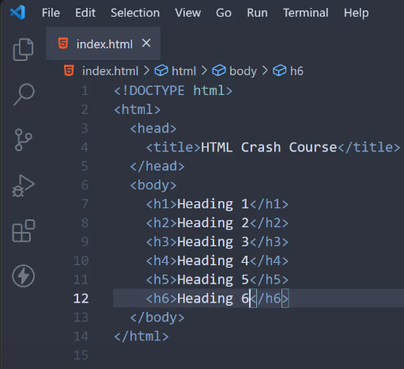
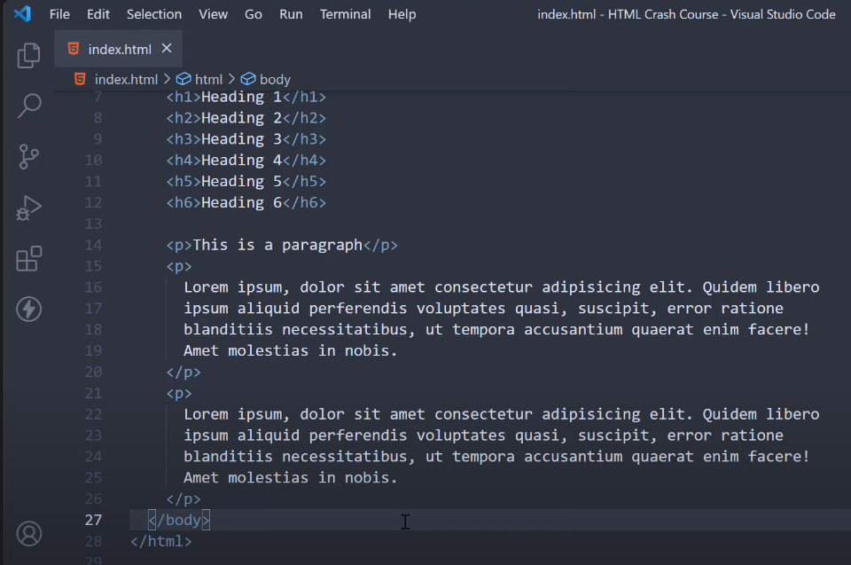
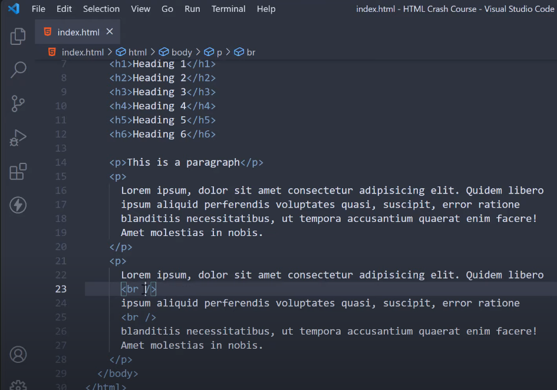

# HTML

### Introduction

- Hey everyone, my name is Vishwas, and welcome to the HTML crash course for complete beginners.

- If you're aiming to become a web developer, you're at the right place, as HTML is the first step you need to take in that direction.

- Building websites involves three technologies:

  - `HTML`, responsible for the structure of your website (text or images).

  - `CSS`, responsible for the presentation (colors, spacing, alignment, etc.).

  - `JavaScript`, responsible for handling interactivity (e.g., button clicks).

- HTML is a prerequisite to CSS and JavaScript for web development, making it your first step.

### Before we begin

- Let's go over a few points to set expectations:

  - This course is for `complete beginners`; no prior HTML knowledge is assumed.

  - If you're already familiar with HTML, you might want to explore other resources.

  - We'll cover essential HTML concepts in this crash course; it's `not exhaustive`.

  - This course is sufficient for your first year or two of web development.

  - We'll focus on HTML only; CSS will be covered in the next video.

  - This video is longer than others but doesn't require you to watch it all at once. Pause when needed and code along for the best learning experience.

### Setup

- To work with HTML, you need a `browser` and a `code editor`.

- Recommended browser options include `Chrome`, Firefox, or Edge.

- `Visual Studio Code` (VS Code) is a recommended code editor.

- Download VS Code from [code.visualstudio.com](https://code.visualstudio.com/) and install it for your operating system.

- Install the `Prettier` extension from the VS Code Extensions sidebar (over 17 million installations).

- Open VS Code within a `folder` of your choice (e.g., "`html crash course`").

- Now you're all set up and ready to learn HTML.

### What is HTML?

- HTML stands for `HyperText Markup Language`.

- It's the language for creating web pages.

- HTML is a markup language, not a programming language.

- In HTML, we mark certain elements in the code to structure the web page; it lacks programming logic like conditionals or branching.

- HTML consists of a series of elements, each instructing the browser how to display content.

- Learning about these individual elements is the key to mastering HTML.

### Writing HTML

- Let's start by creating an HTML file named `index.html`

  - The file should have a ".html" extension (e.g., "index.html").

- Inside the file, type "Welcome to HTML" and save it (Ctrl+S or Command+S).

- Double-clicking the "index.html" file in your project folder opens it in your default browser.

- You'll see the text "Welcome to HTML" displayed.

- HTML isn't just about writing text; it's about marking text to display it differently, achieved by writing HTML elements.

### HTML Element

- An HTML element is `the building block of an HTML document.`

- It typically consists of an `opening tag`, a `closing tag`, and the `content` in between.

- The closing tag has a forward slash before the tag name, while the opening tag does not.

- It's possible to contain one element as the content of another element, allowing nesting of HTML elements.

- `Nesting` is necessary when building practical web pages.

- The goal is to understand various HTML elements and how they affect content, but first, let's grasp the structure of an HTML document.

### HTML Document

>

#### DOCTYPE tag

- We begin by informing the browser that the document is an HTML document using the following line:

  - `<!DOCTYPE html>`

- This line is the very first line of every HTML document.

#### html tag

- Next, we write our first HTML element, which is the `html` element.

- The `html` element has both an opening tag and a closing tag, wrapping all content. It's known as `the root element`.

#### head and body tags

- Within the `html` element, we add two more elements:

  - The `head` element: Used for content not presented to the user.

  - The `body` element: Where user-presented content resides.

- The `head` element is for information not shown to the user, such as metadata. We'll explore this later.

#### title tag

- For now, let's include an `html` element with a `title` element that sets the page's title (visible in the browser tab).

  - Example: `<title>HTML Crash Course</title>`

- In the `body` tag, we can specify the visible content, like "Welcome to HTML."

- To format the document, you can use keyboard shortcuts like `Ctrl+Shift+P` and select "Prettier" as the code formatter.

- This structure constitutes a basic HTML document: a `doctype` declaration, enclosing `html` tag, `head` for non-visible content, and `body` for visible content.

### Formatting Text

- When formatting text in HTML, consider that users scan web pages, often reading headings before deciding to read paragraphs.

#### heading tags

- `HTML provides heading and paragraph elements for structuring text.`

- HTML has six heading elements (`h1` to `h6`):

  - `h1`: Largest, typically used for the page title (only one per page).

  - `h2`: Subheadings.

  - `h3` to `h6`: Used for various levels of subheadings.

- Example of an `h1` element: `<h1>Heading 1</h1>`

- Headings are displayed in different sizes and styles by default, indicating their importance.

- Headings start on a new line with spacing at the bottom.

#### paragraph tag

- Paragraphs, indicated by the `p` element, are blocks of text starting on a new line.

- Example of a `p` element: `
This is a paragraph.
`

- To add more content, use additional `p` tags.

#### line break tag

- The `br` tag (line break) provides explicit line breaks in text.

  - Example: ` `

#### horizontal rule tag

- Another self-closing tag, `hr` (horizontal rule), creates a horizontal line to separate content.

  - Example: `
`

- While spacing is usually sufficient to separate paragraphs, the `hr` tag can be used for more explicit separation.

### Inline Text Formatting

- Let's explore inline text formatting in HTML. HTML provides elements to format text in various ways.

#### strong tag

- The first one is the strong tag, used to add importance to text. Wrap text with the `strong` tag, like `<strong>important</strong>`, to display it in bold.

#### emphasis tag

- Similarly, the em tag emphasizes text and displays it in italics. Example: `<em>emphasized</em>`.

- While you could use `b` for bold and `i` for italics, these tags lack semantic meaning and are not SEO-friendly or screen reader-friendly.

- Use `strong` and `em` for better semantic and accessibility support.

#### small tag

- The small tag defines smaller text, making it appear smaller `<small>small</small>`

#### mark tag

- To highlight text, use the mark tag, like `<mark>highlighted</mark>`.

#### del tag

- To indicate strikethrough, use the del tag, for example: `<del>strikethrough</del>`.

#### ins tag

- For underlining text, employ the ins tag, like `<ins>underline</ins>`.

#### sub and sup tags

- You can use the sub tag for subscripts and sup tag for superscripts.

- HTML offers versatile text formatting options, allowing you to style text as needed.

### Block-level elements and Inline elements

- `HTML elements have default display values`: block-level and inline.

- **Block-level elements** start on a new line and occupy the full available width.

- **Inline elements** do not start on a new line and only take as much width as needed.

### Div and Span Tags

- Two essential elements are the `div` and `span` tags.

  - `div` is a block-level element. Multiple `div` tags will start on new lines and span the entire width.

  - `span` is an inline element. Multiple `span` tags do not start on new lines and only occupy necessary width.

- While less significant when writing HTML alone, `div` and `span` are valuable when adding styles or targeting specific portions of the content.

- These tags become particularly important when applying CSS styles in the CSS crash course.

- Remember `div` as a block-level element and `span` as an inline element.

### Lists

- All right now let's move on to the next set of elements and these are elements which are concerned with rendering a list in the browser. Lists as you might have guessed are very common in day-to-day life:

- A list of shopping items

- A list of events

- A list of things to do on your next vacation, etc.

- Lists are everywhere, and you might have to display them on your web page as well.

- HTML provides three different types of lists. Let's go over them one at a time:

- The first type is the unordered list, which is used to mark up lists of items where the order doesn't matter. For example, a shopping list:

- You may have to buy:

- Red

- Milk

- Eggs

- To define unordered lists, we make use of two HTML tags:

- First, we write a `<ul>` tag for an unordered list.

- Then, as content for this `<ul>` tag, we specify individual items using the `<li>` tag:

- `<li>` Red

- `<li>` Milk

- `<li>` Eggs

- If you now save the file and refresh, you should see the list of items being displayed. Let me zoom in a little bit. We have:

- Bread

- Milk

- Eggs

- The list items will be marked with bullets by default.

- Similar to unordered lists, HTML also provides ordered lists. As the name indicates, with ordered lists, the order does matter. For example, if you are giving a set of directions to your friend:

- Reach point A

- Turn right and reach point B

- Turn left and arrive at point C

- For ordered lists, we simply have to replace `<ul>` with `<ol>`. So, make a copy, paste it, and change `<ul>` to `<ol>`.

- Let me also change the content of the items:

- Reach point A

- Turn left and reach point B

- Turn left and arrive at point C

- Save the file, and you should now be able to see the ordered list. List items will be marked with numbers by default.

- The final list type is description lists. It is a list of terms with the description of each term. The list has three tags that we need to use:

- We wrap with a `<dl>` (definition list) tag.

- Within the list, we add terms and the definitions using `<dt>` (definition term) and `<dd>` (definition description) tags:

- `<dt>` Ice cream (the term)

- `<dd>` A soft sweet frozen food (the definition)

- `<dt>` Tea (the term)

- `<dd>` A hot drink (the definition)

- If we save the file and refresh, you can see the definition list being rendered in the browser. So, these are the three ways to display lists in HTML.

### HTML Attributes

- All right, the next thing we should learn about is HTML attributes.

- HTML attributes provide additional information about HTML elements.

- All HTML elements can have attributes; however, we are going to take a look at two elements where the attributes sort of define the element itself.

### Images

- The first one is the image HTML element, which is used to embed an image in the web page. The image tag also doesn't need a closing tag, so it's self-closing.

- Now, this image tag needs to know which image to display. For that, I'm going to add an image into the same folder as our HTML file. The file name is `logo.jpg`, and it is the logo of Code Evolution.

- If I open the explorer in Visual Studio Code, you can see `logo.jpg`.

- Now, to connect the logo file with the image element, we need to add the source attribute (`src` for short). To this, we assign the path to the file, and this is going to be `logo.jpg` as it is in the same folder as `index.html`.

- If we now save and refresh the browser, we should see a very large image. This is because the image dimensions are huge. So, what we can do is specify two more attributes that restrict the dimensions:

  - One is `width`, which we can set to `200`.

  - The other is `height`, which we can set to `200` again. The default unit for these attributes is pixels.

- Refresh the browser again, and we see a much smaller image.

- One more important attribute we should specify on the image tag is the `alt` attribute. I'm going to set its value to the text "Code Evolution Logo". This attribute is picked up by screen readers and is used to describe the image to visually impaired people. So, this is pretty much how you embed an image in your web page using the image tag and the mandatory `src` attribute.

### Links

- All right, the second element we should learn about when learning HTML attributes is the anchor tag, denoted by `<a>`. This tag is used to create hyperlinks to other pages.

- It is also probably the element you're already familiar with, having navigated thousands of websites.

- The syntax is as follows: In between the tags, we specify the text to display in the browser. Let's say "Google".

- Now, on the opening tag, we specify an attribute called `href`. To this attribute, we specify the address where we need to navigate to. In our case, `https://google.com`.

- For now, head back to the browser, refresh, and you can see we have a link that says "Google". The styling is a little different from the other text elements we have seen so far. The cursor also changes to a pointer when we hover over the text.

- Click on the link, and we are directed to the Google homepage. This is the basic working of an anchor tag.

- Of course, the linking doesn't have to be to other pages on the internet. We could link between two pages in our own folder. So, back in VS Code, let me create a new file, `contact.html`. Type `exclamation` and `tab`. This will populate a sample HTML document.

- In the `<body>` tag, add another anchor tag. The text is going to be "Home," and `href` is going to be `index.html`.

- Similarly, in `index.html`, we're going to add another anchor tag where the text is "Contact," and `href` is going to be `contact.html`.

- If we head back to the browser and refresh, we can click on "Contact," and we go to `contact.html`, which is the contact page. Click on "Home," and we are back at the home page. So, we can navigate back and forth within our own website.

- Now, one attribute that is commonly used with the anchor element is the `target` attribute. You can set `target="_blank"`, and what this does is open the link in a new tab instead of the same tab.

- Refresh, click on Google, and it opens in a new tab. So, `target="_blank"` is pretty useful when you're directing users away from your web page.

- Both image and anchor elements are essential when building websites, so make sure you're clear on these topics.

### Tables

- All right, the next topic is HTML tables. When building web pages, we're going to come across the need to display rows of data:

  - A table of user information

  - A table of product data

  - A table of shipping charges by location, etc.

- Arranging data in rows and columns is common. To help with that, HTML provides several elements that need to be nested at different levels.

- First, we specify the `<table>` tag (opening and closing table tags).

- Nested within the table tags, we specify the `<thead>` for the table header and `<tbody>` for the table body.

- Within the `<thead>` tag, we specify one row using the `<tr>` tag (short for table row). A row can have one or more columns, and if it is the heading for the column, we specify the `<th>` tag (short for table heading). Let's specify the content as "Heading 1."

- Similarly, let's add two more columns. Duplicate the `<th>` tag twice and change the content to "Heading 2" and "Heading 3." That should be good for our column headings.

- Now, for the body, similar to the code above, we begin by adding a row using the `<tr>` tag.

- Within the row, we specify data that has to go in each column using `<td>` tags. Since we have three columns, we specify three `<td>` tags.

- The content can be "Data 1," "Data 2," and "Data 3." This now adds one row into our table.

- We can copy and paste this `<tr>` tag two more times, change the text to "4," "5," "6," and "Data 4," "Data 5," "Data 6," "Data 7," "Data 8," "Data 9."

- What we have done is basically added three rows to the table data. If you now refresh and zoom in a bit, you should see the arrangement of data in rows and columns:

  - The first row consists of headings where the text is in bold.

  - Then we have three rows of data.

- Of course, there is no border, and the spacing isn't great, but styling is part of CSS, which you will learn in the next crash course. For now, make sure you're aware of the different tags and the levels of nesting when it comes to displaying a table in the browser:

  - `<table>` tag

  - `<thead>` and `<tbody>` tags

  - Within `<thead>`, add a row using `<tr>` and `<th>` for the columns

  - Within the body, `<tr>` for a row again, but `<td>` for the columns.

- Very important to keep in mind the different levels of nesting. So, that is about the `<table>` tag.

Certainly, here is the text you provided formatted with Markdown using H3 tags for sections and bullet points for sentences:

### Forms

- The next topic we have to learn about is HTML forms. So far, we have been displaying data to the user.

- When building web pages, you will come across situations where you need to collect data from the user:

  - For example, user details in a registration form or personal details when applying for a bank account.

- Forms allow users to enter data, which is generally sent to a web server for processing and storage.

- In this video, we are only going to focus on the HTML part of a web form and not processing the data, as you need a lot more than just HTML for that.

- Let's take a look at the different HTML elements that are typically used when creating forms.

- Now, every form begins with a `<form>` tag (opening and closing tags).

- Next, let's add a form input to collect a user's name. For that, we make use of two elements:

  - First, a `<label>` element to display the input label. Let's call this field "Username."

  - Next, an `<input>` element to accept some text input. It is a tag, and this is a self-closing tag. We're going to specify `type` is equal to `text` as an attribute.

  - I'm going to add a few ` ` tags for some spacing: after the label, a ` ` tag, and another pair of ` ` tags after the input element. Ideally, spacing should be taken care of with CSS, but ` ` tags will serve the purpose for now.

- If we take a look at the browser and refresh, you can see the "Username" label and the input element.

- Now, what is a good practice with form controls, as we call them, is tying the label with the input. For that, we add an `id` attribute to the input element and use its value on the `for` attribute for the label.

  - So, `id` on input is going to be equal to "username," and `label` `for` attribute is equal to the `id` of the input, which is again "username." So, we are telling this label is for this input. What this does is when we click on the label, it focuses the input element, and this is considered a good practice in HTML.

- So, this is the input element. Let's look at a few more form elements.

- Next, we have a text area to collect larger text from the user. First, we're going to add a label, which is going to be "About You."

- And then for the text area, we use the `<textarea>` tag. I'm going to set `id` is equal to "about" and add `label for` attribute is equal to "about."

- I'm also going to add a few ` ` tags for spacing. If we now take a look at the browser and refresh, you can see that we have a text area, and here we can type multiple lines of text.

- The next form control is the drop-down control. Again, a label, let's call it "Country," and the tag this time is `<select>`.

- Within the `<select>` tag, we need to specify the different options. We're going to specify three countries as options. Each option is represented with an `<option>` tag.

- For each option, we specify the text to be displayed and the value of that option. For example, text is "India," and value is also going to be "India," so "India" with uppercase is displayed to the user, and lowercase "India" is the value sent to the server.

- Let's add two more options. I'm going to make a copy; this is going to be "Singapore," and the value is going to be the same with lowercase. And finally, "Vietnam."

- Also, going to add on the `<select>` tag `id` is equal to "country," and for the label, `for` is equal to "country." A bit of spacing, and if you now take a look at the browser, you can see the dropdown with three options: "India," "Singapore," and "Vietnam" (though "Vietnam" is cut out of the display).

- Alright, the next form control is radio button group, which allows the user to select one value from many options. Let's say the job type is "Part Time" or "Full Time."

- In that case, we're going to add a label that says "Job Type," and below the label, we're going to add first an input element. This is a self-closing tag.

- By default, the input element `type` is `text`, which is not what we want right now for radio buttons. We specify `type` is equal to `radio`, but we also need to specify a few more attributes.

  - I'm going to add `name` is equal to "job type," the actual value which will be sent to the server, so this is going to be "Part Time."

  - Then, I'm also going to set an `id`, "part time." This radio button needs a label, so we're going to add the label after the input. This is going to be "Part Time," and the `for` attribute is also going to be "part time," so this label is for this input element.

  - I'm going to add a ` ` tag after the main "Job Type" label and also after the first radio button.

- I'm going to make a copy of the input element along with the label and paste it. Our second option `type` is going to be radio again, and the `name` needs to remain the same, "job type," and "job type." Both the radio buttons belong to the same group. The value, though, is going to be "Full Time," and so is the `id`. The `label for` attribute is going to be "full time," and the text is going to be "Full Time."

- I'm also going to add another pair of ` ` tags for some spacing. If we now head to the browser, you can see we can now select the job type as "Part Time" or "Full Time."

- Now, it's also possible that you want the user selecting both the options. In that case, we make use of checkboxes instead of radio buttons. All we have to do is change the `type` attribute from "radio" to "checkbox."

- So, let me make a copy of this "Job Type" and change "radio" to "checkbox," and I'll also change the `id` as it should be unique within a page, "part time checkbox," "full time checkbox." Job type is "job type checkbox," "job type checkbox" for the `name` attribute.

- If you now go back to the browser, refresh, we have checkboxes; we can select "Part Time" as well as "Full Time." So, these are some of the most common ways to accept input from a user:

  - A single-line input

  - Multi-line input

  - A drop-down

  - Radio buttons and check boxes.

- Now, what you might want at the end

Certainly, here is the text you provided formatted with Markdown using H3 tags for sections and bullet points for sentences:

### Semantic HTML

- The next topic we're going to learn about is semantic HTML, and this is something that is given more care as you become familiar with HTML.

- When grouping elements or content on a web page, it is possible to use `
` and `` tags. If you were to open a pretty old website, you will see hundreds of `
` and `` tags. However, these tags tell nothing about their content. Semantic HTML aims to fix this problem.

- A semantic element clearly describes the meaning in a human and machine-readable way. In HTML5, there are roughly a hundred semantic elements. For this crash course, I want to highlight just a few frequently used elements.

- Here is a typical layout for a web page:

  - For the header, you would use the `<header>` tag.

  - For the navigation bar, where you typically see links to home, about, services, etc., you use the `<nav>` tag.

  - You then have the `<section>` tag, which defines a section of the page, for example, an intro, some contact info, etc.

  - You also have the `<article>` tag, which can be used for blog posts, product cards, user comments, newspaper articles, etc.

  - The `<aside>` tag is used to define some content aside from the main content, for example, a sidebar where you can highlight recent or featured blog posts.

  - Finally, you have the `<footer>` for links in your web page, like privacy policy, copyright info, sitemap, etc.

- With semantic HTML, the code suggests to the developer the type of data that will be populated, and not just that, semantic HTML helps search engines to influence the page search rankings, and screen readers can use them as a signpost to help visually impaired users navigate a page.

- Semantic HTML is quite important from an interview point of view as well, so once you're comfortable with basic HTML elements, make sure you get a good grasp of semantic HTML elements.

- That pretty much wraps up everything we had to learn from a `<body>` tag point of view.

Certainly, here is the text you provided formatted with Markdown using H3 tags for sections and bullet points for sentences:

### Head Tag

- For our final bit, let's dive deeper into the `<head>` HTML element we discussed very early in this video.

- The head of an HTML document is the part that is not displayed in the web browser when the page is loaded. It does, however, contain the title and metadata about the HTML document.

- The tag that is used to describe metadata is the `<meta>` tag. There are quite a few types of `<meta>` elements that you can add. I'm going to go over some of the more important ones.

- The first `<meta>` tag is to specify the document character encoding. So `<meta charset="utf-8">`. UTF-8 is a universal character set that includes pretty much any character from any human language. This means that your web page will be able to handle displaying any language and is, therefore, a good idea to set this on every web page you create.

- The next `<meta>` element we can use is to set the author of the page. So `<meta name="author" content="Code Evolution">`.

- Another important `<meta>` tag you can include for SEO purposes is the page description. So `<meta name="description" content="This web page aims to provide beginner's information about HTML fundamentals">`.

- Lastly, a `<meta>` tag that you might often see is setting the viewport. So `<meta name="viewport" content="width=device-width, initial-scale=1.0">`. This ensures your webpage width adapts to the device viewport and sets the initial scale.

- If you know about these `<meta>` tags, you're all set with the head section of an HTML document.

- Now, apart from this, you have `<script>` and `<style>` tags which you can include in the head section. `<style>` tag more so than the `<script>` tag, but that is to do with CSS and JavaScript, so we will tackle them in separate videos.

- With that, we come to the end of this crash course on HTML. If you're new to web development, I hope the video has given you an idea of how web pages are created with HTML. If you've enjoyed the video, please do leave a like and subscribe to the channel for more content on web development. I'll see you in the next video, which is a crash course on CSS.
