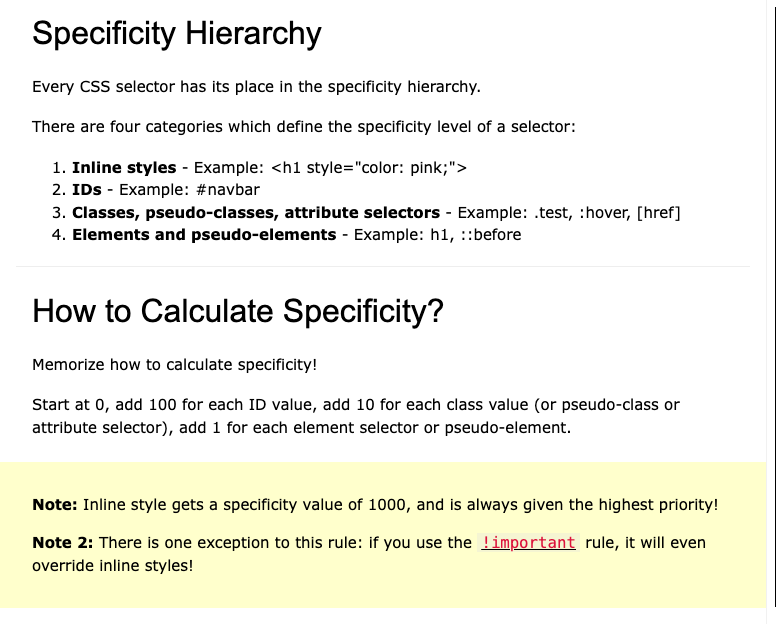
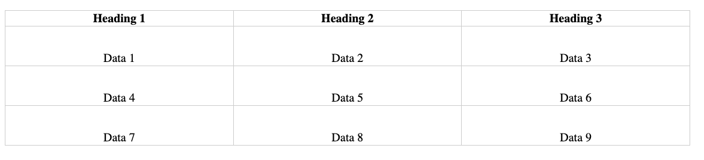
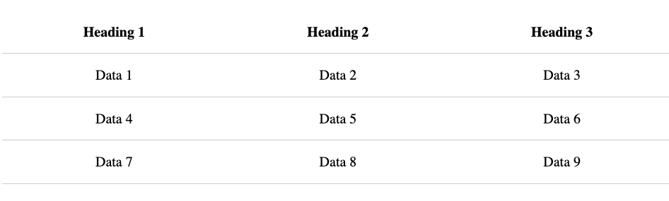

# BASICS

### **=>** What is CSS?

- CSS stands for `Cascading Style Sheets` and is the language used to style an HTML document.

- CSS is a style sheet language and not a programming language.

- With CSS, you control the layout of a web page, the spacing between elements, text colors, and more.

- You do this by selecting HTML elements and applying styles to them.

- Understanding how to select HTML elements and apply styles is crucial in learning CSS.

### **=>** How to Add CSS

- There are three different ways to add styles to an HTML document:
- inline styles,
- internal style sheets,
- and external style sheets.

#### Inline Styles

- Inline styles are CSS declarations that affect a single HTML element.

  - To use inline styles, add the `style attribute` to the relevant HTML element.

  - For example, to apply an orange color to an `h1` tag, you add `style="color: orange"`

```html
<!DOCTYPE html>
<html lang="en">
  <head>
    <meta charset="UTF-8" />
    <meta
      name="viewport"
      content="width=device-width, initial-scale=1.0" />
    <title>Document</title>
  </head>
  <body>
    <h1 style="color: orange">CSS Crash Course</h1>
  </body>
</html>
```

- Inline styles are straightforward but not recommended for larger projects due to maintenance challenges and mixing HTML content with presentational code.

#### Internal Style Sheet

- An internal style sheet is defined within a `<style>` element within the `<head>` section of the HTML document.

#### CSS Rule

- A `CSS rule` consists of a `selector` and a `declaration block`


- The `selector` points to the HTML element you want to style,
- and the `declaration block` contains one or more style declarations.
- Each declaration consists of a property and a value separated by a colon.
- For example: `h1 { property: value; }`

```html
<!DOCTYPE html>
<html lang="en">
  <head>
    <meta charset="UTF-8" />
    <meta
      name="viewport"
      content="width=device-width, initial-scale=1.0" />
    <title>Document</title>

    <style>
      h1 {
        color: orange;
      }
    </style>
  </head>
  <body>
    <h1>CSS Crash Course</h1>
  </body>
</html>
```

- Internal style sheets are more organized than inline styles but still not recommended for larger websites.

#### External Style Sheet

- An external style sheet is a separate CSS file with a `.css` extension.


- The HTML document links to the external style sheet using the `<link>` element within the `<head>` section.

```html
<!DOCTYPE html>
<html lang="en">
  <head>
    <meta charset="UTF-8" />
    <meta
      name="viewport"
      content="width=device-width, initial-scale=1.0" />
    <title>Document</title>
    <link
      rel="stylesheet"
      href="styles.css" />
  </head>
  <body>
    <h1>CSS Crash Course</h1>
  </body>
</html>
```

- This approach is the most common and efficient way to add CSS to a website.

- It allows you to maintain a single CSS file that can be linked to multiple HTML pages, ensuring consistent styling across your website.

- Changes made to the external style sheet are reflected on all linked web pages.

- These are the three methods for adding CSS to an HTML document.
- The external style sheet approach is the recommended method for larger websites and projects.

### **=>** CSS Selectors

- CSS selectors are used to specify which HTML elements should be styled.

- A `CSS rule` consists of a selector and a declaration block containing style declarations.

- We already learned about the type or `element selector` that selects all instances of a specific HTML element.

- CSS selectors help us target specific elements for styling in more complex web pages.

- In this crash course, we'll focus on simple yet useful selectors for beginners.

#### Element Selector (Type Selector)

- The element selector targets a specific HTML element.

- For example, `h1` selects all `h1` tags in the web page.

```css
h1 {
  color: blue;
}
```

- When applied, it affects all elements of the specified type.

#### Universal Selector

- The universal selector, denoted by an asterisk `*`, selects every element in the page.

- It can be used to reset default browser styles.

- Useful for removing default styles that we don't need.

```css
/* Simple CSS reset */

* {
  margin: 0px;
  padding: 0px;
  box-sizing: border-box;
  font-size: 14px;
}
```

#### Class Selector

- The class selector targets elements with a specific class attribute.

- It starts with a dot `.` followed by the class name.

- Multiple elements can share the same class for consistent styling.

```css
.error {
  color: red;
}

.success {
  color: green;
}
```

- For example, `.error` and `.success` classes can style different elements.

```html
<p class="error">Red text</p>
<p class="success">Green text</p>
```

#### ID Selector

- The ID selector is similar to the class selector but applies to a unique element.

- It starts with a hash `#` followed by the ID name.

```css
#test {
  color: maroon;
}
```

- Typically used for styling a single specific element.

```html
<p class="error">Red text</p>
<p class="success">Green text</p>

<p id="test">Id selector</p>
```

- Rarely used compared to class selectors.

- Understanding and using class selectors is common and recommended for styling web elements.

#### using advanced selectors

- Combining selectors and using advanced selectors can provide more sophisticated styling options.

- For now, `focus on grasping the basics of these selectors.`

### **=>** Color Property

- The `color` property is used to `define the text color` of an element in CSS.

- It can be specified in multiple ways.

- Two common methods are `hex` values and `RGBA` values.

#### Hex Values

- `Hex values` start with a hash symbol `#` or pound symbol.

- They are followed by a six-character hex code ranging from six zeros to six F's.

- For example, `#000000` represents black, while `#FFFFFF` represents white.

```css
.light-text {
  color: #ffffff; /* White */
}

.dark-text {
  color: #000000; /* Black */
}
```

#### RGBA Values

- `RGBA values` allow you to specify the color using red `R`, green `G`, and blue `B` components.

- Each component's value can range from 0 to 255.

- Additionally, an alpha `A` value controls opacity, ranging from 0 (completely transparent) to 1 (fully opaque).

- For example, `rgba(0, 0, 0, 0.5)` represents a semi-transparent black color.

```css
.dark-text {
  color: rgba(0, 0, 0, 0.5);
}
```

- Opacity in RGBA can be adjusted from 0 (transparent) to 1 (opaque).

- Understanding color properties allows you to control text color in your web page.

- You can set the `color` property to apply specific text colors.

### **=>** background-color property

- Similarly, you can use the `background-color` property to set background colors for elements.

```html
<div class="orange">Orange background</div>

<span class="yellow">Yellow background</span>
```

- The color property sets the text color, while background-color sets the element's background color.

```css
.orange {
  background-color: orange;
}

.yellow {
  background-color: yellow;
}
```

### **=>** Styling Text

- In CSS, text styling properties are categorized into two main groups: `font styles` and `text layout styles`

### **=>** Font Styles

- By default, on Windows Chrome, the font used is Times New Roman.

#### font-family property

- You can change the font using the `font-family` property.

- Example: Create a CSS class called `.font-styles` and set `font-family` to `Verdana`.

```css
.font-styles {
  font-family: Verdana;
}
```

- Apply the `font-styles` class to an HTML element to change its font.

```html
<h1>CSS text</h1>
<h1 class="font-styles">CSS text</h1>
```

#### web-safe font (font stack)

- Consider adding a web-safe font as a backup for better compatibility.

```css
.font-styles {
  font-family: Verdana, Geneva, Tahoma, sans-serif;
}
```

#### font-style

- Two other font properties are `font-style` (italic)

```css
.font-styles {
  font-family: Verdana, Geneva, Tahoma, sans-serif;
  font-style: italic;
}
```

#### font-weight

- and `font-weight` (bold).

```css
.font-styles {
  font-family: Verdana, Geneva, Tahoma, sans-serif;
  font-style: italic;
  font-weight: bold;
}
```

#### text-decoration

- You can also control `text-decoration` (e.g., underline)

```css
.font-styles {
  font-family: Verdana, Geneva, Tahoma, sans-serif;
  font-style: italic;
  font-weight: bold;
  text-decoration: underline;
}
```

#### font-size

- and `font-size` (e.g., `50px`).

```css
.font-styles {
  font-family: Verdana, Geneva, Tahoma, sans-serif;
  font-style: italic;
  font-weight: bold;
  text-decoration: underline;
  font-size: 50px;
}
```

### **=>** Text Layout Properties

- Text layout properties affect how text is positioned and spaced within its container.

#### text-align

- Text alignment (`text-align`) controls horizontal alignment (e.g., `center` or `right`).

```css
.container {
  background-color: orange;
  text-align: center;
}
```

#### line-height

- Line height (`line-height`) sets the height of each line of text, affecting line spacing.

```css
.container {
  background-color: orange;
  text-align: center;
  line-height: 2;
}
```

#### letter-spacing and word-spacing

- Letter spacing (`letter-spacing`) and word spacing (`word-spacing`) adjust the space between characters and words.

```css
.container {
  background-color: orange;
  text-align: center;
  line-height: 2;
  letter-spacing: 4px;
  word-spacing: 20px;
}
```

- Experiment with these properties to control text layout and appearance in your web page.

### **=>** Styling Lists

- To style lists in HTML, you can use CSS properties to customize their appearance.

#### list-style-type

- For example, you can change the bullet point style in an unordered list (`<ul>`).

- In the HTML file, add an unordered list with items such as "bread," "milk," and "eggs."

```html
<ul>
  <li>Bread</li>
  <li>Milk</li>
  <li>Eggs</li>
</ul>
```

- By default, the bullet points are solid circles (`list-style-type: disc`).

- You can change the bullet point style using the `list-style-type` property.

- Options include:

  - `circle` (hollow circle)

  - `square` (square)

  - `none` (remove markers)

- To remove default spacing around the list, set the `margin` and `padding` properties to zero.

```css
ul {
  list-style-type: none;
  margin: 0;
  padding: 0;
}
```

- Learning how to style lists is essential for creating well-designed web pages.

### **=>** CSS Box Model

- The CSS box model is a fundamental concept in web design.

- It revolves around three key properties: `border`, `padding`, and `margin`.

- In web design, every element is considered a rectangular box.

- Understanding this box model is essential for creating layouts and aligning items using CSS.

- The box model serves as a standard for how browsers render HTML elements.

- It consists of four parts: `margins`, `borders`, `padding`, and the actual `content`.

#### Visualizing the CSS Box Model


- `Content Box:` This is where your content is displayed and can be sized using properties like `width` and `height`.

- `Padding Box:` Padding surrounds the content as white space and is controlled using padding-related properties.

- `Border Box:` The border box wraps the content and any padding, and its size and style are controlled using border-related properties.

- `Margin Box:` The margin is the outermost layer wrapping the content, padding, and border. It creates white space between this box and other elements and is controlled using margin-related properties.

#### Applying Box Model Properties

- In the HTML file, add a `div` tag with a class attribute set to "box model."

```html
<div class="box-model">CSS Box Model</div>
```

- In the CSS file, apply various box model properties to the `.box-model` class:

  - `border: 1px solid red`: Adds a 1-pixel solid red border.

  - `height: 50px` and `width: 300px`: Sets the height and width of the content.

  - `padding: 20px`: Adds spacing between the content and the border.

  - `margin: 20px`: Adds space outside the border in all directions.

```css
.box-model {
  border: 1px solid red;
  height: 50px;
  width: 300px;
  padding: 20px;
  margin: 20px;
}
```

#### Developer Tools and Box Model

- Utilize developer tools to inspect elements and view the box model properties.

- Understanding the box model and its properties is crucial for web page layout and design.


- Explore additional properties like specifying padding or margin in specific directions (e.g., `padding-top`, `margin-right`)
- and the `border-radius` property for rounded corners.

#### Conclusion

- The CSS box model is a fundamental concept in web design that involves properties like `border`, `padding`, and `margin`.

- Understanding how these properties affect elements is essential for creating well-designed web pages.

### **=>** Cascade, Specificity & Inheritance

- Understanding cascade, specificity, and inheritance is crucial for effective CSS.

- `Cascade` refers to how the browser determines which CSS rule to apply when multiple rules target the same element.

- `Specificity` plays a key role in cascade, as different selectors have different levels of specificity.

- `Inheritance` is the process by which some CSS property values set on parent elements are inherited by their child elements.

#### Cascade

- Cascade is the "C" in CSS, but it's often misunderstood.

- In CSS, when multiple rules with equal specificity apply to the same element, the last rule in the CSS file takes precedence.

- For example, if two rules both target an `h2` element

```html
<h2>Cascade</h2>
```

- and set its color to different values,

```css
h2 {
  color: red;
}

h2 {
  color: blue;
}
```

- the last rule's color will be applied.

![]

#### Specificity

- Specificity determines which CSS rule applies when multiple rules have different selectors but target the same element.

- Different selectors have varying levels of specificity.

- The most specific selector takes precedence.

- For instance, an element selector (`h3`) has lower specificity than a class selector (`.subheading`) or an ID selector (`#title`).

- Inline styles are even more specific than ID selectors.

- Using the `!important` keyword makes a rule the most specific, but it's not a recommended practice.



#### Inheritance

- Some CSS property values set on parent elements are inherited by their child elements.

- Commonly inherited properties include `color` and `font-related` properties.

- You can rely on inheritance to style child elements without specifying styles for each one individually.

```html
<div class="inheritance">
  <p>Inheritance</p>
</div>
```

- Inheritance can be tested by setting styles on a parent element and seeing if child elements inherit those styles.

```css
.inheritance {
  color: orange;
  font-family: 'Segoe UI';
  font-size: 30px;
}
```

#### Conclusion

- Understanding cascade, specificity, and inheritance is vital for writing maintainable and efficient CSS.

- These core concepts will help you troubleshoot and optimize your CSS code.

- Spend time practicing and experimenting with these concepts to solidify your understanding.

Here's the text you provided, formatted in Markdown with h3 tags for sections and bullet points for sentences:

### **=>** Styling Tables

- Tables in HTML can be styled using CSS to improve their appearance and layout.

- Basic table styling involves adding borders, adjusting spacing, and aligning table elements.

#### Adding HTML for a Table

- To start styling a table, you need to have the relevant HTML structure.

- The basic structure includes `<table>`, `<thead>`, `<tbody>`, `<tr>`, `<th>`, and `<td>` tags to create rows and columns.

- You can add headings in `<th>` tags and data in `<td>` tags.

```html
<table>
  <thead>
    <tr>
      <th>Heading 1</th>
      <th>Heading 2</th>
      <th>Heading 3</th>
    </tr>
  </thead>
  <tbody>
    <tr>
      <td>Data 1</td>
      <td>Data 2</td>
      <td>Data 3</td>
    </tr>
    <tr>
      <td>Data 4</td>
      <td>Data 5</td>
      <td>Data 6</td>
    </tr>
    <tr>
      <td>Data 7</td>
      <td>Data 8</td>
      <td>Data 9</td>
    </tr>
  </tbody>
</table>
```

- The goal is to create a table with a heading row and multiple data rows.


#### Adding Borders

- To add borders to table cells, you can use the `border` property in CSS.

- For example, setting `border: 1px solid gray;` adds a 1-pixel solid gray border to table cells.

```css
td,
th {
  border: 1px solid #ccc;
}
```

- Applying borders without any adjustments still makes the table look like individual cells.


#### Collapsing Borders

- To make the table look like a coherent unit rather than separate cells, you can use the `border-collapse` property on the `<table>` element.

```css
th,
td {
  border-bottom: 1px solid #ccc;
}

table {
  border-collapse: collapse;
}
```

- Setting `border-collapse: collapse;` merges borders between adjacent cells, creating a cleaner table appearance.


#### Setting Table Width

- You can control the table's width using the `width` property.

- For example, setting `width: 100%;` makes the table occupy the full available width,

```css
td,
th {
  border: 1px solid #ccc;
}

table {
  border-collapse: collapse;
  width: 60%;
}
```

- while `width: 60%;` makes it narrower.


#### Text Alignment

- By default, table headings (`<th>`) are center-aligned, and table data (`<td>`) is left-aligned.

- You can change the text alignment using the `text-align` property and the `vertical-align`

```css
td,
th {
  border: 1px solid #ccc;
}

table {
  border-collapse: collapse;
  width: 60%;
}

td {
  text-align: center;
  height: 50px;
  vertical-align: bottom;
}
```

>



#### Adding Padding

- To add space within the cells, you can use the `padding` property.

- For instance, `th,td {padding: 15px;}` adds 15 pixels of padding inside each cell.
- (and remove vertical-align and height)

```css
td,
th {
  border: 1px solid #ccc;
  padding: 15px;
}

table {
  border-collapse: collapse;
  width: 60%;
}

td {
  text-align: center;
}
```

- Padding enhances the visual appearance of the table.


#### Improving Table Style

- To make the table visually appealing, you can adjust the borders.

- Instead of applying borders to all sides of each cell, set `border-bottom` to separate rows.

- For example, `border-bottom: 1px solid #ccc;`

```css
th,
td {
  border-bottom: 1px solid #ccc;
  padding: 15px;
}

table {
  border-collapse: collapse;
  width: 50%;
}

td {
  text-align: center;
}
```

- adds a horizontal line between rows, making the table easier to read.



#### Fundamental Table Styling

- The basic table styling properties include `border-collapse`, `width`, `text-align`, `padding`, and `border-bottom`.

- These properties help create well-designed tables for your web pages.

### **=>** Display Property

- The `display` property in CSS controls how an HTML element is displayed on the page.

- HTML elements have default `display` values (e.g., `block` for `<div>` and `inline` for `<span>`).

- You can explicitly set the `display` property for elements when needed.

#### Changing Display Values

- You can change the `display` value of an element to alter its behavior.

- For example, setting `display: inline;` makes a block-level element behave like an inline element.

#### Using `display: none;`

- The `display: none;` value hides an element from the page.

- This is often used with JavaScript to show or hide elements dynamically.

#### Display Values: `block`, `inline`, and `none`

- `block`: Makes an element a block-level container, typically taking up the full width of its parent.

- `inline`: Makes an element behave like an inline element, allowing other elements to appear on the same line.

- `none`: Hides the element completely, as if it doesn't exist in the document flow.

#### Future Learning: `flex` and `grid`

- While `block`, `inline`, and `none` are the basic `display` values, CSS also offers advanced layout options like `flex` and `grid`.

- These values allow for more complex and responsive layouts but require a deeper understanding.

### **=>** Position Property

- The `position` property in CSS determines how an element is positioned within its parent container or the viewport.

- There are five main values for the `position` property: `static`, `relative`, `fixed`, `absolute`, and `sticky`.

- In the HTML file, I'm going to add two `div` tags: `position content one` and `position content two`.
- I'm going to add a class `is equal to position one` on the first `div` tag and `position two` on the second `div` tag.
- In the CSS file, let's add class selectors, so `.position one` and let's set `border` to `1px solid red`.
- Similarly, `position two` is going to be `border 1px solid blue`.

#### Static Position

- By default, HTML elements have a `position` value of `static`.

- So let's add `position static` to both the classes.
- With static position, elements are positioned according to the normal flow of the page.
- In our HTML, `position content 1` is before `position content 2`.
- If I refresh the browser, we see the same `position content 1` and then `position content 2`.
- We can affect or change this layout with the other position values.

#### Relative Position

- The second position value is `relative`.

- Elements with `position: relative;` are positioned relative to their normal position in the document flow.

- You can use `top`, `right`, `bottom`, and `left` properties to adjust their position.
- So for the first element, let's set `position relative`, `top` to `50 pixels`, and `left` to `50 pixels`.
- If we take a look at the browser and refresh, you can see the first element, which is `position content 1`, is now pushed `50 pixels` from the top and `50 pixels` from the left.
- So relative to its original position, it has been displaced by `50 pixels` and `50 pixels`.
- Similar to `top` and `left`, you also have `right` and `bottom`, which have a similar effect but from the opposite direction.
- What's also worth noting is that `position two` element is not adjusted to fit into any gap left by the `position one` element. So we do have an empty space here. This is how relative position works.

#### Fixed Position

- The third value for position is `fixed`, which positions an element relative to the viewport.
- On the second element, let's change `position` to `fixed`.
- We're also going to set `bottom` to `0 pixels` and `right` to `0 pixels`.
- If we now take a look at the browser, scroll all the way to the top, and refresh, you can see the element placed bottom right of the screen.
- What's special with fixed position is even when I scroll, the element always stays in the same place.
- You would have probably seen feedback buttons or chatbot buttons in web pages, which are always positioned bottom right.

#### Absolute Position

- The next position value is `absolute`. Now when I change `fixed` to `absolute` and refresh, the element is still positioned bottom right of the screen.
- However, when I scroll, it behaves differently from that of `position fixed`.
- However, if the element has a different parent element with a relative position, the position will then be relative to that parent element. That is slightly confusing, so let me show you the difference in the browser.
- In the HTML, I'm going to wrap the second element with a `div` tag and add a class called `container`.
- In the CSS, I'm going to add the styles for the `container` class, so `container position is relative`, `width 200 pixels`, `height 2000 pixels`, and `border 1 pixel solid black`.
- If you now take a look at the browser and refresh, you can see the element is still positioned bottom right but within the parent element.
- This is something you're going to often use when developing web pages: absolute position but within a relatively positioned parent element.

#### Sticky Position

- The final position value is `sticky`. An element with `position sticky` is positioned based on the user's scroll position.
- For this example, on `position 1` element, set `position` to `sticky`.
- Now, if we take a look at the browser and refresh, you can see we have `position content one`, but if we scroll down, it moves along with the scroll.
- Beyond an offset, it just sticks in one place on a web page.
- If you have something that needs to be in the normal layout of the page and always visible as they scroll, `position sticky` is a very good option.
- As you can see, there is quite a bit to learn when it comes to the `position` property. We have `position static`, `fixed`, `relative`, `absolute`, and `sticky`. If it's a bit confusing at this moment in time, do not worry; it is something we all tend to struggle with as beginners. But hopefully, the examples you have seen have given you a hint as to how the different values work, which should set you up for further learning.

### **=>** CSS Units

- Okay, for the penultimate topic in this crash course, we're going to quickly take a look at the different CSS units.

- We have two categories of units: absolute and relative.

- Absolute units are generally considered to always be the same size. Here is a list of absolute units you can use.

- However, `pixel` is the only value you will commonly use and is the value we have seen so far.

- Absolute units are useful for layouts where the page needs to be printed.

- Relative units, on the other hand, are relative to something else, perhaps the size of the parent element's font or the size of the viewport.

- The benefit of using relative units is that with some careful planning, you can make it so that the size of the text or other elements scales relative to everything else on the page.

- Here is a list of relative units you can use. Again, not every unit here is used regularly, but let us take a look at a few popular ones.

- Let's start with the first one, which is `m`. In the HTML file, I'm going to add a new element `<div>` with a class called `m-container`, and the text content is going to be "m unit."

- In the CSS, I'm going to define the style with a class selector: `.m-container`. We're going to set `font size` to `20 pixel`, and the `height` is going to be `2m`.

- In this scenario, `1m` is equal to the font size of the element. So `2m` is `40 pixels`.

- If we refresh the browser, you can see "m unit." If I inspect the element, click on "computed," scroll down, and you can see height is `40 pixels`.

- `m` can also be used for font size on a child element. So in `index.html`, within the `m-container`, add another `<div>` tag with a

class equal to just `m`.

- The text can be "m child element."

- In the CSS, on the `.m` class, we're going to set `font size` to `1.5m`.

- What happens now is `1m` is the font size of the parent element, which is `20 pixels`. So `1.5m` is `30 pixels`.

- If we refresh and inspect the "m child element," you can see font size is `30 pixels`.

- As you can see, the `m` unit is a relative unit.

- The next unit to know about is `rem`, and `rem` is relative to the font size of the root element, typically the `body` element.

- So in the HTML document, I'm going to add another `<div>` tag. The text content is going to be "rem unit."

- We also have a class called `rem` in the CSS file. I'm going to add a style to the `rem` class where we set `font size` is `2rem`.

- If you now refresh the browser and inspect the `<div>` tag with class equals `rem`, go to "computed," and you can see the font size is `32 pixels`.

- One `rem` is equal to the font size of the `body` element, which is `16 pixels` by default. So `2rem` is `32 pixels`.

- If we set this to `3rem`, refresh, you can see font size is `48 pixels`.

- `rem` is a unit that is more commonly used to specify font sizes in a web page, so make sure you remember how this works.

- All right, finally, there is `vh` and `vw` for viewport-relative height and width. Let's look at `vh`.

- On the `rem` element, I'm going to specify `height` `50vh`. I'm also going to set a `border` of `1 pixel solid #333`, which is again a shade of grey.

- If we save the file and refresh the browser, you can see the height of the `<div>` tag is `50 percent` of the viewport height.

- Now, `vw`, which stands for viewport width, works on a similar principle but for the width of an element.

- `m`, `rem`, `vh`, and `vw`—these are some of the more commonly used relative units in CSS that you, as a beginner, should be aware of.

### **=>** CSS Math Functions

- All right, for the final topic in this CSS crash course, we're going to take a look at three math functions that can be used as property values.

- The first one is `calc`. On the `rem` element, for the height, I'm going to set `calc(50vh - 100 pixels)`.

- When I refresh, you can see the height has decreased by `100 pixels`. This is useful, for example, when you have to subtract the navbar height for calculating the available height for your content.

- The next function is the `max` function, which uses the largest value from a comma-separated list of values.

- I'm going to set height to `max(50vh, 600 pixels)`. When I refresh, you can see the height is `600 pixels` as that is the larger of the two values.

- It is also shown in the dev tools, as you can see.

- Similarly, if I change `max` to `min`, refresh, the height is reduced to `50 percent` of the viewport height as it is the smaller of the two heights.

- Both `max` and `min` can be used to set a minimum or maximum height or width for an element and allow it to take on the other value based on screen size.

- You might want an element at `500 pixels`, but on larger monitors, it can take up more than `500 pixels` as it would be okay with more space on the screen.

- Well, with that, we come to the end of this crash course on CSS.
