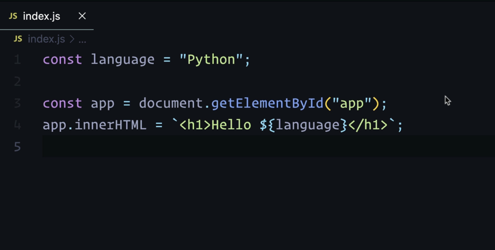
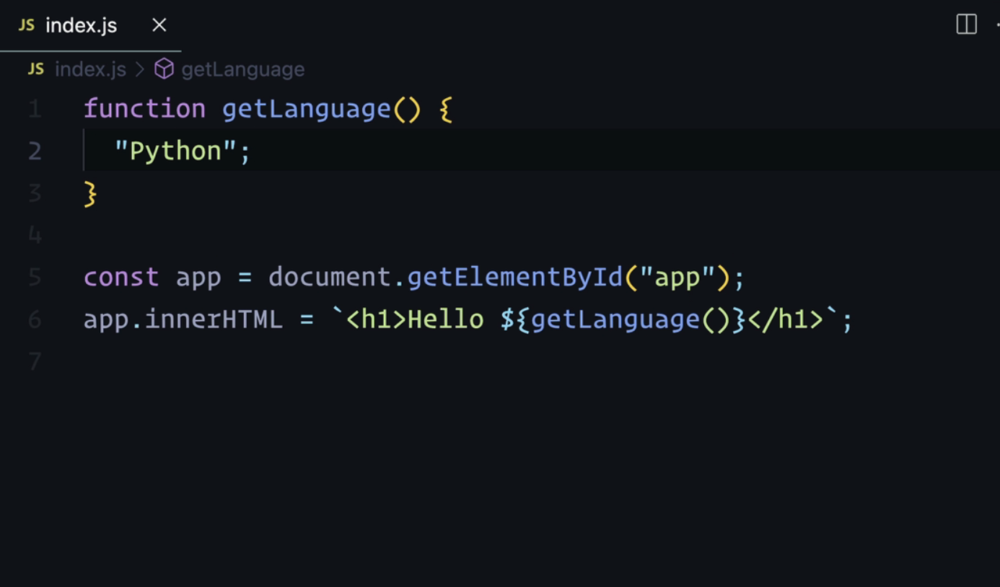

# React Booth Camp

>

## MODULE 1 - JavaScript to React

>

### **=>** Intro

JavaScript for React is all about getting you up to speed with exactly the JavaScript you need for React.

You don't need to know every single thing in the JavaScript language to be a capable React developer.
This section will focus in all the parts of JavaScript that specifically matter to you as a React developer.

#### Brief Overview

- We'll get comfortable working with `functions` and thinking of them as reusable "slices" of our user interface.

- How `conditionals` are used for control flow to determine what the user sees and what parts of our code run.

- How to share parts of our apps, including functions and variables with the help of `modules`.

- Next, we'll get good at `object and array structures` and not only see how to create them effectively (and quickly), but modify them as we need with tons of `array methods`.

- And then finish with `asynchronous code` using Promises and the async await syntax, which is necessary for virtually every single React app you'll work on.

Because React is "just JavaScript", the better you are as a JavaScript developer, the better React developer you'll become at the same time.

Let's dive in!

## FUNCTIONS

### **=>** 1 - Functions as UI

>

#### PROBLEM

Make our app display the text "Hello Python" using the function `getLanguage`.

```js
function getLanguage() {
  'python'
}

const app = document.getElementById('app')
app.innerHTML = `<h1>Hello </h1>`
```

Make sure to use the string ("python") that is already within the function. Use it to create the desired output in the `h1`.

#### Transcript

In our app, we're displaying an `h1` using JavaScript.

And if we want to change the string content here, for example, to say `"Hello JavaScript"`, that's going to change what we see in the HTML.


But this is entirely static. So to make this dynamic, we can create a variable called `language`, we can take this value, put string value in the language variable, and output it here.

To do that easily, we can use backticks, called template literals. And then insert our value using this dollar sign and curly brace syntax `${}`, and then just put in whatever dynamic value we want.
In this case, its `language`.

So now if we were to say, `"Hello Python"`, this would update the UI.



In this challenge, you need to display the text content that we just had ("Hello Python"), but using this function.


#### SOLUTION

To solve the challenge, just add the `return` keyword to the function.

Then, make sure to call the function `getLanguage()` within the template string.

Also make sure not to pass it as a reference but to call the function.

```js
function getLanguage() {
  return 'python'
}

const app = document.getElementById('app')
app.innerHTML = `<h1>Hello ${getLanguage()}</h1>`
```

#### Transcript

To display Hello Python in our app user interface, we need to figure out how to have `getLanguage` actually output the string "Python" in the HTML that we're creating here.

To do that, we need to return the text Python. So we need to add the `return` keyword first.

To use an expression, expression is just something that resolves to a value in JavaScript, we need to output it with our dollar sign and curly brace syntax.

And instead of just passing it as a reference here, says to pass it as a reference, we need to call this to make sure it resolves to an expression, in this case, the string Python.

So now if we save, we see hello Python in lowercase and change that to be a capitalized string.


And mind you if we did not have this return keyword if we had just Python here in the body of our function, we would see hello undefined because the implicit behavior of a function if you do not have a return keyword is to return undefined.



And since we're calling the function here, it takes that undefined value and this dollar sign and curly brace syntax converts it to a string so therefore we see hello undefined

### **=>** 2 - Function Arguments

>

#### PROBLEM

Using an argument passed to the `createButton` function, make it possible to dynamically change the first word within our button.

#### Transcript

In moving from JavaScript to React, we learned that functions really make it possible to add a lot of reusable elements to our applications. We saw that in the last example.

Right now we have just a button that says `"like video"`. Using what we saw before, we could create a function with the name `createButton` where we might return the text.

Using template literals, we can once again call `createButton` here. But keep in mind that we can take the other parts of this string, the button tags and add them to the return value of our function like this. And we're still--when we remove those button tags within the string here--we're still creating our button.

We can go a step further and remove those tags, those template string tags, entirely.

But what's great about functions is that we can pass them dynamic values via arguments. We can pass a value through here. Let's say we wanted to display "dislike video", we could add a text argument and once again, use a template literal and output that text between the tags.

So now we've made this part of our UI, this button element, dynamic.

For this challenge, I'd like you to make it possible to change this first word within our button to make it possible to perform different actions with a video

#### SOLUTION

>

#### Transcript

if you found this challenge a little bit easy, that's good. These challenges are going to ramp up in difficulty as time goes on, you probably realized that this is a very simple solution, we just need to take away video or rather, remove it from where we're passing it in as an argument to create button and added as a static bit of text to the return in Create button.

And we could improve our function here by instead of calling this argument text, we could call it action, that would be a bit more appropriate. And now, if we wanted to change it to like, or up vote, or whatever we want the action to be, it's immediately changed in our UI.

And by adding additional arguments, we can really make this button as customizable as we want. For example, the second argument could be for any style rules that we might want to apply. So if we wanted to set you know, color, or other background color to green, we could pass that through as a new argument and add the parameter style.

And then on the button, we could use inline styles, and then insert, insert those rules, just like this. So here we have a green button. And we could make the color of the text white by adding that rule at the end of our our style argument.

So the benefit is that we have this nice, extensible button. And next we're going to see how we can reuse these or use multiple components as they're known and react everywhere we want to around our application.

### **=>** 3 - Function Composition

>

#### PROBLEM

Create a video player using `createHeader`, `createVideo` and `createButton`.

Make the header the video title, prefixed with `"Watch"`.

Display the video using the `videoSrc`, passed as an argument.

Make the video player 300 pixels in height and full width.

Display a like and dislike button underneath the video.

#### Transcript

A big mental shift that needs to take place when you're going from just JavaScript to building apps with React is that we need to start thinking of these functions as being little, reusable pieces of our user interface.

To work with components, we need to compose them. We not only need to arrange them in the appropriate order, so that they show up in the right place in our application, but we also need to pass them the right stuff.

If we go down to where we're setting the inner HTML, we can expand these template string tags. And the cool thing about the `createButton` component, and any component for that matter, is the fact that we can call it multiple times; we can reuse it as we like. And here you can see I've created a `"like"` and a "dislike video" button.

Now, what's the logic behind this? For the like video button, we need to think about what our app needs: we want to display a button with the text "like video" and we want to make it have a green background.

For the red button here, the dislike video button, we want to set its background color to red and we wanted to set its text to `"dislike"`.

Because those were the two types of values that were changing: the text and the color, or rather the style, we made arguments out of both of those. So we could pass whatever value we like into the createButton function to make that button.

It cuts down on our code a lot and it allows us to focus on more important things. If we want a button we just say, `"what text and what colors do we want it to have?"`

Now going off of this video example, let's make a video player.

So you see here on top of our `createButton` component, we also have a `createHeader` component, where up at the very top of the page, we want to display it a header according to the title that's passed into it as an argument. We want to say `"watch"`, and whatever the name of the video is.

The video that we're going to be playing (we have a video source here) is going to be played by this video element that's being created by `createVideo`, we need to pass this in as the source attribute. This needs to be passed as an argument. And we want to display the header up at the top as, `"Watch Big Buck Bunny"`. That's the name of this video.

So to summarize, we need header, a video and then our two buttons that I've already made for you. It should use all three of our components and the end product should look something like this.

So you're going to need to add some styles, or I would recommend it at least. I would recommend making the video player about 300 pixels in height and it can be the full width.

And try to separate your buttons from the video that's above it.

#### SOLUTION

>

#### Transcript

Let's start with our header up at the very top.

So we have `createHeader` and we need to call it within `innerHTML`. And if we call it like this, we just see the text "watch".

So we want to add the name of our video that we're playing. In this case, it's "Big Buck Bunny". So we're going to pass the text down to an argument. And we have an argument here, `title` that's already been created for us.

And we just need to put whatever is on title after watch. So now we have watched Big Buck Bunny. And after the Create header, we're going to add create video. And to this, we need to pass our source. So because this is outside our component, of course, could put it inside, we could hard code this value, but we want to make this dynamic.

So we want to take our video source variable and pass it down to create video. And here we need to create the argument Add Source or could also be video source here. And source is going to be set to the source attribute, as I mentioned, like this need to use our dollar sign and curly brace syntax. So now we have a very big video. To fix that we can add some dynamic styles, if we want, you could of course, of course have hard coded it, that would have been fine, too, we're going to add some dynamic styles, we're going to add that to the style attribute here and then go back down and add a second argument.

And here, as I mentioned, we want to set the height to something like 300 pixels, and we'll set the width to 100%. That's pretty good. And we can play it because we have the controls attribute here on the video element. And for our two buttons, we just need to separate them a little bit from the video. And one way to do that, we could of course add margin on both of these buttons.

Another way to do that is we could just add a wrapper div here and add those buttons inside that div so that we can apply just one inline style which is to say margin top and we could set it to whatever we thought was appropriate, say 20 pixels or something like that.

And so now we have a very basic but still functional video player that's been made with our three components to create our header, video and button.

### **=>** 4 - Passing Arguments

>

#### PROBLEM

Break the markup displayed on the page into two components.

Display the title in one component and display the cover image in another component.

They can be called `createTitle` and `createCoverImage`, for example.

Create src, height and width arguments for the `createCoverImage` function to be able to change those properties dynamically.

Finally, pass arguments to `1. ` to set the cover image height to "300px", width to "520px" and set the src to its original value as well.

Transcript
When we're creating components for our application, its totally fine to start with some static markup first, and then turn that into a component. So for example, you might have one very large component that you break up into smaller ones.

And that's what we want to do here--

I want you to break up this page that we have here, talking about our computer setup, into its two parts:

1. We have our title up at the top, and

2. Then we have a cover image here.

So you're gonna have one component that's going to create the header or the title, whatever you want to call it, and then one to create the cover image.

But be aware that for this cover image, instead of just having a generic style argument being passed to the function, focus on splitting up each value that we want to pass down to this cover image as a separate argument. And those are the src, the height and the width.

You want to add those each as separate arguments to make it possible to change them. To change the source of the image, to change the height, and the width.

And for bonus points, add a fallback value so that if for example, a height argument is not passed, that it will have a fallback, at least do that for the two styles that we have here.

And yes, you can use the height and width attributes directly or you can use the style attribute.

#### SOLUTION

>

#### Transcript

Let's begin by breaking up our app into the two components that we talked about, we want to make one for the header or the title. And we want to make one for the cover image. So we'll begin by making those two functions, we're going to have create header and another function Create cover image.

Okay, the first step is easy, we just need to take this this title that we have, we didn't talk about being dynamic. So we just need to return this as a string. And then within innerHTML, we can call that as a function like this. Next, we can very easily do the same for create cover image, we can return all this as a string, we can't use double quotes here. And we aren't going to anyway, because we need to insert all these dynamic values. So we're gonna use a template literal.

And then we're going to return create cover image, making sure to call it as a function. So we have the exact same user interface. But now it's broken into these two chunks. The real step here is splitting up our image into all of its separate arguments. And we mentioned that those were the source, the height and the width. So we just need to now that we've included all of these in order, we just now need to take all the values and replace them with dynamic ones with the argument that they correspond to.

And then after replacing each with their argument, need to pass it to the function. So we have first our image, then we have our height passed as a string, and then we have our width, which is 520 pixels as I specified. So we still have the exact same image.

However, what happens if to create cover image, we don't provide a height or width, we get a really big image, we don't want that. So we need to provide a default value, nothing is passed to those two arguments, height or width. We know that by default, undefined is in place of these two arguments values. So to set a default value can do that in the parameters of the function by using an equals sign where the height would be set to our value of 300 pixels and the width fallback value would be set to 520 pixels. So now this is no longer broken.

And we can still provide dynamic values to override those values. For example, if we wanted to set the height to 500 pixels, we could do that very easily.

### **=>** 5 - Passing Objects as Arguments

>

#### PROBLEM

Create an object and put it in a variable, `profileProps`.

Figure out what data needs to be passed down as an argument to the profile function.

Add that data as key-value pairs to the `profileProps` object.

Pass `profileProps` down to `createProfile` and display the data that was passed down.

Transcript
In our application, we're displaying a profile up at the very top that consists of a user's profile image, their name, and an associated image.

This is broken into the `createProfile` component and the `createPhoto` component.

We saw recently how we could split up each part of the component that we wanted to make dynamic into separate arguments. Here, if we wanted to create a dynamic profile, we'd probably want to have a separate `src` argument as well as a separate `name` argument.

But the annoying thing about adding arguments in JavaScript is that they all have to be added individually, you'd have to add `src` and then the name. And if they weren't in the right order, that would cause some problems. It's a bit simpler to add them all as a single argument and we can do that with the help of objects.

So if we go down to `createPhoto` here, we could provide it all as a single object that we might call `photoProps`. And the reason I'm calling it props is because that's what the term for it in React is known as.

All of the things that we want to pass down to a function (a component) are provided on a props object.

So what is that going to be? Well, for this image, that would be the width and the source. So we'll add that as separate properties on the object; we'll add the source as a string, and we'll add the width as a string as well.

So we've added two properties to the props object. We just need to pass this in as a single argument to `createPhoto`. Again, imagine that we can't include this locally, this has has to be had from elsewhere, this has to be passed down and is not accessible within this function. Otherwise, we wouldn't need to pass it as an argument.

When we have props, this allows us to, in our returned HTML, say `props`. and then use the appropriate property. In this case, its `src` for the source value, and then for with that would be `props.width`. And we see that it still works as we would expect. We can provide a different width here, say 500, and that works just as well. But now it's organized in one place.

I want you to do the same thing for `createProfile`, create a props object (`profileProps`) and pass down all the data that matters on a single object.

#### SOLUTION

>

#### Transcript

Let's see how to pass down all the data that we need within our Create Profile component as a single argument called props, we see here that the two values that we want to be dynamic are the profile source image, and the name the text here.

So let's create as we did before an object, and we're going to call this profile prompts. And we're going to add a property for the source. We could also call this the profile source. But I'm just going to leave it at source for now to match the source attribute, we're going to copy that and paste it in as the source property. And we'll do the same thing for the profile name. We'll include that as a string for the name property.

So we just need to pass profile props down the Create Profile function as its one argument. And then back and create profile, we can call that argument props. And now source can be set by props dot source, and the name of the profile can be set by props dot name. So if we wanted to change the name, we would do it up here in the props object. So now we have one unified place to set all of these values instead of passing down multiple arguments.

And just like we did before, if a value is not provided, we could set a fallback value. We wanted to do that with name. Let's say if we didn't have a name property, we could provide a fallback value by using the or operator here so that if we had some text, even if we didn't have that name property, it would still be displayed within our UI.

## CONDITIONALS

>

### **=>** 1 - If Statements

>

#### PROBLEM

Write a conditional that displays "authenticated content" if the user is authenticated (if `isAuth` is true).

Display the text "Log in here" if `isAut`h is false.

#### Transcript

One major use of conditionals in JavaScript and in React apps in particular, is to show different types of content to different users. For example, to show authenticated content to logged in users.

You can see here currently in our app, we're displaying authenticated content to everyone. However, if we're not authenticated (and this is signified with this `isAuth` variable) we do not want to show this authenticated content.

We want to show some content such as log in here, or something that tells our users that they need to be authenticated, but not show this content.

So your job is to write a conditional that displays the authenticated content if our users authenticated and to show log in here, if not.

#### SOLUTION

>

#### Transcript

There are a ton of ways to solve this. But the easiest way is probably with an if else. If you're at all familiar with JavaScript, you know that we can write a conditional with the help of an if statement is off is true, then we want to show one type of content.

And we mentioned that that was going to be the authenticated content here, so we can copy that. And that's what we want to display if our users authenticated. So if is auth is true, this is going to run however, if this condition is not met, if is auth is not true or resolves to true, we want to return login here or some unauthenticated content.

So you'll see that when we set is off to false, we now see the appropriate text login here. This is a really common pattern that you will be using in your React applications where you want to display one component if the user is authenticated, or to return an entirely different component if they're not.

### **=>** 2 - Ternaries

>

#### PROBLEM

Rewrite our if-else condition from the last lesson using a ternary expression.

If the user is authenticated, display "auth user content", else tell the user "log in here".

#### Transcript

We're going to revisit the same example to take a look at a more concise way of writing this conditional.

Of course, we could still write an if else or we could write an if statement and return if we don't have an else. In our (React) components, we're always going to want to return something.

But there's another major way to write these conditions as compared to using an if statement. And it's really useful in a lot of different places in our React components. This type of conditional is different because it's an expression, and it's what's known as a ternary expression.

The way it works is like this: if a condition is true, we can write the if statement by saying this: if it's true, or if we wanted to use the `isAuth` variable, we could say if `isAuth` is true, we could say true, otherwise (and we use a colon to write this else case) else false.

This is pretty simple to wrap your head around. If `isAuth` is true, we display the string true. If it's false, we display the string false.

Your task is to rewrite the condition that we just wrote as an if statement using a ternary, where if the user is authenticated, we want to display the auth user content otherwise to tell the user to log in here

#### SOLUTION

>

#### Transcript

We're gonna be diving into some more complex examples of this in a bit, but we just want to get the basics right now, if our users authenticated, we want to display the div auth user content, or that could also be protected content. And if the user is not authenticated, we'll tell the user to log in here or to go login, or whatever.

So if we change this off to false, we see login here. But one small thing to note, and this is going to lead us into the next part, take a second and see what's being reused. What's something that we can cut out. And this is the cool thing about using a ternary expression. Just pause the video and take a second and see if you can identify what can we change here to use a little bit less code? Well, the answer is because a ternary is just an expression, it can be inserted within our string here within our div.

So that means we can reuse the div tags because they're shared across these conditions. So in other words, we can turn this into a template literal, we can remove the else. So we just have the div with auth user content. But we can change that dynamically by inserting within our dollar sign and curly braces, that condition that we just wrote. But just to dynamically change the text. So if is auth is true, we want to say auth user content.

Otherwise, log in here. This is something that you're gonna write within your JSX quite a lot when we're working with React components. It's really neat to be able to conditionally add content, add markup with the help of these ternary

### **=>** 3 - Nested Ternaries

>

#### PROBLEM

Write a ternary within the returned template literal.

This ternary conditional should display the image from `user.avatar` if it exists or the `defaultAvatar` as the `src` if not.

Both images can use the same width of 100px.

#### Transcript

Now let's move on to a practical example.

Right now we have this `Profile` component. We're calling it and setting the inner HTML of our app. If we look at this component, we'll see that we have a user consisting of a name and an avatar.

In our markup, we're greeting the user. We want to greet the user based on their name on the name property. We have an avatar here, but we won't necessarily have it for every user.

Your job is to write a conditional within this return.

If we have an avatar, we want to display it, we want to display it, of course using an image element. Otherwise, we want to use this source for the default avatar to display a fallback, so make sure to include the title the avatar if the user has it, or the fallback if they don't.

#### SOLUTION

>

#### Transcript

Hopefully this wasn't too difficult and you made use of the ternary that we just learned. The first part is pretty easy, we just need to insert the users name from user dot name. And the next step is to use a ternary. Here around our image. Now, one approach, although either approach here is fine, One approach is to say user dot avatar, if that's true, if we have it, then to use our image, we need to return it as a string.

But we need to use a template literal here. Otherwise, we want to return another image, and they can have the same width. So if we have user dot avatar, we can for source pass in user dot avatar, since this is the URL, and we see the user and if we don't have the user avatar, which we'll test in a second, we want to pass in the default avatar URL. So if we don't have user avatar, we see our default image here.

And the other approach, the one that reduces duplication if these were exactly the same, although as I mentioned, either of these approaches would be fine. For example, if we wanted to display different properties for this first Avatar or the second one, but let's say they were exactly the same, then what we could do is we could just have one image and have a single image here.

And then of course, right that ternary here, where we're setting source by saying if we have user dot avatar, then it could be user dot avatar, or it could be the default avatar. And so we'll check to make sure it works for both conditions. And it does and one neat trick that you can use all the again, this is perfectly fine.

But if we want to get even shorter, we can use our or operator here we can say if we have a user avatar display it or if we don't use the default avatar as a fallback

### **=>** 4 - Hide Content

>

#### PROBLEM

Write two conditionals if the user doesn't have an avatar (you can remove it manually to test this):

1. A conditional that will hide all the displayed markup if there is no avatar (`user.avatar`).

2. A conditional that will hide only the avatar if there is no avatar.

#### Transcript

Just to keep things simple, let's revisit the previous example that we have.

But let's assume that if our user doesn't have an avatar, we don't want to display anything. What do we do in the event that we don't want to display any of our return markup? Or if we don't want to display the image?

My challenge to you is to walk through both of those scenarios. What exactly do we need to return? What conditionals would we write in both cases? If, for example, we didn't want to show anything here if we wanted to display nothing, but of course, we can't just not return from the function because it would return undefined.

What would we do if we wanted to return nothing, as well as if we just wanted to hide one element, namely the avatar?

See if you can figure out both of those scenarios.

#### SOLUTION

>

#### Transcript

Hopefully that wasn't too challenging for you, we knew that we needed to return something in the event that we didn't want to display anything from our profile component, we had to return some value. The only question is, how do we write that condition.

So we just needed to check and see, if we don't have a user's avatar. If not user dot avatar, then we can return from our if statement and say just return an empty string.

Now currently, we do have an avatar. So if we were to comment out this property, we see all of our component, all of our UI goes away. And we can even shorten this single line, usually, you'll see this, especially if you have a number of early returns within a component, you can just remove the curly braces here and just write this all on one line.

So that covers the case, if we don't have an avatar, and we want to hide everything, but what if we just want to hide the avatar itself the image? Well, to do that, we can again, write a ternary. So we will add within the dollar sign in curly braces. If user dot avatar is there, we want to display our image. Otherwise, we want to just display an empty string. So again, we'll comment out our avatar and that goes away.

So that's a nice pattern for hiding individual elements. And this is identical to the syntax you'd use in React components with just one small change. And we'll cover that in future sections.

When we move on to react. We'll see that instead of this empty string, we'll use a different JavaScript value to not show or rather to hide a component.

### **=>** 5 - Conditional Styles

>

#### PROBLEM

Use ternaries to change the text and class of the `DownloadButton` markup.

If `props.isPaid` is true, the `.paid` class should be added, with the text "Buy Now".

Otherwise, the button should have a green background with the text "Download Free".

#### Transcript

Conditionals, like ternaries, can be used anywhere. It not only applies to hiding or showing elements or the text content within it, but it also extends to styles as well.

In this example, we have a download button. You see here we have a button with a class of the same name and some text here. If we take a look at the stylesheet, you'll see that there's another class, .paid.

And if we apply it, it'll add a blue background, this button is going to have two different states:

One for when the user is able to download something for free, and another one when they want to buy now. We want to change the styles by changing the class specifically by adding it.

Now with the help of a ternary, we need to conditionally change not only the text content here, but also the applied class. We're going to pass in to download button an argument.

Again, this is going to be on an object and we're going to have one boolean value called isPaid and this is either going to be true or false.

So if `isPaid` is true, we want to display our paid version of the button with the text: "Buy Now".

Otherwise, we want to display the green button with the text "Download Free."

So your job is to use ternaries in order to change the content based on the data that's being passed in.

## ARRAYS

### **=>** 1 - Display Content with Map

>

#### PROBLEM

Take the text content from each of the list items in `Features`. Put them as individual array elements in an array called `features`.

Use the `map` array method to iterate over each of these array elements and output them in between the ul tags using template literals.

#### Transcript

Array methods are essential for working with React. You're going to have arrays, whenever you have lists. It's good to have the equivalence in your mind: array = list.

Right here, we have a list of list items (an unordered list of list items). We want to find a better way to map over these, because we're usually not going to have a structure like this with totally static HTML; since we're working with React, we're going to have the data.

We're going to see to how to kind of work backwards and take the data from this list of app features and use it to iterate over an array and then display these list items individually. By outputting the text content between the opening and closing tags.

To map over these list items, we're going to be using the `.map()` function. If we have an array, we can chain on the map method, and map takes a function. map will go through each element in our array.

Map is good for either outputting something or transforming our array. We can do both at the same time. If we wanted to output all of these to the console individually, we could just say `number` (and this is a parameter, we're just writing an inline arrow function here). We can say that for each number, we want to `console.log` that number.

```js
;[1, 2, 3].map(number => {
  console.log(number)
})
```

If we save this and go to our console, we'll see `1,2,3`, just like we would expect.

If we wanted to use a standard function, which I won't, and most people don't, it would look like this:

```js
;[1, 2, 3].map(function (number) {
  console.log(number)
})
```

And it's going to give us the same thing. As I mentioned, you could transform it to so you could say number plus one, if we wanted to get each of those values plus one (`2, 3, 4`).

The challenge for you is going to be to do the following: you're going to take the text content of each of these list items, put them into an array (which you can call `features`) and then output them within the `Features` component in this unordered list.

If this is difficult for you, don't worry, we're gonna get a lot of practice with this, so don't be intimidated.

#### SOLUTION

>

#### Transcript

If this was super challenging for you don't worry about it, we're going to take this step by step, the first thing that we're going to do is because we have all this static markup, we want to use an array so that we can actually work with it and use cool methods like the map method. So we're just going to do this, we're going to make an array called features. And we're going to take each of these elements and drop it in as a string. So we have 123 elements here.

So we have all of these. Now, as I mentioned, we want to iterate over them, we want to map over them, loop over them. These are all synonyms, these are all the same way of saying we want to go through this array and do something with each of the elements. So we're going to take features. And as we mentioned, we can use maps since we have an array, and we give it a callback function to be called on each element. And as we said, we can output it, we can transform it, that's what map does.

And we always want to give the parameter something that makes sense. And since we're mapping over features, we're going to call each element in this array a feature. Now we want to output a string. Since we're we ultimately have to output a string to be added to our HTML. So we're going to return that. So we have an implicit return here, we do not have a return keyword, but it will still return the string that we have here. And what do we want to do? Well, we want to construct a list item, so we can add the opening and closing tag.

And here we can, again, since we have another template literal going again, use our dollar sign curly brace syntax to insert each of these features just like this, we could even write this on one line. But this is, I think, a bit easier to read. And when we save this, you'll see something kind of weird that they're separated by commas. The way to fix this is to just go to the end of map and just chain on the join method.

So we want to join on an empty string. And that's going to get rid of all of those comments that we have. And that's it to create a list from data, we can use map. And this is used all the time in every single react application, you'll use you'll work with and you'll write, it's going to have in somewhere the map function when you iterate over an array.

The only difference is that the map function that it uses is a bit different than the standard JavaScript one we do not have to call join at the end. And another thing is that we're not going to be mapping over strings to be output. We're going to be mapping over what's known as JSX.

### **=>** 2 - Transform Arrays with Map

>

#### PROBLEM

Iterate over the `members` array with map. Within map's inner function, use a template string to display each member within a `Member` function. Pass each member's data in as an argument

In the Member function, display their image, name within an `h3` element and their role within a `p` element.

#### Transcript

`map` is not just great for iterating over lists to display them in our UI. It can additionally enable us to transform whatever we're iterating over.

It's perfect for working with arrays of objects where, for example, we may not want to use every single property on that object. map is perfect for this because we can iterate over each element and within our user interface, just display the things that we want.

In the final version of the little app that we're building here, we're building an about page, so we have this hard coded title up at the top.

What you're going to want to display is what we see here, this is the final version of what you're going to be creating; you're going to be creating these individual cards for each of the team members.

We have this `members` array that consists of an array of objects and we see here we have a bunch of different properties, but we really only need to display the first three: we need to we want to display their `name`, `role` and `imageUrl`.

What you're going to do is ignore these two properties, the `twitterUrl` and `linkedinUrl`. What we're going to do is display these within the div with the class `.members` to create this grid.

The final version is just going to consist of an image up at the very top and then an h3 element, and then within a paragraph, a role. It's going to work like this--we're going to output each of these members within this `Member` component.

We want to return a div here with the class of `.member`. Within this, we're going to have their image, an h3 with their name, and then a paragraph with their role.

#### SOLUTION

>

#### Transcript

This challenge should have been a bit more difficult considering the fact that we're doing something that we haven't done. And that is we're mapping over a list, but we're also displaying the output within a separate component within a separate function.

So the first step is to take our array members, and we want to output it here, the div with the class members who say members, that map can take each member. And remember that we return a string, a template string, and then we can call our member function, or component or function within that, and we can pass member down to it.

And we can refer to that as member or props. And within the member component itself, we first want to display our image. So we only want to get if we took a look at this, that matters. To look at the properties, we have the image from the image URL, we want to set the source to props dot image URL, and then we have our h3 coming from props dot name.

And then we have our role in the paragraph from props dot roll. And once again, we see that our commas are screwing things up to fix the appearance, we just need to call join at the end of map with an empty string. And now we have our members grid.

And this is the typical structure that we're going to have for just about every list that we work with. In fact, we could even extract this into its own component. This is usually what's done in React where you have all of this where you're iterating over things be the list, the Members list is probably what we'd call it.

And then we would have a member item. So it usually there's usually that terminology there's usually that naming convention that we go from list whatever list to whatever item so in this case would be member list. We map over those and we display them within a member item component.

### **=>** 3 - Filter Arrays with Filter

>

#### PROBLEM

Use the `filter` array method to filter the `links` array into two columns.

One column for the Support links (that start with "/support") and another column for the Company links (that start with "/company").

Hint: in the callback function to `filter`, you will need to find a way to check and see if the string includes the appropriate text (i.e. "/company")

#### Transcript

There are many transformations to arrays that can't be done with map. In fact, map can't remove elements from arrays and it can't separate arrays.

Let's say we wanted to split an array into a couple of parts or into more than two parts. For example, if we wanted to display in our application, in a footer component, to separate all of the "support" links for a given website from all of the "company" links.

Now, what do I mean by that? Well, there might be some related links that you have and want to display in your footer and you've got this big array of them. Some of them start with the pathname "/support" (they are in the "support" pages folder) of your website. So that's what the route begins with.

Then you've got other ones that are company links that begin with "/company".

We want to put them in the correct category: "/support" links in the Support category in our footer and "/company" links in the Company category. We want to display them underneath each of these titles. How would we do that?

That's where `.filter()` comes into play.

We'll have our really rudimentary example again: filter is very much like map in that it accepts a callback function, but what's different about it is that it accepts something called a "predicate".

We do pass it a function, but unlike map where we would say, "hey, let's just return the number or a `number + 1`" or something, we need to in the return add a predicate, which is a condition that resolves to a true or false value (a boolean value).

We could use a nonsensical predicate: a condition like `number === true`. Let's say we put the return values in a variable called `filtered` and `console.log(filtered)`.

Let's take a look at what it returns. If we go to our console, we'll see that we have `[]` (an empty array). That makes sense because none of these numbers equal `tru`e.

Now, let's say we set that to `1`, which is the first element. What would we get?

It filters it (the array) according to what makes this predicate resolve to true. So if this returns true, then everything's going to be returned, `[1, 2, 3]`.

But we obviously don't want that to be the case. If we only wanted to return the numbers that were greater than one, then it would logically be true only for the numbers two and three.

We want to do something very similar for our footer. We want to use the filter array method on our links array and use a condition (two conditions, actually) where we will first filter through this array to get all of the links that begin with "/support", all the support links.

Then, in the second column, all of the links that start with "/company". Use the `Link` component here that I've already created to output them.

#### SOLUTION

>

#### Transcript

As I mentioned, there's a couple of parts to solving this correctly, the first step is to filter our links, then to map over them. So let's do that first. For our support links.

As I mentioned, it's the links that all have the href, starting with the forward slash support. So let's output those with links dot filter, we're iterating over each link. And we want to write a condition that resolves to true if the href of that link starts with forward slash support.

So writing that predicates, pretty easy, we can just say link dot h ref dot starts with, if you didn't know about that array method, you could have also used something like includes would have been fine, but starts with is probably a little bit better starts with forward slash support. So we've got all those support links, but we still need to map over them for each link and return the link component.

So we'll call link pass in our link data and make sure after the closing parenthesis here for a map called join, and now we have our two support links, displayed pricing and documentation. And we can see that in fact, they do start with forward slash support. Now to do the same for our company links is pretty easy, we can actually just copy all of this and where we have company, we want to have that predicate B if the link href starts with forward slash company instead of support.

So filter is a very powerful array method to use in combination with map with the two combined you can do just about anything when it comes to transforming arrays.

The only exception would be if you want to transform your array into something that's not an array. In that case, you would probably have to use the reduce function

### **=>** 4 - Map with Inner Function

>

#### PROBLEM

Using the todos array, iterate over it with map, display each todo as an li within the ul tags.

Use the TodoItem component to display each of the todo's content.

Next, within a span, use a ternary to indicate whether the todo is done using a checkmark or x. Within another span, display the text content of each todo.

#### Transcript

Let's get comfortable in working with `map` and specifically working with a list component and iterating and displaying each of the list items within its own separate component, that's going to be a child of the list component.

In other words, a very, very common activity when working with React and lists, and that is, going from data, either an array or an array of objects and making a list using a dedicated list component.

The end result is going to be this: it's going to be a very, very simple todo list. And what's important for you is, of course, to display each of the todos' text--that's the easy part. Then we also have this boolean value displaying whether it's done or not.

And here you can see if it's done, I've included the ✅ emoji or ❌ emoji if it's not done. You could include a yes or no, or maybe just the letter "x" if you didn't want to add an emoji here.

Regardless, we need to have something very close to this where we are displaying both of these values. We want to do this from top to bottom. Take this todos array and convert it to what you see here.

#### SOLUTION

>

#### Transcript

This whole process is something that you're going to need to be very familiar with when working with React, you're going to be working with lists all the time.

So let's walk through this step by step, we have our list component here. And this is where we iterate over our array, we take our to dues array and we map over it, we're always going to be using something like map. In fact, I can't think of too many cases where you don't use map, you're never going to use a for each or something like that, you're always going to use map because map just like filter returns a new array, that's very important, we're going to map over each to do and we're going to return a template literal, or we're going to output the to do item and pass down the data. This is exactly how it's going to be when you work with React.

The only difference is that the syntax for a component is going to look a bit different. And as I mentioned, you're not going to use join at the end here all the time, fortunately. So we're passing down our to do and we're going to receive our to do here within to do item. And we have these two properties.

And these can be displayed. Since we're working with an unordered list, we want to use a list item. So we'll return string will have a list item. And we'll start with since they're going to be on the same line, we're going to have a span and we're going to write a ternary here to conditionally display based off of the value of done.

If to do that done is true, then we want to display our checkmark otherwise an x and then we'll have another span another inline element or we'll say to do dot txt, it's good to get the practice in of iterating over an array mapping over it and then figuring out how to create this component to then display in our UI what we're mapping over

### **=>** 5 - Nested Lists

>

#### PROBLEM

Filter through the `recipes` array to only display the vegetarian recipes.

Use `map` to display the recipes and iterate over the `ingredients` property of each recipe to create a nested list.

Transcript
The reason I mentioned why it's good to get used to mapping over arrays and creating lists in React is because sometimes you need to create nested lists. You're going to need to create a list within a list. That's exactly what we're going to do here.

In fact, we're going to put together everything that we have covered with map and filter to create this--we're going to display a bunch of vegetarian recipes and we're going to use this recipes array to do it.

Within this array of objects, we have a property that says whether the recipe is vegetarian or not, as well as its name and ingredients. We want to display each of these recipes, and feel free to use an individual component or to create all of the markup right here within our recipes component.

Regardless, we're going to output it underneath this `h1` . We're not only going to display a list. Each list item here is going to consist of the recipes name, but we're also going to have a nested list where, for each recipe, we're going to iterate and display its ingredients. So we're going to have a separate `div` or a recipe and then an unordered list for our ingredients.

Make sure to use both `map` and `filter. map` to display our lists and `filter` to make sure that we're only displaying the vegetarian recipes.

## OBJECTS

>

### **=>** 1 - Destructuring

>

#### PROBLEM

Destructure all of the properties that are being passed down on the argument to `Checkbox` as `id`, `label` and `defaultChecked`.

Also make sure to use those variables in the correct places in our `Checkbox` component, for the `id` attributes, the label text and the `checked` attribute of the input.

#### Transcript

Here we have a basic checkbox, we can toggle it checked or unchecked.

It's not very interesting right now, because we're not using any of the data that's being passed down to it. We're passing down an id as well as a label to be displayed here, as well as whether it's checked by default or not.

We want to make this dynamic. And of course, we could call this parameter `props` or `checkbox` or whatever. But to be a bit more declarative, because we just have a few, a nice pattern that we can use with objects is called destructuring.

Instead of having an object that we pass down and give it a generic name, we can within the argument parameters, "destructure" the property that we know is being passed down, such as id. If we add a set of curly braces, we can immediately grab that property and kind of turn it into its own variable.

If we were to console log it, `id` and take a look at the result, we see that we do, in fact, get the correct value of checkbox. We can do the same for a label and default checked.

Your challenge is to destructure all of the properties that we're passing down on this props object on this one argument as an object, display it in the appropriate places for, id, label and checked.

#### SOLUTION

>

#### Transcript

Destructuring is a nice pattern, as I mentioned for when you have a props object when you have an object being passed down to a component or to a function for that matter, and you want to get specific properties that you know are there. destructuring makes it really easy just to grab those individually.

So as we mentioned, we can grab ID label and default checked. And to put those in the correct places, we'll put ID in on the for attribute as well as the ID attribute of the input. And that enables us to because those have the same name to toggle this by clicking on the label for the label can output those between the label tags.

So now we see subscribe for updates. And for checked that's not going to be provided as a string, but we can provide it as a Boolean by removing those double quotes. We'll set that to default checked. So we see that it is checked by default when our function runs.

And this destructuring pattern is used all the time when working with props, objects, specifically within React components. You're going to see it again in every single app that you work with.

### **=>** 2 - Rest Operator

>

#### PROBLEM

Destructure the `src` property from the object passed to `Avatar`.

Use the rest operator (i.e. .`..rest`) to gather the rest of properties as a separate object. Use the `rest` object to display the other values in the `Avatar` component.

#### Transcript

Here we've got another broken component that we need to fix. This is an `Avatar` component. You can see that we're passing down an object with a `src`, `alt`, and `borderRadius` property.

If we look at the avatar component itself, we want to receive `src` on the src attribute, we'll receive `alt` on the alt attribute, and we're setting an inline style where we'll grab the value of `borderRadius` and display it here for this border-radius declaration.

This isn't too much of a challenge, but this is an interesting behavior of working with objects. It's another newer feature of working with objects. And this is something that we can also do when we're working in function parameters.

Within the function parameters, instead of naming or destructuring individual properties, we can do something like this, we can use this ... syntax and say `rest`.

I want you to take a look at the console and see what we get when we `rest`. Again, this is going to be its own variable or so it seems. If we were to save this and go to our console, we're going to see all of the properties.

What's happening here? The rest operator is collecting separately all of the properties in our object. What's interesting is that if we destructure one of the properties like `borderRadius`, and add a comma, and we log these two values, we'll see actually what's happening.

So if we log `borderRadius` and this `...rest`, and this could be whatever you want, this could be `anything`, it would still work. What you'll see here is that we get border radius separately, we get its value, so it's destructured properly.

But this rest syntax, we call this the rest operator, we get the rest of the properties. Here in this collected object, it gathers all of this all these remaining properties that haven't been restructured and put them and put them in its own separate object.

Your job here is to, using this syntax, destructure the `src` property rather separately and put it in the source attribute and then grab the rest of them and then from whatever you call that, figure out how to put that in our avatar image to fix its appearance.

#### SOLUTION

>

#### Transcript

If this challenge was a bit strange for you don't worry about it, the rest operator is something that you're not going to need too much. But it's especially helpful when you want to gather a bunch of properties a bunch of values from an object that you want to collect into its own object and pass somewhere else.

So you might pass one destructured property to one component and the rest of them somewhere else. But it's important to know this pattern because there's another very similar operator with the same syntax. So as I mentioned, we want to just destructure source and provide it as the source of our avatar.

But we also need to pass down the ALT and border radius values, and we are going to gather them onto an object which we'll call rest. And because this is an object, we know it gathers rest into an object, we can say rest dot Alt, and so now if we were to inspect, we can see a name for the alt text.

And for the border radius, we can apply the value here of 10 pixels by inserting rest dot border radius in this declaration. So now we have a rounded avatar, and we've separated the one destructured property and we could do that for any property that we like from the rest of them which are collected into their own object here.

### **=>** 3 - Default Values

>

#### PROBLEM

Destructure all of the appropriate properties while providing the necessary fallback values.

For the `author` property, use the fallback value "Someone".

For the `text` property, use the fallback value "No message".

For the `time` property, use the fallback value of an empty string to not display anything.

#### Transcript

Here we have a message component. This is the final version of what you're going to be making. It's receiving all of these individual properties displaying a dynamic text, author, and time value. This is what's going to be displayed where I have each of these x's.

But we're going to handle the case where if we attempt to destructure a value, such as text, but don't have a value provided, that we include some fallback.

For example, if we don't have any text passed here, include a fallback such as "no message". So this a default value can be applied with the equals operator just like this.

What I want you to do is to display this content if it's passed, but if we don't have them, for example, if we don't have `text`, `author` or time, I want you to say: "Someone commented, no message".

It should look like this. Someone commented, and then no message at the end, but not with hard coded values, but instead by using the fallback value that I just showed you here within the destructured parameters.

#### SOLUTION

>

#### Transcript

Let's start from scratch and creating our message we want to destructure each of these properties off of the object that's being passed down.

So we'll grab text author and time will first display within the strong tags the author then we'll say they commented time, in this case three days ago, and within the paragraph will include the text but obviously, if these are not provided in the object, we're gonna see undefined commented undefined, undefined. Great.

To fix this, we want to add our fallback values of for the text, no message for author someone. And as I mentioned, for time, we don't want to display anything and to fix that or to actually display nothing.

We want to include an empty string instead of displaying undefined so now if we have no properties provided to this object passed to our message component, we now see someone commented, no message

### **=>** 4 - Spread Operator

>

#### PROBLEM

Figure out how to use the spread operator to add the properties of `livesIn` in each of the users' objects.

Display each user's location with the `state` and `country` properties.

#### Transcript

Here we have a very simple component: we just have a users list and these users are being displayed from this array of objects.

But there's a problem--the issue is that each of these elements need to have some additional data. Right now, we just have three elements.

But imagine that this is a very, very large array nd we want to transform the data a bit, we want to add some additional properties. Now fortunately, we know how to do that. But we don't exactly know how to easily add in multiple properties from say, another object.

This is what the spread operator in particular does. The spread operator is written in the same exact way as the rest operator (`...`).

If we just console log a new object here, we can create one where, for example, we might have a name and we want to add some additional properties. Of course, we could manually add them. But if we have an object with a bunch of properties, or we want to add these properties safely, making sure that we don't introduce any errors by doing it manually, we can just use the ..., the spread syntax, to spread in all of those properties individually. So when we're creating an object, we can spread in and take the properties of another object individually and put them into that new object.

If we spread in `livesIn`, it'll be given the `state` and `country` properties and values. We take a look at the object and we now have a new one with `name`, `state`, and `country`.

And that's what we want to do for each of these users right here. As you see in the final version of this component, we want to display first each of the users names and then say that they live in California, the state and then the country.

You're going to figure out how to map over these using the spread operator, spread in those properties and then display them. You can just display them within a div or a paragraph to complete our users component with all the data that we need right here.

#### SOLUTION

>

#### Transcript

The first step to solving this problem is to use the mapper array method. And it really doesn't matter whether you use it inside or outside the function. If we wanted to, we could transform it right here, because that's where the users array is.

And we could say map for each user. And then a neat way to implicitly return an object, you'll see this often in React. But this is a JavaScript feature to implicitly return an object is to add a set of parentheses around it. So not just by doing this, but to return each element as an object, add a set of parentheses around it.

So now we're returning an object. And we can spread in user, all of the user properties, which are name and email. And if we move lives in to the top, we can spread in all the properties of lives in with the spread operator as well.

So now we can take our users map over each of them display first within a div the user name and say that they live in lives in and then first include user now these properties are on the user object state lives in user dot state, comma, user dot country, and I made one small typo here. It should be lives in are spreading it in and make sure finally to join all of the strings that we're mapping over

### **=>** 5 - Nested Spread Operator

>

#### PROBLEM

Figure out how to use the spread operator ... to add and display the `today` property to each of the statistic cards.

#### Transcript

Here we have a number of cards that display email statistics, the number of subscribers that a given user has, the average open rate of the emails, and the average click rate.

This is the final version of what we're going to be making. Again, the problem is that we have an array of objects that don't have all the data that we need, we not only need to include a type of record that it is, for example, total subscribers, as well as the value. But we also want to display when this value was updated.

And we don't have that in each of the elements here. But it's a bit different because we have not just an array of objects, but those objects also have nested elements. Those are what we need to update.

So what we need to figure out is how to add this date, namely the string `today` as a property to this nested record property.

You're going to need how need to figure out how to do that specifically with the spread operator and then map over all of the transform stats and display them in these individual statistic components.

#### SOLUTION

>

#### Transcript

We'll begin once again by mapping over our array. So we'll use map, and we'll grab each stat once again will implicitly return an object. But we're going to use the spread operator a little bit differently here, because we have a couple of objects to spread into, not only do we need to spread in the new date value into the inner record object, but we need to spread in all of the existing properties of each stat.

So within the first object, we need to spread in, for example, the ID property. And we can do that with dot dot dot stat. And then we can create a new record object where it will spread in all of its values that we don't want to change. And those are going to come from stat dot record. And here we just have the same objects that we did before. But we need to add date as a property and value.

And we can do that with this object shorthand which is equivalent to this by setting date equal to date can write it in the same fashion by just collapsing it like this. So now we have date added to each of our nested records. All we need to do now is map over the stats. So we have each stat and we're going to use the statistic component to receive that stat, so we have that passed on to this component.

And up at the top we want to display the name of the statistic will say stat dot record dot name, and then stat dot record dot value as of stat dot record dot date, and once again, for the last time we need to add the join method at the very end. And now we have our three statistics cards.

## PROMISES

>

### **=>** 1 - Promise Chaining

>

#### PROBLEM

Make a GET request using the fetch API and the `fetch` function to the characters endpoint of the Star Wars API.

Use promises and then callbacks in order to get the data back and display the `count` value in the user interface (in place of the default text, `--`).

#### Transcript

Promises are essential for working with asynchronous code and JavaScript and async code is unpredictable, we don't know when it's going to resolve meaning give us the value that we want.

For example, if we're making a request for data from an API, and we don't know about the state of that, whether it's going to be successful, or if it's going to fail. We use promises to help us with that.

Promises crop up in many places in JavaScript and React, but the most common one is when we're fetching data. In this mini challenge, we're going to be fetching data from the Star Wars API. We can take a look at the endpoint that we're going to be using and what it returns. We're going to specifically be requesting people many of the main characters from Star Wars.

By visiting this in our browser, we're making a get request. And we can make this within our JavaScript application by taking that same URL and using the Fetch API.

We just need to pass it that URL that we want to send a GET request to. A key part of using promises is that when something returns a promise, such as the Fetch API. This fetch function is referred to as the Fetch API, or comes from the Fetch API and it's available in the browser. We could just say `window.fetch` and access that just as well.

That's what we're going to use to display how many primary characters how many main people there are in Star Wars, at least according to the API. The way that we resolve a promise is with the help of a then callback, so we can chain on a method, which we can chain on as many times as we like, called `then`.

This gives us relevant metadata about the promise, this is usually what's referred to as the response. So to get this response, we need to use a callback, and we can `console.log(response)`. Here, you can see the information that consists of going to the console, and we see it includes a bunch of stuff. And it also includes, if we were to use then again, we just need to return the response. In the case of an error function, we have an implicit return. But in order to get the data that we want back, we need to use the JSON method which also returns a response.

We do this to get JSON data, which is then passed to another then callback where we do in fact, get our data. And we can console log that here. If we inspect once again, we can see that we have an object with a bunch of stuff. And what's relevant for us is not the results with all of the characters details in detail, but we just want to count the number of records that it returns.

Your challenge is to figure out how to get this in the user interface.

#### SOLUTION

>

#### Transcript

To display the number of characters, we need to take that value from data dot count. And we can put that in a variable, for example, called primary characters.

And using that we want to select where we're interested in putting it. And where we have these two dashes. The strong tags, the strong element with the ID of characters is where we wanted to put it. So this might have required a little bit of diving into the DOM.

A good reference is where we're using get element by ID above to get the div from our index dot HTML file. We could do the same here by saying document dot get element by ID and select the element with the ID of characters and just set the text content to primary characters. So now we're making a fetch request or getting back the JSON data.

And when we get back the data specifically from the count property, we now see after a second or so that our promise was resolved successfully, and we see that there are 82 primary characters in Star Wars

### **=>** 2 - Error Handling with Promises

>

#### PROBLEM

With the first `.then()` callback, use the `.ok` property from the `response` object to see if there was an error making a request.

If so, throw an error (i.e. `throw new Error()`). Then, within the `.catch()` block, log the error to the console.

#### Transcript

Now here's a real challenge for you--

Let's say that we're attempting to make a fetch request. But for whatever reason, maybe due to a network error, or because we're totally requesting the wrong API endpoint, our request fails.

So we can see that there's an error due to the fact that this never changes. And if we check out the console can see a big fat uncaught error here.

Now, there is a way to catch this error. And it comes from what we saw by logging the response, there's information about whether the the request was successful or not on this response object, specifically on the `.ok` property.

It's going to give us a status, which is a 404 "not found" error. And it's also going to make it easy to determine whether this was a bad request by checking the `.ok` property.

What you need to do is you need to check the value of the response specifically the okay property from it and throw an error manually with your own error message. And fortunately, with the help of this promise syntax after then we can chain on a catch callback, which is going to give us access to the error.

We could not only console log that error, which we're not going to get currently. We have to catch it first. And then we're going to head down to this callback, where we're going to update our HTML and display in our paragraph element that there was an error making the request.

So let's do all those steps--

See if there was an error off the `.ok` property, throw an error so that we're now catching it, and then within `catch` display it to the user, what happened so they're not left in the dark about the fact that we're totally requesting the wrong endpoint, or there's an error making the request for whatever reason.

#### SOLUTION

>

#### Transcript

For making a bad request to our API endpoint, but we can catch it by saying if not response dot, okay, or you could also say if response dot okay equals false, then we want to throw a new error. And we can provide our own error message error making request.

And because we're catching it, now the catch callback is going to run, you can see that here, if once again, we go to the console, and we see the error that we passed error making request. But now we need to display that to the user. So we just need to reference the paragraph element, we could add an ID here saying title or text or whatever you want.

And then we could once again say document dot get element by ID, title, and then say the text content should be could not get characters. So when we save, we're not only displaying our error to the console, but we're telling our users that the request was bad, which is going to happen sometimes whenever you're making an API request or working with promises in general.

### **=>** 3 - Finally Callback

>

#### PROBLEM

Add the `.finally()` callback, identical to how you chained on `.then()` and after it, `.catch()`.

The only difference is that the finally callback does not accept a value. Within the finally callback, when the promise has "settled" (resolved successfully or has been rejected), perform the cleanup step of removing the loading span.

Transcript
We know at this point that promises can resolve successfully or unsuccessfully. It's a good practice to display to users the loading state when we're in the process of performing some asynchronous action and we're waiting for a result.

Now the issue here is that we've added this loading span. So we're displaying that we're loading not only when we're in the process of fetching the data when we're waiting for the promise to resolve, but we also see it after it has resolved in one way or another.

The last callback to promises is the finally callback. It's identical to catch or then but it doesn't receive an argument.

My challenge to use to use this finally callback. Chain it on just like we did with then and catch.

Chain it on at the very end and perform a "cleanup" step to get rid of this loading span when our promise has resolved either successfully or not.

#### SOLUTION

>

#### Transcript

To solve this challenge, we need to add the finally callback, we'll chain that on. As I mentioned, there is nothing that we need to pass to this. There's nothing that receives here, we just need to figure out how to get rid of this loading span.

And because it has an ID of loading, it's going to be pretty easy to select. Once again, using document dot get element by ID here, we just need to select the one the element with the loading ID.

And we need to say at the very end, remove, we just need to call the Remove function to get rid of it. And once we do that, when we save and attempt to fetch again, we'll see for a split second, if there's an error you had loading, but then it was removed and if it was successful, we saw briefly loading and then it also goes away when our promise resolves successfully.

### **=>** 4 - Async Await Syntax

>

#### PROBLEM

Resolve our fetch request using the async-await syntax and, once again, display the number of starships from the Star Wars API in our UI.

#### Transcript

In this example, we're using the starships endpoint of the Star Wars API to see how many starships there are in the Star Wars franchise. We are doing something identical to what we did before using a couple of them callbacks to ultimately get that data and put it in our HTML.

But there's fortunately a better way to resolve promises. And that is with the async await syntax. All you need to do in order to resolve a promise, instead of using multiple callbacks like this is we can work with our JavaScript code in a much more familiar way, from top to bottom, we don't need all of these functions, we can resolve promises very easily just by adding the `await` keyword if a given function returns a promise.

Now, the caveat to this is that await expressions, if you want to use this keyword, must only be done in an async function. Meaning we have to add the `async` keyword to it.

But the power of this is that we get back whatever is going to be resolved from this promise just like this, without having to use a function. But instead immediately (or seemingly so) with the ability to put it in whatever variable we like. We do in fact, if we were to log this, get the response just like we did before within our `then` callback.

My challenge to you is to turn all of this code that you see here using our then callbacks and transform it into an async function again, using the await keyword for each promise.

It's your job to figure out where promises are actually being used to then get back the data and then display it in this case in our starships element, just like we did before with all of the primary characters in Star Wars.

#### SOLUTION

>

#### Transcript

We've covered the first part of resolving our promise here. But whenever we use Fetch, as you might have seen, hopefully saw, we have to resolve a couple of promises.

That's what the purpose of chaining these then callbacks is for, we need that in order to resolve another promise, which is specifically using the JSON method. So we have our response here, but we don't have the result value from it. We have metadata about it.

But to get the JSON data, we need to await response dot JSON. And if I hover over this, we do see that it in fact, returns a promise. So using a weight, we can get back the data and put it in a variable of the same name. And from here, we can grab data dot count, and we're going to call that our starships.

And again, using document get element by ID select the starships strong tag and set the inner text or the text content to the starships variable. So now we have a function that fetches the data and updates our UI but runs in a top down very understandable fashion with far less code and is a lot easier to work with in general.

### **=>** 5 - Async Await Complete

>

#### PROBLEM

Display the number of Star Wars films using the films endpoint.

Write the async code with the async-await syntax, with a try-catch to catch any errors and a finally block to hide the loading span.

#### Transcript

Now I want to give you a real challenge with promises.

We have this function getFilms that we're calling. And here in our UI, we have our typical loading state.

We have a place where we want to display the number of Star Wars films; I've included the endpoint from the Star Wars API to get all the films. Once again, we want to display the count.

If you want to challenge yourself, display all of the films within the list.

What you're going to do is you're going to fetch the films here using an async function and the async-await syntax using the fetch API.

Not only are you going to resolve the promise and display it if it's resolved correctly, but we also want to catch any errors and hide the loading span when our promises resolved. The way to do that with an async function is that we want to wrap all of our code in a try catch. We want to catch the error, and we can receive the error in the catch block.

This is where you're going to show your error message once again. It also has a finally block where we can do the same exact thing as we did in the final a callback. So again, hopefully this is a challenge for you a good challenge that puts together all the major things that we've covered so far with promises.

#### SOLUTION

>

#### Transcript

Let's walk through everything that we need to do. To solve this challenge step by step. The first step is that we know that we want to use the async await syntax.

As I mentioned, we need to add the async keyword before the function keyword here to make our function async. We want to make our request using the Fetch API. And that returns a promise. So we need to await fetch and then include our API endpoint as a string, we're going to get back our response, which we'll put in a variable of the same name. And we want to get back the data as JSON data. So we can await response dot JSON can put the result in a data variable.

But before we do that, remember that we need to check on response not response dot Okay, if that's the case, then we want to throw a new error saying error making request or whatever error we like, we want to wrap all of this in a try catch, we're going to try to run all of this code that we've written so far successfully. But we do want to catch the error that we're throwing if the response wasn't okay, we want to log that error. And then additionally, we want to update the entire paragraph by saying document and we can give it once again, an ID to make this simple of title, we can say document dot get element by ID title and give it the text content could not make a request or error fetching data.

Now, if this resolves successfully, we do get back our data in the tripart. And from data dot count, we're going to get the number of films does have the same data returned to us in this endpoint as all the others. And we want to display that in the films The element with the ID of films. So get that element by ID and set the text content to what's in the films variable, we see that there are six Star Wars films. I don't think that that's right. But regardless, we're going to in the finally part, remove that loading text that loading span.

And to do that, we're gonna say document, get element by ID select the one with loading and remove it so we can now fetch films successfully. And if there's an error and the request, we see error fetching data, and that's being signaled to our user

## MODULE 2 - React Essentials

>

### **=>** Intro

After getting the fundamentals of JavaScript down, it's time to finally dig into React.

- We'll start from the building blocks of React, which are `elements` and see how they are alike and different from plain HTML. JSX might appear a bit unusual at first, but we'll learn to appreciate its dynamic nature, by giving us everything in JavaScript.

- Then, we'll see how to cluster elements to create our own "custom" React elements known as `components`. They'll look very familiar to plain JavaScript functions, but with some quirks, such as how "render" or update the DOM and require a predictable data input and output of only JSX with no side effects.

- Next, we'll cover how to pass data to React components via `props`. To make any component dynamic, we need to use props. We'll get comfortable using props and the process of how to create them and pass them down to our components to consume them. You'll learn essential props patterns such as prop destructuring and composition with the help of the children prop.

- Then we'll work with the "memory" of any React app: `state`. State is necessary for tracking data over the lifecycle of a component, plus updating state makes it possible for our components to re-render. We'll see how to create local state using the useState hook, work with multiple state variables, use arrays and objects as state variables and learn patterns like "lifting state up" to share state between components.

## ELEMENTS

### **=>** HTML to JSX

>

#### PROBLEM

Convert the `Pricing` component's HTML string to valid JSX.

Remember to not return a string, camel case attributes (props), close single tag elements and wrap everything in one parent element.

#### Transcript

We're now moving from JavaScript to react. And we're looking, in fact at a React component, instead of a typical JavaScript function that we've been working with lately. Now notice that it looks identical, we're still declaring it like a normal function declaration, we've got the function keyword, we've got the same type of name.

Note that this has a capital letter at the very beginning of it, this is our app function. But again, since we're working in React, things are a little bit different. Yes, React is just JavaScript. But you'll notice immediately that there's a difference between the code that we've written before and this particular code. First of all, you'll notice that we're using a dot JSX file, the JavaScript files that we're using here in our source folder, where our source code is these end and dot JSX.

And you'll also notice that we're returning a string here, but it's just outputting it as a plain string in our app, it's not converting it to HTML. So to fix this, and to actually use JSX. To output HTML, we can just remove the template strings around it. And there we go, we have an actual div with the text Hello, JSX. What's unusual about JSX is that this is actually JavaScript code. To create this div, we're actually using JavaScript. And that means when we write this HTML like syntax called JSX, which stands for JavaScript, and XML is pretty close to using HTML. But there are some key differences.

The first thing is that since this is JavaScript, some words are classified, so we can't use class. For example, if we want to write a class on an element, we have to use class name. In other words, there's a lot of attributes, which now have to be written in this camel case syntax. Instead of class, its class name with name capitalized. And this applies just to attributes that have multiple words in it. For example, ID is still just ID, since that's one word, or it doesn't consist of more than one word.

Additionally, unlike HTML, you can't return to adjacent elements, this won't work, it's going to tell us we need to wrap it in something, we need to wrap it in something like a div. So components can only return one element, one parent element.

And finally, it's referred to as JavaScript and XML because there are some elements that can't be written like they were in plain HTML, for example, this line break this br element has to be ended with a forward slash. If it's just one tag, it has to be closed. And this applies. For example, if we wanted to just have a single div tag an empty div, we would also have to close that make sure that it's closed.

And if we have a two tag element, well, that's normal. We have to close that just like we did before. But with all those rules in mind, the best way to get familiar with JSX is to actually convert some HTML into valid JSX.

I want you to take this string that we have here, which again just outputs plain text to turn that into valid JSX to display this pricing component.

#### SOLUTION

The final Pricing component should have a single parent element, convert class to className, change `<hr>` to `<hr />` and return JSX, not a string:

```jsx
export default function Pricing() {
  return (
    <div>
      <h2 className='title'>Simple no-tricks pricing</h2>
      <hr />
      <a
        href='/buy'
        className='button'>
        Buy Now <span aria-hidden='true'>→</span>
      </a>
    </div>
  )
}
```

#### Transcript

There are a bunch of hoops to jump through to solve this particular problem. First, we need to remove the backticks so that we no longer have a template literal, but we have actual JSX. Now we're being told that JSX expressions must have one parent element.

So to fix this, we want to remove all of our JSX here, and a really good practice to always adopt is to add a set of parentheses, you're going to need to add parentheses to return all of your JSX unless all of it fits on one line. So if this was just a div with the text pricing, this could all fit on one line. But since there's multiple lines, we always want to use a set of parentheses here. Now, we still need to fix this error.

So to add a parent element, we could just wrap it with a standard div. And then the next error that we see is that our HR, our horizontal line doesn't have a closing tag, we could either fix this by adding a closing tag like this, or we could solve close HR because it only it's just a single tag. And now moving on to the attributes. As we mentioned, class needs to be changed to class name, because there are classes in JavaScript.

So we want to change both of those to class name so our styles can be applied. And finally, notice that this aria hidden attribute is being set to true this is actually valid. This is only the case with a couple of types of attributes. Aria is one of them. This is one type of attribute accessibility tags can be prefixed with Aria and the dash they don't need to be written in camel case like this. So this is entirely valid to write.

So now we can save this and we have our pricing component with our styles applied, and we don't have any more linting errors.
