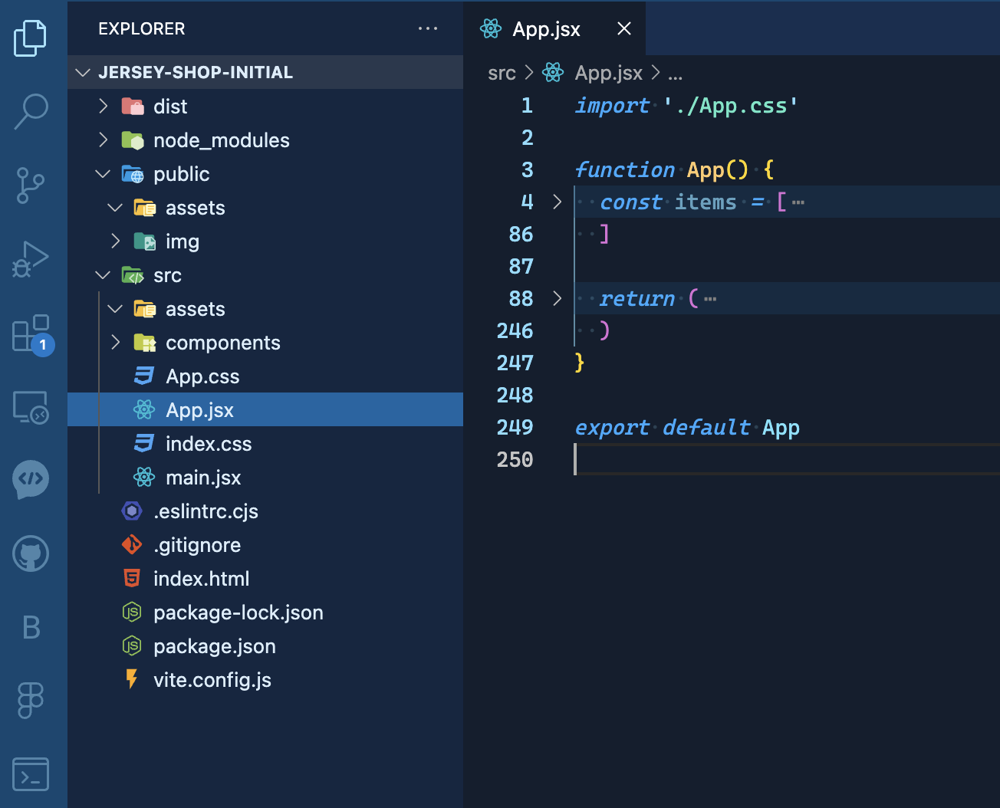
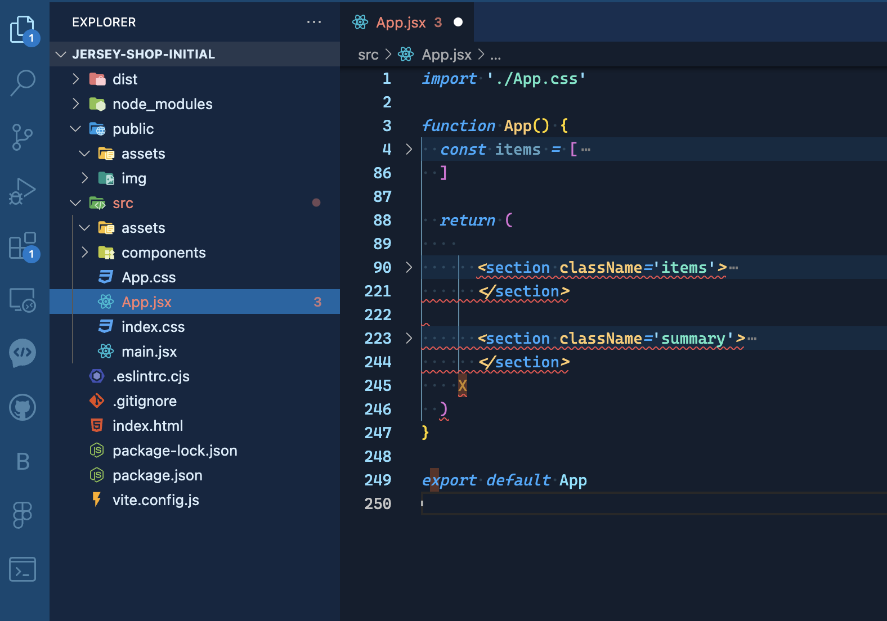
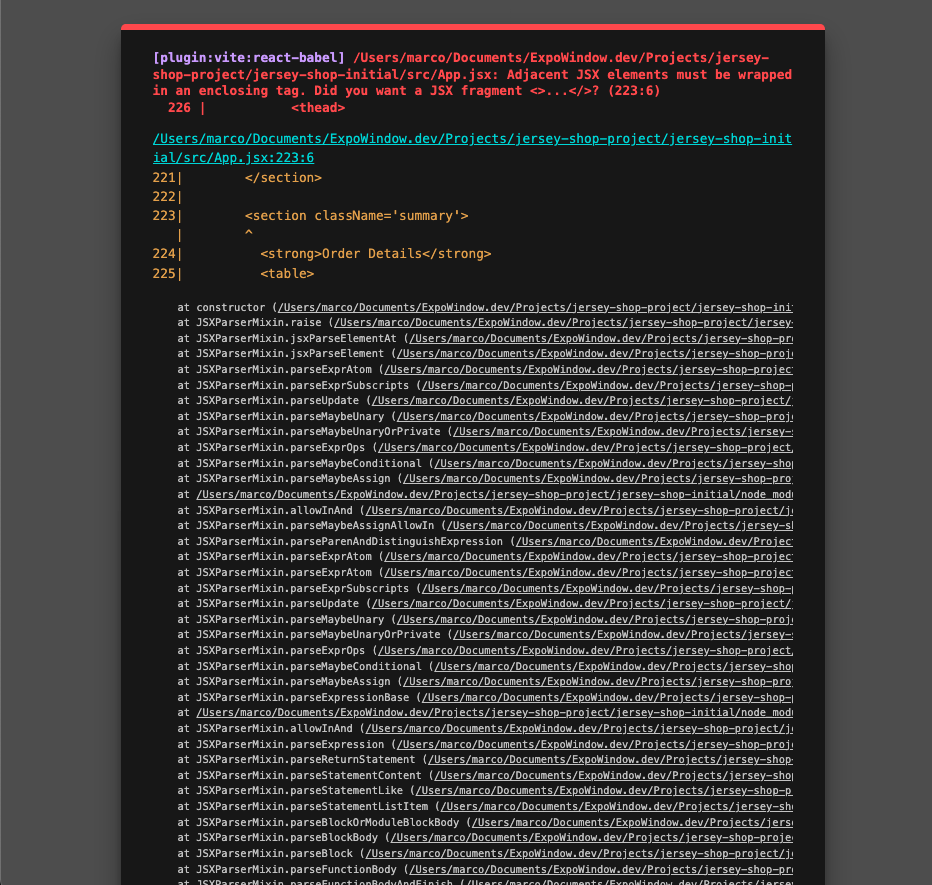
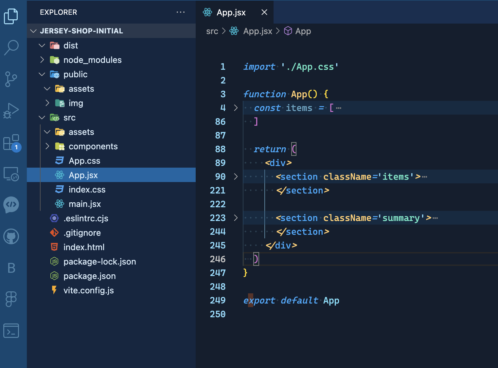
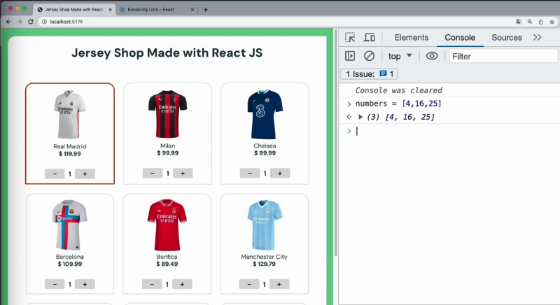
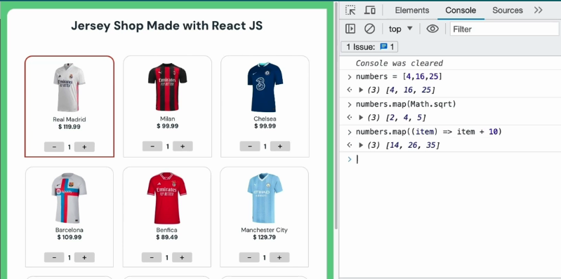
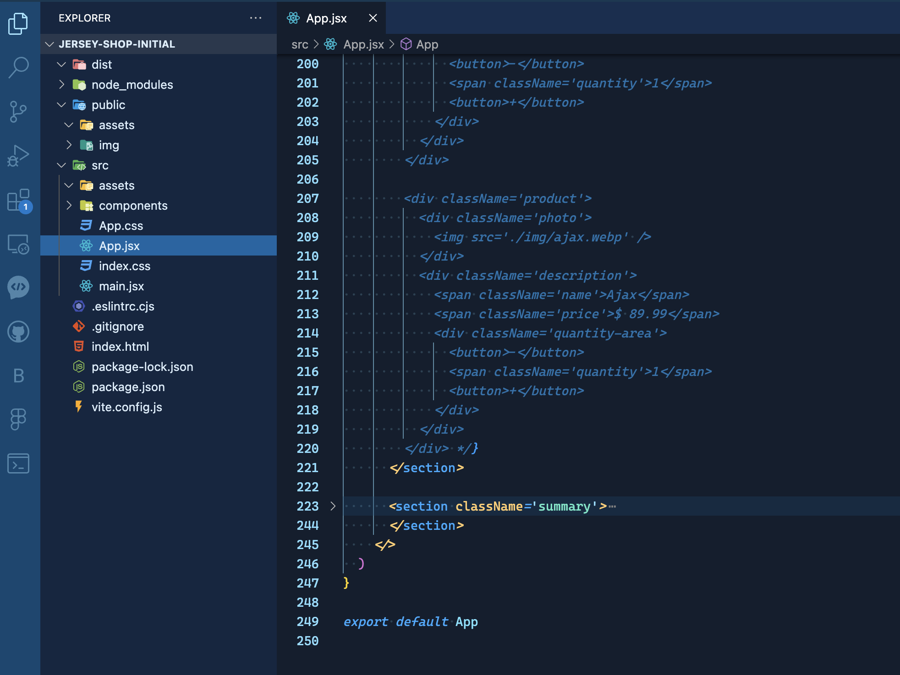
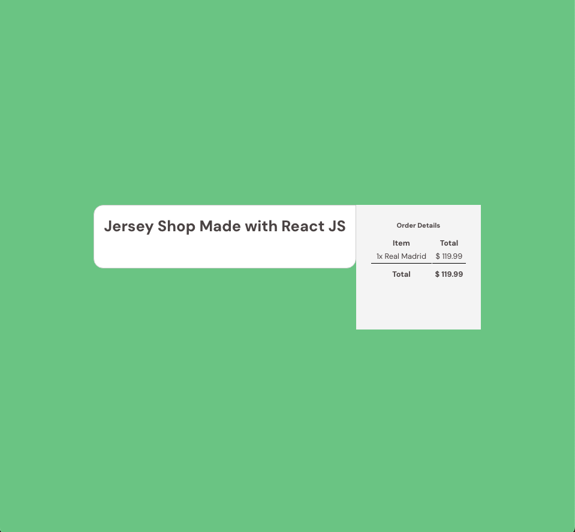
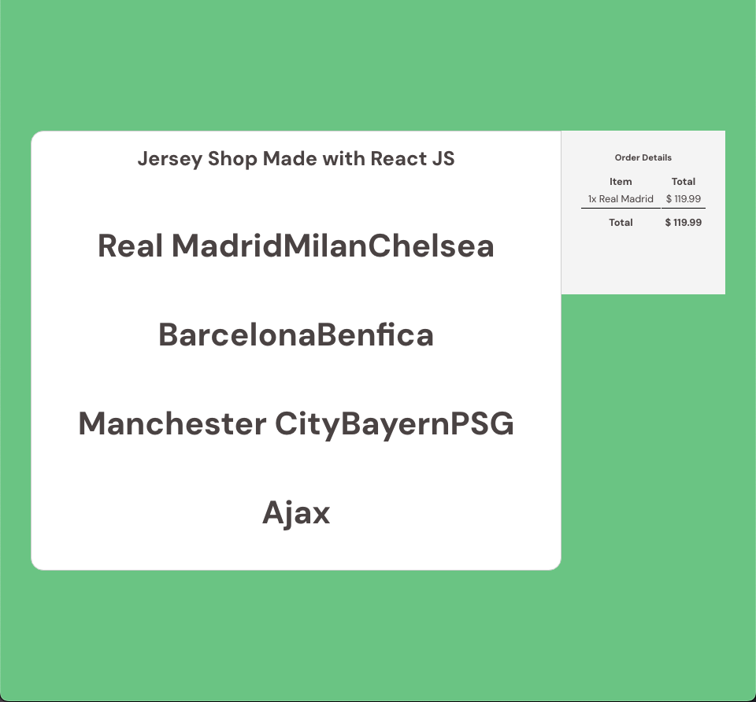
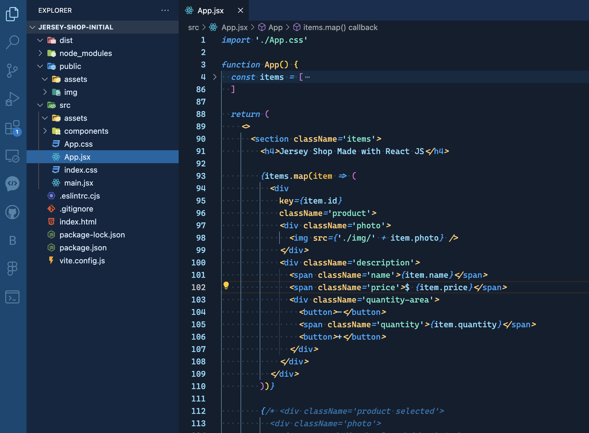

# React Crash Course

## Section 1: React Basics

### **=>** 1. Preparing the Workspace

- In this video, we are going to prepare the workspace.

- So we start working with React.

- We need to run some comments in the command line.

- So I think the easiest way to do this is from the Visual Studio Code `Terminal`.

#### Checking NodeJS Installation

- the first thing we need to check is if we already have NodeJS installed on our machine, So for that we can just type `node -v`.

```bash
node -v
```

- As you can see, I already have NodeJS installed on my machine.

- If this is not the case for you, you can just go to [nodejs.org](https://nodejs.org) and download the recommended version for most users.

- After you finish the installation, you can run the comment again and you should see your version of NodeJS with NodeJS.

#### Checking NPM Installation

- We'll also going to have the NPM, which is the package manager for NodeJS, So if we type `npm -v`,

```bash
npm -v
```

- we can see that it is also installed.

- we are going to use NPM a lot to install packages and libraries that we are going to need in our projects.

#### Installing Vite

- Now another thing that we need to install is vite.

- Vite is a front end development tooling and it is going to make it easy for us to create new React applications and to run it on a local server.

- It has more features which you can read more on [Vite JS](https://vitejs.dev).

- So let's go back there and check if we have vite, So `vite -v`.

```bsh
vite -v
```

- As you can see, I also have vite.

- If this is not the case for you, you can just run `npm install vite -g` to install it globally like this.

```bash
npm install vite -g
```

- It is going to be available in any folder of your computer for any project you create from now on.

- So after you do this, you are going to have Vite installed on your machine.

#### Setting Up Project Folder

- So now that we have all the programs we need to start working with React, I encourage you to create a projects folder on your computer.

- **We are going to get started with a template that I already built** so we can save time with having all the HTML and CSS code written

- **so you can download the zip file that I provided right below the name of this lesson In the right-hand side of the video.**

- You can copy that to your projects folder and open on Visual Studio code.

- So let me do it right now.

- Let me go to open folder.

- You can open the `Jersey-shop-initial`.

- **The first time you work with a React app that already exists You should always run an `npm install`.**

```bash
npm install
```

- For the first time because this is going to install all dependencies.

- This is going to create the `node_modules` folder and have everything ready for you to get started.

#### Running Vite for the Project

- **So now let's run Vite for this project to see what we have.**

```js
vite
```

- Let's go back to the browser and as you can see, this is the project that we are going to start working on right now.


- So it already has all the HTML and CSS written so we don't have to waste time on this and we can go straight to the react part.

#### Opening React Documentation

- So now we can close the websites for NodeJS and Vite, and let's open the React documentation because we are going to use it a lot throughout the course so we can go to [react.dev](https://react.dev).

- Let's go to `Learn React`.

- We're going to start with `describing the UI`.

- So this is what we're going to follow whenever we need to go deeper into any topic.

### **=>** 2. JSX Basics

- Now that we have the workspace ready, we can start writing the code for our application.

#### Exploring Project Files and Folders

- Before we do that, let me show you some important files and folders in the project.
- The first important thing here is that most of the files we are going to work on will be inside the source folder, so you can expand the `src` folder.

#### Understanding the `main.jsx` File

- Now let's see how all of this works by going first to the `main.jsx`.


- This might be a new extension for you. We normally work with JavaScript files, but in React, we are going to work with `JSX`.
- `JSX` is a special type of JavaScript syntax that will allow us to mix HTML markup with JavaScript logic.

- This file is importing a few React functions that are needed for everything to run properly.
- It is always importing the `App` component.

> Organizing Components

- As you will see in the next videos, we are going to divide our user interface into components when working with React.
- At the moment, we only have one component, which is the `App` component, so we are importing it here so we can use.

> Component Naming Conventions

- One important thing is that the name of the components must start with a capital letter.
- This is why we have the `App.jsx` starting with a capital letter.

> css imports

- We are also importing this global CSS file, which has some global styles for the application, but each component will also have its own CSS.
- This is important to keep everything clean and organized.

> Understanding the Render Function

- Now, this is the function that renders our application, so it is looking for an HTML element with an ID of `root`.

- If you go to the `index.html` file, you will see that this element is right here.


> Adding Google fonts

- If you want to load anything, for example, Google fonts or any scripts that you want to add to your page, you can add them directly to the `index.html` file.

#### Understanding the `App.jsx` File

- Now going to the `App.jsx`, which is the file that we are going to work on.


> Every component will be a function.

- You can see we are starting with the function called `App`.

> We export this function

- If we close the function, you can see that in the end, we export this function.



- So we use the `export default App`, which is the name of our function, and this is how we are able to import these components from other files.

### Understanding the App Function

> The return statement

- Now let's go inside the main function for this component.
- One important thing here is that all the visible part of the component is inside a `return` statement.


- So you will see that later. We are going to write a lot of JavaScript code, new functions inside here, but the part that is visible on the page should be inside the return statement.

> the parentheses for multiple lines

- One thing about the return is that since we have multiple lines, if we don't use the parentheses, this is not going to work properly.

#### JSX Constraints

> one single root element

- Another thing is that React components must be inside one single root element.

- if we delete the root element (`<>`)

- and we minimize the section elements, you will see that we have two root elements.



- We don't have a single root element.

- So if we save this now and go back to the browser, you will see that this is not going to run properly.



- And it is important that you get used to reading these error messages.
- They can be a bit intimidating in the beginning because there is a lot of text, but they will be very helpful to understand what is going on.

- Here it is telling us that JSX elements must be wrapped in an enclosing tag.
- So due to the fact that we have two root elements, this is not working properly.
- One thing we could do here is add a `div` so we can have a div outside.

- Now, we have one single root element.
- If we save this and go back there, you can see that now we don't have the problem anymore.



- Now we messed up the CSS a bit,


- but we can see that the page is loading correctly.

#### Using Fragments

- Now, how do we have a parent element without messing with the CSS?
- We can use this fragment, which is what we had before, which is like an element with no name.


- And what this is going to do is provide the parent element that the component needs but without adding anything to the DOM tree,
- meaning that the HTML that will be rendered by the browser will continue to be exactly as before.
- So this is why we have this symbol here.
- This is a fragment.
- And if we save this and go back there now, everything is rendering normally.

#### JavaScript expressions in JSX

- Now, one last thing before we finish this video.
- Remember, in the beginning, that I mentioned that JSX mixes HTML markup with JavaScript logic, and the way we use JavaScript here is `by using the curly braces`.

> Dynamic Values in JSX

- For example, we could have a variable for the shop name if we don't want to hard code it.
- So I'm going to add a new constant called `shopName`.
- So let's assign that string as the value of the variable.
- And if I want to use dynamic values, if I want to output JavaScript code here, we can just use the curly braces.
- So inside here we can do any JavaScript expressions that we want.
- For example, if we just do like `2 + 3`,


this is a JavaScript expression.

- If we go back to the browser, you will see that it is executing that code and we can also output variables.
- So in this example, we can output `shopName`.


- And as you can see now, we are showing the value of a variable.
- `So this is how we are going to mix JavaScript code inside our template`.

#### JSX Syntax Rules

- Now before we move ahead, I just want to point out that the HTML we use inside JSX is not exactly HTML.
- It looks very similar, but it has some different rules.

> `className`

- So you probably notice that instead of using `class` like we do in HTML, we are using `className` and this is how we should define our CSS classes in JSX templates.
- The reason for this is that JSX is going to be eventually converted into JavaScript so we can run in the web browser, and `class` is a JavaScript reserved word.
- Therefore we need to use `className`.

> Self-closing tags

- Another rule we need to follow is that every element that doesn't have content like image tags, they must be closed in the beginning tag.

```jsx

```

- So in HTML, if you don't do this and you just have an unclosed image, this is not going to be a problem.
- But if you do that with JSX, as you can see, Visual Studio Code is telling us that there is something wrong and if we save this and go back to the browser, you will see that we are going to have an error because the image tag is missing a closing tag

- We need to pay attention to certain rules when converting HTML to JSX.

#### Converting HTML to JSX

- One way to check this is to use a JSX converter.
- If you want to convert an existing HTML file into JSX, consider using a JSX converter.

- Let's go to a JSX converter to illustrate this.
- An example of HTML and its JSX counterpart is provided.


> Handling Reserved Words in JSX

- One notable example is the `for` attribute in HTML, which is a reserved word in JavaScript.
- In JSX, we need to use `htmlFor` instead of `for` to avoid conflicts with JavaScript reserved words.

> Differences in Inline Styles

- The inline style in HTML is slightly different in JSX.
- It's essential to be aware of these small differences when working with JSX.

> Practice and Familiarization

- We will have many opportunities to practice working with JSX.
- While JSX looks very much like HTML, there are subtle differences that need attention.

### **=>** 3. List Rendering with the Map Function

- Now that we have everything set up and we learned some basics of how to work with `JSX`, it's time to start writing the code to make our application dynamic.

> at the moment we have everything hard coded in HTML

- The first thing we need to do is to generate these items on the page.
- If we go back to the code, let's remember that at the moment we have everything hard coded in HTML.
- We have product number one, product two and so on.

> Using Array for Dynamic Generation

- What we actually need to do here is use the array of items.


- We are going to loop through this array and dynamically generate the HTML for each of them.
- To do this, we need to learn how to do list rendering.

#### List Rendering with Map Function

- If we go to the documentation right under describing the UI, we can go to rendering lists, we can scroll down and we will see that the documentation suggests we use the `map` function.
- One very important thing when working with React is that it uses a lot of vanilla JavaScript.
- It's very important that we have a deep understanding of how these native JavaScript functions work because then it's going to be way easier to understand how React works.

#### Understanding the Map Function

- Let's speak a little bit about the `map` function.
- First, let's go to the page.
- I'm just going to open the console real quick so we can do some tests.
- I'm going to create a new array here and I'm going to call it `numbers`.
- So let's put some numbers inside, for example, `4`, `16`, `25`.



> Testing the Map Function

- This is a new array.
- What the `map` function will do is loop through this array and run a function on each of the items.
- Let's do a quick test here.
- I can do `numbers.map`.
- And I can run any function on each of the items.
- For example, I can do `Math.sqrt`.
- If I do this, as you can see, it generates a new array with the square root of each of the items.


- This is one way of using this.
- But we can also create our own function here that it's going to do more complex things with these elements.

> using an Arrow Function

- So for this, we could, for example, start an arrow function and we could call each of the items `item`.

- Then we do the arrow function and right here we are going to return For example, we could do `item` plus ten.

- If we do this, it is going to get each of the items, add ten and then generate the new array.



#### Using Map Function in Template

- So this is how the `map` function works and how could we use this in our template?

- Let's go back there and see.
- Right now I'm just going to comment out all the products so we can start generating our own HTML from the loop.
- All the products, this is the last one.
- Be careful here where it ends.

- This is the last div I'm going to hit `command` + `/` to comment out everything.



- So now nothing should be showing on the page.



#### Implementing Dynamic HTML with Map

- To use that function here in the template The first thing we need to do is `start with the curly braces` so we can add a JavaScript expression here


- and we are going to use `the items array`.

- So let's remember we have a variable called `items` so we can run the `map` function over it.
- So we can do `items.map`.
- Then we can add our own function.
- Let's add an arrow function.
- So, for example, we could add `item`.
- Then the arrow function and we would do it like this.


- Now here we just need to pay attention because since we are inside the template and we are going to use the curly braces for the dynamic pieces of information, we are not going to use it here.
- We are going to directly write HTML on this side and here, since we only have one argument, we also don't need parentheses for the argument.
- This is going to be simplified like this.


- Now to do a quick test for every item of that array, let's just start an `h1`, for example, and then we could just use its dynamic property so we could add the curly braces so we can use one of the properties.

- For example, `item.name`.


- So we could output the name of each of the products inside an `H1` tag.

- If we do this, let's go back there.



- As you can see, we just got all of the names of the products and generated an `H1` for each of them.

- And this is super cool because now we can add any piece of HTML right here.

- We don't have to use just a single line.

- So what we are going to do is just erase this.
- We are going to break some lines and we are going to add the full HTML for the product.

- Let's get the second one that has better indentation.

- And let's paste it inside here.


#### Generating Dynamic HTML for Each Product

- So now for every item, we are going to generate this block of HTML.

> Using Dynamic Data

- And now we can make all the information dynamic, for example, right here, instead of hard coding the name,

- we could use `item.name`.

- Let me copy this and we can do the same thing for the price.
- Same thing for the quantity.


- And we can also do the same thing for attributes.
- So right here we are going to enclose this with the curly braces.
- Be careful because we need to do this outside of the quotation marks.
- So we do like this and then we are going to generate something dynamic.
- And right here, instead of just hard coding this, we can just leave the path for the folder and then concatenate with the file name.
- So we have this under the `photo` property.


- Let's save this and let's see if this is working.

- As you can see now, we are generating all the items dynamically.


> Testing Dynamic HTML Generation

- We could do a test here.
- So if we go back there and for example, we go to our object and we delete Real Madrid, we're going to start with Milan.
- We can save this.
- And then as you can see, that item is not showing on the list anymore.
- So our list is completely dynamic.

#### Handling Unique Key Prop Warning

- Now, before we finish, there's just one thing we need to pay attention here.
- If we refresh the page, we will see that now it's showing this warning.


- It is saying that each child in the list should have a unique `key` prop.
- If we go to the documentation and scroll down a bit, we will find information about this warning.
- So let's scroll down a bit more.
- As you can see, the way we can fix this is just by adding a `key` attribute to identify each of the elements.

- Let's go back there and do this.
- We can get the root element of each product, which is going to be this one.
- Then we can add the `key` attribute.
- And right here we can add the ID of each product as the unique identifier.
- So this is going to be `item.id`.



- Let's save this.
- Let's go back there.
- And if we refresh the page now, as you can see, that warning is gone.

- So every time we loop through an array, we need to remember to add the `key` attribute.
- This ensures that react renders the list efficiently.

### **=>** 4. Coding Exercise Walkthrough

- In the next lesson, you have a coding exercise to do.

#### Instructions for Completing the Exercise

- And since this is the first coding exercise of the course, I'm here to give you some instructions on how you can complete it.
- So this is the screen that you are going to see when you move to the next lesson.
- On the left side, we can see the instructions, so you should read the instructions carefully so you know exactly what needs to be done in the exercise.
- Then you have this screen in the middle, which is where you are going to write the code.

#### Interface and Code Editor

- If you want to hide the instructions, you can just click here.
- You can also increase the size of the code so you can focus or you can even choose a custom dimension for the window.
- So then you can see your code and you can see the output of the code.

#### Exercise Description

- Now, putting the instructions back in this exercise, you have an array of movies, and what I want you to do is to generate this table with the information of all the movies.
- So I'm putting here an example of how the HTML of each row of the table should look like and also how the table should look at the end.
- I'm including some comments in the code so you know where you need to work.
- So in this case, you need to work in this area.
- Only when you feel like you finished.

#### Running Tests

- You can run tests to see if your code is right.
- So let's pretend that I already wrote some code to solve the exercise.
- So now I'm going to run tests.
- And after a few seconds, you can see the results.
- In this case, I haven't done anything.
- So of course, the test failed.
- So you are going to have a reason why the test failed in this case.
- The app component should have a table with four rows inside the body, which is not the case.
- And the table should show all movies of the array correctly, which again is not happening.

#### Getting Hints if Needed

- If you fail a few times and you need some hints, you can go to this next section after the instructions where I'm going to give you some hints of how to solve the exercise.

#### Exploring Solutions

- And in the end, you can also go to the solution explanation to see how it should be done.
- So now I'm going to minimize the test results and I'm going to solve this correctly.
- I'm going to cover the solution right now so you don't see it before you try it for yourself.

#### Completing the Exercise

- All right.
- So now I solve the exercise, and it seems to me that everything is correct.
- I was able to run a loop through the array and generate the correct rows for the table.
- So now I'm going to run the test again.
- And now I can see that I completed the exercise successfully.

#### Conclusion

- So that's all.
- I hope you enjoyed the coding exercise and good luck.

### **=>** Coding Exercise 1: Test Your Skills with List Rendering

### **=>** 5. Conditional Rendering

- In the previous video We wrote the code to loop through the array of items and render them on the page.

#### Now, we still have to adjust a few things.

- If we go to the final version, we will see that when we load the page, we don't see those buttons to change the quantities.
- We can only see those buttons when we select an item.
- So I'm going to select this one, and when the item is selected, then we can change the quantity.

#### Conditional Rendering

- In order to make this work, we're going to have to do conditional rendering.
- Let's go back to Visual Studio code so we can identify where we need to work on.
- Let's remember that this is the HTML for each of the products, so we can see that we have this quantity area and we only want to show this quantity area if the property is `inBag` is set to `true`.

#### Ternary Operator

- Let's go to the documentation and look for the conditional rendering.
- We are going to use most of the time is going to be the ternary operator.
- As you can see, we can start the template tag right here. Then we could add a condition.
- If the condition is true, then we are going to render something.
- If the condition is not true, then we are going to render something else.
- This is one way of doing this.

#### Conditional Rendering with Ternary Operator

- So, we have this quantity area. Let's start with the curly braces.
- One at the start, one at the end.
- Right here I'm going to add the condition.
- The condition is the `inBag` property being `true`.
- If this condition is true, then we are going to use the question mark to render this.
- If the condition is not true, we could add the colon and then just render nothing.

#### Unnecessary Lines of Code

- If we take a look here, we will see that this part of the code is unnecessary because in this case, we don't have something to render.
- If this returns false, we only have it for when it is true.
- But the problem is that with the ternary conditional, we can't remove this part.
- There is an error here. We need to have this second part.

#### Using the AND Operator

- To avoid writing unnecessary lines of code, there's a very clever way of solving this.
- If we go back to the documentation, it suggests using the AND operator.
- As you can see, if this condition is true, then we return this.

#### Explanation of the AND Operator

- Let's go to the documentation of the AND operator.
- For a set of boolean operands, it will be true if and only all of the operands are true.
- This is what we are all used to using this.
- However, there's a second way of using it.

#### AND Operator Usage

- If we have just two values like this, it's telling us that it evaluates operands from left to right.
- If one of the operands we add here is false, it is going to return it.
- If not, it is just going to return the value of the last operand.

#### Testing AND Operator

- Let's make a quick test here.
- Let's try, for example, adding three and four and six.
- As you can see, all of these values are considered to be true by JavaScript.
- So it is returning the last one.
- If we have a falsy value right here, for example, a false, it is going to return the first false operand.

#### Conditional Rendering with AND Operator

- Right here we could do the following.
- We could add the AND operator right here.
- Remove this part of the code.
- What this is going to do is the following.
- It is going to start evaluating the value.
- So this is considered to be true if we have it as true in the property and this is also true.
- Since both of them are true, JavaScript is going to return the last one.
- But if this one is false, then it will just return false and nothing will be shown on the page.

#### Product Selection

- Now, let me remove these extra lines and there is still one thing that we need to do here with conditional rendering, which is showing the product as selected.
- If we go back to the HTML we had before, we can see that one of the products had a class of `selected`.
- So for the products that have the class of `selected`, they will show as highlighted.

#### Conditional Rendering for Product Selection

- Again, right here we are going to use conditional rendering.
- So here we also have a clever way of doing this.
- Let's erase all this.
- Let's add the curly braces.
- We can add the backticks to do string interpolation.
- Here we can mix strings with dynamic values.
- The first thing we need here is the product class, which is the one we had before.
- We can add a space and now we can just add some piece of dynamic code here.
- So we do this when we use the Backticks, we can use the dollar sign and open and close curly braces.
- In this case, we are going to test the condition `item.inBag`.
- We could use the ternary conditional right here.
- If the product is in the bag we could show `selected`.
- If the product is not in the bag, we could just add nothing here.

#### Careful Usage of Ternary Operator

- One thing we need to be careful. We also don't have anything to return if this value is false.
- So why don't we do the same thing as we did before?
- So instead of using the ternary conditional, we could use the AND operator.
- If both these values are true, which is the case for the first product, it is going to return the last two values.
- But if it finds a false value, this one, for example, it is going to return false.
- If we go back there, it seems that everything is working normally, but actually if we inspect the HTML, we will see that for the first one, it is correct.
- But for the other products, it added the false as a string.

#### Conclusion

- I just wanted to take some time to explain how the AND operator works in this case.
- When I saw this for the first time, I thought it was like an exclusive React syntax.
- But as we can see, it isn't.
- It's just a different way of using the AND operator.
- Now let me remove these extra lines, and there is still one thing that we need to do here with conditional rendering, which is showing the product as selected.
- If we go back to the HTML we had before, we can see that one of the products had a class of `selected`.
- So for the products that have the class of `selected`, they will show as highlighted.
- Again, right here we are going to use conditional rendering.
- So here we also have a clever way of doing this.

#### Progress Update

- This is pretty cool.
- We are making some good progress in this project, so we are ready to move on to

### **=>** Coding Exercise 2: Test Your Skills with Conditional Rendering

### **=>** 6. Components

- In the previous video We used conditional rendering to show or hide the quantity area.

#### Conditional Rendering for Order Details

- Now we need to do something similar for the order details.
- If we go to the final version, we will see that if we don't have any product added to the basket, we don't see that element.
- Only when we have at least one product selected, we see the order details.
- So we need to apply conditional rendering in this section as well.

#### Important Preparation

- However, there is something more important that we need to do first.
- If we go back to the code, everything we've done so far was inside the `app.js` file.
- This is the `app` component, and we can identify this component by this function.
- Then the `export default app`. This is how we create React components.
- After doing this, let's remember that we can use these components just like HTML elements.
- It is a good idea, since the beginning of any project, to think about components right from the start.
- It's not a good practice to let your application grow and then start separating things into components.
- If we go to the documentation, right below describing the UI, the first article is about components.
- It is a good practice to get started separating things rather than doing this later.
- We have many components, and we also have components inside components.
- Each of these components is responsible for one thing.
- For example, we have a search bar that has its own functionalities, so it is going to be a separate component.
- In our application, it doesn't make sense to have the order details, the items, everything, all the logic and HTML together in the same file.

#### Separating into Components

- Let's start separating things into components.
- Going back to the code, let's do this with the order details first.
- We can already delete all these lines of code that we commented.
- Here we have the section for the order details.
- In order to separate this into a component, we're going to go to the components folder, which is still empty, and we are going to add a new file.
- Let's name this one `OrderDetails`.
- The extension is going to be `JSX`.
- The first thing we need here is a function that has the name of the component, starting with a capital letter.
- So, `OrderDetails`.
- Let's export this function so we can use it from other files.
- We also have its separate CSS file, which is the way we should be doing things.

#### Structure of OrderDetails Component

- In this case, we don't have to follow this because we want to save time and not write any CSS for this project.
- We can leave the CSS inside here for now.
- We can just leave the HTML and the logic inside the components, inside the function.
- We are going to return something.
- Let's remember to add this fragment just so we don't have any problems.
- This is only needed if we don't have a single root element, but it doesn't hurt leaving this anyway.
- So right here we can include the HTML for this section.

#### Importing and Using the Component

- To use this component, we need to import it first.
- Let's import the `OrderDetails` from `components/OrderDetails`.
- Now that we have this, we can just use it as a regular HTML element.
- So we can do `OrderDetails`.
- Let's not forget to close it with the forward slash because in React, all the elements that don't have contents, that don't have a closing tag must have the closure in the opening tag.
- So we should always write it like this.

#### Check If It's Working

- Let's save this.
- Let's go back to the page to see if this is still working.
- As you can see, our component is still here.
- If we go there and change something like `OrderSummary` just to make sure that this is working.
- Saving this, going back there.
- We now see `OrderSummary`.
- So we successfully changed this to a separate component.

#### Advantages of Separation

- Now the advantage of doing this, first we are making the main screen of our application cleaner because we are not showing all that HTML here.
- Also, all the logic that we're going to have to write to calculate the order total will be separate from the main component, which is going to make things way cleaner.
- Now we still need to write the logic to only show this component when we have products in the basket, and this is what we are going to do in the next video.

### **=>** 7. Show or Hide the Order Summary

### **=>** 8. Props

### **=>** 9. Events

### **=>** 10. State

### **=>** 11. React Hooks

### **=>** 12. Updating State Variables

### **=>** Coding Exercise 3: Test Your Skills with Events & the useState Hook

### **=>** 13. Updating the Order Details

### **=>** 14. The Quantity Handler

## Section 2: Styling in React

### **=>** 15. Presentation of the To-Dos Project

### **=>** 16. SCSS Code for The Next Lesson

### **=>** 17. CSS x SCSS

### **=>** 18. Component Styles

### **=>** 19. CSS Modules

### **=>** 20. RECAP: Using CSS Modules

### **=>** 21. Tips for Working with CSS Modules

## Section 3: Context API & Reducers for State Management

### **=>** 22. State Management on Large Scale Applications

### **=>** 23. Creating Dummy To-Dos and Rendering the List

### **=>** 24. Setting Up The Logic to Erase and Mark To-Dos as Done

### **=>** 25. Creating and Providing the To-Dos Context

### **=>** 26. Using the Context from Child Components

### **=>** 27. Reducers - Consolidating the State Logic

### **=>** 28. Using The Reducer Function

### **=>** 29. RECAP: Reducers

### **=>** Coding Exercise 4: Test Your Skills with Reducers

### **=>** 30. Dispatching Actions Directly from the To-Do Component

### **=>** 31. Moving the Context Logic into the Context Provider Component

### **=>** 32. Merging the Reducer Into the Context

### **=>** 33. RECAP: Context + Reducers

### **=>** 34. The Add To-Do Modal

### **=>** 35. Open & Close The Modal with State

### **=>** 36. The Add To-Do Logic

### **=>** 37. Adding IDs to New Todos

### **=>** 38. The Filter Logic

### **=>** 39. Showing The Filtered Todos

### **=>** 40. Saving To-Dos in the LocalStorage

## Section 4: React Router

### **=>** 41. Presentation of The Book List Project

### **=>** 42. Getting Started with React Router

### **=>** 43. Adding Links with React Router

### **=>** 44. Dynamic Links and URL Params

### **=>** 45. Adding Links to Individual Books

### **=>** 46. Navigate to Links Programatically with useNavigate

## Section 5: State Management with Redux Toolkit

### **=>** 47. Redux - State Management for Large Scale Applications

### **=>** 48. Redux Installation and Store Setup

### **=>** 49. Reading from the State with the useSelector Hook

### **=>** 50. Calling the Reducer Functions With the useDispatch Hook

### **=>** 51. Avoiding Breaking Errors for Non Existing Book Ids

### **=>** 52. Toggle the isRead State

### **=>** 53. The addBook Action

### **=>** 54. The Notes Slice

### **=>** 55. Filtering Notes by the Book ID

### **=>** 56. Erase Notes

### **=>** 57. Add Notes

### **=>** 58. Erase All Book Notes

## Section 6: Firebase: User Authentication

### **=>** 59. React and Firebase - Project Introduction

### **=>** 60. Firebase Project Setup

### **=>** 61. Firebase Authentication Methods

### **=>** 62. Signing Up New Users

### **=>** 63. Handling Signup Errors

### **=>** 64. Signing In Existing Users

### **=>** 65. The Reset Password Function

### **=>** 66. Show the Homepage to Logged In Users

### **=>** 67. Persisting the Login State in the Browser Session

### **=>** 68. The Logout Function

### **=>** 69. Adding a Loader to The Login Page

## Section 7: Firebase: The Firestore Database

### **=>** 70. Setting Up the Firestore Database

### **=>** 71. READ From the Firestore Database

### **=>** 72. Using WHERE Clauses on Firebase Queries

### **=>** 73. Do We Really Need Redux in This Project?

### **=>** 74. Async Functions in Redux with createAsyncThunk

### **=>** 75. ExtraReducers and the Builder Object

### **=>** 76. UPDATE Data From The Firestore - The isRead Property

### **=>** 77. Toggle isRead from the Single Book Page

### **=>** 78. DELETE Documents from the Firestore

### **=>** 79. CREATE Documents in the Firestore

### **=>** 80. Fixing Bugs in the Add Book Flow

### **=>** 81. Adding Loaders for Pending Actions

### **=>** 82. Single Book Page: Fetching Books On-Demand

### **=>** 83. Improving the Loading State of The Single Book Page

### **=>** 84. Fetch Book Notes

### **=>** 85. Delete Book Notes

### **=>** 86. Add Notes

### **=>** 87. Cleaning Up the Project

## Section 8: Firebase: Hosting & Deploying Your React App

### **=>** 88. Firebase Hosting

### **=>** 89. Adding a Custom .com Domain to Your Firebase Project

### **=>** 90. Setting Up a Github Repo

### **=>** 91. Beginner GIT Tips

### **=>** 92. Setting Up the Github Integration with Firebase

### **=>** 93. The Importance of Branches

### **=>** 94. Deploying Feature Branches with Pull Requests

## Section 9: TypeScript: Quick Guide

### **=>** 95. What is TypeScript?

### **=>** 96. Preparing the Workspace

### **=>** 97. TSC: The TypeScript Compiler

### **=>** 98. TypeScript Syntax

### **=>** 99. Primitives Data Types & Functions

### **=>** 100. Arrays

### **=>** 101. Objects and Type Aliases

### **=>** 102. Optional Properties

### **=>** 103. Interfaces

### **=>** 104. Union and Literal Types

### **=>** 105. Null & Undefined

### **=>** 106. The Any Type

### **=>** 107. HTML Elements and Type Assertion

## Section 10: TypeScript in Practice

### **=>** 108. Presentation of the Students Project

### **=>** 109. More on the Default Tsconfig Rules

### **=>** 110. Defining the Student Interface

### **=>** 111. Outputting Name & Age of Students

### **=>** 112. Writing the Logic for the Area of Focus

### **=>** 113. Outputting the Students' Status

### **=>** 114. The Reusable Refresh Table Function

## Section 11: React & Typescript Basics

### **=>** 115. Creating Your First React & TypeScript Project

### **=>** 116. Typing State Variables

### **=>** 117. Typing Props

### **=>** 118. Sharing Types Between Components

### **=>** 119. Typing Functions

## Section 12: React & TypeScript with Context & Reducers

### **=>** 120. Presentation of the Quiz App

### **=>** 121. Creating the Context

### **=>** 122. Providing the Context

### **=>** 123. Adding the Reducer Function to the Context

### **=>** 124. Adjusting the Context Type

### **=>** 125. Fetching Questions From the Open Trivia API

### **=>** 126. Making the Question Interface with Chat GPT

### **=>** 127. Rendering the UI Based on the Game Status

### **=>** 128. Adding the The Question to the Context

### **=>** 129. Shuffling the Correct and Incorrect Answers

### **=>** 130. Decoding HTML Entities on Questions

### **=>** 131. Collecting the User's Answer

### **=>** 132. Submitting the User's Answer

### **=>** 133. Showing the Result to the User

### **=>** 134. Showing the Next Question for Infinite Gameplay

### **=>** 135. Adding the Score to the Context

### **=>** 136. Setting the Sound and Confetti for The Correct Answer
