# Custom WordPress Block Theme

https://youtu.be/_9FeKcUgcPw?si=D0pmJ2nRpo-MUj6H

<!-- This is part of the transcript of a video tutorial on web development.

help me do the following:

Write this text in its entirety, word by word, using markdown format, adding sub-headings for all its parts in h4 tags, starting every sentence with a bullet point, and using backticks for code terminology. -->

### **=>**Intro

- Today, I will guide you through the creation of a WordPress website utilizing the full site editor on the plugin called `create block team`.

#### Building the Website

- Join me as we build every section of the website from scratch. We will build:
  - The home page.
  - The contact page.
  - The blog post page.
  - A simple 404 page.

#### Important Note

- Now, it's important to note that this video is packed with ingenious acts to help us achieve our goals while everything functions flawlessly.
- It's essential to understand that there are certain limitations when it comes to customizing `Gutenberg blocks` and controlling responsive web design behavior.

### **=>** Local WP Setup

- Hey, welcome everybody, and let's get started for today's video.
- I'm going to be using `Laragon` in order to get WordPress installed on my machine.
- Make sure that you start `Apache` and `MySQL` from here.
- Right-click and then go to `Quick up` and then `WordPress`.
- Give it a name, `FSC Services`, and press OK.
- This should take a couple of seconds in order to get the latest WordPress download and install it for me.
- We can now visit the website using this URL.

#### WordPress Installation

- As you can see, we have the standard WordPress installation here.
- I'm just going to do the default English United States.
- Then for the site name, I'm going to combine `FSC Services`.
- Username is going to be `admin`, password is going to be `password`.
- As I'm developing locally and I'm not going to be publishing this website, that's absolutely fine.
- In this case, I will confirm the weak password, and I will put my email.
- The last thing that we need to do inside here is install WordPress.

#### Logging In

- Now that we have WordPress installed, let's log in.
- Admin, password, and remember me.

#### Updating WordPress

- From here, let's update absolutely everything starting from WordPress, so please update now.
- I think that's done.
- Then let's do the plugins update, all plugins.
- Then let's click updates again, scroll down, update all themes, and we should be good to go.

#### Website Settings

- From here, the first thing that I want to do is change some of the website settings.
- Let's go to `Settings General`,


- and from here, you can update your site title, tagline, and email.

- Let's go to `Reading`,
- and because **we're going to be developing a website instead of a blog**, we need to change the home page to a `static page`.
- Click on this and then select your home page. When we installed WordPress, this created a `sample page`, so let's select that.
- This is located on the pages,
- and now we just need to press `save changes`.


#### Permalinks

- For the permalinks, if you wish, we could make them a little bit more friendly. So, for example, let's just choose `post name`.


- Of course, this is up to you. You can put `blog` before this or whatever, but I'm just going to keep it simple.
- And in fact, let's just choose this and put it as `blog`. We'll see whether this works later on, so that's going to be fine, and then let's save changes.

#### Adding Demo Pages

- From here, let's add a few demo pages just so we have something to work with for our menu later on.
- So, pages,
- we already have the `sample page`,
  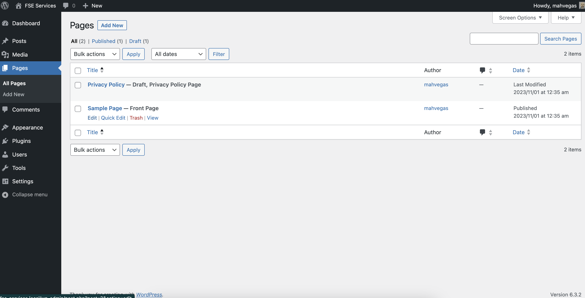
- so I'm going to edit this to `Home`,
- update.

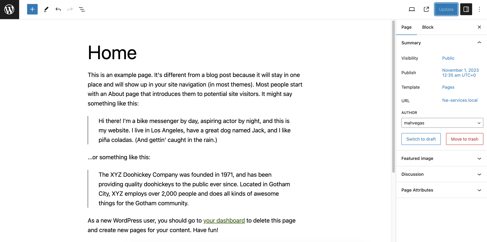

- For some reason, we're getting a `privacy policy` page now, as before, that's interesting.
- Let's add a couple more pages,
- so add new, `about`.
- I will change the URL to `about` in the permalink and publish.
- Let's create a few more, `services`, publish.
- Let's create a few more, `how it works`, publish.
- And the last one is `contact`, publish.
- Let's rephrase this, and you can see all of the pages that we have in here.

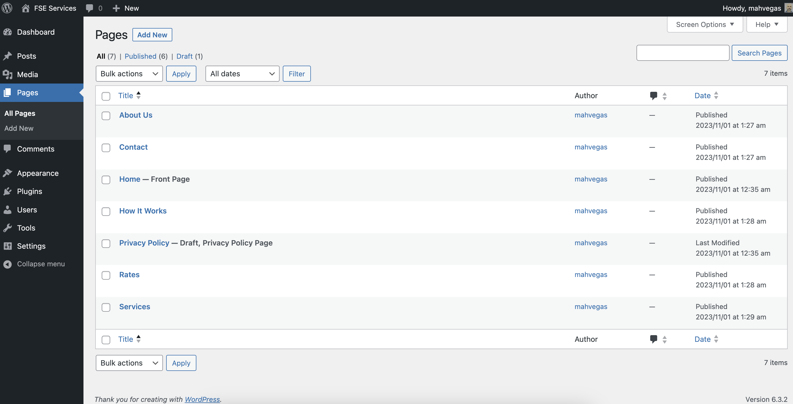

#### Adding Demo Posts

- Let's do the same for posts.
- So I'm going to go to `post`, and from here, let's edit the `hello world`.
- Let's make a few demo ones, so `Exploring the most common carpentry trends`,
- featured image.


- I will drag something from my assets here.


- Obviously, make sure that you optimize your images and you put `alt text`.
- I'm going to set this as featured image and update.
- 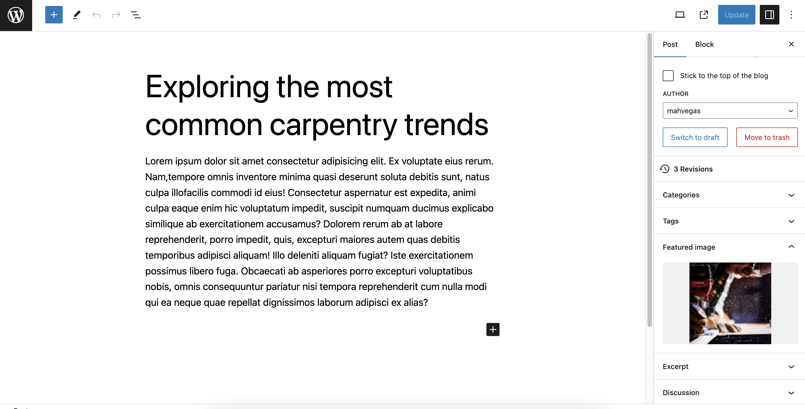

- Let's do 2 more blog post, `How to fix your sink`
- For this, I'm going to drag another image.
- I'm going to drag another image, set it here,
- and add some lorem ipsum as well.

  

- I forgot to do that, so I'm going to go back and **add a little bit of lorem ipsum to all the post**
- Now this one already had some, and let's add one more,
- We'll put `Cheap plumbing services`, and let's add one more image. I don't have another image like that, so I'm going to say `cheap painting`, something like that.

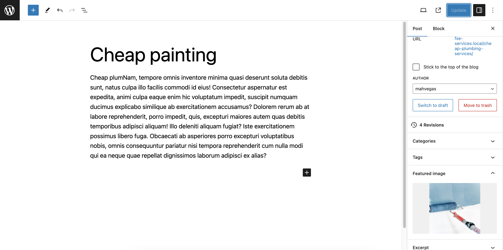

- Let's refresh here, and now that we have a couple of pages and we have a couple of posts.

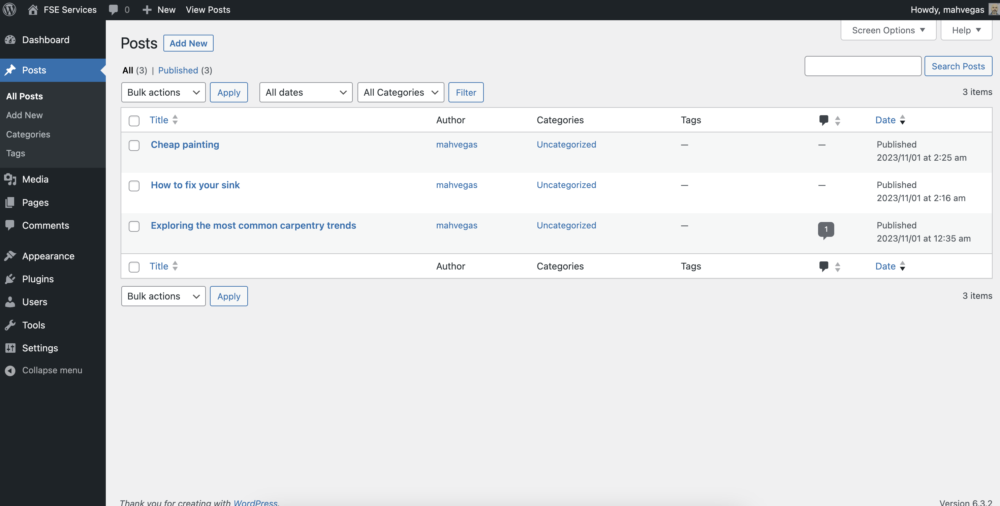

#### Installing SVG Plugin

- Let's go to `plugins`, and let's install a plugin which is going to allow me to upload `SVGs`
- and this is for my logo mainly, so `add new`.
- SVG, and the one that I'm going to install is going to be `safe SVG`,


- install this one, activate the plugin.
- And now if I go to `Media`, I should be able to drag all of my images for this tutorial, including SVGs, so we'll make it easier later on.


- So I have my logo in here.


- It's kind of hard to see, but go through your images, make sure that you optimize them, add alternative text.

### **=>** Creating Custom Theme

- And so on, now let's go back to plugins.
- Click `add new` and look for `create block theme`

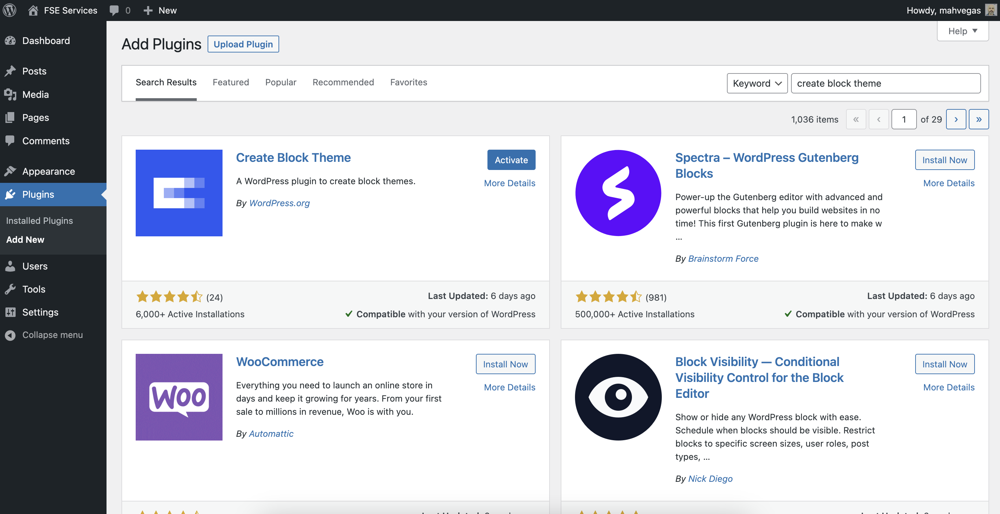

- This is the plugin that we want by `wordpress.org`, so let's install it.
- Also, activate it.
- This plugin is going to allow us to add fonts from Google or local fonts.
- It's going to allow us to create a theme super quickly and also export it.

#### Theme Selection

- First of all, if we go to the `appearance`, make sure that you have a full site editing team selected, such as the `2023` so you can get the editor.

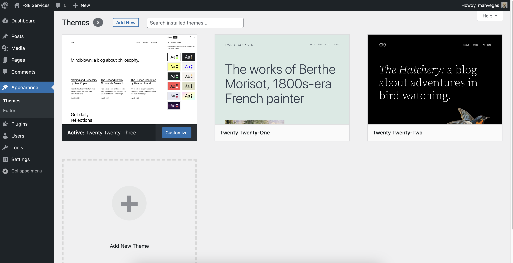

- Because if you have a classic team selected, you might not get this option in here.

#### Creating a Blank Theme

- Now that we have the `create block theme` plugin installed, if you go on the `appearance` and then `create block theme`, from here we can **create a blank theme**.
- Click `create`, give it a name, so `FSC services`.
- Give it a short description, URL, author, and upload a screenshot (recommended size is 1200 by 900).
- Select your theme tags, and add custom tags if you wish to.

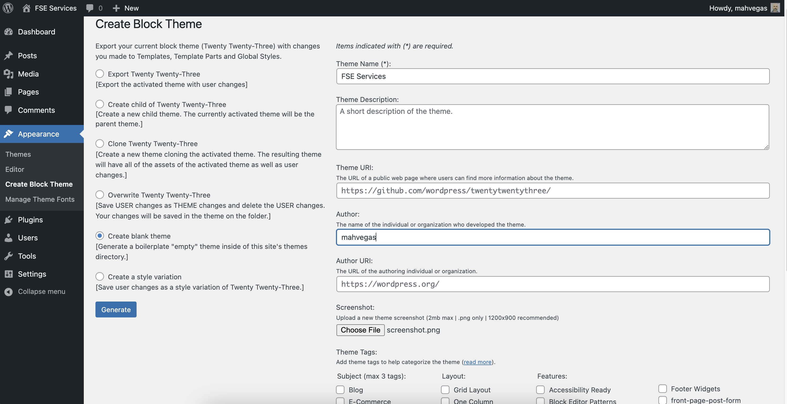

- Once you're done, click `generate`.

#### Activating the Theme

- Here we go, a blank theme has been created.
- Go to `appearance`, and from here, you'll see your brand new theme.
- Let's activate it.

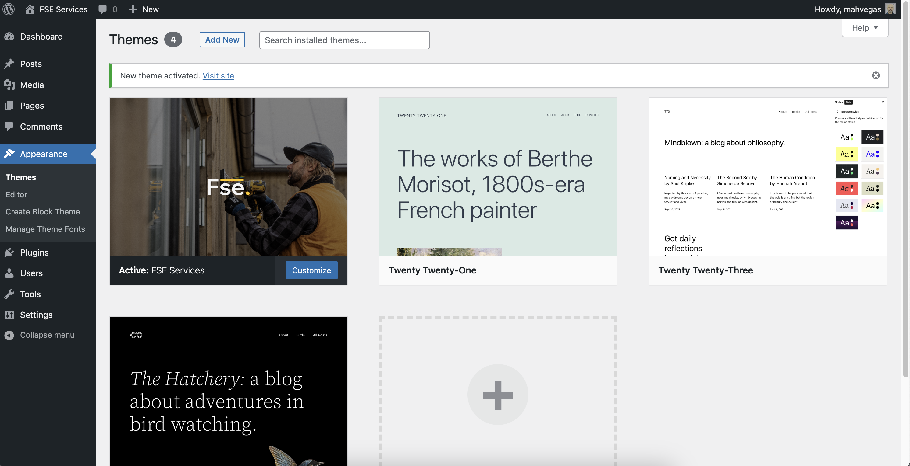

- If you visit the website, you will see that we have a brand new website.

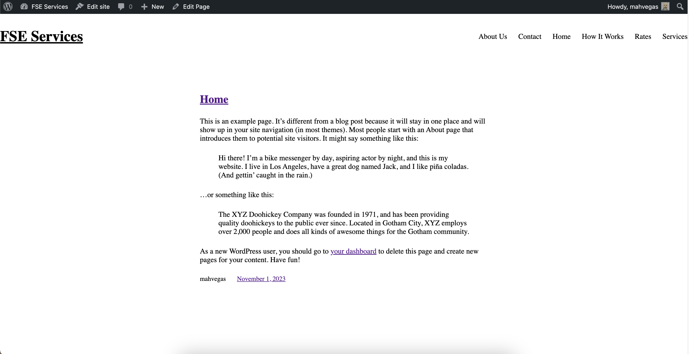

#### Managing Theme Fonts

- Let's go back to the `appearance` and then `manage theme font`.
- From here, we can either `add Google fonts` or `add local fonts`


- lets add this one `Wix Madefor Display`


### **=>** FSE Overview

- let's take a look at the full site editing editor.
- Go to `appearance` > `themes`, and from here, you can click `customize`.
- There are a number of ways of going to the customizer page, but this is one of them.
- Click `customize`, and this will open the `full site editing`


- so from here, we can design all templates and template parts.

#### Templates

- Let's have a look at templates.
- If we click on "templates", **these are basically all layouts**
- under the hood **WordPress uses the index template**
- But if we click here on the `plus sign`, you will see that you can design a different template.
- So you can design a specific one for the front page, single blog posts, `pages` (which is what we're going to be using), and many more.
- You can also create custom templates.


#### Template Parts (Header and Footer)

- Now, let's go back super quickly and look at the template part.
- go to `patterns` and you see the template part

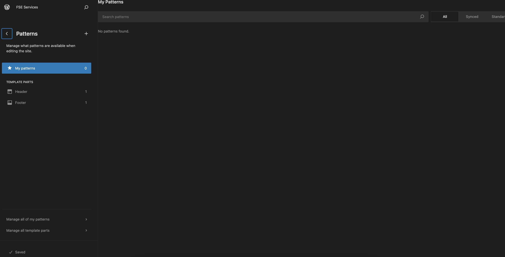

- Template part is essentially a reusable part. For example, on most websites, we tend to reuse our `header` and `footer` on pretty much every page.
- You can create stuff like a `sidebar`, `header`, `footer`, and many other reusable parts that you can create on your website.
- `we will mainly look into creating a header and a footer.`

#### Creating a Page Template

- let's go back and click on "template".
- The first template I'm going to create is going to be the page template, so click plus and then click "page".
- For this one, we're going to choose "all pages"


- because I want my template to apply to all pages.

- then we have to `choose a pattern`

- **maybe if we add patterns like the "wireframes" we can choose them from here**

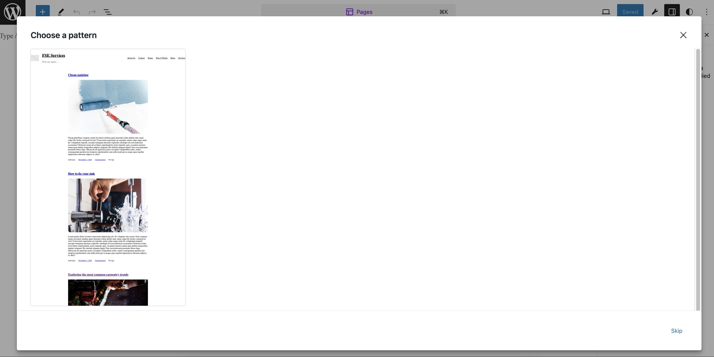

- right now we only have the pattern from the index, so we choose that one for now
  
- Here we go, we have a very basic template.

#### Menu Overview

- From here, let me quickly walk you through the menus, and then we can start building.
- From here, we can always go back to the template that we're editing.


- But then, from the `plus sign` here, we can search for "patterns", which are pre-made patterns such as featured buttons, posts, text, buttons, gallery patterns, and so on.

- Then we have "blocks", which is what we're going to be using the most. Blocks are basically stuff like paragraphs, headings, lists, quotes, images, galleries, buttons, widgets, and so on.

- In the" media" section, we pretty much have the images that we uploaded earlier.

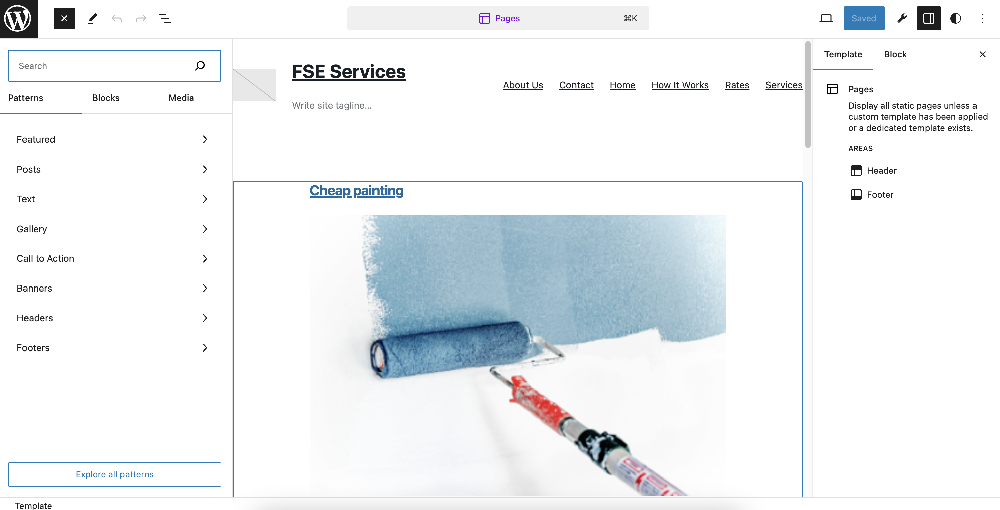

#### List View

- The list view is what we're going to be using quite a lot throughout this video.
- This is essentially how your website is built.
- Normally, a website is built with sections.
- For example, a header section, we have a query loop in here, and a footer.


- These are three different sections,
- and inside them, we have different parts,
- different blocks such as a group, row, spacer,
- inside the row we have a logo, and so on.


#### Create block theme exporter

- Here on the right side is where we have the "create block theme exporter,"


- which we're going to be using later on to export our theme.
- Then you can pretty much reuse it on any website.

#### Settings

- and then we have the "settings," which is what we're going to be using quite a lot.
- From here, we have "template settings" and "block settings."

- We don't get anything in the block because I haven't selected one, but if I was to select the navigation block here, you'll see that suddenly we're getting a lot of options.

- We're getting the `list view` here,


- then we're getting `settings` which is kind of like the layout, display, and so on.


- And then we're getting "styles," so styles are basically your colors, typography, dimensions, and so on.


#### Theme Styles

- Now, the last thing that I wanted to show you inside here is the `theme styles`.

- It's kind of like your branding, your typography, colors, and layout.


#### Icon for Style Box

- Also, there is a little hidden icon here, kind of hidden, which is `all style box`. So if I click on this, you will see a lot of the elements that we could use on our website.
- For example, headings, paragraphs, lists, quotes, code, preformatted code, tables, and so on.
- Inside here, we have media stuff like images, galleries, audio, covers, and we have buttons, columns, groups, and so on.
- There is quite a bit, and we have widgets, team settings, and so on.

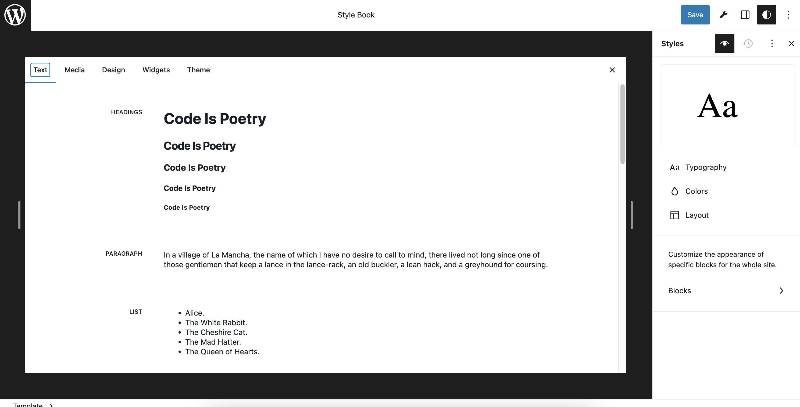

### **=>** Starting the Styling Process

- So we're going to be pretty much starting from here and develop our website.
- If you go back to everything, don't select anything on the screen.
  

- Let's start by building or branding.

#### Styling typography

- The first thing that we look at is the `typography`.

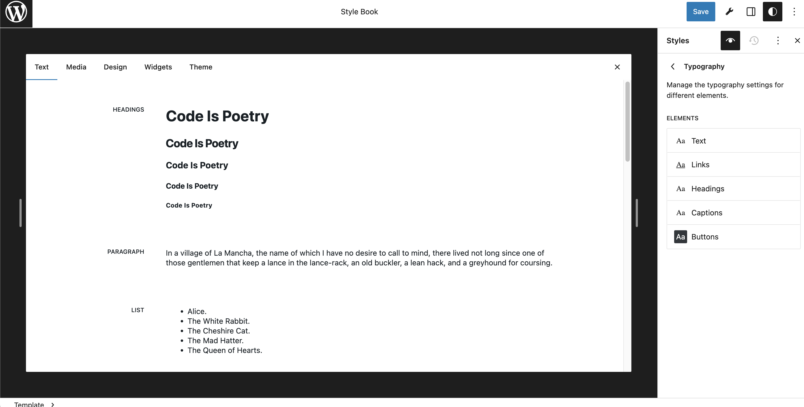

- If we click on this, as you can see, we have a couple of elements.
- The **text element** is the first one that we can look at, and from here, we can change the typography.
- Now, as you can see, the current font is the default one.
- From here, we can change it. So instead of using the system font, I'm going to be using the Wix one that we downloaded earlier, and as you can see, it already changes.


- From here, you can always change the size of the font if you wish, the appearance (which is basically thin, light, regular, and so on).


#### Styling Links

- Now we have **links**. I'm going to do the same for links. I'm going to change it to this one here.
- Everything else looks good. You could remove the underline from here as you can see, but I don't really mind the underline on links, so I'm going to leave that.

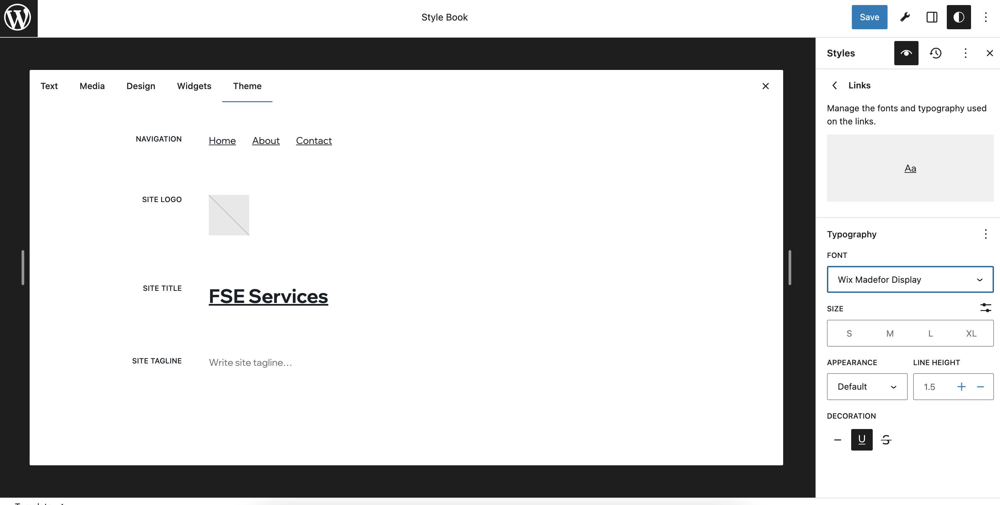

#### Styling Headings

- Then we have the **headings**. For the headings, you have pretty much two options.
- You can either change the font from here for all of them, or you can look into each individual heading individually if you wish to.
- You can change stuff like the line height and so on.


#### Styling Buttons

- If we go to **buttons** from here, let's change the button to be the Wix display font.
- Let's change it from pixels to Rem, so maybe I can put it as 0.9.


- Make sure that you save your changes.

#### Customizing Colors

- Now, let's go back, and now let's look into the **colors**. From here, we have a palette.
- On the palette, we have a couple of the default colors here and a couple of default gradients, which is pretty cool.


- Now, I want to add custom colors for this theme.

- So if you go here on the `Custom`, click on the plus sign, and then you can select the colors that you want.
- First of all, I'm going to be adding a yellow color, which I'm going to call, `FSE-Yellow`, you can call it whatever you like.

- Let's add another one; this is going to be almost black. So just outside here, and I'm going to call it `FSE-Black`

- one more, and this is going to be a very creamy color, as you can see here.
- And then this is going to be called `FSE-Cream`. Save this,


- let's go back, and from here, we can change some of the colors globally.


- For example, the **background color** is what I want to change. I can change it, and as you can see, it makes a change straight away.
- I'm going to leave it as this one here.


- `Text`, I'm actually going to leave it as black. I'm going to leave it to this one here instead.
- We have the `links`, select them as `FSE_black`
- for the `hover`; maybe we can do something extreme, I'm going to go with the yellow.
- That might be a little bit extreme, but it doesn't matter.
- Then for the `headings`, I'm going to go with black,
- and for the `buttons`, I'm going to go with custom. For the text, it's going to be black, and for the background here, it's going to be our custom yellow.


#### Layout and Dimensions

- The last thing that we can look into here is the layout.
- This is going to be basically the dimensions, the width of your area.

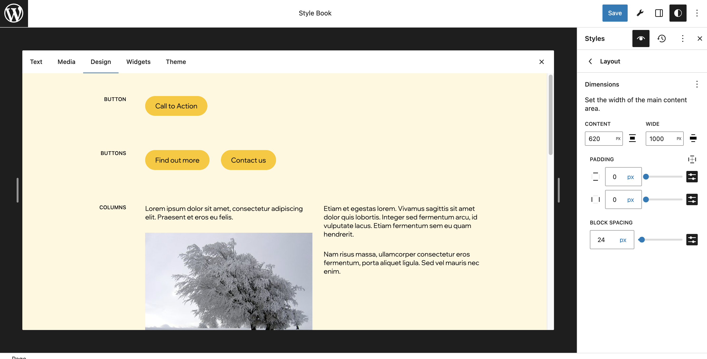

#### Example in Figma Design

- For example, if I go back to my Figma design super quickly.
- If I click on my design and if I look into it.
- This is where my content is gonna start.
- So if I create a square super quickly, this is how wide my website is going to be.
- I can go here and have a look, it's 1544.

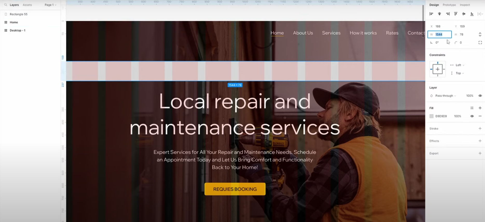

- This is how wide my website is going to be.
- So I'm going to be using that number for the content and the white content.


#### Content Width Options

- Now, this allows you to basically have two options for narrower content and the wide content.
- But I'm not going to be using this in this video.

#### Handling Black Space

- You also have something called black space in here which you can modify.
- Sometimes it's pretty useful, sometimes it's pretty annoying, but you'll get used to it, I guess.
- So I'm gonna leave it as the default and show you ways of going around this.
- Make sure that you save your changes.

#### paragraph line height

- Let's go back, click on blocks.


- One thing that I want to change is definitely the paragraph.
- So I'm going to go to typography and maybe set the line height as `1.6`.

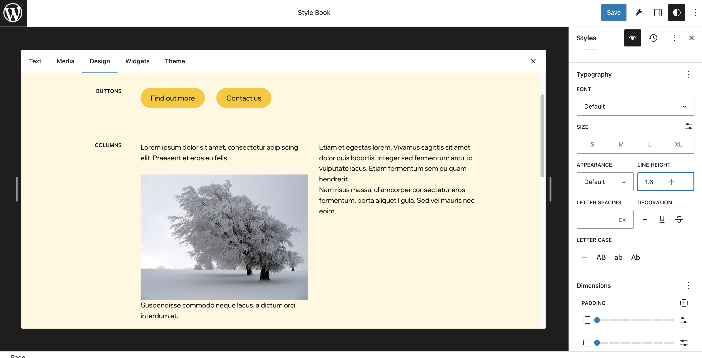

- It's actually looking decent at `1.6`, so I'm gonna leave it at that.

- **Make sure that you go around here and change everything that you don't like**.
- Save this, and let's have a look at the first problem that we're gonna encounter.

#### Responsive Font Size

- So if you go to text super quickly, as I showed you earlier, we can modify the headings to whatever font size we wish.
- Unfortunately, we can't make those headings responsive, which is a pain.
- If I scale down, you'll see that they're not responsive, and that's not great.
- As you know, the Gutenberg blocks don't really have many options for responsive design.
- So we're gonna have to fix this, and this is where the first hack comes from.
- Save your changes.

### **=>** Exporting Theme

- so save your changes once you're happy go to `create block theme` and choose `create theme`


- make sure that you name your team and put all the description I'm gonna put `FSE Services (New)`
- and then choose `export theme`

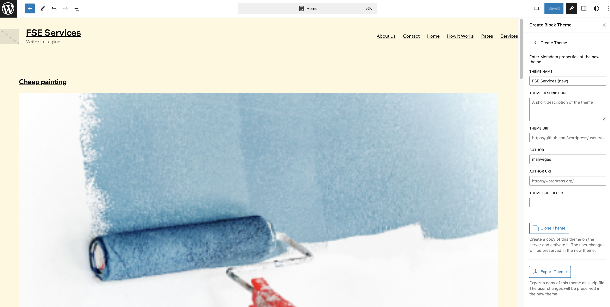

- this is going to export a zip file for me.

- extract the files from the zip and rename the folder `fseservises-new`

### **=>** New Theme Settings

- And now let's go back to Laragon. `(Local)`
- choose `Go to site folder` then app/public/wp-content/themes
-
- Here is the theme that we were just working on. `fseservices`


- so move the `fseservises-new` in the themes folder

#### Explanation for Exporting and Creating a New Theme

- I wanted to give a quick explanation of why I exported the theme from the create block theme plugin and created a new one out of it.
- The reason for this is because originally I tried to edit the theme created by create block theme.
- I couldn't update a couple of things, and I don't know whether some things are saved into the database.
- If I open the theme.json file, you will see that a lot of the things that I added are missing.
- Like the colors, typography, and so on.
- But when I export the theme, which is here, and if you look at the JSON file, you will see that the palette, the colors are here, the layout is here, the spacing, and the typography.
- That's why I created a new theme out of it. So that's pretty much why I did it.

#### Exploring the theme.json

- Now, if we open the new **theme.json** super quickly, you will see that most of the work is already done for us.
- The reason I'm going through this and I'm creating a new theme is because I don't want to mess up anything.
- I want to start clean. So we're starting with a clean theme here.
- And I'm gonna be adding custom code as we need. It's not going to be much.
- This has already saved us a lot of time, as you can see.
- I'll walk you through this in a second.

#### Theme Parts

- Essentially, we have a couple of parts and you can add a lot more to effect.
- But as you can see, let me...
- Essentially, we have **three main parts**:


- **Settings**: Basically, stuff like the `palette` which we just added, the `layout` which we also added, we have some `spacing` here which you can add more options to, and you have the `typography`.
- So this is already added for us. It saves us a lot of time.

- **Styles** is another section, and this is basically where you can style different blocks.
- So for example, inside `block`, you can start a paragraph, you can style, I think there are quite a lot
- Let me just do this, and as you can see, you can start the core, archives, audio, avatar, buttons, headings, links, typography, and so on.


- We're going to be doing this, so let's save this, and let's go back to our website.

#### Enqueuing Styles and Debugging

- Let's go back, let's go back, and now we go to **appearance**, and let's select **our new theme**.

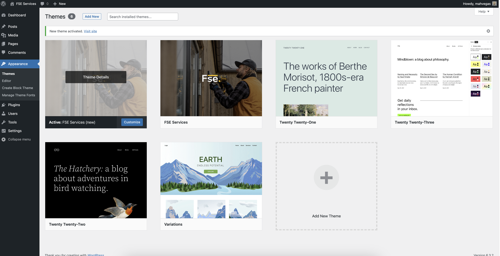

- Now, before we start any development work, what we can do is if we go back to the website,
- navigate to the root folder where we have **WP config.php**,
- and from here, if you open the file, scroll down to the bottom.
- Somewhere on the bottom where we have **WP debug**, turn that to **true**.


- This is going to help you every time you make an error.
- It's going to show you at the top of your website, and it might help with caching issues.
- So if you save this,
-
- the other thing that we want to do is, let's look at the **style** super quickly.
- Let's go back to `wp-content/themes/fseervices-new` theme.
- Here, as you can see, we have **style.css**.


- Let's open it. So this contains details for the theme.

- The name which appears here in the editor, as you can see, and so on.

- But when we visit the actual website, if I refresh simple quickly, everything is working well so far.


- But if I was to go to this **style.css** and if I was to do, let's say **body**, and let's say I wanted to change the background color for some reason, let's change it to **red** and, in fact, let's make it **!important** just to prove a point.


- If I go back, and if I refresh, `you'll see that it's not taking any of the styles What we need to do is go back and create a **functions.php** file.
- by duplicating a file and renaming it **functions.php**.
- Let's open this file, and it's going to be empty.
- Inside the **functions.php**, the first thing I want to do is start PHP like so,
- and inside here all we want to do is include the **style.css**.
- I'm going to paste a little comment: "Enqueue Styles."
- To save time, I'm going to copy and paste the function that does that.
- So here it is.

```js
<?php

/*-------------------------------------------------
Enqueue Styles
--------------------------------------------------*/

if(!function_exists('theme_styles')) :
  function theme_styles() {
    wp_enqueue_style('styles', get_stylesheet_uri(), wp_get_theme()->get('version'));
  }

endif;

add_action('wp_enqueue_scripts', 'theme_styles');
```

- this enqueues the stylesheet for us.
- Now, if I save this, we still have the **body background color** of red.

- If I go back to the website and if I refresh,


- you'll see that the styles are working, which is great.
- Let me remove the body because we don't obviously want that, and save it.
- Perfect, let's go back to the website and refresh.
- By the way, you might see some errors in here, and this is because I enabled the `wp_debug`.
- As you can see, some things are deprecated, and this is actually coming from this plugin here, the **create blockchain** plugin, which we don't really need anymore because we exported the stuff that we need.
- So I'm going to deactivate this, and as you can see, no errors.
- I am using PHP 8.1, I believe. If I do right-click, PHP, yeah, 8.1.

The provided text has been formatted with

the requested sub-headings, bullet points, and backticks for code terminology.

### **=>** Custom Header

- Now let's go back to the appearance editor and from here we can start with the Custom Header.
- Header so inside `patterns/template Parts` click on `header`
-
- and click `edit`


- there are actually quite a few headers that you can use. inside the plus sign here. If you put headers, you might be able to find a few headers that are already pre-built.


- But today I'm just gonna build a very basic one.

#### Custom Header Setup

- If you go to the list view, we have a spacer which we don't need, so I'm going to delete it.
- We have a group, so this group I'm gonna click on and under Advanced here, I'm gonna change this to a header element.
- Now for some reason, this I think this adds a block margin on top of it, and there is a way of resetting it.

#### Custom Header Styling

- You can go here, let's have a look. It could be, in fact, sorry, it's margin, and I believe that you can just reset the margin.
- Also, just for development purposes, I'm gonna change this to another color.
- If we go under the grid, we have a row, and inside this row, we have the side logo, which is fine.
- We also have this group which contains the site title tagline, let's remove this.
- For the logo, I can click here and upload mine.
- For the navigation, at the moment, it's actually just picking up the pages that we created earlier in this tutorial, which is absolutely fine.
- But from here, I want to change the order, and this is actually using a page list instead.
- So what I'm going to do is I'm going to remove this.

#### Custom Header Menu Setup

- Let's add the first item and I'm gonna go with page link.
- This is going to be home.
- Let's add another one. And by the way, you might be tempted to use this home link, but we're gonna have some problems with this if you use it, and I'll show you why.
- All right, let's add about.
- Let's add services.
- Oops, page link, sorry, how it works.
- Right, perfect, save this.

#### Custom Header Styling (Continued)

- From here, I am zoomed in quite a bit, but if I change it to the default one, that's actually looking pretty cool.
- From here, you can edit some of the settings.
- For example, the mobile menu, the orientation, you can change it to whatever you like.
- Also, you can change the style.
- For example, for the text, you can change the color, which we'll actually have to do.
- I'm going to change it to White, and what else do we need?
- The block spacing you can also change to make it to whatever you like. I'm gonna reset it because I like the default.

#### Mobile Menu Styling

- And that's pretty much it. Look into the background, the sub-menus, and so on.
- Now if we go to the settings, you will see this display.
- From here, you can choose how your mobile menu displays. So if I go down to mobile, you will see that we're getting this mobile menu.
- Let me zoom in, and then from here, you can pretty much change it to whatever you like. There are not many options, and also if you click on it, you'll see that this is looking kind of pretty bad.
- We're gonna have to do some custom CSS in order to make this work.

#### Integrating Custom Header

- So let's close this and let's look into it. Now it's actually pretty hard to visualize how our menu looks like.
- So what I'm gonna do is save it. Let's go back to WordPress. Let's go back to our template parts page. And from here, I want to add it to the top.
- So from here, I'm going to remove this one, remove the bottom one as well, and I'm gonna add a new one.
- Search for header and just drag this in. I'll try to drag it, um, okay, here we go.
- I added it to the bottom, so choose and then scroll back to the top, choose and then here it is. So I'm gonna add this and make sure that this is the top, wait for this to be removed, come on.
- Here we go, move it to the top, save it, and let's preview our website.

#### Custom Header Styling (Final Touches)

- Okay, not so bad. The first thing that I want to do is 10 pixels of space on each side.
- And also I want to move this in the middle. So in order to do this, I'm going to click on the header here, click on the header edit and now let's continue.
- So edit, so first of all, let's click on the group here and let's go to Styles.
- Let's go to padding, unlink this, and do 10 pixels to the left, sorry, right, and then pick this to the right to the left like so.
- Now I also want to make this in the middle of the screen. So let's go to the block series content width, that's correct, maybe we need to put the group inside the group.
- Let's try that, so group drag it, select this one here and now if we drag this grip outside and if we drag the row inside, well, let's try, here we go.
- Now hopefully, if this is set to in a block use content width, save this and the other one is also set as the same.
- You will see that it did move, but the reason that it's not working well is because I'm zoomed in, okay, so potentially it was probably he was probably fine a way worse.
- Let's try without the second group, no, okay, so the second group does make a change now unless yeah, the second group does make a change, I think unless we, so let's do it like this.
- Refresh, and we're good to go.

#### Fixing Header Position and Styling

- Now if we look at the design super quickly, you will see that our header is always on top of this hero image, so we need to do that.
- Let's go back to the header and let's remove the background color first of all because that's gonna get in a way.
- So I'm gonna go to Styles and deselect the background color, first of all, it will look a little bit odd now it's going to be hard to edit, but there is not much we can do about that.
- If we were to select this grip first of all and go to settings, you'll see that there are some options for positioning such as sticky, but there isn't a position for fixed or absolute yet.
- Instead, I'm gonna click on this, and I'm gonna add a custom class on it.
- So on the settings Advanced, click on here, additional CSS classes, so I'm going to call this one FSC custom header

foreign, and copy this, and Save.

#### Custom Header CSS Modifications

- So now if we go back to the website, as you can see, the header is working fine, but we need to position it absolute.
- So I'm gonna go to the CSS and inside here we're gonna put FSC custom header and then position it's going to be absolute, zero left, zero right, zero.
- And I want to put the Z index to be at least two so it's on top of the other stuff.
- So if I go back, you should see that I did Ctrl shift and add to refresh, and you should see that the header is now on pretty much on top of this section which is exactly what I want.

#### Styling the Mobile Menu

- Now the other thing that we need to solve is the mobile menu.
- I didn't really prepare for this, but if we inspect this and if we go down to mobile super quickly and if we click on the menu which is here, oh, okay, that's not so bad.
- Potentially you could add a custom class and just move everything to in the middle maybe or just move a little bit from the right side.
- So what you can do, click on the menu here, navigation, let's go to settings, click on Advanced and let's give it a class name.
- Maybe main math, main nav, copy this, save, save, and now if we go back to the website here when we toggle the menu, let's see where it is, I need to inspect it, and when we toggle the menu we're getting this class here is menu open and has model open which we can use in our advantage to style this.
- And by the way, here we go, I refreshed, and the star that I just added this here, main nav. So that's outside the, so that's here.
- And if I open it, then we have another dip with this is menu open. Okay, cool.

#### Custom CSS for Mobile Menu

- So what I'm gonna do is I'm gonna use this menu nav, and then I'm gonna do is menu Dash open and then I'm gonna use the container, which is sorry, it's this one here, block navigation container is what I could use, yeah, I'm gonna use this URL here.
- So this is going to be UL with the class name of this, and let's say we just do padding right or 20 pixels for this example and font size was already good enough, but you could potentially do that as well.
- So let's refresh, open it, yep, and as you can see, there is a little bit more space.
- So yeah, and pretty much you can change this to however you like, but this is already looking okay, it's not perfect but it works, and that's pretty much all headed then, and it's gonna look much better when we add stuff below it.

#### Styling Active Links

- One thing that I totally forgot to do is the active links, so at the moment you can't see anything because of the background.
- But if I edit side super quickly and if we go to template header now let's super quickly give this a background color of this one here, for example, and save.
- So what I want to show you is that at the moment you don't really know on which page you like sci-fi.
- I'm on the about page and it doesn't it's not really highlighted, and if you go to the services page, the same thing.
- I don't think that there is a proper way of doing this, but if you right-click and inspect the elements and if you go to one of the links, for example, the about this, I'm going to put this at the bottom.
- If we go to the about this page, for example, and if we inspect the element, you should see a class name of current menu item.
- So we can use this class name in order to somehow highlight this link.
- So if I was to copy this and we can also use the wp block navigation link if you want to make it super specific.
- And then inside there we have a link, so for example, somewhere around here where we have all navigation, I'm going to let me zoom in, I'm going to paste the current menu item and the wp block and both of those are class names.
- So if I put dot and put this one here and if I put another dot it means that whenever they're together in our HTML, we can we can start them.
- And then I can say well, we want to start the link inside, which is a, and inside here, I will be doing my studs.
- We can also put a little navigation comment here just so we know where all navigation styles are.
- So for this example, to make it super basic, we can do border Dash bottom, and then the Border can be 2 pixels solid and just let's put red for now.
- So if I go back and refresh, I did Ctrl shift, and now because it wasn't refreshing and now as you can see, we're getting the board underneath.
- I could potentially use one of the variables from the body, so from here, let's say we can maybe use the FSC yellow, I think that would be pretty cool.
- So I'm going to copy this variable and then go back to my Styles, and instead of red, I'm going to do variable and then paste the variable of yellow.
- Okay, now we could do the hover, and I'm gonna copy this, but in this case, obviously, the current item menu won't exist on the other items because they won't be selected.
- So I can remove this and I can just do potentially hover, and then do the Border, maybe you can do on the link, and then we have the link, and then we add border at the bottom.
- So let's save this and let's have a look refresh, the hover won't work because I've selected the device toolbar here, so I'm gonna unselect it.
- And as you can see, the hover is working, but it's kind of like pushing my element a little bit at the top, and the couple of ways of solving this.
- But what I'm gonna do super quickly I'm gonna grab this link here and I'm gonna say over the bottom, and I'm gonna put as two pixels solid transparent, it's because it's messing with the height, I believe that this is gonna make it work.
- And if I refresh now, that's cool, but we potentially need the a as well.
- So let's save this and as you can see now we have hover on all items, and if I go to Services, the services is now highlighted because it has the current menu item cast name.
- And now we can go back and remove the background, so select the group, background, remove it, save, all right, and now we're finished with the header.

### **=>** Custom Footer

- Now the next thing that I want to do is the footer.

#### Editing the Footer

- For the footer, let's go back. Make sure you save everything, by the way.
- Click here, click back, and click foot, click editor.

#### Customizing the Footer

- From here, we can edit this footer. By the way, there are also other options that you can use, buttons, and then footer.
- There are so many options from here, but let's develop a custom one super quickly.

#### Footer Styling

- List view, super quickly, then click on this, go to Advanced, click on foot, save.
- Now this is going to have a style of a black background, but the text is gonna be white, and the links are going to be white.

#### Adding a Logo

- Now, was there a logo here? No, inside this group, we have a paragraph. So I want to add the logo as well.
- So I'm going to add a logo and drop it in.

#### Setting up the Footer Content

- Let me Zoom it. I'm gonna make this a lot smaller, oops, and if I click on the list view, we can go here inside this group and create a row.
- So let's click row, add it, and then inside this row is where I'm going to be adding everything.
- So let's just drag them in, and then if you click on this row, then you can do orientation down vertical and then justification Center.
- So I think that's going to look pretty cool, save it.
- And also on top of this, I'm gonna add a couple of columns. So let's add columns. These columns are going to be free.
- And I'm going to move the columns above this.

#### Creating Footer Sections

- Perfect inside here. So let's just add a new heading, and this section is going to be called "About."
- Let's change the color to white and let's make sure that this is a tree.
- Inside here, I'm going to create a new menu. So this is navigation, and then instead of using the main primary navigation, what I'm gonna do is create a new one by clicking here.

#### Creating Custom Menus

- Block list view and then create a new menu.
- And inside here, I'm going to create a page link, and for example, we can do "about," "services," maybe "how it works," "rates," and "contact."
- Here we go. Now this menu, if we click on the settings here, the orientation needs to go down, and we can disable the overline menu for mobile.
- So let's click that, and also the space in between is a lot more than I want.

#### Duplicate for the Other Columns

- So I can just change it from the block space in here and save.
- Now we can do exactly the same thing for the other columns.
- So I can do Ctrl shift and D to duplicate this and just copy twice like so, and then I can do the same thing for this.
- I can create another menu, copy in here, and then for, let's say, this is going to be "Company," and let's say that this is going to be "Contact."

#### Adding Contact Information

- And inside the contact, I'm just gonna add a paragraph which is going to say "Piccadilly," maybe this can be linked to a Google map.
- We can embed the Google Map but I don't really want to do that because it's just a waste of resources I guess.
- So instead, I'm gonna use a nice image that I've prepared and then I'm gonna use it like so.
- And then you can link this to your Google Map by adding a link from here.

#### Integrating the Footer

- Now let's go back to the website, and as you can see, we're only getting the header but we also need the foot.
- If I was to go to edit site templates page edit the page, all we need to do is here we need to add the footer.
- So, in fact, I'm going to remove this query Loop and let's add the footer.
- Drag the foot in, choose, choose, and then here is the footer.
- Save it, make sure that it works.
- I'm going to zoom out, and here we go, it works.
- So we're getting the header, Underfoot, and everything in between is going to be the content of each page.
- It does look a little bit odd at the moment, but if I was to edit the home page, for example.

#### Adding Page Content

- So this is the content right, this is the content on the home page, but at the moment we are not getting a from here.
- This is because if we go to the template, inside here is where we need to add the content.

#### Adding Content to the Template

- Plus, and then this is going to be post. Let's have a look, I think, yeah, it's post content.
- So I'm going to drag this, and this is basically going to fetch the content from all pages. I will show you how it works in a second.
- But also I want to wrap this in a group. Just add a group, this group is going to contain everything, and also this group, I want to reset the inner blocks, use content, and we'll see how this goes.

#### Displaying Page Content

- So now if we go back to the website, we're getting the home content.
- If I was to go to the contact page and edit it, let's just put an H1, H1, sorry, heading, "This is the contact page."
- Refresh, and as you can see, this is the contact page, cool.

#### Footer Styling (Continued)

- The last thing that I spotted, if we go down, you'll see that we're not getting the space again.
- So what I'm gonna do is go back to the footer, the main group here, click on edit Styles.
- Unlink the pattern right is going to be 10 pixels left is going to be 10 pixels and Save.
- So that will make it a little bit better one-wheel mobile, at least a little bit.

### **=>** Responsive Typography

- Right now that we have this done let's edit the home page.
- I'm going to close all of this and let's edit the homepage super quickly.

#### Typography Customization

- So what I want to do is let's look into the typography.
- Let's remove here everything from the home page and let's create a bunch of H1 tags.
- So I'm gonna do `heading` / `heading` and this is going to be heading one.

#### Adding H1 to H6

- I'm gonna do `control` + `shift` and `D` to duplicate.
- So one, two, three, four, so this is going to be heading one, two, three, four, five, and H6.
- If I save this and if I preview the website, you must see that these settings are not responsive which is not ideal.

#### Exporting Font Styles

- That's why I had to export the website create this Json file here so we can do them manually.
- Let me show you how this is going to work. In my design, I pretty much have.

#### Calculating Font Sizes

- So I have the minimum size for the font on mobile and I also have the maximum size for desktop.
- The way I've calculated this is by using this calculator here which I'm gonna open.
- I've already calculated everything but on smaller screens, the base font size is set to 16.
- The minimum screen width is set to 400 and as I showed you earlier, we set the maximum screen width for my website to be 1543.
- So that's why I'm adding it here and the base font size is going to be 19.
- I've added all steps, small, base, medium, large, extra large, XXL, XXXL, and so on.
- This creates these responsive fonts for me with the CSS clamp function.

#### Applying Custom Font Sizes

- So what I've done basically is I've copied this.
- Let me copy it to a notepad, paste it into a notepad.
- Let's open the Json file here `team.json` and inside the `element`, we can use those in order to make fonts responsive.
- So inside here, I can do `H1`, as you can see, and for the `H1`, we can do typography.
- Here is the last option, and then inside typography, we can do font size.
- For the font size, we can basically just do the clamp size.
- So for the `H1`, it's going to be this one here for me. In fact, we just need to copy-paste.
- I would also change the line height, for example, so line height and let's say we put this to 1.4.
- Right, and what I would do is copy this and do it for the rest. So this is going to be `H2`.
- And I will change the `H2` to this one here, copy-paste.
- And before we did too many of these. Save it and let's go back to the website and refresh.
- As you can see, heading 1 and heading 2 have changed, and if I make the browser smaller, they also resize, which is amazing.
- This is how I was able to make the font responsive.

#### Custom Font Sizes

- So I'm gonna copy and paste the code for the rest, copy and we have `H2`, and after `H2`, I'm gonna have `H3, 4, 5, and 6`. That's it, save it.
- Let's go back, refresh, cool. Now we are getting a problem.

#### Addressing Font Size Variations

- The reason I've done it this way is that now, all `H3` tags here are pretty huge.
- But in some cases, you might want to have an `H3` heading that looks like `H4`, for example.
- That's why I'm going to be adding custom font sizes as well. Let me show you how we can do that.

#### Custom Font Sizes (Continued)

- So this time we're gonna go back to the `team.json`.
- Let's go to the top and this is going to be inside settings, maybe underneath the spacing.
- Yeah, underneath the spacing, we can do... Okay, we already have `topography`.
- So inside `Topography` is where we're gonna have to add the new one. This is going to be `font size`.
- Okay, `font sizes`, click on this, and this creates an array. Inside this array is where we can do curly brackets.
- Then inside here, there are a couple of methods of doing this, but what I'm gonna do is use the `fluid` method.
- In order to be able to use the `fluid` method, we can set a maximum number.
- Let's say the maximum of this one is going to be `0.89rem` and the minimum `min` is going to be `0.8rem`.
- And then we can give it a name for this custom font size. So `name`, this is going to be `small`.
- I don't know what I need to make this unique so I'm going to do `small` anyway, better save the story.
- Then `size` is going to be the small size. In this case, it's going to be this. And save. Now this probably won't work.
- This is because we need to add another option here, which is `fluid`. I'm going to set it to `True`, otherwise, it won't work.

#### Applying Custom Font Sizes

- I don't think that it will true. Save it. Okay, so technically speaking, if I go back to the website, refresh.
- Everything is working well. But now, if I wanted to change these to my custom font, let's go and edit the footer, for example.
- I can click on about here. And now, because we have so many options, they've done it on a drop-down menu, which is great to be found.
- And now we can select... I don't know... large. Now that's too large. Medium, perfect.

#### Custom Font Sizes (Continued)

- So now if I select `medium`, `medium`, save this.
- Now we have responsive fonts, and we can select whatever heading we want with whatever size we want. If we go refresh, you should be able to see that the scaling. Perfect, awesome.

### **=>** Home Page

- All right, now we have the exciting part.
- I'm gonna close this and I'm gonna go back to my figma design.
- Here, let's close this as well.
- And let's go here.

#### Starting with the Home Page

- Now we have the exciting part.
- We're going to start by building all pages, starting with the home page and the cover.

#### Page Structure

- Just a quick recap:
  - If we go to the FSC here.
  - Appearance editor, then themes, and then page.
  - Just a quick recap.

#### Header and Content

- We have the header.
- We have a group which is going to contain the post content, which is basically the content from the pages.
- And then we have a footer.
- Essentially, if I click on home, we have these.
- But if I click on contact, here, which you probably can see, we have the contact page.
- Now, the reason I've left this to be full-width is because sometimes, just like on the design here, we can remove.
- Sometimes, we want to make stuff for weight and sometimes we don't. So that's why I've left it as three.

#### Editing the Home Page

- Let's edit the home page.
- Click on the logo, edit page.
- Let's start by removing everything from here.
- And let's start by creating a group. So `/group the release`.
- And then select this one here, the first one.
- And then inside this group, is where I'm gonna add a cover.

#### Adding a Cover

- Add cover.
- The cover is basically going to allow us to add an image and text on top of it.
- So from Media Library, I've already added a couple of images. They're definitely not optimized. Three megabytes is fairly large. So let's add them.
- And inside here, I'm gonna add a group instead.
- So let's create `/group` here.
- Oops, maybe there is another way I can maybe do `plus group`.
- Add in here, choose the first one.
- And then I'm gonna put everything inside that group.
- And this is gonna make sense in a second.

#### Customizing the Cover

- So I'm going to put the paragraph in here.
- And if I put, and I'm going to grab some text and put in here.
- So "Local Repair and Maintenance Services".
- And this is going to be an H1 tag.
- I don't know why it doesn't look, it looks a little bit smaller than it should. Let's update.
- Yeah, it looks a little bit tiny.
- So the H1, maybe we change the appearance from here, custom reset tool.
- Yeah, okay, so that works. And also, you might want to change this to regular or light.
- That works as well.
- And one really cool trick with the cover here is if you select there and if you go to the Styles, you can actually change the opacity and it changes the text, it makes it accessible, which is super cool.

#### Customizing the Cover's Overlay

- But what I want to achieve inside here is an overlay.
- I want to go to gradient, and I want to change this to kind of like a black color.
- And then I'm going to change this as well to black color.
- I'm gonna change this to... whoops, the gradient here I'm going to change to 90 and halves linear.
- So this, I want to change the opacity to this, but this one is going to be 100.
- And also, the opacity from here, I'm gonna change. So we're getting like a nice gradient here.

#### Adding a Paragraph

- The next thing I'm gonna do is add a paragraph underneath here.
- So press enter and type a paragraph.
- And let's make sure that we center align this.
- Center align this is what, cool.
- Let's go, "Book now."
- Obviously, we can link this button to the contact page like so.
- And make sure that it is center aligned.
- So, middle align. And there is another one here, justify item Center.
- And update.

#### Adjusting the Section

- If we go back to the website super quickly, just so we see what's happening, you will see two things.
- The first thing is that we're getting a little bit of a gap on top and bottom.
- And the second thing is that our section is not forward.
- So let's solve both of those issues.
- Group potentially in a block, now, we don't need this.
- So if we go here, if I click on group, potentially, we don't need this. Update it. Okay, first problem solved.
- And the second problem, I believe that the group, that the template has block margins. So if you go to... Let's refresh the template.
- This is the page template, and if I click on the group here, that's why I've added it actually, pretty much. And if I click on styles, then I think I'm having the margin. Okay, margin, select margin, and reset it, no margins anywhere. Save this, refresh. Okay, yeah, that has worked.
- I'm not sure what there is, base underneath here yet. So let's have a look. It could be even the photo. Um, you know what, I think it's actually the first margin block start. Yep. Okay. So on the footer, we'll have to edit that and fix it later on.
- But basically, you click on the footer, and you reset the margins.
- So let's go back to the home page. And here, where we have the group. The reason I added this is because if you look at our website, this is a little bit too long.
- So what I wanted to do is this group allows us to add content width. So I'm going to do 850, for example.
- And already, this is looking so much better. Refresh. And this is already nice. Now, you can mess with the spacing a little bit, typography, and so on, but that's already good.

#### Customizing the Cover's Height

- The other thing that we can do is we can either do the height of this cover manually, so I can just drag it.
- Or there was a way, so for example, Advanced. Maybe no, sorry, on the Styles, it's going to be here. Okay, why did we have the pixels, we can do VH, which is kind of like a percentage, but is based on the window.
- So if I do, let's say 90, this is going to take 90% of the height of the window.
- So let's have a look. And yeah, that's looking pretty decent with that. And if I go down on mobile, it's looking good, not so bad.
- Okay, I'm happy with this. If I open the designs, we have one more issue.
- I want this scroll button to be at the bottom. We're gonna have to go back and add outside this group. So

what I'm going to do is I'm going to group this entire cover.

- So I'm just gonna click on group here. And that's going to be, let's say, Hero. So we're going to create an object.

#### Adding a Scroll Button

- And we're going to add a button which is going to scroll down.
- So I'm gonna go to add, and let's add a button.
- I'm gonna make sure that this button is in the middle, so align, horizontal center, and vertical center.
- Now it's here, I want this to be on the bottom. We can go for 40 on the bottom and this is on the footer.
- It's looking nice and to be honest, I quite like it. Maybe what I'm going to do, I'm going to bring it a little bit up so it's not on the edge.
- Let's go with 20. Okay, let's have a look at the design.

#### Final Adjustments

- It's still quite good. And I'm gonna adjust the opacity of the text, for example, if I want to make it even darker.
- It's a little bit too dark. Maybe 50, so I think 60 is okay. Let's update it.
- And that's looking quite nice.
- Yeah, that's looking quite nice. So basically, the only thing I'm going to do is make sure that this is left margin and not a block, so zero margin.

#### Saving and Testing

- And I'm going to save.
- And now, we're going to check it out. So I'm going to go to "Preview" here.
- It's opening, and as you can see, we have the scroll button. We have a scroll button that's actually working. If you click on it, you're going to scroll down to where you want it to.
- You're going to check out, click on it, and that's already working quite well.
- That is, yeah, that is really, really nice. Let's go back to edit. So I'm going to edit the home.
- Just get an idea of what we've done. And that is what we've done, so that is really nice.

### **=>** Contact Page

- And now we can concentrate on creating our contact page.

#### Contact Page Template

- The contact page is basically going to use exactly the same template as the home page.
- This makes it super easy.
- If we go to any of those pages, they're using exactly the same template. So if you go to the contact page, you will see that we're getting the header (it's kind of hard to see, but we are getting the header) and we're getting the footer.
- From now on, it's going to be super easy to build pages.
- Let me show you, for example, if we edit this page on another tab, here we added the contact page.
- And let's quickly open the home page.
- What I can do is copy this section here. This is the hero section. I'm gonna copy it, copy blocks.
- Now, if we go back to the contact page, let's remove everything.
- And now, if I right-click (or control-click), or if I click on this and paste, paste styles. No, maybe Ctrl+V. Let's see, Ctrl+B does the job.
- And now, the contact page is going to start looking good.
- Let's change this to "Contact." Maybe you can have a little bit of text.
- Remove the button in this case. Let's remove it. One more time, remove this space as well.
- And now, if we click on the cover here, and if we go to the styles where we have the maximum height, now we can actually change this to pixels and make it a little bit smaller. In fact, 430 pixels should be fine. Let's go back to the contact and refresh.
- And now, just like that, we created a super quick contact page.
- We can, of course, change the image from here, replace (open media library), let's choose this image, update, and that's it.

#### Customizing the Contact Page

- Now to make this contact page a little bit better, we can go here on the group.
- We can come to the styles, and for example, we can give it a border of 4 pixels, yellow. Can I do it bottom-only? Unlink everything. Okay, I've reset that.
- Now, unlink everything. Yellow border, 4 pixels, to the bottom. And now, that's gonna look... oh, I've done it on the home page. Sorry. Let's do that on the contact page as well. Sorry about that.
- So styles, go down to border, unlink, yellow, 4 pixels, and update.
- That's looking so cool. Maybe we can add it as six, and now I can update the home page as well.

#### Finalizing the Home and Contact Pages

- All right, just like that, we have our home page and the contact page. Cool. Now let's finish our contact page.
- If we go here underneath this group, we can create another one.
- Under here, we can create columns, so we can split this into two. The first one is going to be a heading of "Where to Find Us" or something like this. And then I'm gonna copy and paste the address, copy and paste there.
- And from here, you can do pretty much whatever you like. For example, social icons. Here we go. And for the social icons, you can click the plus sign, and you can choose from here. So I don't know, let's choose something super quickly: Mastodon, LinkedIn, Twitter, YouTube, WhatsApp, whatever you wish.
- And then you need to give them links. Obviously, I don't have links for them, so I'm just gonna put empty links for the demo; otherwise, they won't appear. And save this.
- "Find Us" is a little bit too big; maybe I can make it an H3. And save.
- On the right side here, we can add a contact form. So let me refresh super quickly. That's already looking good.
- So let's add a super quick contact form. And in order to do this, let's go back to the WP admin. Let's go to plugins. We're gonna add a new plugin.
- And from here, I'm gonna do "Contact Form." "Contact Form 7" is a very basic one that we can use. It's very popular, so I'm going to install this, activate it.
- And now from here, where we have the settings, you can pretty much create a contact form however you like. For example, this one is going to have your name, email, subject, and your message.
- Then you have some settings here for the email and a few messages like "Thank you for your message" and so on. So we can use this default one.
- If you go back to editing the contact form, let's refresh this.
- And now inside here, we can click on the plus sign and click on and search for "Contact." Here we go, we have "Contact 7." Select the "Contact Form 1" and now update.
- If you go back, you will see that we're getting the contact form which is awesome.
- Now, we also getting this scroll button from the home page which we need to remove.
- My bad. So inside this group, we have the stack. Let's remove that.

#### Custom Styling

- And we have done one of the things that you cannot do with the Json file at the moment is style things such as input. So we're gonna have to do this manually.
- If you go back to "all-style.tss," I already know the classes of Contact Form 7. So I'm going to help you out straight away here. Essentially, I'm going to copy and paste them.
- So essentially, the very basic is WP-Contact, CF7-4WP, WordPress Contact Form 7.
- And then we select all the input with the text field, and then we do the same for the email here and the text area.
- So from here, we put in the span to have one rem, the background color to be white. I'm putting a little bit of border to make it a little bit more readable, and I'm adding box-sizing so when we add padding it doesn't affect the width. The width is always 100.
- And then for the button at the bottom, we're pretty much doing the same thing. I'm just changing the background color here. Save this, refresh.
- And as you can see, this is actually looking fairly presentable. And of course, feel free to make it a little bit better. And potentially, we need to put a little bit of button on the left and the right, and we should be good to go.
- So this one here, yep, we can do it unlink, so left is going to be 10 pixels, right is going to be 10 pixels. 20 pixels would have been better but so good. Yep, that's much better. So we have a decent contact home page, and we have a home page now.

### **=>** 404 Page

- We can do exactly the same thing for most pages. For example, I can literally copy this group here: `copy block`.
- Now if we go to `Appearance > Editor`, yep, and then `Template`, from here we can literally create a new one. Let's say `404`.
- And I can remove everything from here (I mean, you can add the heading, I guess) and paste it. Instead of this, we can put `404`.
- Put some text in here: "Sorry, this page does not exist," or whatever.
- And then you can click on it, make this VH of, uh, `100`, whatever, and now you have a simple `404` page.
- Which I'm not sure how to trigger. Let's have a look, maybe. Can I trigger like that? Yep, here we go. So we have a `404` page here, just like that, super simple.

### **=>** Single Post

- We can also do the same thing for the blog post.
- So let me have a look super quickly. This is for the blog page. If I click on this, we're going to create a new one.
- And for this, we can remove this, remove this, and remove this. So let's start with the header.
- Like so, choosing... I'm going to choose my header. And let's paste the cover that we copied from the contact page.
- And inside here, what we can do is replace this with the actual post title. If we do `post`, you will see `post title`. Put this in the middle.
- And then we also need the post content somewhere, so `post` now... come on... `/post content` is the one that I'm looking after.
- Okay, let's go back to the website, click on one of the posts in here, "Cheap Painting Services," and as you can see, we're getting the content. Also, this can come from the original article. So if you click on the cover (if I can find it now), replace, use featured image, here we go, and now that's going to use the featured image.
- And we need to put this inside, so potentially we can create in the group like so. And then that group... if we can get it out... oh no, it's gone into the header. That group needs to go down, select this, move the content inside it, and as long as this group has inner block use content width, we're probably going to be fine. Yep, so we are getting a little issue here. The title has changed. I think the image is so small for this, but what we can do is obviously change the title to whatever color we wish from here. Maybe we can do the color to be a lot darker.
- And now this can be later and the link is a link. I'm not sure, anyway. Regardless, inside here you can do a lot more. So you can do `Post title`, I'm sure that there was a date, `post date`. Yep, you can do that, put it in the middle, make sure that this is also white, save it, and now you will see that this is working.
- We are getting a little problem from the template here, I believe, so this needs to be reset. The margins of this need to be reset. I think things like this, you're just gonna have to mess around a little bit and get it to work. And that just works. If you install the SEO plugin, you can also do breadcrumbs and so on. But this is where your content is going to go.
- If you edit the post, you can literally write your post in here. Heading, "Hello, World," and save. Now, if I was to go to another post, you will see that everything is dynamic. So this one here, everything changes. The date changes (well, it's the same day, but everything else changes), the text changes, and so on.

#### Adding the Footer

- The last thing I didn't do here is the footer. So we might as well add it.
- Let's add a new first and choose... choose.
- Let's make sure that this is at the bottom.

### **=>** Conclusion

- So that's going to be everything from this tutorial.
- I hope that you found it useful.
- It is a little bit hacky, I know, but hopefully things will get better.
- Thank you very much for watching.
- Consider liking the video, comment below, and hopefully, I'll see you in the next one.

This should give you the desired formatting for the concluding part of the video tutorial.
