# WordPress Block Theme Development

https://youtu.be/uR2Q2Pn_zSU?si=DHn64l_nya-oHMyA

>

The ONLY resources you need to design award winning websites https://youtu.be/CEWQIzjKvoE?si=A33wF7lCbV4qwAGL

Builder Basics: Adding Custom CSS to Block Themes https://youtu.be/Xz7uo1cFma0?si=6XXwYHJ5RnxHjGID

How (and Why) to Build a Base WordPress Theme https://youtu.be/OUmx3IPyLOw?si=9z4udt_n4J94miTg

## **1**. Create an Starter project

>

### New Site

- Create a new WP site using Local

### Create Blocks Theme

- install the `Create Blocks Theme` plugin

- Install `Safe SVG`plugins for logos and icons

- Create blank Theme

- activate the new theme and delete all other themes

### Posts and pages

- all default posts and pages

- create a page with the title `Home`

- (create all other pages as needed for the project)

### WordPress Settings

- General - Set Title & tagline

- Reading - Set static homepage to `Home`

- Discussion - Users must be registered to comment

- Permalinks - Set to post name

### Create a template for the pages

- do not create a Home page template , only a `Pages` template

- Editor / Templates / + / select - Pages/ Choose a pattern (there should be only one)/

### Edit the `Pages` Template

- delete the scroll view and leave `only the empty Group`

- remember: the Pages template will be use for all pages, including the Home page, this template will have a `template part for the header`, an empty `group for the content` and a `template part for the footer`

### Define the wp development mode as theme in the wp-config.php file

- this ensures no caching occurs during theme development

```php
...

/* Add any custom values between this line and the "stop editing" line. */

define('WP_DEVELOPMENT_MODE', 'theme');

/**
 * For developers: WordPress debugging mode.

...
```

### Gather all Settings and styles form figma

- all the settings and styles will be the same as in the figma project

### Understanding Theme, Global & Block settings **11:52**

- it's essential to understand what happens when WordPress loads your theme for the first time or when a user installs and activates it.

in summary the process unfolds as follows:

1. the theme initially loads and processes settings and styles outlined in the `theme.Json` file

2. next the `global styles` (set by the user) are read and any absence settings are assimilated or overridden by the global Styles

3. lastly, if a `block` contains a specific setting or style (set by the user) it takes precedence over the global Styles

### Group vs stack

- by choosing to use the group


- you it'll provide you with access to alignment options of inner blocks


- whereas selecting row or stack will transition the alignment options to flexbox


- and by doing so will limit your choice of using content wide or indeed full width options on your inner blocks

## 2. Applying new styles and settings to the theme.json file

>

### Set `contentSize` and `wideSize` according to design **13:06**


### Customizing the color palette to give our site a unique look. **17:19**

1. Disabling the default color palette

- disabling the default colors means losing access to essential colors like black and white
- so we'll need to remember to add them back in with our own custom color palette.


2. Adding our custom color palette presets


- and there it is, a unique color palette coming directly from our theme.json file


### Setting new font sizes

- Inside typography enable `"fluid": false,` and `"fontSizes":`

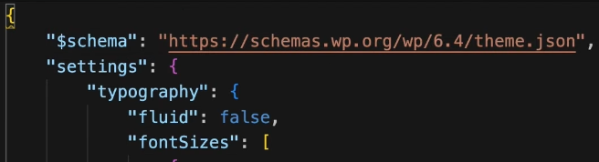

- fontSizes is an array so that means we can add multiple items
- and within font sizes each object requires a name size and slug and there's an additional optional fluid


### Getting custom properties for any property on the theme.json file

- now because we have our schema set this allows us to mouse over any one of the properties and pop up a description of what that property actually does
- and this is really useful things like font sizes
- you'll notice that on font sizes it gives us the custom property that we can later on use in our Styles


- and this applies to any one of the properties
- as long as the schema is set you'll get a description as you mouse over that property

### Setting font sizes globally to elements

- To globally set the font size to one of our elements for instance the H1 element
- all we need to do is to set the properties for the styles, elements, h1, typography, fontSize.


- and to use the font size set in our settings all we need to do is to Mouse over the settings property, copy the custom property property preset and paste it into our Styles property value
- and because this is a CSS variable we just need to wrap it in the CSS VAR function then replace the slug reference with the value set in our settings


### Setting the font family for our theme

- Because we're using the create block theme plugin we can actually utilize the font management system that the plug-in provides.

- the font family is currently set to a system font and that's actually been provided by the create block theme plugin as a default

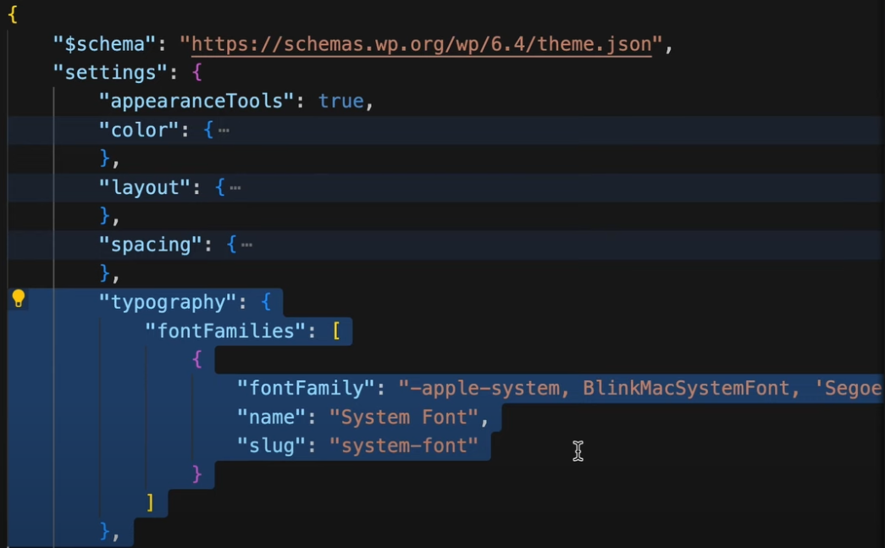

- back to the dashboard and under appearance we'll see that we've got manage theme fonts
- now in here here we've got our system font that was actually set when we first generated our theme


- and we remove that and then if I pop back to my site editor we'll see that immediately in the typography the font family has been removed


- so by using the plug-in font management system not only will update your theme that's currently active it will also update your theme. Json file

- so if we go back to to our site editor and the font we want is Roboto so if we go to `add Google font` and then we do a search select our `Roboto` font
- and we want to go ahead and add 300 weight normal 500 weight normal and 700 weight normal and we can `add fonts to your theme`
- and it's telling us that the font has been added to our theme

- so we can check that by going back to our our code editor

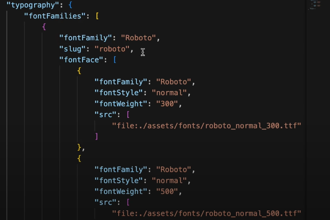

- and as we can see we've got our typography fon families and Roberto has been set up with it Slug and all of the relevant sizes
- there's also a property for the source `src` and that is telling us the source is a file in the assets directory, fonts directory, and a link to the font ttf file
- so if we just look in our theme folder and as we can see we've got assets, fonts, and then we've got three fonts reflecting our 300 500 and 700 weight

### Adding the font family to our styles

- now what we need to do also is is to set the `styles`
- so "after settings" we can add in another property for `styles`
- and then within the styles we can add in `typography`
- and we can set the fontFamily to a string

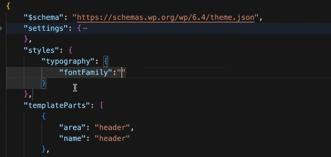

- and to reference that string all we need to do is to go back to our `settings` and then our `fontFamily`
- and you can see that we've got a custom property here that's listed and it says `--wp--preset--font-family--{slug}`, followed by the slug which is shown as a variable


- simply all I'm going to do is copy that custom property and then I'm going to come back down to my Styles and I'm going to input here

- now the way to input the reference is to type VAR (which stands for variable in CSS) wrap it in Brackets and then reference the wp preset font family followed by the slug which is `roboto` and we can save that

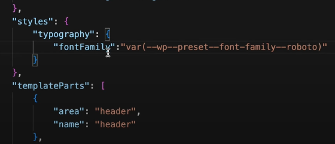

- and if we revisit our site editor going to editor and then patterns manage all template parts and our header we can see that now our font is pulling the Roboto font that we've set in our theme. Json file

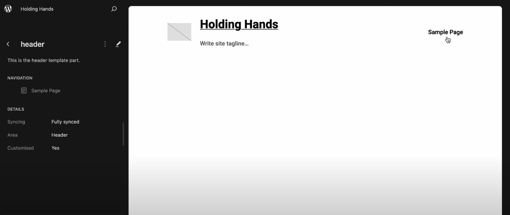

### Theme files and database

1. Changes made in the editor are save in the database.

- it's essential to understand that these changes made in the site editor, (similar to the theme.json File these are global Styles)


- these changes are now saved to the database
- this includes `templates` and `template parts`

- and by saving the header template part directly to the database it becomes independent of the theme files in the theme folder
- therefore any alterations made in the theme folder to the header.html file will no longer impact the header's appearance, it now originates directly from the database

2. transferring the changes to the theme's folder.

- however this might not be ideal for commercial themes or theme installations, where all the appearance Styles and settings should actually be initialized from the
  theme folder.

3. Copying the code from the database.

- so to address this you can either directly copy the code from the database by locating the post_type wp_template_part, with the post_name and title of header

### Copying the code edited for `template-parts` from the site editor to the theme folder

- or if you're not comfortable interacting directly with the database you can do the same through the site editor
- so in the site editor navigate to the template part in question


- in this case it's the header
- and under the options represented by the three dots switch to the code editor where you can see the code


- copy this code exit the editor and paste it directly into your theme `header.html` file and save the file


- this ensures that the header appearance is now replicated in the theme rather than the site editor or what is database driven
- additionally if you need to revert to the theme settings you can clear customization in the site editor settings under the template Parts


- by selecting clear customization the header template will now adHere to the themes header HTML file rather than the database driven code in the header custom postype part
- saving this adjustment removes the reference to the header template part referenced in the database to confirm this refresh the database and you'll notice that the wp template part for the header no longer exists

### Copying the code edited for `templates` from the site editor to the theme folder

- when it comes to `templates` the process is exactly the same with the exception of the name with the post type saved to the database the post type name is simply named `wp_template` as opposed to wp_template_part

### Site Editing & templates **32:10**

- adhering to the WordPress template hierarchy if a specific template is not available the system gracefully falls back to the index.php file as a default
- this is exactly the same for Block themes in WordPress
- if a particular template is absent the system seamlessly defaults to the fallback template typically index.html

- it's worth noting that currently only the index HTML file exists in our theme folder
- when using the front-end approach and clicking the edit site link from the admin bar on the homepage on a single post or on a page the user will consistently be directed to edit the index.html file

### manually create a page template

- now I'll create a page. HTML file in the template folder of our theme
- to do this I'll duplicate the index.html file in my code editor then rename it to page. HTML


- navigate to a page in the front end of my site and then clicking the edit site Link in the admin bar you'll notice that this now takes me to the site editor where I can edit the pages template


### Setting up the page template **34:10**

- I'll go to the list View and you'll notice the query loop block
- this is unnecessary for a page template so I'll simplify this by moving the group that contains the title Fe image and content to below the header
- now I'll remove the query loop block which is specifically for blog posts or archives, so I don't need it for a page template
- if I close the list view you'll see that the alignment of the content is now filling the width of the site this isn't right
- so open the list view again and I'll further group the existing group to Nest it in a group block
- at this point it would be sensible to rename the top parent group to something like content section
- now the alignment of the nested group will be set to none
- meaning it will be set to the content size coming from the theme. Json file which is 1100 pixels

### Creating and using theme patterns **35:06**

- so I've taken a screenshot of a typical page from my source site and added it to Pixel Perfect Pro I
- plan to use this screenshot as an overlay to create a title Banner ultimately I intend to bundle it with my theme as a pattern rather than save it to the database
- this is because saving it to the database would make the pattern independent of the theme and locked to this specific database and site
- **my goal is for it to be locked to the theme so wherever this theme is installed any patterns I've created are available and link to the theme**
- so I'll go ahead and set up this layout using blocks and when I come back I'll show you how I accomplish this


- at this stage I want to ensure that the template is sourced from my theme folder rather than the database
- after making all these changes I'll navigate to the options and access the code editor from within the site editor
- from there I'll select all the code and copy it
- next I'll switch to my theme in my code editor select my page. HTML template
- select all the code and paste the copied code into the file
- this step is crucial to guarantee that the code originates from my template and not the database
- so returning back to the site in the site editor I can now continue building my block theme with the reassurance that the template is now coming from my theme folder

### I now want to create it as a pattern **36:25**

- with my banner set up I now want to create it as a pattern
- typically this would involve selecting a group of blocks then using the options or the three dots in the toolbar you'd select create pattern
- however this would save it directly to the database and that's not what I want
- I want to make this pattern exclusive to my theme
- to achieve this simply select copy
- then return to your code editor
- within the themes directory create a folder named `patterns`,
- inside this folder create a new file named after the pattern you wish to call it in my case I'll name it `title-banner.php`

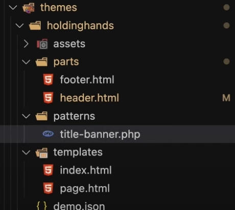

- using PHP is the recommended method as WordPress uses its own wrapper that allows for dynamic data such as referencing images and other elements relative to the theme folder
- unlike template parts and templates here we need to include some header Fields with opening PHP tags
- and similar to the styles.css file create a comment section also known as a header
- to do this use back SL followed by two asterisk to ensure it's treated as a comment
- so include two required parameters in the header a title followed by a colon specifying the name of the pattern in my case title banner
- and a slug which is a lowercase replication of the title with no spaces
- now I'd also recommend using a categories field as this will help WordPress locate the patterns in the correct place in the site editor
- closing the PHP tags


- so in this file paste the copied blocks you copied from the site editor


- hit save return to the site
- then navigate to all patterns in the site editor your pattern should now include the one you've just created


- now it's locked because it's part of the theme and not the database
- however you can duplicate it creating a copy of the original pattern will add a new one to the database but the original will still be locked to the theme

### Adding the images to the theme folder

- though this process functions adequately a minor issue Still Remains that requires attention
- since we've directly copied the code from the site editor there's a slight problem
- copying the blocks directly from the site editor also copies the path references to any images that are relative to the site itself
- this isn't ideal for our purposes
- the image is currently referencing the site and we want it to be dynamically coming from our theme folder regardless of where the theme is activated
- to address this the recommended approach is to add an images folder within your assets folder
- then place the image you want to use as a placeholder in this images folder
- so I have a copy of an image on my desktop and I'll go ahead and copy this to my assets/images folder in my theme


- in the `title-banner.php` file I'll open up some PHP tags
- Echo out a special WordPress function that will dynamically fetch my image from the theme folder
- and for security reasons I need to wrap the echo in the Escape URL function
- now while I'm here I'll close the PHP tags
- within the Escape function
- I'll call the WordPress function get theme file URI to dynamically retrieve the file directly from my theme folder
- this function requires a string reference to the path where the image resides in my theme folder,
- in this case it would be under assets assets/images followed by the name of the image file


- now my them will dynamically pick up the image using the WordPress function
- I also need to remove the ID reference provided in the block code copied earlier from the HTML block comments


- this reference is no longer coming from an ID it's coming directly from the assets/images folder

- additionally I'll add the same reference to the image source tag for the HTML markup

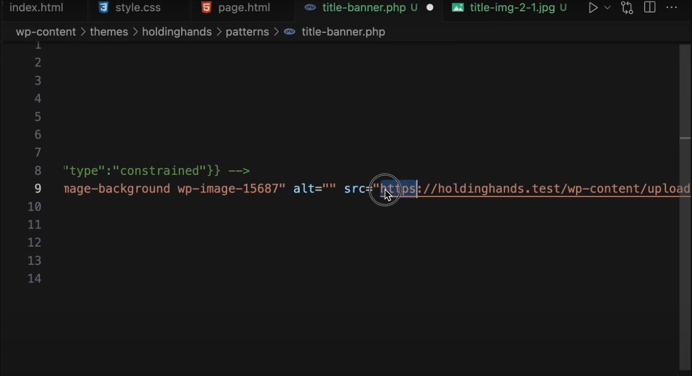

- again this uses the same function called get theme file URI
- so I'll simply copy and paste the same PHP code


- this code also contains a class with an image ID reference which needs to be removed to prevent any issues


- so in summary we've replaced the relative path with a dynamic path
- and remove the references to an ID, I've done this in two places, in the block comment and in the image tag HTML markup
- now if I save this and go back to my site Editor to refresh my patterns nothing should change
- it's still being picked up from my theme folder but now it's Dynamic to the theme folder itself rather than relative to the site

### replace the cover block with a pattern block

- now although the pattern has been successfully created and its Dynamic pulling from our theme a check of our template file reveals that the cover block is still hardcoded in the page.html file

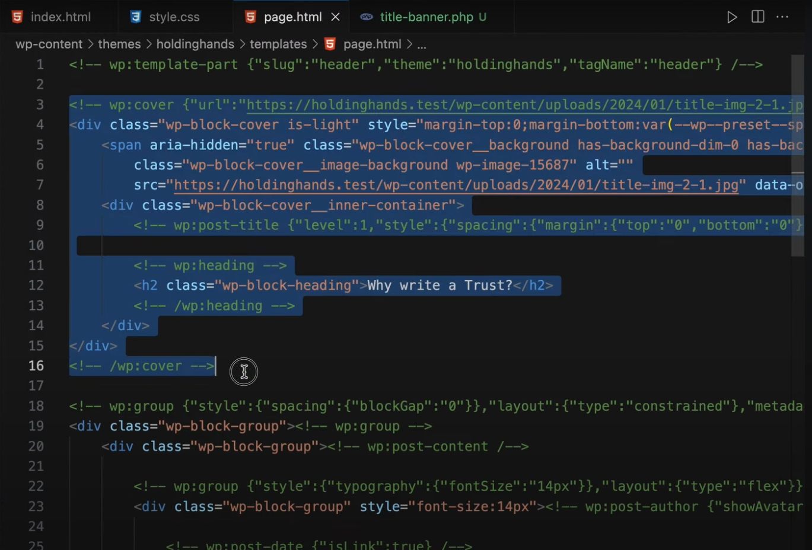

- this is not what we want
- we want to reference the pattern in the same way that we reference template parts

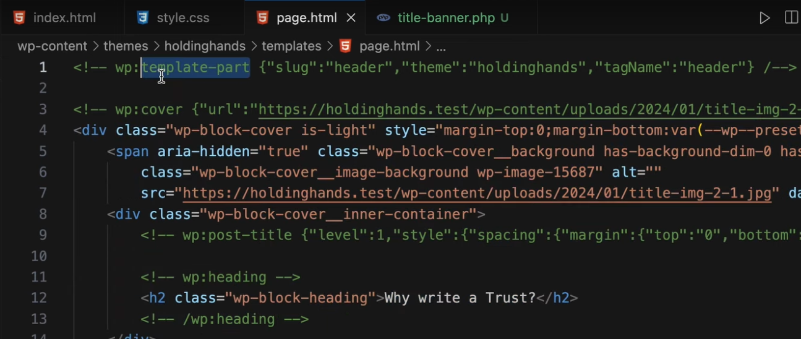

- so to achieve this we can replace the cover block with a pattern Block in doing so we can use the following syntax
- wp colon pattern slug and the title using HTML comments
- ensuring that you include the slug name identical to what is assigned in the pattern within the curly braces
- finally make make sure to terminate the comment for the block reference

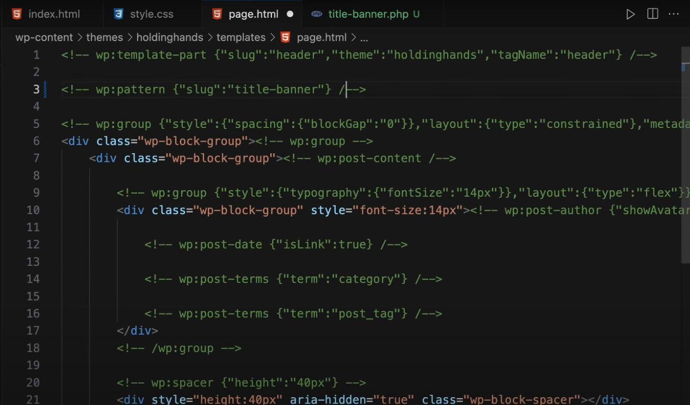

- save the file and return to the site Editor to check in templates and Pages
- we might not see any changes immediately so to confirm this we can refresh the page and as anticipated nothing appears to have changed

- so to validate that this pattern is coming from our page. HTML template we can insert a test string (in our pattern file)


- and after saving we can go back to the block editor refresh the page and observe if the test string changes and it verifies that the content is now sourced from our page. HTML template


### Adding the theme's name to the slug

- now although this will work it's advisable to give the slug the namespace of your theme
- which is typically the text domain and you can check that in your style.CSS file


- this will avoid any other conflicts with any other patterns
- in this instance the theme is named holdinghands
- and the slug should be referenced as holdinghands / title banner


- consequently in the template page. HTML the reference should be exactly the same
- so the slug should be holding hands SL tile Banner


- once again a quick check by refreshing the page in the site editor confirms that the content is still being picked up from our theme

### Style core blocks in theme.json

- now I'm at a point where I can review the changes I've made and how they correlate to the site I'm trying to match
- and I've noticed that the navigation in my theme is isn't quite right
- specifically there's differences in the upper lowercase usage and the font size is slightly different compared to the original site
- the original site has a smaller font and uses uppercase lettering in the navigation
- Additionally the body text in my theme is slightly different being a bit larger and thinner
- this is also another aspect I need to address
- similar to what I did before I'll inspect the original site
- take notes on the font styling for both the navigation and body text and add them to my audit file


- now I can set these notes aside
- so to make these adjustments I plan to modify the styling of the core blocks
- so this entails diving back into my theme. Json file
- in my theme.json file, I need to add another property in the styles object for the `blocks`
- and then a property for the `core/navigation`
- and because I'm dealing with typography I need another object for the `typography` property


- and referring back to my audit from the original site I can set the
- font size
- font style
- font weight
- and text transform


- now with those set I can repeat the process by adding another property object for the `core/paragraph` block
- and again within this object set the property for the typography
- and again referring back to my site audit I can set the
- font size
- line height
- fonts style
- font weight
- and set the margin top and bottom


- now when it comes to margin and padding you have to add another property
- and this property is called `spacing`
- unlike CSS there is no shorthand you have to set them individually
- so I'll set my top and bottom margin according to the site audit


- and now I can check what I've set against the original site styling
-
- I'm quite pleased with the progress I've made so far
- the styling of the navigation and the body text is closely aligned with the existing site

### How to export theme.json

- so following the same principles I used earlier I went ahead and built the footer
- afterwards I copied the blocks from the list View
- and returned to my code Editor to locate the footer. HTML file where I pasted all the code
- now I repeated this process to create a new pattern for the contact call to action
- however there is still some styling issues with the buttons
- If you compare them to the existing site you'll notice there's a difference in styling
- now I could go back to the theme. Json file and start styling the buttons but there's one final thing I want to show you that is a game changer when it comes to developing a block theme
- up until this point I've shown you the manual process as well as leveraging the create block theme plug-in to develop a modern block theme for WordPress
- but there's an even simpler way to do this so let me demonstrate
- this time I'm going to leverage WordPress to build my theme. Json file specifically using the global Styles
- and this can be done for any element or block on your site
- but for now let's focus on the buttons block
- first I'll navigate to my `settings` ensuring that I'm working at a `block` level


- I'll set the style to `outline`


- and the `text` color to white


- then I'm going to move to my `Global Styles`
- and navigate to `blocks`
- and find the `button` block


- I'll ensure that the style variation is set to `outline`

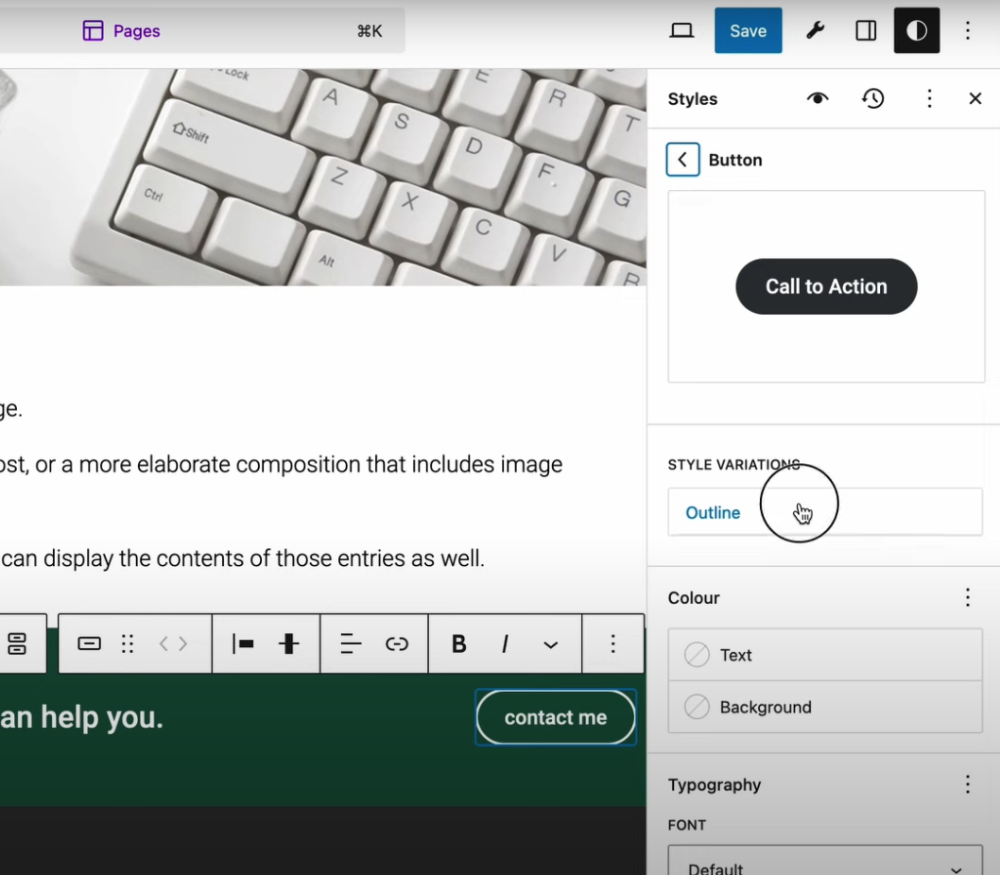

- I'll adjust the `font` to 11 pixels
- I'll set the `letter spacing` to one pixel
- I'll set the `letter case` to uppercase
- I'll set the `padding top and bottom` to two units
- and the `left and right padding` to four units


- I'll also set the Border width to one pixel
- and finally the radius to four pixels


- now reviewing the button against my original site you can see that it now aligns more closely with the original style
- saving this to the database prompts a notification that my pages and custom Styles have changed.


- I'll disable Pages since I'm only interested in the custom Styles and the global styles that fundamentally are going to create the theme. Json file that I want


- after saving I can come to my `options`


- go to `export` and generate a zip file of my theme

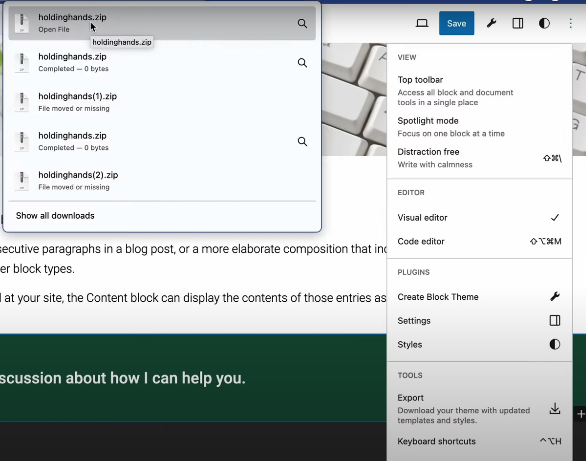

- now with the zip file downloaded I'll open it up in my code editor
- now although it contains all the assets my focus is on the theme. Json file
- so I'll scroll down to the styles you'll notice a new core block for the `core/button` with the specific variations set to outline with the Border style width and radius declared including settings for spacing and the typography


- now copying this content (all the file)


- I'll paste it directly into my existing theme. Json file as part of my site theme


- now returning to my site I need to ensure that I clear the global styles by selecting reset to defaults


- after saving those Styles


- a simple page refresh will apply those changes

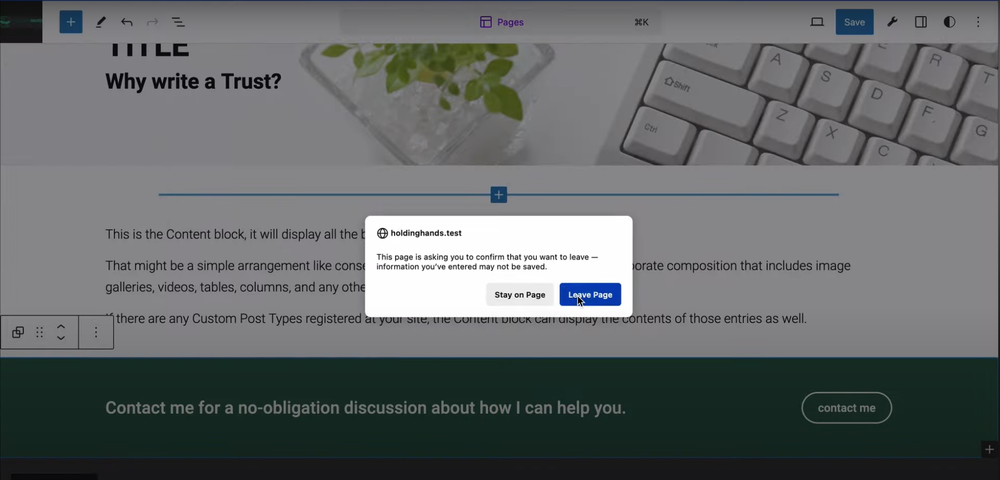

- the button will will now inherit its styles from the theme. Json file and is no longer reliant on the database


- this process demonstrates how you can use WordPress to automate the creation of the theme. Json file
- offering you a more convenient and efficient way to develop a modern WordPress block theme

- now while I've adopted to disable exporting of templates and parts in this process


- note that following the same steps `with them enabled` will give you a different outcome
- pattern placed within your templates `won't be exported as template components`
- instead the code will be hardcoded into your templates and parts


- so if you decide to go this route
- remember that if you intend to distribute your theme you'll need to manually amend those hard-coded blocks into pattern components


- but I'll save that for another video
- so I still have a lot to do to finish this site but for now this concludes my video on creating a modern WordPress block theme
- and I hope it's provided you with some foundational insights
