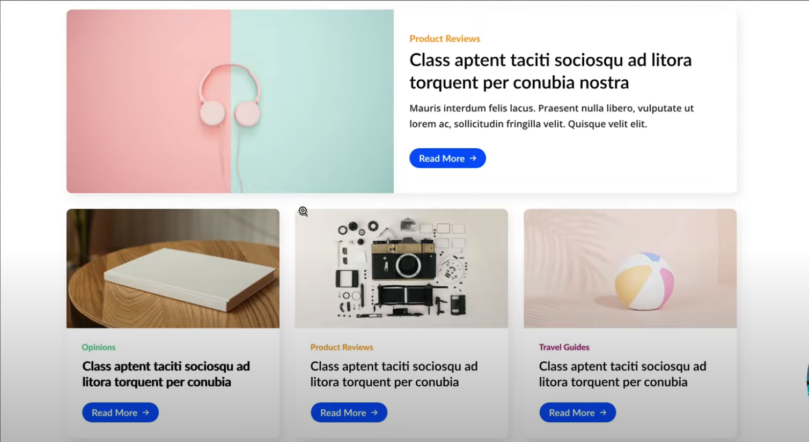
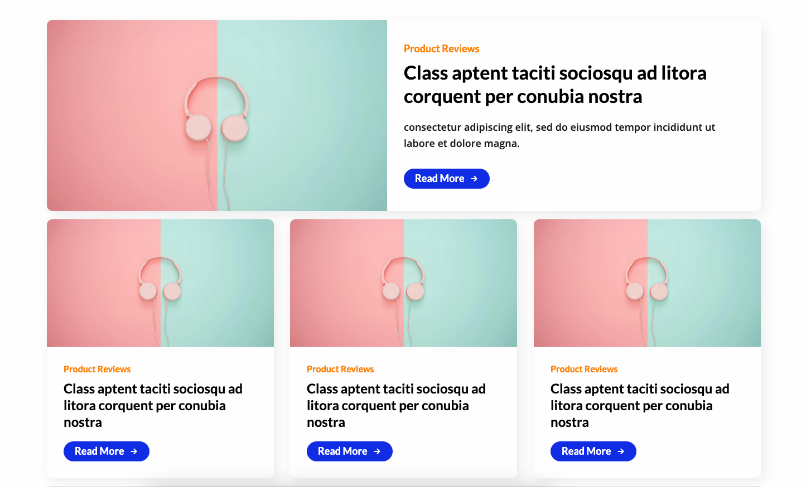
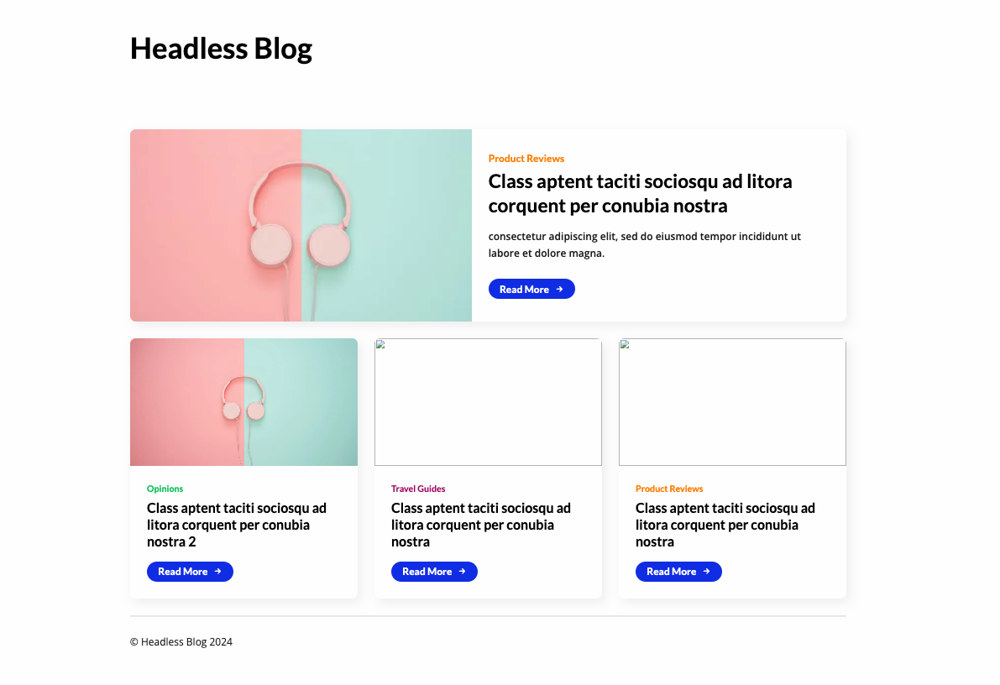

# Build a Blog with Next.js and a Headless CMS (Strapi)

https://youtu.be/NNWX2flw5mg?si=DbfOI6kHfRrhvX57

>

## **=>** Introduction

- Welcome in this video, we'll build an entire blog post location from scratch.
- The only thing I've prepared beforehand are the designs for the application.
- We'll start by building the front end and turning these designs into a `Next.js` application.
- Then we'll connect the `Next.js` app to a headless CMS.
- In the back end, we'll use `Strapi` as the Headless CMS.

## **=>** Design

- I have prepared two simple designs for the book we're going to build.
- This is the list page,


the home page of the blog, which will show a featured blog post and no other blog posts are needed.

- Each block will have a detail page.


The detail page will show the title and main content together with the larger featured image of the blog post.

## **=>** Create a Next.js Application

>

#### Front End Setup

- Starting with the front end, I'll create a Next.js application using the command:

- I'll use the latest version and name the project 'headless-blog.'

  ```bash
  npx create-next-app@latest headless-blog
  ```

- I prefer not to use TypeScript,
- but I'll use ESLint for linting.

- I won't use Tailwind CSS,
- and I recommend using a source directory.

- Utilizing the app router instead of the pages router is a good practice.

- There's usually no need to modify the default import class for a basic project.


- After bootstrapping, I'll navigate into the project directory and open it with Visual Studio Code.

- Running the app with `npm run dev` to ensure it's working correctly. It should be accessible at `localhost:3000`.

#### Cleaning Up Bootstrap Code

- Deleting the `app/global.css` file
- Removing unnecessary import from the `layout.js` file

```jsx
import { Inter } from 'next/font/google' // leave this as we'll use google fonts

// import './globals.css'

const inter = Inter({ subsets: ['latin'] })

export const metadata = {
  title: 'Create Next App',
  description: 'Generated by create next app',
}

export default function RootLayout({ children }) {
  return (
    <html lang='en'>
      <body className={inter.className}>{children}</body>
    </html>
  )
}
```

- Modifying metadata, adjusting the title, and removing the description temporarily.

```jsx
import { Inter } from 'next/font/google' // leave this as we'll use google fonts

const inter = Inter({ subsets: ['latin'] })

export const metadata = {
  title: 'Headless Blog',
  // description: 'Generated by create next app',
}

export default function RootLayout({ children }) {
  return (
    <html lang='en'>
      <body className={inter.className}>{children}</body>
    </html>
  )
}
```

- Refactoring functions to arrow functions.

#### Modifying Root Layout

- The root layout will remain largely the same, containing HTML, body, and children.

- Exporting the root layout by default from the file.

```jsx
import { Inter } from 'next/font/google'

const inter = Inter({ subsets: ['latin'] })

export const metadata = {
  title: 'Headless Blog',
  // description: 'Generated by create next app',
}

const RootLayout = ({ children }) => {
  return (
    <html lang='en'>
      <body className={inter.className}>{children}</body>
    </html>
  )
}

export default RootLayout
```

#### Updating Home Page

In the app/page.js file:

- remove the imports
- Rewriting the home page to an arrow function
- and simplifying the markup to just a div tag with the text 'Home'

```jsx
const Home = () => {
  return <div>Home</div>
}

export default Home
```

#### Other files

- Retaining the `app/favicon.ico` for now to prevent errors.

- Removing the unused `page.module.css` file.

- Cleaning up the public folder by removing unnecessary SVG icons.

- The project is now clean and ready for further development.

#### Initial Design Discussion

- The design includes a simple header and footer in the main layout, following a 12-column grid inside a 1280-pixel container.


- Initial steps involve implementing main styles like typography, normalization, and the grid system.

- Subsequent tasks include building the header and footer, followed by the card component.

- Once these are completed, the page will be in good shape for further development.

## **=>** Adding SASS and Global Styles

#### Main CSS Files and Normalize

- To start, let's focus on the main CSS files and the normalization process.
- I will install necessary dependencies from npm.

#### Using SAS as a Preprocessor

- I've decided to use SAS as a preprocessor, mainly because Nexgs has built-in support for it.
- Installing the SAS package from npm is the first step.

#### Installing Normalized CSS

- Additionally, I will install normalized CSS from npm.

```bash
npm install -s sass normalize.css
```

#### styles folder

- Create a new folder named `Styles` inside the `src` folder.

#### Styles File

- Inside the `Styles` folder, create a `styles.scss`
- Import all necessary modules, starting with the normalization module.
- Importing normalized CSS can be done directly from the `node_modules` directory.

```scss
@import 'normalize.css/normalize.css';
```

- Verify the correct path by checking the `node_modules` directory.
- The `normalize.css` file should be inside the `normalize` directory.

#### Verifying Normalization

- Once imported, check if normalization is working by running the project.

```jsx
import { Inter } from 'next/font/google'
import '@/styles/styles.scss'

const inter = Inter({ subsets: ['latin'] })

export const metadata = {
  title: 'Headless Blog',
  // description: 'Generated by create next app',
}

const RootLayout = ({ children }) => {
  return (
    <html lang='en'>
      <body className={inter.className}>{children}</body>
    </html>
  )
}

export default RootLayout
```

#### Global CSS Class File

- The next step is to add a styles/`global.scss` file for handling global side effects, modifications, and normalizations.
- Import the global.scss file (e.g., `globals.scss`) from the same directory as the Styles folder.

```scss
@import 'globals';
```

- I can just say `globals` because is in the same directory as styles.scss

#### Setting Box Sizing

- Inside the global file, set the `box-sizing` property to `border-box` for all elements and pseudo-elements.
- This is a standard practice to normalize the Box model.

```scss
*,
*:before,
*:after {
  box-sizing: border-box;
}
```

- This concludes the setup for the global file.

#### Future Body Styles

- The next steps involve adding additional styles to the body, but that will be addressed later.

## **=>** Grid System

#### The Next Step: Setting up the Grid System

- The next step will be to set up the grid system.
- For that, I'll make another file, styles/`grid.scss`.
- and import it into `styles.scss`
- In this file, I'll first create a container.

#### Container Configuration

- Let me open the calculator real quick.
- The width of the container is 1280, but I want a 20-pixel padding on both sides for mobile devices.
- The container should have a max width of `1320` (1280 + 20 + 20) and 20-pixel left and right padding.
- Lastly, I will set margin left and right to zero so that it centers.

```scss
.container {
  max-width: 1320px;
  padding: 0 20px;
  margin: 0 auto;
}
```

#### Creating a Flex Grid for Rows

- Next in a grid system, we need a `row`.
- I will use a flex grid; the default display is row.
- To set up the gutter (spacing between columns), I'll use a negative margin left on the row.
- The width will be `100% + 30 pixels` to account for the gutter.
- here we also need to set Flex wrap to wrap so that it wraps if the width is not enough

```scss
.container {
  max-width: 1320px;
  padding: 0 20px;
  margin: 0 auto;
}

.row {
  display: flex;
  flex-wrap: wrap;
  margin-left: -15px;
  width: calc(100% + 30px);
}
```

- this is one way to do it:
  - you can also just set `gap: 30px;` but then the width calculations of the columns would be a little bit more complex later
  - so this is the approach I'll take
  - there are many ways to implement a grid system you can also use a ready-made grid like the bootstrap Grid

#### Creating a Flex Grid for columns

- for the `col`, set a flex value to 1 to allow growth and expansion.
- Additionally, set padding to 15px

```scss
.container {
  max-width: 1320px;
  padding: 0 20px;
  margin: 0 auto;
}

.row {
  display: flex;
  margin-left: -15px;
  width: calc(100% + 30px);
}

.col {
  flex: 1;
  padding: 15px;
}
```

#### Generating Columns

- Now we need to generate columns.
- I'll use a for loop for the syntax for each column.
- The loop will iterate from 1 through 12.
- We will generate a class for each column, setting the width as a percentage.

```scss
.container {
  max-width: 1320px;
  padding: 0 20px;
  margin: 0 auto;
}

.row {
  display: flex;
  flex-wrap: wrap;
  margin-left: -15px;
  width: calc(100% + 30px);
}

.col {
  flex: 1;
  padding: 15px;
}

@for $i from 1 through 12 {
  .col-#{$i} {
    min-width: calc(100% / 12) * $i;
    max-width: calc(100% / 12) * $i;
  }
}
```

- This ensures that each column has a width percentage based on the total number of columns (12).

#### add more global styles

- Set background color for the entire site to a subtle shade of gray, in the `globals.scss` file
- and Adjust text color for body text and headings.

```scss
*,
*:before,
*:after {
  box-sizing: border-box;
}

body {
  background-color: #fefefe;
  color: #222;
}
```

- The grid system and styles are now ready for testing and use.

## **=>** Fonts

>

#### Setting Up Fonts in the Main Layout

- Define fonts: Lato for headings (H1, H2, etc.) and Open Sans for body text, in the main `layout.js` file
- for lato I might need to specify weights
- and I will also specify the variable setting because I want a CSS variable for both of these.

```jsx
import { Lato, Open_Sans } from 'next/font/google'
import '@/styles/styles.scss'

const lato = Lato({
  subsets: ['latin'],
  weight: ['400', '700', '900'],
  variable: '--font-lato',
})

const openSans = Open_Sans({
  subsets: ['latin'],
  variable: '--font-open-sans',
})

export const metadata = {
  title: 'Headless Blog',
  // description: 'Generated by create next app',
}

const RootLayout = ({ children }) => {
  return (
    <html lang='en'>
      <body className={`${openSans.className} ${openSans.variable} ${lato.variable}`}>
        {children}
      </body>
    </html>
  )
}

export default RootLayout
```

## **=>** Typography

>

#### Creating a Typography File

- Now, let's create a styles/`typography.scss` file.
- I will also import it into styles.scss

```scss
@import 'normalize.css/normalize.css';
@import 'globals';
@import 'grid';
@import 'typography';
```

- and here we'll define some typography styles.

- First, I'll set the base font size to `18 pixels` on the HTML and body.
- The font family is already set on the body, so no need to do that.

```scss
html,
body {
  font-size: 18px;
}
```

- After that, I'll apply some basic paragraph styles.
- Set margins to `30 pixels` bottom only.
- Set line height to `1.66`.

```scss
html,
body {
  font-size: 18px;
}

p {
  margin: 0 0 30px;
  line-height: 1.66;
}
```

- Now, I'll style all headings and create classes for each heading.
- This way, I can use the heading styles without the actual heading tag.

- the headings will first be black, that's a major difference.
- they will have a font family of my lato variable.
- and the font weight of 600 by default, so they'll be bold.
- I will also set their Baseline Heights 1.25.
- I will set margins individually for each heading, only keep the default margin on the paragraphs

```scss
html,
body {
  font-size: 18px;
}

p {
  margin: 0 0 30px;
  line-height: 1.66;
}

h1,
.h1,
h2,
.h2,
h3,
.h3,
h4,
.h4,
h5,
.h5,
h6,
.h6 {
  font-family: var(--font-lato);
  font-weight: 600;
  color: #000;
  line-height: 1.25;
  margin: 0;
}
```

- And now we need to set the sizes for each in for each heading
- starting with H1 which I can check in my design is 52.
- I will come to my editor and open calculator 52 divided by 18 is 2.88rem okay
- let's do H2 I actually don't have an H2 on this page I have it here it's 43. 2.388 okay
- let's go for the H3 now this is its style it's 34. that's 1.88 let's go forward
- this is my h4 Style 24 pixels let me check 1.33
- and my H5 would be 20 I believe let's see no it's actually 18 and 16. yeah so my H5 has a font size yeah sorry my H5 has a font size of 20 which is 1.11
- and my H6 has a font size of one ram
- these are my headings done exactly as in the design

```scss
html,
body {
  font-size: 18px;
}

p {
  margin: 0 0 30px;
  line-height: 1.66;
}

h1,
.h1,
h2,
.h2,
h3,
.h3,
h4,
.h4,
h5,
.h5,
h6,
.h6 {
  font-family: var(--font-lato);
  font-weight: 600;
  color: #000;
  line-height: 1.25;
  margin: 0;
}

h1,
.h1 {
  font-size: 2.888rem;
}
h2,
.h2 {
  font-size: 2.388rem;
}

h3,
.h3 {
  font-size: 1.888rem;
}

h4,
.h4 {
  font-size: 1.333rem;
}

h5,
.h5 {
  font-size: 1.111rem;
}

h6,
.h6 {
  font-size: 1rem;
}
```

- Okay, this is the basic typography done!

## **=>** Header Component

>

#### Creating Header and Footer Components

- I will now create the header and footer components.
- What I'll do for that is create a new folder in the app called app/`components`.

- I'll start with the `Header.jsx` file. Here I'll create a React component for my header, which will be exported by default.

```jsx
const Header = () => {
  return (
    <header>
      <div className='container'>
        <h1 className='h1'>Headless Blog</h1>
      </div>
    </header>
  )
}

export default Header
```

- Now, I will use this component in my main layout. Here we have our `body` tag and the `children`.
- Above it, I can add my header component.

```jsx
import { Lato, Open_Sans } from 'next/font/google'
import '@/styles/styles.scss'
import Header from './components/Header'

const lato = Lato({
  subsets: ['latin'],
  weight: ['400', '700', '900'],
  variable: '--font-lato',
})

const openSans = Open_Sans({
  subsets: ['latin'],
  variable: '--font-open-sans',
})

export const metadata = {
  title: 'Headless Blog',
  // description: 'Generated by create next app',
}

const RootLayout = ({ children }) => {
  return (
    <html lang='en'>
      <body className={`${openSans.className} ${openSans.variable} ${lato.variable}`}>
        <Header />
        {children}
      </body>
    </html>
  )
}

export default RootLayout
```

- Now we need some spacing above and below the heading in the form of padding.
- The spacing is `80 pixels` on both sides.
- I will create some spacing utilities for that.
- Create the styles/`utils` folder and create a utils/`spacing.scss` file.
- and import it to `styles.scss`

```scss
@import 'normalize.css/normalize.css';
@import 'globals';
@import 'grid';
@import 'typography';

@import 'utils/spacing.scss';
```

- I will need top and bottom paddings. Let's iterate through this list and generate a class for each iteration.

```scss
// paddings
$paddingTop: (80);

@each $pt in $paddingTop {
  .pt-#{$pt} {
    padding-top: #{$pt}px;
  }
}

$paddingBottom: (80);

@each $pb in $paddingBottom {
  .pb-#{$pb} {
    padding-bottom: #{$pb}px;
  }
}
```

- it's a little bit overdone for just this property but if I need to add one more I will just write it right here `$paddingTop: (80, 60);` so it scales a little bit better

- Now, let's see if my classes are generated and working. They seem to be working perfectly.

- Let's add them permanently to the header. I will zoom out the page a bit so that we can see it better.

```jsx
// In your header component
import React from 'react'

const Header = () => {
  return (
    <header className='PT-D8 PB-D8'>
      <div className='container'>
        <h1>My Simple Headline</h1>
      </div>
    </header>
  )
}

export default Header
```

- Great! So that's basically my header done.

## **=>** Footer Component

>

#### Creating the Footer Component

- Now I'll focus on the footer. It's also very simple, as you can see—just a basic horizontal line and some copyright paragraph text.


- Let's create the component, components/`Footer.jsx`

- I will use the `footer` tag, and again, I will use a container. The basic markup is quite straightforward: a horizontal line and copyright text.

```jsx
const Footer = () => {
  return (
    <footer>
      <div className='container'>
        <hr />
        <p>&copy; Headless Blog 2024</p>
      </div>
    </footer>
  )
}
export default Footer
```

- Add it to my layout. Import it and add it right here.

```jsx
import { Lato, Open_Sans } from 'next/font/google'
import '@/styles/styles.scss'
import Header from './components/Header'
import Footer from './components/footer'

const lato = Lato({
  subsets: ['latin'],
  weight: ['400', '700', '900'],
  variable: '--font-lato',
})

const openSans = Open_Sans({
  subsets: ['latin'],
  variable: '--font-open-sans',
})

export const metadata = {
  title: 'Headless Blog',
  // description: 'Generated by create next app',
}

const RootLayout = ({ children }) => {
  return (
    <html lang='en'>
      <body className={`${openSans.className} ${openSans.variable} ${lato.variable}`}>
        <Header />
        {children}
        <Footer />
      </body>
    </html>
  )
}

export default RootLayout
```

- Now it should be welded right here, and it is. Now what I'll need to do is style the default horizontal line because it has a little bit of a different style than in my design.

#### Styling the Horizontal Line

- In the design, we have an opacity black border with opacity.
- So a little bit overkill, but I'll create a separate styles/`hr.scss` file for it to keep up with one file per component.

```scss
hr {
  border-color: rgba(0, 0, 0, 0.1);
}
```

- And import this file.

```scss
@import 'normalize.css/normalize.css';
@import 'globals';
@import 'grid';
@import 'typography';
@import 'hr';

@import 'utils/spacing.scss';
```

- Alright, the horizontal line is set.

#### Resetting Default Spacings

I also reset its default spacings right here.

```scss
hr {
  margin: 0;
  border-color: rgba(0, 0, 0, 0.1);
}
```

- we need some spacings here. I believe the space between those two is `30 pixels`.


- Yes, that's exactly right.
- So, I will add a margin bottom utility in my spacings file.
- This will be used a lot. Now again, create a map, and we need only `30` for now.

```scss
//margin
$marginBottom: (30);

@each $mb in $marginBottom {
  .mb-#{$mb} {
    margin-bottom: #{$mb}px;
  }
}

// paddings
$paddingTop: (80);

@each $pt in $paddingTop {
  .pt-#{$pt} {
    padding-top: #{$pt}px;
  }
}

$paddingBottom: (80);

@each $pb in $paddingBottom {
  .pb-#{$pb} {
    padding-bottom: #{$pb}px;
  }
}
```

- Alright, and this will set margin bottom. That's all.

- Now I will actually immediately set that class to my footer component, to my `hr` tag,

```jsx
const Footer = () => {
  return (
    <footer>
      <div className='container'>
        <hr className='mb-30' />
        <p>&copy; Headless Blog 2024</p>
      </div>
    </footer>
  )
}
export default Footer
```

- and here we go. I have my spacing set correctly.

## **=>** Card Component

>

#### Implementing the Home Page

- Now here in the home, we just have a simple div for now, but we can start focusing on the home page.
- It will include a simple card component, maybe not so simple. I will make one card component that will be useful for this featured blog post and these blog posts.



- We'll use `container queries` because they will also scale well.
- I'll show you right now how that will work.
- We will start by implementing the larger card component and then write container queries so that it scales down.

#### Creating the Card Component

- To do so, in my `components` folder, I'll create a `card` folder. This is because my card component will have both JavaScript and a module file.

- components/card/`card.jsx`
- components/card/`card.module.scss`

- Now, create a JavaScript component, a React component first.
- Import styles from the card module Style
- so the card will have a wrapper with a card class name.

```jsx
import styles from './card.modules.scss'

const Card = () => {
  return <div className={styles.card}></div>
}

export default Card
```

- The markup will be very simple.
- We need this kind of layout where the image will take 50 percent of the space and the content another 50 with the 30 pixels gap between them.

- I will not use the grid for this so that I can scale with container queries without applying side effects to the grid system.
- I think this is a better design.
- For the image, I need a couple of wrappers actually. I'll call them `card image wrap` and `card image`.
- I also need a separate wrapper for the aspect ratio, in order to scale it later.
- I won't use the image tag; instead, I'll use the Image component from next/image because it will also optimize my image.
- We also need an `alt` attribute, and for now, I will just use one of my images statically.
- I can set `fill` to `true`, this will make the image position absolute and make it expand to its parent.
- After my image wrapper, I will need a wrapper for my content, which I'll call `card content`.
- Inside of it, we have a couple of textual elements: a label for the category, the title, a summary, and the button.
- and the last thing is the button which I will not add for now I'll make a separate component

```jsx
import Image from 'next/image'
import styles from './card.modules.scss'

const Card = () => {
  return (
    <div className={styles.card}>
      <div className={styles.card_imageWrap}>
        <div className={styles.card_image}>
          <Image
            src='/thumb-feature-article.jpg'
            alt='thumbnail'
            fill={true}
          />
        </div>
      </div>
      <div className={styles.card_content}>
        <div className={styles.card_label}>Product Reviews</div>
        <div className={`${styles.card_title} h3`}>
          Class aptent taciti sociosqu ad litora corquent per conubia nostra
        </div>
        <div className={styles.card_summary}>
          consectetur adipiscing elit, sed do eiusmod tempor incididunt ut labore et dolore magna.
        </div>
      </div>
    </div>
  )
}

export default Card
```

- let's actually import and use this card in my page so that we can view it and test it.
- I will add a container here and just the card components inside
- I also set some padding bottom to separate it from the footer temporarily

```jsx
import Card from './components/card/Card'

const Home = () => {
  return (
    <div className='container p-80'>
      <Card />
    </div>
  )
}

export default Home
```

#### Styling the Card Component

- Now we have to style the components.

- Let's start with the main layout.
- The card needs to be `display: flex`,
- it needs to have `flex-direction` of row for now because the content is horizontal.
- We will set a gap of 30 pixels in this case because it will work well.
- I need to also set `border-radius` of 10 pixels
- and `overflow: hidden` so that the border radius is applied to our inner elements that are overflowing.
- Lastly, we have some `box-shadow`, which is 21 pixels spread with 7 percent opacity.

```jsx
.card {
  display: flex;
  gap: 30px;
  overflow: hidden;
  border-radius: 10px;
  box-shadow: 6px 7px 21px rgba(0, 0, 0, 0.07);
}

```

- Next, we need to set the layout on these two inner elements, the `image wrap` and the `card content`.
- The `card image wrap` should have `flex: 1` to expand so that both can fill the 50 percent.

```jsx
.card {
  display: flex;
  gap: 30px;
  overflow: hidden;
  border-radius: 10px;
  box-shadow: 6px 7px 21px rgba(0, 0, 0, 0.07);
}


.card_imageWrap,
.card_content {
  flex: 1;
}

```

- The `card image` will have a `position: relative`, a `width` of 100, and an `aspect ratio` of 16 by 9. Also, set `min-height` to 100 so that if the aspect ratio is a calculation of height is less than the overall height of the card, it will expand more.
- The card image wrap has an aspect ratio of 16 by 9 but also `min-height`, meaning that if the content grows more than the image height, the image will disobey the aspect ratio rule and expand more.
- Now, I'll set `object-fit: cover` for the image inside that wrapper.

```jsx
.card {
  display: flex;
  gap: 30px;
  overflow: hidden;
  border-radius: 10px;
  box-shadow: 6px 7px 21px rgba(0, 0, 0, 0.07);
}

.card_imageWrap,
.card_content {
  flex: 1;
}

.card_image {
  position: relative;
  width: 100%;
  aspect-ratio: 16 / 9;
  min-height: 100%;
  object-fit: cover;

  img {
    object-fit: cover;
  }
}

```

- Now, if we test that out, you can see this is starting to look a little bit like it.
- We have our card flex container with a 30-pixel gap,
- the image wrap, and the content.
- The image wrap has `flex: 1` to expand to 50, as well as its sibling, the content.
- Inside the image wrap, we have the `card image wrapper`, which has a `position: relative` and an aspect ratio of 16 by 9.

- Now, the next thing I need to set is the actual padding here on the `card content`
- as we have a gap. We don't need padding left; otherwise, the spacing around it is consistent at 30 pixels.
- Just the left value will be zero.

```jsx
.card {
  display: flex;
  gap: 30px;
  overflow: hidden;
  border-radius: 10px;
  box-shadow: 6px 7px 21px rgba(0, 0, 0, 0.07);
}

.card_imageWrap,
.card_content {
  flex: 1;
}

.card_image {
  position: relative;
  width: 100%;
  aspect-ratio: 16 / 9;
  min-height: 100%;
  object-fit: cover;

  img {
    object-fit: cover;
  }
}

.card_content {
  padding: 30px 30px 30px 0;
}

```

- Also, `card content` should be vertically centered compared to the image, which I'll do right now by setting `display: flex`, the `direction` of the column, and justify the content `center`.

```jsx
.card {
  display: flex;
  gap: 30px;
  overflow: hidden;
  border-radius: 10px;
  box-shadow: 6px 7px 21px rgba(0, 0, 0, 0.07);
}

.card_imageWrap,
.card_content {
  flex: 1;
}

.card_image {
  position: relative;
  width: 100%;
  aspect-ratio: 16 / 9;
  min-height: 100%;
  object-fit: cover;

  img {
    object-fit: cover;
  }
}

.card_content {
  display: flex;
  flex-direction: column;
  justify-content: center;
  padding: 30px 30px 30px 0;
}
```

#### Styling Text Elements in Card

- Now, all we have to do is style the inside component of card content
- the label is a heading with size 18, which means an H6 style. Let's apply that right now.

```jsx
import Image from 'next/image'
import styles from './card.module.scss'

const Card = () => {
  return (
    <div className={styles.card}>
      <div className={styles.card_imageWrap}>
        <div className={styles.card_image}>
          <Image
            src='/thumb-feature-article.jpg'
            alt='thumbnail'
            fill={true}
          />
        </div>
      </div>
      <div className={styles.card_content}>
        <div className={`${styles.card_label} h6`}>Product Reviews</div>
        <div className={`${styles.card_title} h3`}>
          Class aptent taciti sociosqu ad litora corquent per conubia nostra
        </div>
        <div className={styles.card_summary}>
          consectetur adipiscing elit, sed do eiusmod tempor incididunt ut labore et dolore magna.
        </div>
      </div>
    </div>
  )
}

export default Card
```

- Besides that, it has a bottom margin of 10 pixels and an orange color. So,

- let's add both the spacing first in `margin-bottom` add `10`

```css
//margin
$marginBottom: (10, 30);

@each $mb in $marginBottom {
  .mb-#{$mb} {
    margin-bottom: #{$mb}px;
  }
}

// paddings
$paddingTop: (80);

@each $pt in $paddingTop {
  .pt-#{$pt} {
    padding-top: #{$pt}px;
  }
}

$paddingBottom: (80);

@each $pb in $paddingBottom {
  .pb-#{$pb} {
    padding-bottom: #{$pb}px;
  }
}
```

- and in card add the class

#### Utilities for color

- Now, we'll add some utilities file for colors, styles/utils/`colors.scss`
- starting with orange.

```jsx
.c-orange {
  color: #ff9300;
}
```

- Import it in the style

```jsx
@import 'normalize.css/normalize.css';
@import 'globals';
@import 'grid';
@import 'typography';
@import 'hr';

@import 'utils/spacing.scss';
@import 'utils/colors.scss';

```

- and use it:

```jsx
import Image from 'next/image'
import styles from './card.module.scss'

const Card = () => {
  return (
    <div className={styles.card}>
      <div className={styles.card_imageWrap}>
        <div className={styles.card_image}>
          <Image
            src='/thumb-feature-article.jpg'
            alt='thumbnail'
            fill={true}
          />
        </div>
      </div>
      <div className={styles.card_content}>
        <div className={`${styles.card_label} h6 mb-10 c-orange`}>Product Reviews</div>
        <div className={`${styles.card_title} h3`}>
          Class aptent taciti sociosqu ad litora corquent per conubia nostra
        </div>
        <div className={styles.card_summary}>
          consectetur adipiscing elit, sed do eiusmod tempor incididunt ut labore et dolore magna.
        </div>
      </div>
    </div>
  )
}

export default Card
```

- Note that the this color will change based on the category (product reviews, opinions, travel guides), but we'll implement that later.

#### Title Styling

- Next, let's check the title styling.
- It's an H3 with a line height of 42 and margin bottom of 20px.

```css
//margin
$marginBottom: (10, 20, 30);

@each $mb in $marginBottom {
  .mb-#{$mb} {
    margin-bottom: #{$mb}px;
  }
}

// paddings
$paddingTop: (80);

@each $pt in $paddingTop {
  .pt-#{$pt} {
    padding-top: #{$pt}px;
  }
}

$paddingBottom: (80);

@each $pb in $paddingBottom {
  .pb-#{$pb} {
    padding-bottom: #{$pb}px;
  }
}
```

- Apply these styles

```jsx
import Image from 'next/image'
import styles from './card.module.scss'

const Card = () => {
  return (
    <div className={styles.card}>
      <div className={styles.card_imageWrap}>
        <div className={styles.card_image}>
          <Image
            src='/thumb-feature-article.jpg'
            alt='thumbnail'
            fill={true}
          />
        </div>
      </div>
      <div className={styles.card_content}>
        <div className={`${styles.card_label} h6 mb-10 c-orange`}>Product Reviews</div>
        <div className={`${styles.card_title} h3 mb-20`}>
          Class aptent taciti sociosqu ad litora corquent per conubia nostra
        </div>
        <div className={styles.card_summary}>
          consectetur adipiscing elit, sed do eiusmod tempor incididunt ut labore et dolore magna.
        </div>
      </div>
    </div>
  )
}

export default Card
```

#### Paragraph Text Styling

- The paragraph text is currently not a paragraph, change to a `p` tag to set the proper line height and font size (18),

- and to set the font weight (semi bold) lets create a new utils/`fonts.scss` file and crate a new map

```css
//font-weight
$fontWeight: (600);

@each $fw in $fontWeight {
  .fw-#{$fw} {
    font-weight: #{$fw};
  }
}
```

- import it

```scss
@import 'normalize.css/normalize.css';
@import 'globals';
@import 'grid';
@import 'typography';
@import 'hr';

@import 'utils/spacing.scss';
@import 'utils/colors.scss';
@import 'utils/fonts.scss';
```

- and apply it

```jsx
import Image from 'next/image'
import styles from './card.module.scss'

const Card = () => {
  return (
    <div className={styles.card}>
      <div className={styles.card_imageWrap}>
        <div className={styles.card_image}>
          <Image
            src='/thumb-feature-article.jpg'
            alt='thumbnail'
            fill={true}
          />
        </div>
      </div>
      <div className={styles.card_content}>
        <div className={`${styles.card_label} h6 mb-10 c-orange`}>Product Reviews</div>
        <div className={`${styles.card_title} h3 mb-20`}>
          Class aptent taciti sociosqu ad litora corquent per conubia nostra
        </div>
        <p className={`${styles.card_summary} fw-600`}>
          consectetur adipiscing elit, sed do eiusmod tempor incididunt ut labore et dolore magna.
        </p>
      </div>
    </div>
  )
}

export default Card
```

#### Button Component Styling

- Now, let's create the button folder and files.
- components/button/`Button.jsx`
- components/button/`button.module.scss`
- create the Button component

```jsx
import Link from 'next/link'
import styles from './button.module.scss'

const Button = props => {
  if (props.href) {
    return (
      <Link
        className={styles.button}
        href={props.href}>
        {props.children}
      </Link>
    )
  }
  return <button className={styles.button}> {props.children} </button>
}

export default Button
```

and use in in Card.jsx

```jsx
import Image from 'next/image'
import Button from '../button/Button'
import styles from './card.module.scss'

const Card = () => {
  return (
    <div className={styles.card}>
      <div className={styles.card_imageWrap}>
        <div className={styles.card_image}>
          <Image
            src='/thumb-feature-article.jpg'
            alt='thumbnail'
            fill={true}
          />
        </div>
      </div>
      <div className={styles.card_content}>
        <div className={`${styles.card_label} h6 mb-10 c-orange`}>Product Reviews</div>
        <div className={`${styles.card_title} h3 mb-20`}>
          Class aptent taciti sociosqu ad litora corquent per conubia nostra
        </div>
        <p className={`${styles.card_summary} fw-600`}>
          consectetur adipiscing elit, sed do eiusmod tempor incididunt ut labore et dolore magna.
        </p>
        <Button href='#'>Read More</Button>
      </div>
    </div>
  )
}

export default Card
```

- We'll start by defining the styles for both the link and button. Add the following styles:

```scss
.button {
  display: inline-flex;
  gap: 0.555rem; //10px
  align-items: center;
  width: max-content;
  padding: 0.555rem 1.111rem; //10px 20px
  font-family: var(--font-lato);
  font-weight: 600;
  line-height: 0.75;
  text-decoration: none;
  border: none;
  border-radius: 100px;
  background-color: #154aea;
  color: #fff;
  transition: 0.2s background-color;
}

.button:hover {
  background-color: #1442cb;
}
```

#### Button Icon Component and Styling

- For the button icon, we need consistent spacing (10px top, 18px side) and a basic font size of 18. Add the following styles:

```jsx
import Link from 'next/link'
import styles from './button.module.scss'

export const IconTypes = {
  ARROW_RIGHT: 'ARROW_RIGHT',
}

const Button = props => {
  if (props.href) {
    return (
      <Link
        className={styles.button}
        href={props.href}>
        {props.children}
        <Button.Icon iconType={props.icon} />
      </Link>
    )
  }
  return <button className={styles.button}> {props.children} </button>
}

Button.Icon = ({ iconType }) => {
  if (iconType === 'ARROW_RIGHT') {
    return (
      <svg
        width='0.88em'
        height='0.88em'
        viewBox='0 0 24 24'
        fill='none'
        xmlns='http://www.w3.org/2000/svg'>
        <path
          d='M5 12H19M19 12L13 6M19 12L13 18'
          stroke='#fff'
          stroke-width='3'
          stroke-linecap='round'
          stroke-linejoin='round'
        />
      </svg>
    )
  }
  return null
}
export default Button
```

- Additionally, make sure to import the icon types and use them in the button component.

```jsx
import Image from 'next/image'
import Button, { IconTypes } from '../button/Button'
import styles from './card.module.scss'

const Card = () => {
  return (
    <div className={styles.card}>
      <div className={styles.card_imageWrap}>
        <div className={styles.card_image}>
          <Image
            src='/thumb-feature-article.jpg'
            alt='thumbnail'
            fill={true}
          />
        </div>
      </div>
      <div className={styles.card_content}>
        <div className={`${styles.card_label} h6 mb-10 c-orange`}>Product Reviews</div>
        <div className={`${styles.card_title} h3 mb-20`}>
          Class aptent taciti sociosqu ad litora corquent per conubia nostra
        </div>
        <p className={`${styles.card_summary} fw-600`}>
          consectetur adipiscing elit, sed do eiusmod tempor incididunt ut labore et dolore magna.
        </p>
        <Button
          href='#'
          icon={IconTypes.ARROW_RIGHT}>
          Read More
        </Button>
      </div>
    </div>
  )
}

export default Card
```

#### Container Query for Responsive Design

- Finally, implement a container query for responsive design to turn the large featured card into a smaller card at a certain width.abs

- we'll start by going to the cart module and writing a container query right here
- and container queries like a media query except that it doesn't watch the viewport but another container which you specify
- and it accepts Max and Min with
- lets set the max-width to 700px

```scss
.card {
  display: flex;
  gap: 30px;
  overflow: hidden;
  border-radius: 10px;
  box-shadow: 6px 7px 21px rgba(0, 0, 0, 0.07);
}

.card_imageWrap,
.card_content {
  flex: 1;
}

.card_image {
  position: relative;
  width: 100%;
  aspect-ratio: 16 / 9;
  min-height: 100%;
  object-fit: cover;

  img {
    object-fit: cover;
  }
}

.card_content {
  display: flex;
  flex-direction: column;
  justify-content: center;
  padding: 30px 30px 30px 0;
}

@container (max-width: 700px) {
}
```

- now the container query doesn't know what the container is until you tell it
- so for that reason I'll add another wrapper here (styles.card_wrap) to serve as that container for my container query

```jsx
import Image from 'next/image'
import Button, { IconTypes } from '../button/Button'
import styles from './card.module.scss'

const Card = () => {
  return (
    <div className={styles.card_wrap}>
      <div className={styles.card}>
        <div className={styles.card_imageWrap}>
          <div className={styles.card_image}>
            <Image
              src='/thumb-feature-article.jpg'
              alt='thumbnail'
              fill={true}
            />
          </div>
        </div>
        <div className={styles.card_content}>
          <div className={`${styles.card_label} h6 mb-10 c-orange`}>Product Reviews</div>
          <div className={`${styles.card_title} h3 mb-20`}>
            Class aptent taciti sociosqu ad litora corquent per conubia nostra
          </div>
          <p className={`${styles.card_summary} fw-600`}>
            consectetur adipiscing elit, sed do eiusmod tempor incididunt ut labore et dolore magna.
          </p>
          <Button
            href='#'
            icon={IconTypes.ARROW_RIGHT}>
            Read More
          </Button>
        </div>
      </div>
    </div>
  )
}

export default Card
```

- I'll explain why I need that extra wrapper in a bit and I'm not using `.card`

- and this is how we define the container

```scss
.card_imageWrap {
  container-type: inline-size; ///
}

.card {
  display: flex;
  gap: 30px;
  overflow: hidden;
  border-radius: 10px;
  box-shadow: 6px 7px 21px rgba(0, 0, 0, 0.07);
}

.card_imageWrap,
.card_content {
  flex: 1;
}

.card_image {
  position: relative;
  width: 100%;
  aspect-ratio: 16 / 9;
  min-height: 100%;
  object-fit: cover;

  img {
    object-fit: cover;
  }
}

.card_content {
  display: flex;
  flex-direction: column;
  justify-content: center;
  padding: 30px 30px 30px 0;
}

@container (max-width: 700px) {
}
```

- now my card wrapped right here is defined as the container

- and I can write a container query for it using one of its children in this case `card`
- this is exactly why I needed a secondary wrapper
- because I actually need to modify this element, the card in its layout to a column layout on a certain container in my container query
- and I can do that if it is the container itself

- first thing most importantly my card to change its direction to column
- and the content padding
- and the font sizes
- and the summary is hidden

```scss
.card_wrap {
  container-type: inline-size;
}

.card {
  display: flex;
  gap: 30px;
  overflow: hidden;
  border-radius: 10px;
  box-shadow: 6px 7px 21px rgba(0, 0, 0, 0.07);
}

.card_imageWrap,
.card_content {
  flex: 1;
}

.card_image {
  position: relative;
  width: 100%;
  aspect-ratio: 16 / 9;
  min-height: 100%;
  object-fit: cover;

  img {
    object-fit: cover;
  }
}

.card_content {
  display: flex;
  flex-direction: column;
  justify-content: center;
  padding: 30px 30px 30px 0;
}

@container (max-width: 700px) {
  .card {
    flex-direction: column;
  }

  .card_content {
    padding: 0 30px 30px;
  }

  .card_label {
    font-size: 16px;
  }

  .card_title {
    font-size: 24px;
  }

  .card_summary {
    display: none;
  }
}
```

#### three column layout

- now I can use it in a grid we need the featured post to achieve this three column layout so let's build that in our Home

```jsx
import Card from './components/card/Card'

const Home = () => {
  return (
    <div className='container p-80'>
      <Card />
      <div className='row'>
        <div className='col col-4'>
          <Card />
        </div>
        <div className='col col-4'>
          <Card />
        </div>
        <div className='col col-4'>
          <Card />
        </div>
      </div>
    </div>
  )
}

export default Home
```



- right now everything is hard coded
- we need to pass all of these values as props
- and I also want to be able to pass a CSS class

1. pass the `props` into `Card()` and add `props.className` to the card_wrap

```jsx
import Image from 'next/image'
import Button, { IconTypes } from '../button/Button'
import styles from './card.module.scss'

const Card = props => {
  return (
    <div className={`${styles.card_wrap} ${props.className || ''}`}>
      <div className={styles.card}>
        <div className={styles.card_imageWrap}>
          <div className={styles.card_image}>
            <Image
              src='/thumb-feature-article.jpg'
              alt='thumbnail'
              fill={true}
            />
          </div>
        </div>
        <div className={styles.card_content}>
          <div className={`${styles.card_label} h6 mb-10 c-orange`}>Product Reviews</div>
          <div className={`${styles.card_title} h3 mb-20`}>
            Class aptent taciti sociosqu ad litora corquent per conubia nostra
          </div>
          <p className={`${styles.card_summary} fw-600`}>
            consectetur adipiscing elit, sed do eiusmod tempor incididunt ut labore et dolore magna.
          </p>
          <Button
            href='#'
            icon={IconTypes.ARROW_RIGHT}>
            Read More
          </Button>
        </div>
      </div>
    </div>
  )
}

export default Card
```

2. add a new helper component called components/`Conditional-renderer.jsx`

```jsx
const ConditionalRenderer = ({ condition, children }) => {
  if (condition) return children
  return null
}

export default ConditionalRenderer
```

- and use it in Card.jsx for the content for the label

```jsx
import Image from 'next/image'
import Button, { IconTypes } from '../button/Button'
import ConditionalRenderer from '../Conditional-renderer'
import styles from './card.module.scss'

const Card = props => {
  return (
    <div className={`${styles.card_wrap} ${props.className || ''}`}>
      <div className={styles.card}>
        <div className={styles.card_imageWrap}>
          <div className={styles.card_image}>
            <Image
              src='/thumb-feature-article.jpg'
              alt='thumbnail'
              fill={true}
            />
          </div>
        </div>
        <div className={styles.card_content}>
          <ConditionalRenderer condition={props.label}>
            <div className={`${styles.card_label} h6 mb-10 c-orange`}>{props.label}</div>
          </ConditionalRenderer>
          <div className={`${styles.card_title} h3 mb-20`}>
            Class aptent taciti sociosqu ad litora corquent per conubia nostra
          </div>
          <p className={`${styles.card_summary} fw-600`}>
            consectetur adipiscing elit, sed do eiusmod tempor incididunt ut labore et dolore magna.
          </p>
          <Button
            href='#'
            icon={IconTypes.ARROW_RIGHT}>
            Read More
          </Button>
        </div>
      </div>
    </div>
  )
}

export default Card
```

- Add the props.`label` to one Card in our home page

```jsx
import Image from 'next/image'
import Button, { IconTypes } from '../button/Button'
import ConditionalRenderer from '../Conditional-renderer'
import styles from './card.module.scss'

const Card = props => {
  return (
    <div className={`${styles.card_wrap} ${props.className || ''}`}>
      <div className={styles.card}>
        <div className={styles.card_imageWrap}>
          <div className={styles.card_image}>
            <Image
              src='/thumb-feature-article.jpg'
              alt='thumbnail'
              fill={true}
            />
          </div>
        </div>
        <div className={styles.card_content}>
          <ConditionalRenderer condition={props.label}>
            <div className={`${styles.card_label} h6 mb-10 c-orange`}>{props.label}</div>
          </ConditionalRenderer>
          <div className={`${styles.card_title} h3 mb-20`}>
            Class aptent taciti sociosqu ad litora corquent per conubia nostra
          </div>
          <p className={`${styles.card_summary} fw-600`}>
            consectetur adipiscing elit, sed do eiusmod tempor incididunt ut labore et dolore magna.
          </p>
          <Button
            href='#'
            icon={IconTypes.ARROW_RIGHT}>
            Read More
          </Button>
        </div>
      </div>
    </div>
  )
}

export default Card
```

- and do the same for the rest of the content

```jsx
import Image from 'next/image'
import Button, { IconTypes } from '../button/Button'
import ConditionalRenderer from '../Conditional-renderer'
import styles from './card.module.scss'

const Card = props => {
  return (
    <div className={`${styles.card_wrap} ${props.className || ''}`}>
      <div className={styles.card}>
        <div className={styles.card_imageWrap}>
          <div className={styles.card_image}>
            <Image
              src='/thumb-feature-article.jpg'
              alt='thumbnail'
              fill={true}
            />
          </div>
        </div>
        <div className={styles.card_content}>
          <ConditionalRenderer condition={props.label}>
            <div className={`${styles.card_label} h6 mb-10 c-orange`}>{props.label}</div>
          </ConditionalRenderer>
          <ConditionalRenderer condition={props.title}>
            <div className={`${styles.card_title} h3 mb-20`}>{props.title}</div>
          </ConditionalRenderer>
          <ConditionalRenderer condition={props.summary}>
            <p className={`${styles.card_summary} fw-600`}>{props.summary}</p>
          </ConditionalRenderer>

          <Button
            href={props.href}
            icon={props.btnIcon}>
            {props.btnLabel || 'Read More'}
          </Button>
        </div>
      </div>
    </div>
  )
}

export default Card
```

```jsx
import Card from './components/card/Card'
import { IconTypes } from './components/button/button'

const Home = () => {
  return (
    <div className='container p-80'>
      <Card
        label='Product Reviews'
        title='Class aptent taciti sociosqu ad litora corquent per conubia nostra'
        summary='consectetur adipiscing elit, sed do eiusmod tempor incididunt ut labore et dolore magna.'
        href='#'
        btnIcon={IconTypes.ARROW_RIGHT}
        className='mb-10'
      />
      <div className='row'>
        <div className='col col-4'>
          <Card
            label='Product Reviews'
            title='Class aptent taciti sociosqu ad litora corquent per conubia nostra'
            summary='consectetur adipiscing elit, sed do eiusmod tempor incididunt ut labore et dolore magna.'
            href='#'
            btnIcon={IconTypes.ARROW_RIGHT}
          />
        </div>
        <div className='col col-4'>
          <Card
            label='Product Reviews'
            title='Class aptent taciti sociosqu ad litora corquent per conubia nostra'
            summary='consectetur adipiscing elit, sed do eiusmod tempor incididunt ut labore et dolore magna.'
            href='#'
            btnIcon={IconTypes.ARROW_RIGHT}
          />
        </div>
        <div className='col col-4'>
          <Card
            label='Product Reviews'
            title='Class aptent taciti sociosqu ad litora corquent per conubia nostra'
            summary='consectetur adipiscing elit, sed do eiusmod tempor incididunt ut labore et dolore magna.'
            href='#'
            btnIcon={IconTypes.ARROW_RIGHT}
          />
        </div>
      </div>
    </div>
  )
}

export default Home
```

#### The last thing for cards

- To make the label change its cover based on inner content, follow these steps:

#### Implementing the Helper Function

1. Create a new `helpers` folder in the `app` directory.
2. Inside the `helpers` folder, create a file named `get-category-color.jsx`.
3. Define the `getCategoryColor` function in this file.

```jsx
const categoryColorMap = new Map()

categoryColorMap.set('Product Reviews', 'orange')
categoryColorMap.set('Opinions', 'green')
categoryColorMap.set('Travel Guides', 'purple')

const getCategoryColor = category => {
  return categoryColorMap.get(category)
}

export default getCategoryColor
```

#### Usage in Card Component

4. Import the `getCategoryColor` function in the card component file.
5. Use the function in the color utility for the label

```jsx
import Image from 'next/image'
import Button, { IconTypes } from '../button/Button'
import ConditionalRenderer from '../Conditional-renderer'
import styles from './card.module.scss'
import getCategoryColor from '@/app/helpers/get-category-color'

const Card = props => {
  return (
    <div className={`${styles.card_wrap} ${props.className || ''}`}>
      <div className={styles.card}>
        <div className={styles.card_imageWrap}>
          <div className={styles.card_image}>
            <Image
              src='/thumb-feature-article.jpg'
              alt='thumbnail'
              fill={true}
            />
          </div>
        </div>
        <div className={styles.card_content}>
          <ConditionalRenderer condition={props.label}>
            <div className={`${styles.card_label} h6 mb-10 c-${getCategoryColor(props.label)}`}>
              {props.label}
            </div>
          </ConditionalRenderer>
          <ConditionalRenderer condition={props.title}>
            <div className={`${styles.card_title} h3 mb-20`}>{props.title}</div>
          </ConditionalRenderer>
          <ConditionalRenderer condition={props.summary}>
            <p className={`${styles.card_summary} fw-600`}>{props.summary}</p>
          </ConditionalRenderer>

          <Button
            href={props.href}
            icon={props.btnIcon}>
            {props.btnLabel || 'Read More'}
          </Button>
        </div>
      </div>
    </div>
  )
}

export default Card
```

#### Update Card Component

1. Update the data for the labels to use the new color.

```javascript
import Card from './components/card/Card'
import { IconTypes } from './components/button/button'

const Home = () => {
  return (
    <div className='container p-80'>
      <Card
        label='Product Reviews'
        title='Class aptent taciti sociosqu ad litora corquent per conubia nostra'
        summary='consectetur adipiscing elit, sed do eiusmod tempor incididunt ut labore et dolore magna.'
        href='#'
        btnIcon={IconTypes.ARROW_RIGHT}
        className='mb-10'
      />
      <div className='row'>
        <div className='col col-4'>
          <Card
            label='Opinions'
            title='Class aptent taciti sociosqu ad litora corquent per conubia nostra'
            summary='consectetur adipiscing elit, sed do eiusmod tempor incididunt ut labore et dolore magna.'
            href='#'
            btnIcon={IconTypes.ARROW_RIGHT}
          />
        </div>
        <div className='col col-4'>
          <Card
            label='Travel Guides'
            title='Class aptent taciti sociosqu ad litora corquent per conubia nostra'
            summary='consectetur adipiscing elit, sed do eiusmod tempor incididunt ut labore et dolore magna.'
            href='#'
            btnIcon={IconTypes.ARROW_RIGHT}
          />
        </div>
        <div className='col col-4'>
          <Card
            label='Product Reviews'
            title='Class aptent taciti sociosqu ad litora corquent per conubia nostra'
            summary='consectetur adipiscing elit, sed do eiusmod tempor incididunt ut labore et dolore magna.'
            href='#'
            btnIcon={IconTypes.ARROW_RIGHT}
          />
        </div>
      </div>
    </div>
  )
}

export default Home
```

2. Refresh the page to see the updated colors.

#### Define Classes in CSS

8. In your `colors.scs`s file, define classes for the colors used.

```scss
.c-orange {
  color: #ff9300;
}
.c-green {
  color: #00c873;
}
.c-purple {
  color: #ae006f;
}
```

#### Responsive Scaling

10. Create a new file named utils/`widths.scss` for responsive scaling.

```scss
@media screen and (max-width: 800px) {
  .m-mw-100 {
    min-width: 100%;
  }
}
```

11. Import the responsive styles in your layout or columns file.

```scss
@import 'normalize.css/normalize.css';
@import 'globals';
@import 'grid';
@import 'typography';
@import 'hr';

@import 'utils/spacing.scss';
@import 'utils/colors.scss';
@import 'utils/fonts.scss';
@import 'utils/widths.scss';
```

12. Use the class in your layout, on my col-4s, and add some margin bottom `mb-30`

```jsx
import Card from './components/card/Card'
import { IconTypes } from './components/button/button'

const Home = () => {
  return (
    <div className='container p-80'>
      <Card
        label='Product Reviews'
        title='Class aptent taciti sociosqu ad litora corquent per conubia nostra'
        summary='consectetur adipiscing elit, sed do eiusmod tempor incididunt ut labore et dolore magna.'
        href='#'
        btnIcon={IconTypes.ARROW_RIGHT}
        className='mb-10'
      />
      <div className='row'>
        <div className='col col-4 m-mw-100'>
          <Card
            label='Opinions'
            title='Class aptent taciti sociosqu ad litora corquent per conubia nostra'
            summary='consectetur adipiscing elit, sed do eiusmod tempor incididunt ut labore et dolore magna.'
            href='#'
            btnIcon={IconTypes.ARROW_RIGHT}
          />
        </div>
        <div className='col col-4 m-mw-100'>
          <Card
            label='Travel Guides'
            title='Class aptent taciti sociosqu ad litora corquent per conubia nostra'
            summary='consectetur adipiscing elit, sed do eiusmod tempor incididunt ut labore et dolore magna.'
            href='#'
            btnIcon={IconTypes.ARROW_RIGHT}
          />
        </div>
        <div className='col col-4 m-mw-100'>
          <Card
            label='Product Reviews'
            title='Class aptent taciti sociosqu ad litora corquent per conubia nostra'
            summary='consectetur adipiscing elit, sed do eiusmod tempor incididunt ut labore et dolore magna.'
            href='#'
            btnIcon={IconTypes.ARROW_RIGHT}
          />
        </div>
      </div>
    </div>
  )
}

export default Home
```

Now, your cards should have dynamic cover colors based on their content, and the layout should be responsive.

## **=>** Blog Details Page

- Now we will turn our attention to the details page.

#### Setting Up Dynamic Routes

- the details page will be a dynamic route in Next.
- I'll use app/`[slug]` for it because it will be used for an individual blog post.

#### Creating the Details Page

- Now, create a [slug]/`page.jsx` file. Just copy this one,
- although we don't really need any of this content.
- I'll call the component `BlogDetails`
- and remove all of the markup for now except the container because I need that.

```jsx
const BlogDetail = () => {
  return <div className='container p-80'></div>
}

export default BlogDetail
```

- To access it, just type any Dynamic route.


- There we go.

- So, I have the header and the footer, and we need to work on these elements right here.


- Very simple layout; the only interesting thing right here is that some of the content is constrained to 9 columns.


#### Copying Components from Card Component

- We can actually copy some of the components like the label and the title from our card component.
- Here, I'll copy the label.
- The only difference being we don't need this style for the container query,
- but I will need that `get category color` utility,
- so I'll import it.
- `props label` will be different later, but for now, I will just hard code it so that we can see the label, `Product Review`
- and it's great.
- In this design, it needs to have a margin bottom of 20 pixels.

```jsx
import getCategoryColor from '../helpers/get-category-color'

getCategoryColor

const BlogDetail = () => {
  return (
    <div className='container p-80'>
      <div className={`h6 mb-20 c-${getCategoryColor('Product Reviews')}`}>{'Product Reviews'}</div>
    </div>
  )
}

export default BlogDetail
```

#### Adding Title and Image

- Next up is the title; it is an H2.
- Let's measure its spacing; it's 50 pixels.

```jsx
import getCategoryColor from '../helpers/get-category-color'

getCategoryColor

const BlogDetail = () => {
  return (
    <div className='container p-80'>
      <div className={`h6 mb-20 c-${getCategoryColor('Product Reviews')}`}>{'Product Reviews'}</div>
      <h2 className='mb-50'>Class aptent taciti sociosqu ad litora corquent per conubia nostra</h2>
    </div>
  )
}

export default BlogDetail
```

- I need to add that in my spacing utilities for margin bottom.

```scss
//margin
$marginBottom: (10, 20, 30, 50);

@each $mb in $marginBottom {
  .mb-#{$mb} {
    margin-bottom: #{$mb}px;
  }
}

// paddings
$paddingTop: (80);

@each $pt in $paddingTop {
  .pt-#{$pt} {
    padding-top: #{$pt}px;
  }
}

$paddingBottom: (80);

@each $pb in $paddingBottom {
  .pb-#{$pb} {
    padding-bottom: #{$pb}px;
  }
}
```

- Now, I will add the nine-column constraint right here.
- To do that, I'll need a row and a `col-9` class.
- and i will move the `className='mb-50'` to the `row`

```jsx
import getCategoryColor from '../helpers/get-category-color'

getCategoryColor

const BlogDetail = () => {
  return (
    <div className='container p-80'>
      <div className='row mb-50'>
        <div className='col col-9'>
          <div className={`h6 mb-20 c-${getCategoryColor('Product Reviews')}`}>
            {'Product Reviews'}
          </div>
          <h2>Class aptent taciti sociosqu ad litora corquent per conubia nostra</h2>
        </div>
      </div>
    </div>
  )
}

export default BlogDetail
```

#### Adding Featured Image

- Let's add the image;
- it will be underneath the row.
- I'll use Next Image, of course,
- and I have the thumbnail in my public folder. It's called `featured-image-one`.
- It should have a few properties, I need to specify my width. I need to, of course. We have 1280 by 387; let's do that.

```jsx
import Image from 'next/image'
import getCategoryColor from '../helpers/get-category-color'

getCategoryColor

const BlogDetail = () => {
  return (
    <div className='container p-80'>
      <div className='row mb-50'>
        <div className='col col-9'>
          <div className={`h6 mb-20 c-${getCategoryColor('Product Reviews')}`}>
            {'Product Reviews'}
          </div>
          <h2>Class aptent taciti sociosqu ad litora corquent per conubia nostra</h2>
        </div>
      </div>
      <Image
        src='/feature-picture-one.jpg'
        alt='Feature Image'
        width='1280'
        height='444'
      />
    </div>
  )
}

export default BlogDetail
```

- Awesome! Here's my featured image. I will add some styles to it.

#### Styling Featured Image

- To do so, I will add a slug/`style.module.scss` file.
- the class will be `featured-image`.
- It needs a border-radius of 10 pixels,
- and I'll also apply it with the same shadow I'm using on the card.
- Although I think I missed that in the design, it will look nice in my opinion and consistent.

```scss
.featuredImage {
  border-radius: 10px;
  box-shadow: 6px 7px 21px rgba(0, 0, 0, 0.7);
}
```

- Let's import and apply the styles.

```jsx
import Image from 'next/image'
import getCategoryColor from '../helpers/get-category-color'
import styles from './style.module.scss'

getCategoryColor

const BlogDetail = () => {
  return (
    <div className='container p-80'>
      <div className='row mb-50'>
        <div className='col col-9'>
          <div className={`h6 mb-20 c-${getCategoryColor('Product Reviews')}`}>
            {'Product Reviews'}
          </div>
          <h2>Class aptent taciti sociosqu ad litora corquent per conubia nostra</h2>
        </div>
      </div>
      <Image
        className={styles.featuredImage}
        src='/feature-picture-one.jpg'
        alt='Feature Image'
        width='1280'
        height='444'
      />
    </div>
  )
}

export default BlogDetail
```

- Now, I need spacing beneath it as well, again 50 pixels. I'll measure it right now just to be sure; yeah, exactly.
- Let's see; we have 50-pixel spacing.

```jsx
import Image from 'next/image'
import getCategoryColor from '../helpers/get-category-color'
import styles from './style.module.scss'

getCategoryColor

const BlogDetail = () => {
  return (
    <div className='container p-80'>
      <div className='row mb-50'>
        <div className='col col-9'>
          <div className={`h6 mb-20 c-${getCategoryColor('Product Reviews')}`}>
            {'Product Reviews'}
          </div>
          <h2>Class aptent taciti sociosqu ad litora corquent per conubia nostra</h2>
        </div>
      </div>
      <Image
        className={`${styles.featuredImage} mb-50`}
        src='/feature-picture-one.jpg'
        alt='Feature Image'
        width='1280'
        height='444'
      />
    </div>
  )
}

export default BlogDetail
```

#### Finalizing the Content

- Now, next is the content. To do that, I will copy the `row` and `col-9` layout.
- and it will be just a few paragraphs,

- It's hardcoded right now, so the content doesn't matter at all.
- We will pull all of this content from a rich text field in our headless CMS, but at this stage, we have our content, my featured image, and this sales page is completely ready.

## **=>** Headless CMS (Strapi) Setup

>

#### Setting Up Strapi CMS

- So we will use `strapi` for the CMS.
- I'll go to the docs immediately. `Strapi` is a headless CMS.

#### Creating a New Strapi Application

- Go to the developer Docs and the quick start guide.
- We need to create a new application here, so I'll start my terminal.
- Go to my Source folder, alright.
- So, I copied the MPX; I'm going to create the `strapi` app.
- I'll call my app `blog-cms`; this is the project name, of course.
- `Strapi` will create a quick start project now and install dependencies.

```bash
npx create-strapi-app@latest blog-cms --quickstart
```

- Okay, `strapi` bootstrapped and run the application.

#### Creating an Admin User

- I get the screen, and it guides us to go to the first and to go to the admin panel.
- Create the first administrator; it starts in an app at `localhost:1337`.
- Here we have to create our admin user, which I'll do real quick.
- It needs to have one uppercase character, alright.
- And we're already in our `strapi` headless CMS.

#### Overview of Strapi Plugins

- `Strapi` is very simple to use and extremely powerful.
- The first thing we can see are the plugins: Content Type Builder and Media Library.

#### Working with Media Library

- Media Library is very straightforward; here you can add media assets, which include videos, images, and files.

#### Creating Content Types with Content Type Builder

- In the Content Type Builder, we create content types.
- We already have one collection already: users.
- Users and content types, in general, are a collection of fields. In this case: username, email, password, etc.
- Each of these fields has a type; very straightforward if you've created modules or content types in any content management system. Here is the same way, although greatly simplified for ease of use.

#### Single Types and Components

- We also have single types and components.
- Single types are a type that holds only one instance; users, for example.
- If we go to the content management, we can create multiple users with multiple entries.
- Single types will have the defined fields by you, but they will have only one instance.
- Components are a special collection of fields which you can reuse if you find yourself using the same couple of fields on many types.

#### Creating a New Collection Type

- For now, we'll just create a new collection type for our blog,
- Content-type Builder/+ Create new collection type/
  - Display name: `Blogs` /
- which will be called `blocks`.
- I need to enter its singular API ID and its plural ID.


- In advanced settings, we can also allow internationalization if you have multiple languages and enable or disable drafts. I want drafts.


- So just create a content type real quick.

#### Adding Fields to the Collection

- Okay, and next, we can create fields. I'll start with the most basic `Text` field, which will be the book `Title`.
- It will be a `short text` field; in advanced settings, I don't want the default value, but I want it to be `required`, `unique`, and I want it to have a `maximum length of 255`.

#### Adding Enumeration Field

- I want to add another field; let me check my block real quick. So my block, it has a category.
- In that category, I want to set it to an `enumeration`, and it will be called `Category`.
- Here, we list `values`, one value per line. We'll have
- `Product reviews`,
- `Opinions`, and
- `Travel guides`.
- In validation, we'll make it a `required` field, and that's it.
- Now we have our category.

#### Adding Text Field and Boolean Field

1. I also need a `text` field, `Long text`, and it will be a `Summary`.

- Again, it will be `required`, with a `maximum length of 255`.
- This summary will be used right here in the card featured item description.

2. So, we also need a flag, and that's going to be a `Boolean` field.

- It's going to be `IsFeatured` if a blog post should be featured on the home page, and it will be required.
- The `default value` will be `false`.

#### Adding Image Fields

- Another field will, of course, be the thumbnail and the list image. Let's add both of these to be a `media` field.

1. First, we'll add the `Thumbnail`, `single media`. I will `allow only images`, and it will be `required`.

- I'll also add a `FeaturedImage`. It should be `single media` again, `only an image`, and `required` field. Okay, these are the two image fields.

#### Adding the content field

- Let me open the details page real quick. The last item, I believe, is the content, which will be a `rich text field`, `Content`. `required`
- And it won't have any validation.
- Okay, we're good to go, press` save`.

#### create a blog post

- now we have our blogs collection.
- We can add a blogs through `content manager`. We go to the `Blogs` type and press `create new entry`.
- And here we have the editor to create a new blog post.
- So let's create a new blog post; it will be this one right here, for example.
- I need a `title`; `category` will be a `product review`. Let's add its `summary` right here; it will be a `featured blog post`.
- Let me add its `thumbnail` from my source folder; there we have it. We can upload it.
- And I can add the `featured image` as well. Okay, we have our two images.
- Another thing is the `content`, which is a Rich Text Markdown field, which means I can add my HTML to it.
- My three paragraphs here they are great, and I can now `save` my blog post and `publish` it.

#### Adding a Field for Slug

- I also need one more field; um, You need to add a field. I forgot.
- We need a field for `slug`, which would be a `short text field` for the URL of the blog post.
- It's a `required` field with the `max length 250`. Save that.
- Go to content manager, edit my blog post to add the required work field. Myself will be like the title with lowercase and dashes, `class-aptent-taciti-sociosqu-ad-litora-corquent-per-conubia-nostra` very standard,
- save.

#### Testing the API

- Now we have to test the API. For that, I will open Postman before I attempt to use Next.js, and my API endpoint will be `localhost:1337/api`.
- And in `strapi`, you can access a content type by the API ID in Portal. So, in this case, that will be `blogs`.
- What's important is I need authorization here in `settings/` we have `API tokens\`, and I need to `create a new API token`.
- `name: token`
- I will make it an `unlimited` token and read-only, `save` and now copy the key.

```bash
4ef479b802abaa64a07369504885bcc0ede89e558dc82d8b3779f1956d97a29e0cce5424530034494cf403592c4f0a6715ac25b1d9d308c794a4a1085d1ffe13a2699a19ac89df657d90f8b1641dfc7901948dd82abc9bd1a75113a0753ad2f8b9b6545529c91238b8d2b08f5fdff710a7b08416e0ce5c63f75c2a5014cb754b
```

- Now, to authorize, we send an authorization Bearer token.
- Here you see how to do that in the HTTP request headers later.

#### Testing the API Endpoint

- So now if I make the get request, I get my blog post.
- If you noticed, I get the title, category, summary, is featured, and content, but I don't

see the featured image because they are a kind of a related field.

- To do that, I need that `populate` parameter, to everything, and then I will get all of my images and related fields.
- But the request will be a little bit slower. As you can see, for the image, we get the URL and image title. Great.

## **=>** Integrate Strapi with Next.js

>

#### API Request Setup in Next.js App

- Now I can use this API request in my Next.js app.
- First, let's do a little bit of setup here.

#### Environment Variable for API Token

- The first thing we need to do is add our API token in an environment variable.

1. create a root/`.env` file

```c
API_TOKEN=4ef479b802abaa64a07369504885bcc0ede89e558dc82d8b3779f1956d97a29e0cce5424530034494cf403592c4f0a6715ac25b1d9d308c794a4a1085d1ffe13a2699a19ac89df657d90f8b1641dfc7901948dd82abc9bd1a75113a0753ad2f8b9b6545529c91238b8d2b08f5fdff710a7b08416e0ce5c63f75c2a5014cb754b
```

- This should not be pushed to a GitHub repository or anywhere; it should be kept secure.
- This environment variable should be set by your deployment process and ideally taken from secrets repository in your deployment tool.

#### Config File Setup

- Next, I will need a config file set up in my source directory. src/`config.js`
- In this file, we will have a `config` object with the API endpoint, which is currently `1237`.

```jsx
const config = {
  api: 'http://127.0.0.1:1337',
}

export default config
```

#### Making the API Request

- Now I can actually make a request.
- Let's go to the home page first where we'll retrieve all blogs.
- I will first write the request options and then extract the fetchBlogs function.
- It will be an async function that fetches, and I will import the config from `config`.
- Here we will fetch from `config.API`. We need to pass it as an argument later; you'll see why.
- I'll add request options object in order to load the authorization Bearer header.

- The response will be awaited as well as JSON, and then this `fetchBooks` function will return the response.

```javascript
import Card from './components/card/card'
import { IconTypes } from './components/button/button'
import config from '@/config'

const fetchBlogs = async () => {
  const reqOptions = {
    Headers: {
      AuthoriZation: `Bearer ${process.env.API_TOKEN}`,
    },
  }

  const request = await fetch(`${config.api}/api/blogs?populate=*`, reqOption)
  const response = await request.json()

  return response
}

const Home = () => {
  return (
    <div className='container p-80'>
      <Card
        label='Product Reviews'
        title='Class aptent taciti sociosqu ad litora corquent per conubia nostra'
        summary='consectetur adipiscing elit, sed do eiusmod tempor incididunt ut labore et dolore magna.'
        href='#'
        btnIcon={IconTypes.ARROW_RIGHT}
        className='mb-10'
      />
      <div className='row'>
        <div className='col col-4 m-mw-100'>
          <Card
            label='Opinions'
            title='Class aptent taciti sociosqu ad litora corquent per conubia nostra'
            summary='consectetur adipiscing elit, sed do eiusmod tempor incididunt ut labore et dolore magna.'
            href='#'
            btnIcon={IconTypes.ARROW_RIGHT}
          />
        </div>
        <div className='col col-4 m-mw-100'>
          <Card
            label='Travel Guides'
            title='Class aptent taciti sociosqu ad litora corquent per conubia nostra'
            summary='consectetur adipiscing elit, sed do eiusmod tempor incididunt ut labore et dolore magna.'
            href='#'
            btnIcon={IconTypes.ARROW_RIGHT}
          />
        </div>
        <div className='col col-4 m-mw-100'>
          <Card
            label='Product Reviews'
            title='Class aptent taciti sociosqu ad litora corquent per conubia nostra'
            summary='consectetur adipiscing elit, sed do eiusmod tempor incididunt ut labore et dolore magna.'
            href='#'
            btnIcon={IconTypes.ARROW_RIGHT}
          />
        </div>
      </div>
    </div>
  )
}

export default Home
```

#### Integration with Home Component

- in the home components will use this function by making it async using fetch blocks.

- For now, let's just console log the result.

```jsx
import Card from './components/card/card'
import { IconTypes } from './components/button/button'
import config from '@/config'

const fetchBlogs = async () => {
  const reqOptions = {
    Headers: {
      AuthoriZation: `Bearer ${process.env.API_TOKEN}`,
    },
  }

  const request = await fetch(`${config.api}/api/blogs?populate=*`, reqOption)
  const response = await request.json()
}

const Home = async () => {
  const blogs = await fetchBlogs()

  console.log('blogs', blogs)

  return (
    <div className='container p-80'>
      <Card
        label='Product Reviews'
        title='Class aptent taciti sociosqu ad litora corquent per conubia nostra'
        summary='consectetur adipiscing elit, sed do eiusmod tempor incididunt ut labore et dolore magna.'
        href='#'
        btnIcon={IconTypes.ARROW_RIGHT}
        className='mb-10'
      />
      <div className='row'>
        <div className='col col-4 m-mw-100'>
          <Card
            label='Opinions'
            title='Class aptent taciti sociosqu ad litora corquent per conubia nostra'
            summary='consectetur adipiscing elit, sed do eiusmod tempor incididunt ut labore et dolore magna.'
            href='#'
            btnIcon={IconTypes.ARROW_RIGHT}
          />
        </div>
        <div className='col col-4 m-mw-100'>
          <Card
            label='Travel Guides'
            title='Class aptent taciti sociosqu ad litora corquent per conubia nostra'
            summary='consectetur adipiscing elit, sed do eiusmod tempor incididunt ut labore et dolore magna.'
            href='#'
            btnIcon={IconTypes.ARROW_RIGHT}
          />
        </div>
        <div className='col col-4 m-mw-100'>
          <Card
            label='Product Reviews'
            title='Class aptent taciti sociosqu ad litora corquent per conubia nostra'
            summary='consectetur adipiscing elit, sed do eiusmod tempor incididunt ut labore et dolore magna.'
            href='#'
            btnIcon={IconTypes.ARROW_RIGHT}
          />
        </div>
      </div>
    </div>
  )
}

export default Home
```

#### Troubleshooting API Key Issue

- To test everything, I will run the app and mount the home page.
- We get a `403 Forbidden` error, which means we have a problem with our API key.
- I realize I used `password` instead of `API_TOKEN` in the headers. I need to use `API_TOKEN`.

- and now we get it immediately data and metadata
- so if I console log `.data`

```jsx
import Card from './components/card/card'
import { IconTypes } from './components/button/button'
import config from '@/config'

const fetchBlogs = async () => {
  const reqOptions = {
    headers: {
      Authorization: `Bearer ${process.env.API_TOKEN}`,
    },
  }

  const request = await fetch(`${config.api}/api/blogs?populate=*`, reqOptions)
  const response = await request.json()

  return response
}

const Home = async () => {
  const blogs = await fetchBlogs()
  console.log('blogs', blogs.data)

  return (
    <div className='container p-80'>
      <Card
        label='Product Reviews'
        title='Class aptent taciti sociosqu ad litora corquent per conubia nostra'
        summary='consectetur adipiscing elit, sed do eiusmod tempor incididunt ut labore et dolore magna.'
        href='#'
        btnIcon={IconTypes.ARROW_RIGHT}
        className='mb-10'
      />
      <div className='row'>
        <div className='col col-4 m-mw-100'>
          <Card
            label='Opinions'
            title='Class aptent taciti sociosqu ad litora corquent per conubia nostra'
            summary='consectetur adipiscing elit, sed do eiusmod tempor incididunt ut labore et dolore magna.'
            href='#'
            btnIcon={IconTypes.ARROW_RIGHT}
          />
        </div>
        <div className='col col-4 m-mw-100'>
          <Card
            label='Travel Guides'
            title='Class aptent taciti sociosqu ad litora corquent per conubia nostra'
            summary='consectetur adipiscing elit, sed do eiusmod tempor incididunt ut labore et dolore magna.'
            href='#'
            btnIcon={IconTypes.ARROW_RIGHT}
          />
        </div>
        <div className='col col-4 m-mw-100'>
          <Card
            label='Product Reviews'
            title='Class aptent taciti sociosqu ad litora corquent per conubia nostra'
            summary='consectetur adipiscing elit, sed do eiusmod tempor incididunt ut labore et dolore magna.'
            href='#'
            btnIcon={IconTypes.ARROW_RIGHT}
          />
        </div>
      </div>
    </div>
  )
}

export default Home
```

- I get my blogs, which is just one blog right now

#### Fetching featured Blog Posts

- now in this case I need to fetch my featured bog first and then the other ones
- so we need to use strapi to query by field let's see how that works
- here we have the rest API and we can find the interactive query Builder
- basic claim we need a filter we can generate it from here
- it's not a very complex syntax I can just copy this
  and modify it on the go `&filters[title][$eq]=hello`

- so to find the featured blogs I need to filter by the `[IsFeatured]` field and it needs to be called `true`

```jsx
import Card from './components/card/card'
import { IconTypes } from './components/button/button'
import config from '@/config'

const fetchBlogs = async () => {
  const reqOptions = {
    headers: {
      Authorization: `Bearer ${process.env.API_TOKEN}`,
    },
  }

  const request = await fetch(
    `${config.api}/api/blogs?populate=*&filters[IsFeatured][$eq]=true`,
    reqOptions
  )
  const response = await request.json()

  return response
}

const Home = async () => {
  const blogs = await fetchBlogs()
  console.log('blogs', blogs.data)

  return (
    <div className='container p-80'>
      <Card
        label='Product Reviews'
        title='Class aptent taciti sociosqu ad litora corquent per conubia nostra'
        summary='consectetur adipiscing elit, sed do eiusmod tempor incididunt ut labore et dolore agna.'
        href='#'
        btnIcon={IconTypes.ARROW_RIGHT}
        className='mb-10'
      />
      <div className='row'>
        <div className='col col-4 m-mw-100'>
          <Card
            label='Opinions'
            title='Class aptent taciti sociosqu ad litora corquent per conubia nostra'
            summary='consectetur adipiscing elit, sed do eiusmod tempor incididunt ut labore et dolore magna.'
            href='#'
            btnIcon={IconTypes.ARROW_RIGHT}
          />
        </div>
        <div className='col col-4 m-mw-100'>
          <Card
            label='Travel Guides'
            title='Class aptent taciti sociosqu ad litora corquent per conubia nostra'
            summary='consectetur adipiscing elit, sed do eiusmod tempor incididunt ut labore et dolore magna.'
            href='#'
            btnIcon={IconTypes.ARROW_RIGHT}
          />
        </div>
        <div className='col col-4 m-mw-100'>
          <Card
            label='Product Reviews'
            title='Class aptent taciti sociosqu ad litora corquent per conubia nostra'
            summary='consectetur adipiscing elit, sed do eiusmod tempor incididunt ut labore et dolore magna.'
            href='#'
            btnIcon={IconTypes.ARROW_RIGHT}
          />
        </div>
      </div>
    </div>
  )
}

export default Home
```

- and I'll get an empty blogs array.

```bash
blogs []
```

#### Fetching featured and non-featured Blog Posts

- now I will make this blog featured in strapi again.

- and we need to pass these parameters, `filters[IsFeatured][$eq]=true`, as an additional argument in the function.

- I'll set that to `(params)` and we'll pass them as `${params}`

```jsx
import Card from './components/card/card'
import { IconTypes } from './components/button/button'
import config from '@/config'

const fetchBlogs = async params => {
  const reqOptions = {
    headers: {
      Authorization: `Bearer ${process.env.API_TOKEN}`,
    },
  }

  const request = await fetch(`${config.api}/api/blogs?populate=*&${params}`, reqOptions)
  const response = await request.json()

  return response
}

const Home = async () => {
  const blogs = await fetchBlogs()
  console.log('blogs', blogs.data)

  return (
    <div className='container p-80'>
      <Card
        label='Product Reviews'
        title='Class aptent taciti sociosqu ad litora corquent per conubia nostra'
        summary='consectetur adipiscing elit, sed do eiusmod tempor incididunt ut labore et dolore agna.'
        href='#'
        btnIcon={IconTypes.ARROW_RIGHT}
        className='mb-10'
      />
      <div className='row'>
        <div className='col col-4 m-mw-100'>
          <Card
            label='Opinions'
            title='Class aptent taciti sociosqu ad litora corquent per conubia nostra'
            summary='consectetur adipiscing elit, sed do eiusmod tempor incididunt ut labore et dolore magna.'
            href='#'
            btnIcon={IconTypes.ARROW_RIGHT}
          />
        </div>
        <div className='col col-4 m-mw-100'>
          <Card
            label='Travel Guides'
            title='Class aptent taciti sociosqu ad litora corquent per conubia nostra'
            summary='consectetur adipiscing elit, sed do eiusmod tempor incididunt ut labore et dolore magna.'
            href='#'
            btnIcon={IconTypes.ARROW_RIGHT}
          />
        </div>
        <div className='col col-4 m-mw-100'>
          <Card
            label='Product Reviews'
            title='Class aptent taciti sociosqu ad litora corquent per conubia nostra'
            summary='consectetur adipiscing elit, sed do eiusmod tempor incididunt ut labore et dolore magna.'
            href='#'
            btnIcon={IconTypes.ARROW_RIGHT}
          />
        </div>
      </div>
    </div>
  )
}

export default Home
```

- and now I can use the parameters to fetch the featured blogs and the normal blogs

- and I'll do that with promise all for performance so that I can do it concurrently

- the normal blogs can be fetched by filtering by its featured false
- and this will be done with promise all and we'll do both

- and now I have featured box and all other books right here

- (I need to await my promise great)

```jsx
import Card from './components/card/card'
import { IconTypes } from './components/button/button'
import config from '@/config'

const fetchBlogs = async params => {
  const reqOptions = {
    headers: {
      Authorization: `Bearer ${process.env.API_TOKEN}`,
    },
  }

  const request = await fetch(`${config.api}/api/blogs?populate=*&${params}`, reqOptions)
  const response = await request.json()

  return response
}

const Home = async () => {
  const [featuredBlogs, blogs] = await Promise.all([
    await fetchBlogs('filters[IsFeatured][$eq]=true'),
    await fetchBlogs('filters[IsFeatured][$eq]=false'),
  ])

  return (
    <div className='container p-80'>
      <Card
        label='Product Reviews'
        title='Class aptent taciti sociosqu ad litora corquent per conubia nostra'
        summary='consectetur adipiscing elit, sed do eiusmod tempor incididunt ut labore et dolore agna.'
        href='#'
        btnIcon={IconTypes.ARROW_RIGHT}
        className='mb-10'
      />
      <div className='row'>
        <div className='col col-4 m-mw-100'>
          <Card
            label='Opinions'
            title='Class aptent taciti sociosqu ad litora corquent per conubia nostra'
            summary='consectetur adipiscing elit, sed do eiusmod tempor incididunt ut labore et dolore magna.'
            href='#'
            btnIcon={IconTypes.ARROW_RIGHT}
          />
        </div>
        <div className='col col-4 m-mw-100'>
          <Card
            label='Travel Guides'
            title='Class aptent taciti sociosqu ad litora corquent per conubia nostra'
            summary='consectetur adipiscing elit, sed do eiusmod tempor incididunt ut labore et dolore magna.'
            href='#'
            btnIcon={IconTypes.ARROW_RIGHT}
          />
        </div>
        <div className='col col-4 m-mw-100'>
          <Card
            label='Product Reviews'
            title='Class aptent taciti sociosqu ad litora corquent per conubia nostra'
            summary='consectetur adipiscing elit, sed do eiusmod tempor incididunt ut labore et dolore magna.'
            href='#'
            btnIcon={IconTypes.ARROW_RIGHT}
          />
        </div>
      </div>
    </div>
  )
}

export default Home
```

#### testing

- to test out I will create a non-featured blog post right here
-
- I'll just duplicate this one it'll be easier okay um I'll just make it the title end in `2`
- and isFeatured to `false` for now

- and now I can use this blogs let's first draw the featured blog
- I'll do that by mapping feature blog data and for each block I will return jsx when this jsx will just be this car okay um
-
- and now set all attributes one by one
- first of all label will be featured block
- attributes um category all right
- the title will be title summary will of course be summary
- the href will be this work actually it will be forward slash
- this look the icon is Arrow right always
- let's test that real quick

```jsx
import Card from './components/card/card'
import { IconTypes } from './components/button/button'
import config from '@/config'

const fetchBlogs = async params => {
  const reqOptions = {
    headers: {
      Authorization: `Bearer ${process.env.API_TOKEN}`,
    },
  }

  const request = await fetch(`${config.api}/api/blogs?populate=*&${params}`, reqOptions)
  const response = await request.json()

  return response
}

const Home = async () => {
  const [featuredBlogs, blogs] = await Promise.all([
    await fetchBlogs('filters[IsFeatured][$eq]=true'),
    await fetchBlogs('filters[IsFeatured][$eq]=false'),
  ])
  console.log('featuredBlogs.data', featuredBlogs.data)
  return (
    <div className='container p-80'>
      {featuredBlogs.data.map(featuredBlog => (
        <Card
          label={featuredBlog.attributes.Category}
          title={featuredBlog.attributes.Title}
          summary={featuredBlog.attributes.Summary}
          href={`/${featuredBlog.attributes.slug}`}
          btnIcon={IconTypes.ARROW_RIGHT}
          className='mb-30'
        />
      ))}

      <div className='row'>
        <div className='col col-4 m-mw-100'>
          <Card
            label='Opinions'
            title='Class aptent taciti sociosqu ad litora corquent per conubia nostra'
            summary='consectetur adipiscing elit, sed do eiusmod tempor incididunt ut labore et dolore magna.'
            href='#'
            btnIcon={IconTypes.ARROW_RIGHT}
          />
        </div>
        <div className='col col-4 m-mw-100'>
          <Card
            label='Travel Guides'
            title='Class aptent taciti sociosqu ad litora corquent per conubia nostra'
            summary='consectetur adipiscing elit, sed do eiusmod tempor incididunt ut labore et dolore magna.'
            href='#'
            btnIcon={IconTypes.ARROW_RIGHT}
          />
        </div>
        <div className='col col-4 m-mw-100'>
          <Card
            label='Product Reviews'
            title='Class aptent taciti sociosqu ad litora corquent per conubia nostra'
            summary='consectetur adipiscing elit, sed do eiusmod tempor incididunt ut labore et dolore magna.'
            href='#'
            btnIcon={IconTypes.ARROW_RIGHT}
          />
        </div>
      </div>
    </div>
  )
}

export default Home
```

- we don't get our featured walk let me see why all right let me first check if we have a feature even we do we have to publish this one
- **go to the network tab and disable the cache**
- Now, I have a home page pretty much ready.
- If I create more non-featured posts, they should scale well.

#### change the card component to fetch the image

```jsx
import Image from 'next/image'
import Button, { IconTypes } from '../button/button'
import ConditionalRenderer from '../conditional-renderer'
import styles from './card.module.scss'
import getCategoryColor from '@/app/helpers/get-category-color'

const Card = props => {
  return (
    <div className={`${styles.card_wrap} ${props.className || ''}`}>
      <div className={styles.card}>
        <div className={styles.card_imageWrap}>
          <div className={styles.card_image}>
            <Image
              src={props.imgSrc}
              alt={props.imgAlt}
              fill={true}
            />
          </div>
        </div>
        <div className={styles.card_content}>
          <ConditionalRenderer condition={props.label}>
            <div className={`${styles.card_label} h6 mb-10 c-${getCategoryColor(props.label)}`}>
              {props.label}
            </div>
          </ConditionalRenderer>
          <ConditionalRenderer condition={props.title}>
            <div className={`${styles.card_title} h3 mb-20`}>{props.title}</div>
          </ConditionalRenderer>
          <ConditionalRenderer condition={props.summary}>
            <p className={`${styles.card_summary} fw-600`}>{props.summary}</p>
          </ConditionalRenderer>

          <Button
            href={props.href}
            icon={props.btnIcon}>
            {props.btnLabel || 'Read More'}
          </Button>
        </div>
      </div>
    </div>
  )
}

export default Card
```

#### back in page pass the correct data for the image

- add the imgSrc and imgAlt attributes

```jsx
import Card from './components/card/card'
import { IconTypes } from './components/button/button'
import config from '@/config'

const fetchBlogs = async params => {
  const reqOptions = {
    headers: {
      Authorization: `Bearer ${process.env.API_TOKEN}`,
    },
  }

  const request = await fetch(`${config.api}/api/blogs?populate=*&${params}`, reqOptions)
  const response = await request.json()

  return response
}

const Home = async () => {
  const [featuredBlogs, blogs] = await Promise.all([
    await fetchBlogs('filters[IsFeatured][$eq]=true'),
    await fetchBlogs('filters[IsFeatured][$eq]=false'),
  ])
  console.log('featuredBlogs.data', featuredBlogs.data)
  return (
    <div className='container p-80'>
      {featuredBlogs.data.map(featuredBlog => (
        <Card
          label={featuredBlog.attributes.Category}
          title={featuredBlog.attributes.Title}
          summary={featuredBlog.attributes.Summary}
          href={`/${featuredBlog.attributes.slug}`}
          imgSrc={`${config.api}${featuredBlog.attributes.FeaturedImage.data.attributes.url}`}
          imgAlt='Feature Image'
          btnIcon={IconTypes.ARROW_RIGHT}
          className='mb-30'
        />
      ))}

      <div className='row'>
        <div className='col col-4 m-mw-100'>
          <Card
            label='Opinions'
            title='Class aptent taciti sociosqu ad litora corquent per conubia nostra'
            summary='consectetur adipiscing elit, sed do eiusmod tempor incididunt ut labore et dolore magna.'
            href='#'
            btnIcon={IconTypes.ARROW_RIGHT}
          />
        </div>
        <div className='col col-4 m-mw-100'>
          <Card
            label='Travel Guides'
            title='Class aptent taciti sociosqu ad litora corquent per conubia nostra'
            summary='consectetur adipiscing elit, sed do eiusmod tempor incididunt ut labore et dolore magna.'
            href='#'
            btnIcon={IconTypes.ARROW_RIGHT}
          />
        </div>
        <div className='col col-4 m-mw-100'>
          <Card
            label='Product Reviews'
            title='Class aptent taciti sociosqu ad litora corquent per conubia nostra'
            summary='consectetur adipiscing elit, sed do eiusmod tempor incididunt ut labore et dolore magna.'
            href='#'
            btnIcon={IconTypes.ARROW_RIGHT}
          />
        </div>
      </div>
    </div>
  )
}

export default Home
```

#### edit the next.config.js file for the image src

```jsx
/** @type {import('next').NextConfig} */
const nextConfig = {
  images: {
    remotePatterns: [
      {
        protocol: 'http',
        hostname: '127.0.0.1',
      },
    ],
  },
}

module.exports = nextConfig
```

#### adding the key property to the cards

```jsx
import Card from './components/card/card'
import { IconTypes } from './components/button/button'
import config from '@/config'

const fetchBlogs = async params => {
  const reqOptions = {
    headers: {
      Authorization: `Bearer ${process.env.API_TOKEN}`,
    },
  }

  const request = await fetch(`${config.api}/api/blogs?populate=*&${params}`, reqOptions)
  const response = await request.json()

  return response
}

const Home = async () => {
  const [featuredBlogs, blogs] = await Promise.all([
    await fetchBlogs('filters[IsFeatured][$eq]=true'),
    await fetchBlogs('filters[IsFeatured][$eq]=false'),
  ])
  console.log('featuredBlogs.data', featuredBlogs.data)
  return (
    <div className='container p-80'>
      {featuredBlogs.data.map(featuredBlog => (
        <Card
          key={featuredBlog.attributes.id}
          label={featuredBlog.attributes.Category}
          title={featuredBlog.attributes.Title}
          summary={featuredBlog.attributes.Summary}
          href={`/${featuredBlog.attributes.slug}`}
          imgSrc={`${config.api}${featuredBlog.attributes.FeaturedImage.data.attributes.url}`}
          imgAlt='Feature Image'
          btnIcon={IconTypes.ARROW_RIGHT}
          className='mb-30'
        />
      ))}

      <div className='row'>
        <div
          className='col col-4 m-mw-100'
          key='featuredBlog.attributes.id'>
          <Card
            label='Opinions'
            title='Class aptent taciti sociosqu ad litora corquent per conubia nostra'
            summary='consectetur adipiscing elit, sed do eiusmod tempor incididunt ut labore et dolore magna.'
            href='#'
            btnIcon={IconTypes.ARROW_RIGHT}
          />
        </div>
        <div className='col col-4 m-mw-100'>
          <Card
            label='Travel Guides'
            title='Class aptent taciti sociosqu ad litora corquent per conubia nostra'
            summary='consectetur adipiscing elit, sed do eiusmod tempor incididunt ut labore et dolore magna.'
            href='#'
            btnIcon={IconTypes.ARROW_RIGHT}
          />
        </div>
        <div className='col col-4 m-mw-100'>
          <Card
            label='Product Reviews'
            title='Class aptent taciti sociosqu ad litora corquent per conubia nostra'
            summary='consectetur adipiscing elit, sed do eiusmod tempor incididunt ut labore et dolore magna.'
            href='#'
            btnIcon={IconTypes.ARROW_RIGHT}
          />
        </div>
      </div>
    </div>
  )
}

export default Home
```

#### lets fetch the rest of the images from strapi

-and here we'll do the same map for blogs whit one minor difference, being we will also create a column here

```jsx
import Card from './components/card/card'
import { IconTypes } from './components/button/button'
import config from '@/config'

const fetchBlogs = async params => {
  const reqOptions = {
    headers: {
      Authorization: `Bearer ${process.env.API_TOKEN}`,
    },
  }

  const request = await fetch(`${config.api}/api/blogs?populate=*&${params}`, reqOptions)
  const response = await request.json()

  return response
}

const Home = async () => {
  const [featuredBlogs, blogs] = await Promise.all([
    await fetchBlogs('filters[IsFeatured][$eq]=true'),
    await fetchBlogs('filters[IsFeatured][$eq]=false'),
  ])
  console.log('featuredBlogs.data', featuredBlogs.data)
  return (
    <div className='container p-80'>
      {featuredBlogs.data.map(featuredBlog => (
        <Card
          key={featuredBlog.attributes.id}
          label={featuredBlog.attributes.Category}
          title={featuredBlog.attributes.Title}
          summary={featuredBlog.attributes.Summary}
          href={`/${featuredBlog.attributes.slug}`}
          imgSrc={`${config.api}${featuredBlog.attributes.FeaturedImage.data.attributes.url}`}
          imgAlt='Feature Image'
          btnIcon={IconTypes.ARROW_RIGHT}
          className='mb-30'
        />
      ))}

      <div className='row'>
        {blogs.data.map(blog => (
          <div
            className='col col-4 m-mw-100'
            key='blog.attributes.id'>
            <Card
              label={blog.attributes.Category}
              title={blog.attributes.Title}
              summary={blog.attributes.Summary}
              href={`/${blog.attributes.slug}`}
              imgSrc={`${config.api}${blog.attributes.Thumbnail.data.attributes.url}`}
              imgAlt='Thumbnail'
              btnIcon={IconTypes.ARROW_RIGHT}
              className='mb-30'
            />
          </div>
        ))}

        <div className='col col-4 m-mw-100'>
          <Card
            label='Travel Guides'
            title='Class aptent taciti sociosqu ad litora corquent per conubia nostra'
            summary='consectetur adipiscing elit, sed do eiusmod tempor incididunt ut labore et dolore magna.'
            href='#'
            btnIcon={IconTypes.ARROW_RIGHT}
          />
        </div>
        <div className='col col-4 m-mw-100'>
          <Card
            label='Product Reviews'
            title='Class aptent taciti sociosqu ad litora corquent per conubia nostra'
            summary='consectetur adipiscing elit, sed do eiusmod tempor incididunt ut labore et dolore magna.'
            href='#'
            btnIcon={IconTypes.ARROW_RIGHT}
          />
        </div>
      </div>
    </div>
  )
}

export default Home
```



#### remove the hard-coded cards

```jsx
import Card from './components/card/card'
import { IconTypes } from './components/button/button'
import config from '@/config'

const fetchBlogs = async params => {
  const reqOptions = {
    headers: {
      Authorization: `Bearer ${process.env.API_TOKEN}`,
    },
  }

  const request = await fetch(`${config.api}/api/blogs?populate=*&${params}`, reqOptions)
  const response = await request.json()

  return response
}

const Home = async () => {
  const [featuredBlogs, blogs] = await Promise.all([
    await fetchBlogs('filters[IsFeatured][$eq]=true'),
    await fetchBlogs('filters[IsFeatured][$eq]=false'),
  ])
  console.log('featuredBlogs.data', featuredBlogs.data)
  return (
    <div className='container p-80'>
      {featuredBlogs.data.map(featuredBlog => (
        <Card
          key={featuredBlog.attributes.id}
          label={featuredBlog.attributes.Category}
          title={featuredBlog.attributes.Title}
          summary={featuredBlog.attributes.Summary}
          href={`/${featuredBlog.attributes.slug}`}
          imgSrc={`${config.api}${featuredBlog.attributes.FeaturedImage.data.attributes.url}`}
          imgAlt='Feature Image'
          btnIcon={IconTypes.ARROW_RIGHT}
          className='mb-30'
        />
      ))}

      <div className='row'>
        {blogs.data.map(blog => (
          <div
            className='col col-4 m-mw-100'
            key='blog.attributes.id'>
            <Card
              label={blog.attributes.Category}
              title={blog.attributes.Title}
              summary={blog.attributes.Summary}
              href={`/${blog.attributes.slug}`}
              imgSrc={`${config.api}${blog.attributes.Thumbnail.data.attributes.url}`}
              imgAlt='Thumbnail'
              btnIcon={IconTypes.ARROW_RIGHT}
              className='mb-30'
            />
          </div>
        ))}
      </div>
    </div>
  )
}

export default Home
```

#### Adding more non-featured blog posts

- if I create more posts that are non-featured for example one that's called 3 and one that's called 4


#### Dynamic Routing to Detail Page

- Now we should be able to open these and view their contents in detail from the "Read More" button.
- I get to the page, but all this is static content, so let's change that.
- we need to basically retrieve a blog post by this slug

#### Fetching Individual Blog Post for Detail Page

1. pass `(props)` to BlogDetail()
2. I will extract this `fetchBlogs` function to a separate helpers/`fetch-blogs.js` file, because now we'll be using it in components.

```jsx
import Card from './components/card/card'
import { IconTypes } from './components/button/button'
import config from '@/config'

// const fetchBlogs = async params => {
//   const reqOptions = {
//     headers: {
//       Authorization: `Bearer ${process.env.API_TOKEN}`,
//     },
//   }

//   const request = await fetch(`${config.api}/api/blogs?populate=*&${params}`, reqOptions)
//   const response = await request.json()

//   return response
// }

const Home = async () => {
  const [featuredBlogs, blogs] = await Promise.all([
    await fetchBlogs('filters[IsFeatured][$eq]=true'),
    await fetchBlogs('filters[IsFeatured][$eq]=false'),
  ])
  console.log('featuredBlogs.data', featuredBlogs.data)
  return (
    <div className='container p-80'>
      {featuredBlogs.data.map(featuredBlog => (
        <Card
          key={featuredBlog.attributes.id}
          label={featuredBlog.attributes.Category}
          title={featuredBlog.attributes.Title}
          summary={featuredBlog.attributes.Summary}
          href={`/${featuredBlog.attributes.slug}`}
          imgSrc={`${config.api}${featuredBlog.attributes.FeaturedImage.data.attributes.url}`}
          imgAlt='Feature Image'
          btnIcon={IconTypes.ARROW_RIGHT}
          className='mb-30'
        />
      ))}

      <div className='row'>
        {blogs.data.map(blog => (
          <div
            className='col col-4 m-mw-100'
            key='blog.attributes.id'>
            <Card
              label={blog.attributes.Category}
              title={blog.attributes.Title}
              summary={blog.attributes.Summary}
              href={`/${blog.attributes.slug}`}
              imgSrc={`${config.api}${blog.attributes.Thumbnail.data.attributes.url}`}
              imgAlt='Thumbnail'
              btnIcon={IconTypes.ARROW_RIGHT}
              className='mb-30'
            />
          </div>
        ))}
      </div>
    </div>
  )
}

export default Home
```

```jsx
import config from '@/config'

const fetchBlogs = async params => {
  const reqOptions = {
    headers: {
      Authorization: `Bearer ${process.env.API_TOKEN}`,
    },
  }

  const request = await fetch(`${config.api}/api/blogs?populate=*&${params}`, reqOptions)
  const response = await request.json()

  return response
}

export default fetchBlogs
```

- and I just need to import it back in the main page

```jsx
import Card from './components/card/card'
import { IconTypes } from './components/button/button'
import config from '@/config'
import fetchBlogs from './helpers/fetch-blogs'

const Home = async () => {
  const [featuredBlogs, blogs] = await Promise.all([
    await fetchBlogs('filters[IsFeatured][$eq]=true'),
    await fetchBlogs('filters[IsFeatured][$eq]=false'),
  ])
  console.log('featuredBlogs.data', featuredBlogs.data)
  return (
    <div className='container p-80'>
      {featuredBlogs.data.map(featuredBlog => (
        <Card
          key={featuredBlog.attributes.id}
          label={featuredBlog.attributes.Category}
          title={featuredBlog.attributes.Title}
          summary={featuredBlog.attributes.Summary}
          href={`/${featuredBlog.attributes.slug}`}
          imgSrc={`${config.api}${featuredBlog.attributes.FeaturedImage.data.attributes.url}`}
          imgAlt='Feature Image'
          btnIcon={IconTypes.ARROW_RIGHT}
          className='mb-30'
        />
      ))}

      <div className='row'>
        {blogs.data.map(blog => (
          <div
            className='col col-4 m-mw-100'
            key='blog.attributes.id'>
            <Card
              label={blog.attributes.Category}
              title={blog.attributes.Title}
              summary={blog.attributes.Summary}
              href={`/${blog.attributes.slug}`}
              imgSrc={`${config.api}${blog.attributes.Thumbnail.data.attributes.url}`}
              imgAlt='Thumbnail'
              btnIcon={IconTypes.ARROW_RIGHT}
              className='mb-30'
            />
          </div>
        ))}
      </div>
    </div>
  )
}

export default Home
```

- and also I can use it in the slug/page.js
- and console log the blog's data, to make sure we get only one blog (make sure all the blogs have a unique slug in strapi)

```jsx
import Image from 'next/image'
import getCategoryColor from '../helpers/get-category-color'
import styles from './style.module.scss'
import fetchBlogs from '../helpers/fetch-blogs'

getCategoryColor

const BlogDetail = async props => {
  const blogs = await fetchBlogs(`filter[slug][$eq]=${props.params.slug}`)

  console.log('blogs', blogs.data[0])

  return (
    <div className='container p-80'>
      <div className='row mb-50'>
        <div className='col col-9'>
          <div className={`h6 mb-20 c-${getCategoryColor('Product Reviews')}`}>
            {'Product Reviews'}
          </div>
          <h2>Class aptent taciti sociosqu ad litora corquent per conubia nostra</h2>
        </div>
      </div>
      <Image
        className={`${styles.featuredImage} mb-50`}
        src='/feature-picture-one.jpg'
        alt='Feature Image'
        width='1280'
        height='444'
      />
      <div className='row'>
        <div className='container p-80'>
          <p>
            Lorem ipsum dolor sit amet, consectetur adipiscing elit, sed do eiusmod tempor
            incididunt ut labore et dolore magna aliqua. Quis commodo odio aenean sed adipiscing
            diam. Egestas diam in arcu cursus euismod quis viverra nibh cras. Rhoncus aenean vel
            elit scelerisque mauris pellentesque pulvinar pellentesque habitant. Mauris sit amet
            massa vitae. Pretium quam vulputate dignissim suspendisse.
          </p>
          <p>
            Commodo nulla facilisi nullam vehicula ipsum a arcu cursus vitae. Morbi tristique
            senectus et netus et malesuada fames ac turpis. Lobortis elementum nibh tellus molestie
            nunc non blandit. Viverra ipsum nunc aliquet bibendum enim facilisis. Consectetur a erat
            nam at lectus. Pretium viverra suspendisse potenti nullam ac tortor vitae. Elementum
            sagittis vitae et leo duis ut diam. Est velit egestas dui id ornare arcu odio. Lorem
            ipsum dolor sit amet consectetur adipiscing elit pellentesque.
          </p>
          <p>
            Eget felis eget nunc lobortis mattis aliquam faucibus purus in. Dictum sit amet justo
            donec enim diam. Gravida cum sociis natoque penatibus et magnis. Quisque non tellus orci
            ac. Volutpat odio facilisis mauris sit amet massa vitae. Nullam non nisi est sit amet
            facilisis magna etiam. Morbi leo urna molestie at elementum eu facilisis. Senectus et
            netus et malesuada fames ac turpis. Elementum sagittis vitae et leo duis ut diam. Est
            velit egestas dui id ornare arcu odio. Lorem ipsum dolor sit amet consectetur adipiscing
            elit pellentesque. Arcu felis bibendum ut tristique et egestas quis ipsum suspendisse.
            Curabitur vitae nunc sed velit.
          </p>
        </div>
      </div>
    </div>
  )
}

export default BlogDetail
```

- now we have our blog here

```jsx
import Image from 'next/image'
import getCategoryColor from '../helpers/get-category-color'
import styles from './style.module.scss'
import fetchBlogs from '../helpers/fetch-blogs'
import config from '@/config'

getCategoryColor

const BlogDetail = async props => {
  const blogs = await fetchBlogs(`filter[slug][$eq]=${props.params.slug}`)

  if (blogs.data.length === 0) return null

  const blog = blogs.data[0]

  console.log('blogs', blogs.data[0])

  return (
    <div className='container p-80'>
      <div className='row mb-50'>
        <div className='col col-9'>
          <div className={`h6 mb-20 c-${getCategoryColor(blog.attributes.Category)}`}>
            {blog.attributes.Category}
          </div>
          <h2>{blog.attributes.Title}</h2>
        </div>
      </div>
      <Image
        className={`${styles.featuredImage} mb-50`}
        src={`${config.api}${blog.attributes.FeaturedImage.data.attributes.url}`}
        alt='Feature Image'
        width='1280'
        height='444'
      />
      <div className='row'>
        <div
          className='col col-9'
          dangerouslySetInnerHTML={{ __html: blog.attributes.Content }}></div>
      </div>
    </div>
  )
}

export default BlogDetail
```

#### Optimizing with Static Generation

- One thing we can address is that currently, these items are dynamically retrieved server-side.
- We can generate them beforehand from the Headless CMS by retrieving all URLs.

- we can use the next.js function `generateStaticParams()` at the end of our slug/page.js
  https://nextjs.org/docs/app/api-reference/functions/generate-static-params

```jsx
import Image from 'next/image'
import getCategoryColor from '../helpers/get-category-color'
import styles from './style.module.scss'
import fetchBlogs from '../helpers/fetch-blogs'
import config from '@/config'

getCategoryColor

const BlogDetail = async props => {
  const blogs = await fetchBlogs(`filters[slug][$eq]=${props.params.slug}`)

  if (blogs.data.length === 0) return null

  const blog = blogs.data[0]

  console.log('blogs', blogs.data[0])

  return (
    <div className='container p-80'>
      <div className='row mb-50'>
        <div className='col col-9'>
          <div className={`h6 mb-20 c-${getCategoryColor(blog.attributes.Category)}`}>
            {blog.attributes.Category}
          </div>
          <h2>{blog.attributes.Title}</h2>
        </div>
      </div>
      <Image
        className={`${styles.featuredImage} mb-50`}
        src={`${config.api}${blog.attributes.FeaturedImage.data.attributes.url}`}
        alt='Feature Image'
        width='1280'
        height='444'
      />
      <div className='row'>
        <div
          className='col col-9'
          dangerouslySetInnerHTML={{ __html: blog.attributes.Content }}></div>
      </div>
    </div>
  )
}

export async function generateStaticParams() {
  const posts = await fetch('https://.../posts').then(res => res.json())

  return posts.map(post => ({
    slug: post.slug,
  }))
}
```

1. re-write it as an arrow function

```jsx
export const generateStaticParams = async () => {
  const posts = await fetch('https://.../posts').then(res => res.json())

  return posts.map(post => ({
    slug: post.slug,
  }))
}
```

2. and here what we do is fetch all blogs without any filters

```jsx
export const generateStaticParams = async () => {
  const blogs = await fetchBlogs()

  return posts.map(post => ({
    slug: post.slug,
  }))
}
```

3. and return `blogs.data.map` of the `slug:`, where `slug:` is `blog.attributes.slug`

```jsx
export const generateStaticParams = async () => {
  const blogs = await fetchBlogs()

  return blogs.data.map(blog => ({
    slug: blog.attributes.slug,
  }))
}
```

4. remove both `console.logs` from the home page and the slug page

5. If we test now and build the application, we will build all blog posts as static pages at build time.

```bash
npm run build
```

- we do have a new next.js error

```bash
 ✓ Compiled successfully

Failed to compile.

./src/app/components/button/button.jsx
22:15  Error: Component definition is missing display name  react/display-name
```

6. to fix that I can set `Button.Icon.displayName= 'Icon'` at the end of `button.jsx` file, that should fix it this

```js
...

Button.Icon.displayName = 'Icon'

export default Button

```

- and run npm build again

```bash
npm run build
```

```bash
❯ npm run build

> headless-blog@0.1.0 build
> next build

   ▲ Next.js 14.0.4
   - Environments: .env

 ✓ Creating an optimized production build
 ✓ Compiled successfully
 ✓ Linting and checking validity of types
 ✓ Collecting page data
 ✓ Generating static pages (6/6)
 ✓ Collecting build traces
 ✓ Finalizing page optimization

Route (app)                                                                Size     First Load JS
┌ ○ /                                                                      7.09 kB        93.9 kB
├ ○ /_not-found                                                            875 B          82.8 kB
└ ● /[slug]                                                                229 B          87.1 kB
    └ /class-aptent-taciti-sociosqu-ad-litora-corquent-per-conubia-nostra
+ First Load JS shared by all                                              81.9 kB
  ├ chunks/938-5e061ba0d46125b1.js                                         26.7 kB
  ├ chunks/fd9d1056-735d320b4b8745cb.js                                    53.3 kB
  ├ chunks/main-app-91cc6d5d5f62dd60.js                                    220 B
  └ chunks/webpack-31677f3278ff8ef1.js                                     1.7 kB


○  (Static)  prerendered as static content
●  (SSG)     prerendered as static HTML (uses getStaticProps)
```

- and now if I npm run start

```bash
npm run start
```

- the application it will actually run very fast because all of the pages are
  statically generated
  you can see they are instantly shown they're prefetched everything is working Flawless

- Well, that's basically it! We have our blog post made from scratch, designed the front-end, set up a Headless CMS with Strapi, integrated with Next.js, and optimized everything with static pages.
