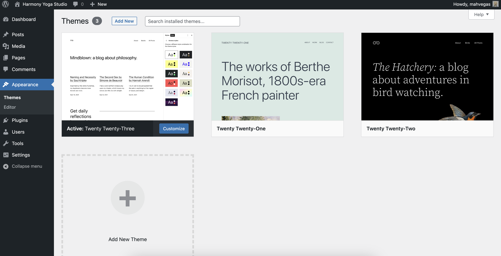
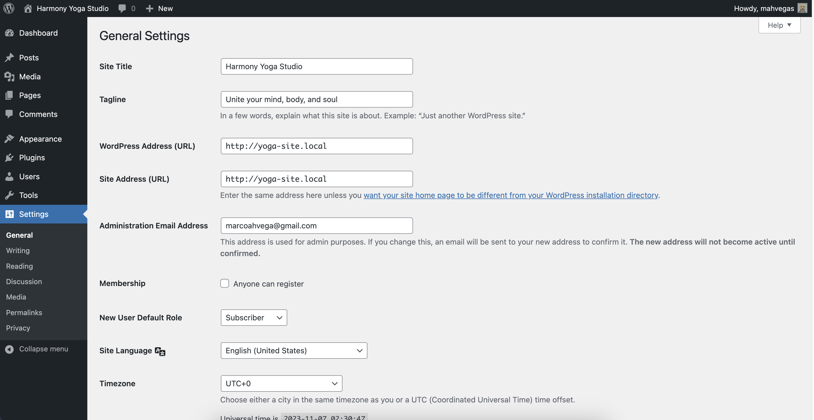
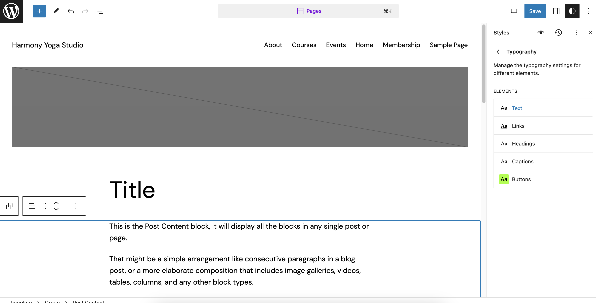
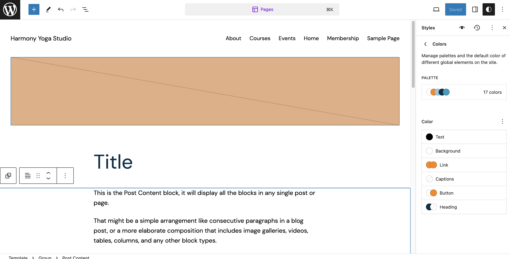
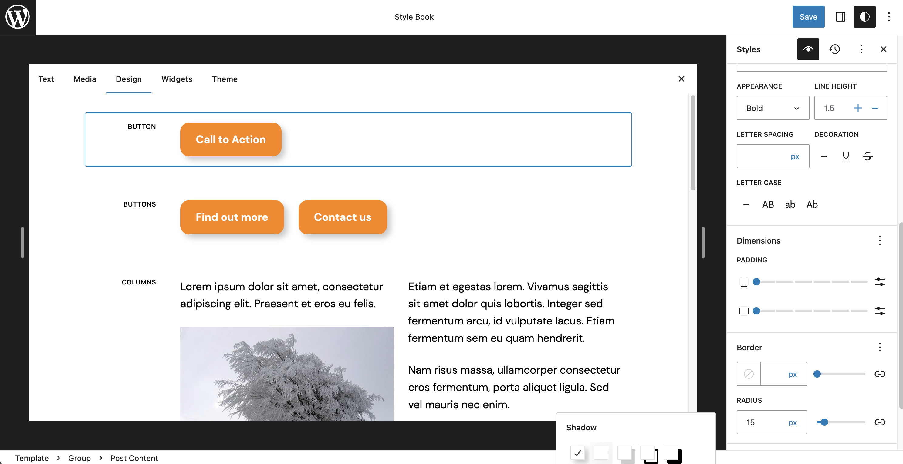

# WordPress Tutorial for Beginners

https://youtu.be/RP8JvALaIio?si=3R-QuKq0AeZYDv7L

<!-- This is part of the transcript of a video tutorial on web development.

help me do the following:

Write this text in its entirety, word by word, using markdown format, adding sub-headings for all its parts in h4 tags, starting every sentence with a bullet point, and using backticks for code terminology. -->

### Intro - 00:00

- we're going to build this website that you're looking at right here

- it's for a yoga studio it's using the new WordPress full site editing feature part of the 2023 theme

### Get domain & hosting - 00:35

1. Register your domain & get web hosting

   👉Launch now with HostGator (The most affordable)

   👉Launch now with SiteGround (Better WordPress tools)

### Install Twenty Twenty-Three theme - 01:22

2. Install WordPress & activate the Twenty Twenty-Three theme

### Upload photos to media library - 01:43

3. Download Tutorial Assets [ZIP]

4. Upload photos to the Media Library

### Publish pages & posts - 02:25

5. Publish pages with featured images (except in Home and Events)

   - Home
   - About
   - Courses
   - Membership
   - Events (Blog)
   - Contact (dynamic link to footer)

- note that I didn't set a featured image for the home page, which is going to have a custom homepage layout, or the events page, because that's just going to show blog posts and those blog posts will have featured images.

### WordPress settings - 04:05

6. WordPress Settings

- General - Set Title & tagline
  - Harmony Yoga Studio - Unite your mind, body, and soul

- Reading - Set static homepage & blog page

- Discussion - Users must be registered to comment

- Permalinks - Set to post name

### Editing theme templates - 06:24

7. From the dashboard, go to Appearance > Editor

- Left menu = Choose templates

  - these are what generate the pages on your website

8. Select the Pages template

- click on the page to open the editor window

- Top-left = Toggle list view (☰) to show block hierarchy

- Right panel = Template/Block settings & styles

- Top-right = Mobile/tablet view, save, and default styles

### Default custom styles - 08:31

9. Styles ◐ = Colors, typography, block styles

- Select the eye icon (👁) at any time to view the current
  design of common content blocks

- Set typography

- Typography > Text (DM Sans)

- Typography > Headings > Appearance (extra bold)

- Typography > Buttons > Appearance (bold)

- Set theme colors (palette included with assets)

- Colors > Palette > Theme

- Colors > Links (orange - hover)
- Colors > Text (black)
- Colors > Headings (dark blue)
- Colors > Buttons (orange/white)

- Set block styles

- Button - radius 15px
- Button - Orange/white + bold + shadow

- Heading and Title - Center
  - Custom CSS - text-align: center;

- Quote - Large + line-height (1.2)

- background/text(blue) + border-radius (30px)
  - Custom CSS - padding: 15px 30px 30px;

### Create Front Page template - 17:46

### Header template part - 18:30

### Image banner layout - 22:33

### Generate text with ChatGPT - 27:25

### Check for CSS bugs with Chrome Inspector - 30:18

### Three-widget section - 32:17

### More content via ChatGPT - 33:56

### Add pre-built WordPress pattern - 37:14

### Footer template part - 40:47

### Review homepage & fix spacing - 47:27

### Custom HTML block bug - 52:20

### Add custom CSS code - 52:55

### Page template - 55:32

### ChatGPT for course ideas - 01:01:55

### A.I. sense of humor - 01:03:36

### Create a subpage & add to menu - 01:04:39

### Home template (for blog posts) - 01:06:41

### Edit Single template - 01:09:44

### CSS for submenu - 01:12:44

### Customize with WordPress plugins - 01:14:44

### Make your website now - 01:16:27
