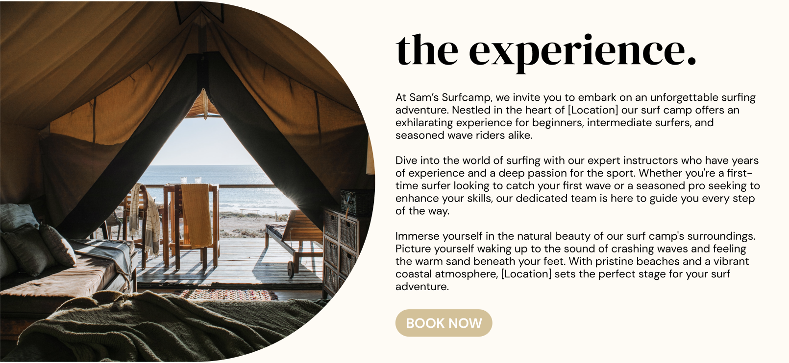
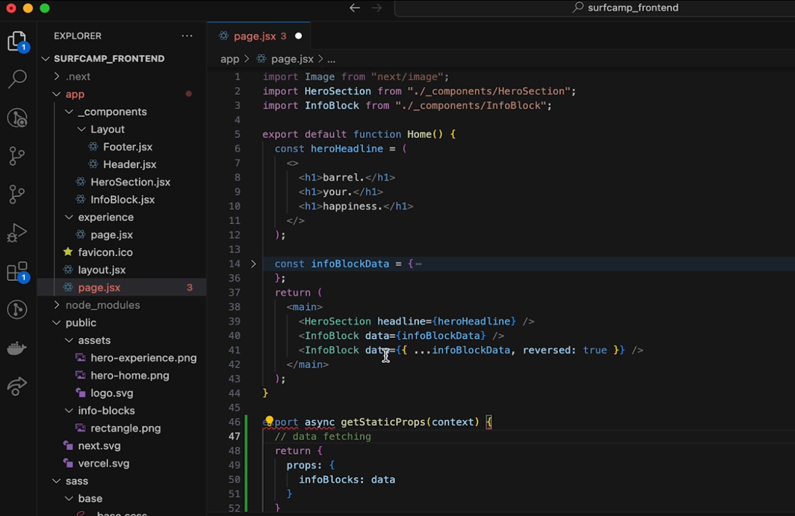
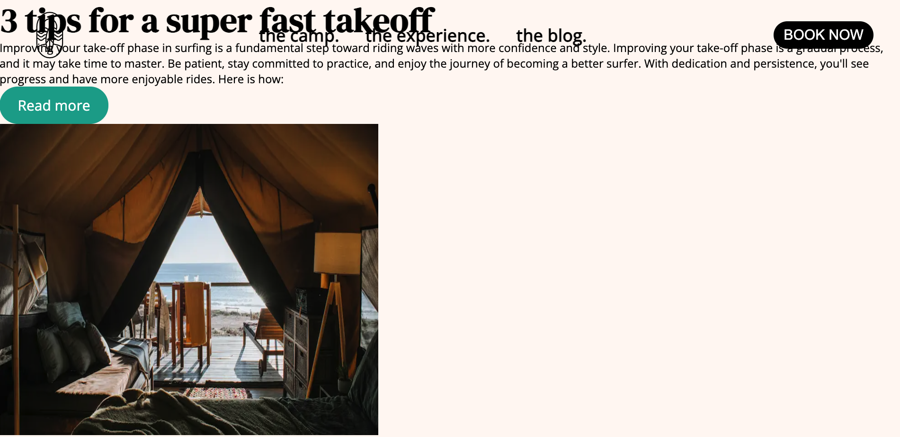

# The Freelance Stack

**Build a Blog with Next.js and a Headless CMS (Strapi)**https://youtu.be/NNWX2flw5mg?si=4_v41nWnSyGZMy6l

<!-- This is part of the transcript of a video tutorial on web development.

help me do the following:

Write this text as entirety, using markdown format, adding sub-headings for all its parts in h4 tags, starting every sentence with a bullet point, and using backticks for code terminology. -->

<!-- This markdown document is part of a transcript for a course on Next.js 14.

Help me do the following:

write this text as notes with instructions to follow, maintaining the same structure.
Keep the same markdown h3 and h4 headings.
Use bullet points in the same way as the document. -->

<!-- This is part of the transcript of a video tutorial next.js 14.

help me do the following:

Write this text in its entirety as instructions to follow using markdown format, adding sub-headings for all its parts in h4 tags, starting every sentence with a bullet point, and using backticks for code terminology.  -->

>

## Section 1: Introduction

>

### **=>** 1. Course Intro

- Are you aspiring to become a freelance developer with prior experience in `React`? This course is tailor-made for you!

#### Course Overview

- This unique course guides you through the various stages of freelance development, starting from the initial design to delivering a fully customizable, full-stack application to your clients.

#### Development Stack

- Experience a journey from an initial `Figma` design file to a complete `Next.js` website integrated with a `Strapi` backend.
- This stack, utilized for three years in freelancing, combines an excellent developer experience with full flexibility, empowering your clients to update and modify the site easily, akin to platforms like `WordPress`, `Squarespace`, or `Wix`.

#### Course Structure

- Begin with a rapid crash course on the necessary tools, emphasizing the new features of `Next.js 13`.
- Dive into the main project, creating a surf camp website featuring a fully customizable blog and signup functionality for different surf camps.
- Each section introduces new concepts without overwhelming complexity, ensuring a smooth and enjoyable learning experience.
- By the course's end, you'll possess the skills to create any website using this newly acquired freelance stack.

#### Instructor's Background

- Beyond freelancing, the instructor brings a background in education, having taught coding to numerous students at boot camps like `General Assembly` and `Master school`.
- This course reflects years of teaching experience, aiming to deliver the ideal learning experience the instructor sought when embarking on their freelance journey.

#### Course Purpose

- Address common questions faced by freelancers, such as delivering a coded website to non-technical clients.
- The course offers insights into effectively delivering projects to individuals unfamiliar with coding and much more.

#### Feedback and Updates

- Your input matters! Feel free to share any suggestions for improvement or additions to the course.
- Connect on Twitter or Udemy to provide feedback, and rest assured that the course will be kept up to date with your valuable input.

#### Conclusion

- With that, there's only one thing left to say—enjoy the course! See you in the first video lecture.

## **=>** 2. What is the Freelance Stack?

- The Freelance Stack is a comprehensive solution for building websites that allows clients to easily update and manage their content without constant developer intervention. It comprises two main components:

### Front End Setup

- The front end of our project is built using `Next.js`.
- This front end is seamlessly connected to the back end, powered by the headless CMS `Strapi`.
- `Strapi` serves as the admin panel for clients, enabling them to update, integrate, and manage various data on their website efficiently.

### Why "Freelance Stack"?

- The term "Freelance Stack" is coined based on its ability to fulfill the common requirements observed in freelance web development projects over the past three years.
- The primary goal is to empower clients to continuously update their websites without the need for constant developer involvement.
- Key requirements include:
  - **Continuous Updates:** Clients can update their website content without frequent code changes.

### Strapi and Front End Integration

- `Strapi` provides a comprehensive admin panel for clients to manage website content.
- The front end, built with `Next.js`, efficiently consumes data from `Strapi` through APIs.
- `Next.js` combines the strengths of `React.js` and server-side rendering for optimal performance.
- Further details on this integration will be covered in the `Next.js` crash course.

### Project Showcase

- The end result of this Freelance Stack is a hosted website with features like a customizable blog.
- The website operates as a single-page application, offering seamless transitions between sections.
- `Strapi` is responsible for publishing blog articles, which are then fetched and displayed dynamically by the `Next.js` front end.

### Excalidraw Overview

- A visual representation using `Excalidraw` showcases the simplicity of the Freelance Stack.
- The front end and back end, along with the admin panel, are neatly integrated, simplifying the overall architecture.
- `Strapi` automatically creates API endpoints based on content types, streamlining data retrieval.

### Design Integration

- Design is a crucial aspect, and the Freelance Workflow involves transitioning from a `Figma` design file to the `Next.js` front end.
- The process includes understanding stylings, margins, and other design elements provided in the `Figma` file.
- The data from `Strapi` is then seamlessly integrated into this design.

### Comparison Without Strapi

- A brief comparison is drawn to highlight the additional effort required without using `Strapi`.
- Building a custom admin panel, backend, and API would necessitate a separate application.
- Data input from the admin panel would require a dedicated user interface, resulting in a more complex development process.

### Conclusion

- The Freelance Stack simplifies the development process by providing a cohesive solution for both front-end and back-end requirements.
- `Strapi` serves as a user-friendly content management system, while `Next.js` delivers high-speed, flexible frontend development.
- Understanding the underlying principles of this stack empowers developers to adapt it to different frameworks and CMS solutions.
- This course will cover the essential concepts and skills needed to leverage the Freelance Stack effectively.

### **=>** 3. How to go through this course

- I just wanted to do a quick note on how to actually go through this course.

#### Styling Focus

- The styling is not the primary focus of this course.
- The focus of this course is `Next.js` and `Strapi`.

#### Styling Approach

- On the front end, `Next.js` will be used with `Sass` for styling.
- `Sass` is essentially CSS on steroids.
- Reasons for choosing `Sass`:
  - Universal Familiarity:
    - Everyone knows how to write CSS, making it accessible for all.
    - No need to introduce additional frameworks like material UI or tailwind.
  - Modularization:
    - Allows for the modularization of CSS files.
    - CSS files will be provided in an assets folder, separate from JavaScript.
    - Users can choose to download these files and integrate them into their projects to skip styling.
    - Styling videos will be clearly marked, enabling users to skip them if desired.

#### Course Structure Recommendation

- It is recommended to follow the course in a chronological order.
- Begin with the crash courses.
- Proceed to the main project for each.
- Chronological order makes sense, especially for the crash courses.
- Users familiar with `Figma` or `Next.js 13` can skip relevant sections and jump to the main project.
- For those not already familiar, going through the course step by step is advised.

### **=>** 4. Materials to go through the course

- In this note, you will find everything you need to go through the whole course!

#### Design & Assets

- **Figma Design File**
  - Access the design file containing all assets, designs, margins, etc.
  - For the best experience, export files directly from Figma, following the correct workflow.
  - Note: The attached assets folder includes the final public folder within the frontend repository.

#### A Word on Styling

- **Styling Videos**
  - If you're primarily focused on learning Next.js and Strapi, you have the option to skip the styling videos.
  - Zipped SASS folder for the final project is attached.
  - Ensure correct spelling of class names and import the `main.scss` file into your `layout.js` file at the beginning of the Next.js setup.

#### The Source Code

- **Github Repository**

  - Explore the code at the end of the project in the general repository.
  - For a breakdown by video, refer to past commits.

  [Github Repository](https://github.com/your-username/your-repository)

- **Github Commits**

  - Commits align closely with each video lecture.

  [Github Commits](https://github.com/your-username/your-repository/commits)

#### Still Stuck?

- If you encounter difficulties:
  - Comment on the video.
  - Directly message the instructor on the platform or via Twitter.

## Section 2: NextJS Crash Course

### **=>** 5. Why are we using Next.js?

- Welcome to the Next.js Crash Course! In this section, we'll explore the reasons behind choosing Next.js for our main project.

#### Why Use Next.js?

- The fundamental question we'll address first is: Why do we use `Next.js`?
  - If you are new to it, this section will provide insights into the nature of this framework.
  - If you already have experience with React, your learning curve will be smooth.
  - `Next.js` is a meta framework built on top of `React`, aiming to eliminate some of the disadvantages associated with `Reactjs`.
  - Unlike `React`, which is purely client-side, `Next.js` is server-side first, offering a combination of the best features from both worlds.
  - Subsequent videos will delve into how it achieves this and how to leverage its full potential.

#### Disadvantages of Reactjs

- Before we explore how `Next.js` addresses the limitations of `Reactjs`, let's understand the drawbacks of `Reactjs`.
  - `React` operates as a client-side library, delivering a sizable JavaScript bundle to be rendered within the browser.
  - While this approach provides a smooth single-page application experience, it comes with downsides:
    - Initial load times can be slower due to the large JavaScript bundle.
    - Search engine optimization is challenging as search engines struggle to interpret JavaScript-rendered content.
  - `Next.js` resolves these issues, making it particularly crucial for freelancers and developers working on projects requiring high search engine rankings.

#### Importance of Next.js for Freelancers

- Freelancers, in particular, stand to benefit from learning `Next.js`.
  - Clients often prioritize high search engine rankings, a challenge with traditional `React` applications.
  - `Next.js` addresses this challenge and offers:
    - Server-side rendering for improved search engine optimization.
    - Performance enhancements through smaller JavaScript bundles.
  - These benefits come without sacrificing the smooth single-page application experience.
  - With integrated API routes and a full-stack framework, `Next.js` is a versatile choice that aligns with modern development practices.

#### Conclusion and Further Information

- In summary, the key advantages of using `Next.js` include:
  - Easier search engine optimization.
  - Performance improvements with smaller JavaScript bundles.
- This framework is particularly valuable when working with content management systems like `Strapi`.
  - `Next.js` facilitates easy data revalidation from the backend (in this case, `Strapi`) to maintain a fast and continuously updated website.
  - Clients can effortlessly update or import data within `Strapi`, ensuring a positive experience for both users and content managers.

For more information on using `Next.js` and its application in the freelance stack, refer to the relevant sections in the course materials.

### **=>** 6. Setting up a NextJS Project

- To initiate a `Next.js` project, follow these steps:
  1. Open your terminal.
  2. Execute the command `npx create-next-app@latest`.

```bash
npx create-next-app@latest
```

3. The above command will install the latest stable version of `Next.js`.
4. Refer to the official `Next.js` documentation for detailed information on installation. [Next.js documentation](https://nextjs.org/docs)
5. Navigate to the installation section to find the recommended command.
6. Optionally, specify the version number during project creation, e.g., `npx create next app@13.5.5`.
7. For this course, it's suggested to use version `13.5.5` to ensure compatibility.

#### Project Setup

- After running the installation command, the setup prompts will include:

  1. Enter your project name (e.g., "Crash Course").
  2. Choose whether to use TypeScript.
  3. Indicate your preference for ESLint.
  4. Opt-out of Tailwind CSS.
  5. Choose the app router with the app directory.
  6. Skip the source directory.
  7. Opt-out of customized imports.


- Additional notes:
  - The `Next.js` documentation is a valuable resource for understanding the framework.
  - Consider referring to the documentation for in-depth information on server components, client components, and other concepts.

#### Project Initialization

- Upon completing the setup, follow these steps:

  1. Navigate to the project folder (e.g., `cd next-crash-course`).
  2. Run the command `npm run dev` in the terminal to start the `Next.js` server.

  ```bash
  cd next-crash-course

  npm run dev
  ```

  1. Access the server at `localhost:3000` in your browser.
  2. Explore the project documentation for further guidance.

#### Initial Project Structure

- **File Exploration:**

  - Inside the project, explore the files and folders.
  - Access the `app` folder and open the `page.js` file.

- **Update Content:**
  - Edit the `page.js` file, leaving only an H1 tag with the text "hello world."

```jsx
import styles from './page.module.css'

export default function Home() {
  return <main className={styles.main}></main>
}
```

- Verify the changes by refreshing the browser.
- Confirm that the project is set up correctly before moving on to routing.

### **=>** 7. Simple Routing in NextJS

- Routing in Next.js has undergone significant updates since version 12.
- Whether you're new to Next.js or transitioning from version 12, this section will guide you through all the changes.

#### File-Based Routing System

- Next.js now employs a file-based routing system, revolutionizing how routes are defined within your application.
- Within the app directory, routes are determined based on the folders and files present.

- Visualizing the structure:

- the app folder is at the top, and specific routes are created using folders, such as 'blog'.
- Dynamic routing will be covered later in the crash course.
- In the main project, the 'page.js' and 'layout.js' files in the app folder serve as the components for a specific route.
- The 'layout.js' file acts as a wrapper, displaying the content of the folder within the outer layout.
- Focus on the 'page.js' file for now.

#### Creating a New Route

- To create a new route, such as a `blog` page, follow these steps:

  1. Inside the app directory, create a new folder named `blog`
  2. Within the blog folder, create a `page.jsx` file, specifying the content for this route.
  3. Consider using code snippets or plugins for efficiency, such as the 'Next.js 13 power snippet' for Visual Studio Code.
  4. Add the desired content to 'page.jsx' for example, `H1 blog`.

  

  5. Upon saving, the new route is accessible at `localhost/3000/blog`.

#### Styling Considerations and Conclusion

- Routing between different pages is established by creating folders and 'page.js' files.
- Note that the styling may need adjustments, but the focus here is on the core functionality of Next.js.
- While more advanced dynamic routing will be covered later, creating a new route involves adding a folder within the app directory and a corresponding 'page.js' file inside it.

### **=>** 8. Layouting in NextJS

- In the context of Next.js, as our routes become more complex with dynamic parameters, it's essential to implement a consistent layout for our pages.

- The logic involves creating a centralized layout that can be applied to multiple pages, preventing the need to import components individually into each page.

#### Page Layout

- **Objective:**

  - Develop a consistent layout for pages to avoid redundancy.

- **Creating Components Folder:**
  - Generate a new folder named `_components`.
  - Prefix with an underscore for easy access at top.
  - Create a `header.jsx` file within the `_components` folder.


#### Header Component

- **Content:**

  - In `header.jsx`, add an H3 tag for the header.
  - Delete the global CSS file for simplicity.


#### Adding Header to Pages

- Import the header component into the `layout.js` file.

- Ensure the import is placed within the body of the layout file, avoiding placement outside of the body.

- Incorrect placement might lead to errors such as `hydration failed`.

- This ensures that the layout is applied consistently across different pages.


#### Custom Layouts for Specific Pages

- Next.js allows the creation of custom layouts for specific pages or subtrees.

- For example, you can create a `layout.js` file within a specific page or subtree, defining a layout specific to that section.

- This flexibility enables customization of the layout for different parts of the website.

- Each `layout.js` file defines the structure for its subtree, allowing for unique styling or content arrangements.

- Example:
  - Create a new `layout.js` for the blog page.
  - Customize the layout for the blog page with a distinct H5 tag.


- Understand that layouts in `layout.js` affect all child elements or subsections of a route.
- Blue lines in the project visually represent the applied layout.


#### Navigating Between Pages

- To navigate between pages, we'll explore the process in the next video.

By following these steps, you can effectively manage the layout of your Next.js application, maintaining consistency while allowing for customization where needed.

### **=>** 9. Linking from Page to Page

- In this section, we will explore how to link between different pages in your Next.js application.

- We have previously built various routes, including the blog page and the main page.

- Now, our goal is to create links that seamlessly navigate between these pages.

#### Linking in Next.js

- Linking in Next.js is straightforward in terms of code implementation, but it is crucial to grasp the conceptual understanding of it.

- The objective is to achieve a single-page application experience, where clicking on links results in instant navigation without any noticeable load time.

- This is made possible by pre-rendering, where all necessary content is loaded in advance, ensuring a fast and smooth user experience.

#### Concept of Pre-rendering

- To illustrate the concept of pre-rendering, consider an already launched website.

- Clicking on links, such as "Read more" on the blog page, demonstrates the absence of load time.

- The transition is immediate because the content is preloaded, eliminating the need for additional server requests.

- This approach significantly contributes to the overall speed and efficiency of the application.

#### Linking Between Pages

- Let's implement linking between our blog and home pages.

- Open the `header.jsx` component file and remove the `layout.js` import.

- Now, within the header component, we want to add links to both the main page and the blog page.

- Utilize the `Link` component from Next.js to ensure seamless navigation.

- Avoid using a standard `A` tag, as it would introduce unnecessary page refreshes.


- By utilizing the `Link` component, we ensure a smooth transition without additional server requests.

- Test the links by clicking on them; you should observe direct navigation without page refreshes.

- Repeat the process for linking to the home page.


- Now, your header contains functional links between the blog and home pages.

#### Moving on to the Core

- With the linking functionality in place, we can now proceed to the core aspects of our application, focusing on server and client components.

### **=>** 10. Server and Client Components Overview

- In Next.js 14, understanding the concepts of server and client-side components is crucial.
- This section delves into the core concepts of Next.js components, differentiating between server-side and client-side components.

- If you're familiar with React and have been away for a while, you might be more acquainted with client-side components.
- However, Next.js default behavior is server-first, making components server-side unless specified otherwise.

#### Server Side Components vs. Client Side Components


- **Server-Side Components:**
  - Built and rendered entirely on the server.
  - Arrive ready on the client, requiring no additional input or JavaScript.
- **Client-Side Components:**
  - HTML is built on the server, but interactivity (e.g., forms, inputs) is hydrated on the client.
  - Used when specific client-side interactivity is needed.
  - Conversion from server-side to client-side is straightforward when required.

#### Why Differentiate Between Server and Client Side?

- The distinction exists for performance reasons:

  - Server-side components are faster and more performant.
  - They allow for sending less JavaScript, resulting in smaller bundles.
  - Ideal for prefetching data, enhancing overall performance.

- **Note:** While client-side components are still fast, server-side components are preferable when interactivity is unnecessary.

#### Displaying Components in Next.js

- In Next.js after version 13, pages can consist of both server-side and client-side components.

- `Components can be nested`, allowing for component-specific data and optimized rendering.


- Example:
  - A search bar as a client component for user input tracking.
  - A nav bar as a server component for fetching and displaying information.

#### Working with Server Side and Client Side Components

- To work with server-side and client-side components:

  - By default, components are server-side unless specified.
  - Conversion to a client-side component requires using the `'use client'` tag.

  - Example: Converting a server-side header to include a client-side search bar.

```jsx
'use client'
import Link from 'next/link'
import { useState } from 'react'

export default function Header() {
  const [search, setSearch] = useState()
  return (
    <header>
      <h3>Header</h3>
      <Link href='/'>Home Page</Link>
      <Link href='blog'>Blog</Link>
      <input
        type='text'
        value={search}
        onChange={e => setSearch(e.target.value)}
      />
    </header>
  )
}
```

- **Note:** Server-side components need JavaScript for rendering, but specific functionalities may be hydrated on the client side.

#### Create separate components for server and client functionality

- Example: Extracting a search bar as a client component and leaving the rest of the nav bar as a server component.

```jsx
import Link from 'next/link'
import SearchBar from './SearchBar'

export default function Header() {
  return (
    <header>
      <h3>Header</h3>
      <Link hrefLang='/'>Homepage</Link>
      <Link hrefLang='/blog'>Blog</Link>
      <SearchBar />
    </header>
  )
}
```

```jsx
'use client'
import { useState } from 'react'

export default function SearchBar() {
  const [search, setSearch] = useState()
  return (
    <>
      <p>{search}</p>
      <input
        type='text'
        value={search}
        onChange={e => setSearch(e.target.value)}
      />
    </>
  )
}
```

#### Conclusion

- Optimize components based on their purpose:

  - Create separate components for server and client functionality.
  - Achieve a balance between server-side rendering and client-side interactivity for optimal performance.

### **=>** 11. Data Fetching

- In this section, we will explore the process of data fetching in Next.js, taking advantage of the capabilities provided by server components.

- The ability to associate data directly with a component simplifies the process of fetching data without the need for creating separate API routes.

- Server components enable seamless data fetching, even when utilizing API keys or other sensitive information.

- The integration of server components offers significant advantages in terms of data retrieval.

- For the practical demonstration, we will consider a blog page where we aim to display articles sourced from an API.

- A free open API will be used for demonstration purposes, but the principles apply to other APIs, including your custom Strappy API.

- The API used in this example provides 100 posts that can be accessed via a specific URL.


#### Fetching Data in the Blog Page

1. To initiate data fetching on the blog page, follow these steps:

   - Create a `response` variable, awaiting the result of the `fetch` function.

   - Utilize the built-in `fetch` function, which can be later replaced with Axios if preferred.

   - The URL of the API should be provided as part of the fetch operation.

```jsx
export default function Page() {
  const response = await fetch ("https://jsonplaceholder.typicode.com/posts")
  return (
    <main>
      <h1>Blog</h1>
    </main>
  )
}
```

2. To handle asynchronous behavior, ensure that the component is declared as an asynchronous function.

```jsx
export default async function Page() {
  const response = await fetch('https://jsonplaceholder.typicode.com/posts')
  return (
    <main>
      <h1>Blog</h1>
    </main>
  )
}
```

3. Log the response to verify the data retrieval.

```jsx
export default async function Page() {
  const response = await fetch('https://jsonplaceholder.typicode.com/posts')
  console.log(response)
  return (
    <main>
      <h1>Blog</h1>
    </main>
  )
}
```

1. The data fetched at this stage is currently on the server.


- Convert the response to JSON for further use.

```jsx
export default async function Page() {
  const response = await fetch('https://jsonplaceholder.typicode.com/posts')
  const data = await response.json()
  console.log(data)
  return (
    <main>
      <h1>Blog</h1>
    </main>
  )
}
```


- Implement basic rendering of post titles using the fetched data.

```jsx
export default async function Page() {
  const response = await fetch('https://jsonplaceholder.typicode.com/posts')
  const data = await response.json()
  console.log(data)
  return (
    <main>
      <h1>Blog</h1>
      {data.map(post => (
        <p>{post.title}</p>
      ))}
    </main>
  )
}
```


#### Continuous Data Updating

- The network activity can be observed in the network tab. However, by default, the data is static and won't be revalidated.


1. Enable continuous data updates using the `revalidate` option.

- Explore the option to set a specific revalidation time (e.g., every 30 seconds).

```jsx
export default async function Page() {
  const response = await fetch('https://jsonplaceholder.typicode.com/posts', {
    next: {
      revalidate: 30,
    },
  })
  const data = await response.json()
  console.log(data)
  return (
    <main>
      <h1>Blog</h1>
      {data.map(post => (
        <p>{post.title}</p>
      ))}
    </main>
  )
}
```

Here, the data will be revalidated every 30 seconds.

2. Alternatively, when using Axios, you can achieve the same effect with the following code:
3.

```jsx
export default async function Page() {
  const response = await fetch('https://jsonplaceholder.typicode.com/posts')
  const data = await response.json()
  console.log(data)
  return (
    <main>
      <h1>Blog</h1>
      {data.map(post => (
        <p>{post.title}</p>
      ))}
    </main>
  )
}

export const revalidate = 30
```

3. With this setup, the data will be continuously updated or revalidated based on the specified interval.

- It's noteworthy that server-side data fetching is the default behavior, providing a convenient and efficient way to handle data without the need for complex state management.

- The ease of integrating data into components showcases a significant improvement compared to traditional approaches.

- The process involves reading the data directly within the component, allowing for straightforward integration with the React elements.

- This approach contrasts with older methodologies that required setting state and subsequent rendering, simplifying the overall data handling process.

### **=>** 12. Dynamic Routing

In this section, we will explore dynamic routing in Next.js 14, allowing us to fetch and display data for various pages with different slugs.

#### Dynamic Routing Basics

- Dynamic routing involves fetching data for pages with different slugs.
- (When using revalidation, be cautious about multiple requests within the same component, as the lowest revalidate number takes precedence.)

- (Requests across components are deduplicated, optimizing performance by preventing unnecessary duplicate requests.)

#### Creating Dynamic Pages

- Create a new folder named `[id]` to represent dynamic routing based on the post IDs.

- For each new route, create a `page.jsx` file to display the data for that route.


- Utilize the `params` prop to access the dynamic values, such as the id.

```jsx
export default function Page({ params }) {
  const { id } = params
  return (
    <main>
      <h1>Individual page : {id}</h1>
    </main>
  )
}
```


- let's do it now in our blog, pulling the post title as well.

```jsx
export default async function Page({ params }) {
  const { id } = params
  const response = await fetch(`https://jsonplaceholder.typicode.com/posts/${id}`, {
    next: {
      revalidate: 30,
    },
  })
  const data = await response.json()
  return (
    <main>
      <h1>Individual page : {id}</h1>
      <p>{data.title}</p>
    </main>
  )
}
```


- dynamic pages are generated at runtime when a request is made.
- but we can improve the performance by Pre-generating the Pages.

#### Pre-generating Dynamic Pages

- To improve performance and provide data at runtime, pre-generate dynamic pages using the `getStaticParams` function.

  - pre-generating pages for improved performance.
  - Use the `getStaticParams` function to achieve pre-rendering based on post IDs.
  - Fetch post data for each ID and return an array of objects with ID values.
  - Demonstrate the use of the `fetch` function to retrieve post data.
  - Convert the ID to a string to ensure compatibility with the data array.
  - Confirm the successful pre-rendering of pages by refreshing and checking individual pages.

```jsx
export default async function Page({ params }) {
  const { id } = params
  const response = await fetch(`https://jsonplaceholder.typicode.com/posts/${id}`, {
    next: {
      revalidate: 30,
    },
  })
  const data = await response.json()
  return (
    <main>
      <h1>Individual page : {id}</h1>
      <p>{data.title}</p>
    </main>
  )
}

export async function generateStaticParams() {
  const response = await fetch('https://jsonplaceholder.typicode.com/posts')
  const data = await response.json()
  return data.map(post => ({
    id: String(post.id),
  }))
}
```


#### Handling Errors and Fallbacks

- **404 Page Handling:**

- Set dynamic params to `false` if you want to ensure all parameters are known beforehand, preventing 404 errors for unknown IDs.

- Implement a fallback mechanism to handle scenarios where the API is unavailable or data fetching fails.

```jsx
export default async function Page({ params }) {
  const { id } = params
  const response = await fetch(`https://jsonplaceholder.typicode.com/posts/${id}`, {
    next: {
      revalidate: 30,
    },
  })
  const data = await response.json()
  return (
    <main>
      <h1>Individual page : {id}</h1>
      <p>{data.title}</p>
    </main>
  )
}

export async function generateStaticParams() {
  const response = await fetch('https://jsonplaceholder.typicode.com/posts')
  const data = await response.json()
  return data.map(post => ({
    id: String(post.id),
  }))
}

export const dynamicParams = false
```


#### Fallbacks for Data Fetching

- Ensure proper error handling to provide a fallback for scenarios like API unavailability.

  - Create a separate function (`fetchPosts`) for data fetching, making it easier to handle errors and implement fallbacks.
  - Implement a try-catch block to handle errors during data fetching.
  - Utilize the `notFound` function from Next.js to redirect users to a 404 page when errors occur.

```jsx
import { notFound } from 'next/navigation'

async function fetchPost(id) {
  try {
    const response = await fetch(`https://jsonplaceholder.typicode.com/posts/${id}`, {
      next: {
        revalidate: 30,
      },
    })
    const data = await response.json()
    return data
  } catch (err) {
    notFound()
  }
}

export default async function Page({ params }) {
  const { id } = params

  const data = await fetchPost(id)

  return (
    <main>
      <h1>Individual page : {id}</h1>
      <p>{data.title}</p>
    </main>
  )
}

export async function generateStaticParams() {
  const response = await fetch('https://jsonplaceholder.typicode.com/posts')
  const data = await response.json()
  return data.map(post => ({
    id: String(post.id),
  }))
}

export const dynamicParams = false
```

- **Demonstration:**

  - Display the proper 404 page for IDs outside the defined range or API-related issues.
  - Showcase the seamless fallback mechanism for handling errors during data fetching.


- **Conclusion:**
  - Dynamic routing in Next.js, combined with pre-generation and fallback strategies, ensures efficient handling of various scenarios.
  - Explore the versatility of dynamic pages and their robust error-handling capabilities for a smoother user experience.

### **=>** 13. Not Found Pages

- Now we have it set up that if we put in an `ID` here that doesn't exist, we see this full, full page here, right?
- Because we said we only want to display anything for the kind of parameters that are coming in here.

#### Creating a Custom 404 Page

- Now, the thing is, we can also create our own 404 page.
- So if I go into my `app` directory here and I just add a `not-found.js` right here, and I say this is a new page and I'm just saying sorry in an `H3`, sorry we couldn't find what you're looking for like this.
- Now if I go back, there we go. Sorry we couldn't find what you're looking for.

#### Route-Specific 404 Pages

- That would be happening on every route. That is just wrong, right?
- If we go to the home page, it wouldn't appear. But then on any route that we haven't actually defined, we will show this page.
- It could be, though, that you actually want to have a situation in which you want to have for specific route segments, different not found pages.
- For example, for the dashboard, you might want to have a different not found page than for the general website.
- So how can we do that?

#### Implementing Route-Specific 404 Pages

- Well, I could go in here and I could say for each one of my `IDs`, right.
- If there's some other root I want to have another not found page here. This would be basically for any blog article that can't be found.
- And now this not found page is only responsible for anything that basically happens after the blog page.
- You could also put it in the blog folder. It doesn't really matter in this case because we don't have any more folders.
- If I go in here and I just say, well, let me say sorry. The blog article you were looking for can't be found. Okay, and we're also going to make that an `H3` like this.
- Now if we go back, we're going to see that this actually hasn't worked.
- So let's go for a route that doesn't exist. We still get sorry couldn't find what you're looking for.

#### Handling Route-Specific 404 Page Rendering

- It's not working as it was with the layout. It's not working here for the for the page. Why is that?
- Because right here, when we're saying we don't expect any dynamic parameters, we're right now saying, okay, just lead it back to the root page to the root for for page if there's anything wrong.
- If I set this to `false` and we look at it again, we have the problem again that it tries to render the page.
- The problem here is that yes, we're catching the error and we're sending it to not found. But actually here because of the API that we're using, we're actually getting back we're getting back `200`.
- So it's telling us, hey, this everything has worked out perfectly.
- Just to show you that in Strapi it's going to be a lot nicer because it would return a full `404` and we would get an error and everything would already be working.
- Here I can now say, if `data.title` does not exist, right? We want to also call the not found function not found function like this.
- Now if we go back to our page we see sorry. The blog article you were looking for can't be found.
- In a normal scenario, our API would find an error here, right? We can't fetch the data, so we're going to bring it to the not found section.
- And that's why here we just have to remember to set this to `true`.
- But again this is only if you want to have a route specific for for page. If you have the normal use case where you're okay with one for for page, what we had before already worked, right? Sorry we couldn't find what you're looking for.

#### Conclusion

- You already went through a lot and pretty much the most important features in all the features actually, that you're going to be needing for the project we're going to be building.
- Which is, you understand, routing in Next.js, you understand data fetching, you understand server components, client and components, all of that.
- Which means we can actually start looking into the project, which we're going to be doing by first looking at Figma and the Figma file itself.
- And then we'll get started with our Next.js app that we're going to be using for the project.
- In terms of Strapi, we're going to have the introduction to Strapi, what Strapi is, how it works, and so on.
- When we're actually starting to build our Strapi backend for our website.
- So basically. Oops. So basically Strapi you're going to be seeing while we're using it.
- We're going to be learning by doing that.
- But in terms of Next.js you're in a perfect position.
- And so now let's look at Figma.

## Section 3: Developer Intro To Figma

### **=>** 14. What is Figma and how to use it

- When I introduced the freelance stack, I mentioned the two main technologies for building this app: `Next.js` and `Strapi`.
- Our focus will be on these technologies.

#### Design Tool Overview

- Take a few minutes to discuss the design tool we'll be using, which is `Figma`.
- While the choice of design tool is not crucial, `Figma` has gained popularity in the design community.
- Previously, designers used tools like `Adobe XD` and `Sketch`, but `Figma` is now widely adopted.

#### Working with Figma

- Explore key aspects for developers to efficiently use `Figma` in the development process.
- Simulate the workflow closely to that of a freelancer.
- Discuss the structure of the shared `Figma` file with icons, logos, and individual pages.
- Emphasize inspecting and extracting values from `Figma` for use in `Next.js` or `CSS` code.
- Highlight collaboration features such as comments and multiple contributors.

#### Using Figma as a Development Tool

- Share the `Figma` file for participants to view.
- Discuss the structure of the file, including images, icons, logos, and individual pages.
- Explain how to inspect elements for information like width, font family, font size, and line height.
- Emphasize the benefits of using `Figma` in development, including copying elements and extracting colors and styles.
- Stress the importance of entering development mode to gather information efficiently.
- Encourage participants to utilize the collaborative features of `Figma` for smoother communication.

#### Utilizing Figma Features

- Demonstrate how to leverage `Figma` features for efficient development.
- Discuss measuring distances between elements and using the option key for additional information.
- Emphasize the simplicity of `Figma` and its role in reducing communication with designers.
- Guide participants on exporting images from `Figma` with different quality and size options.

#### Conclusion and Next Steps

- Summarize the role of `Figma` as the starting point for creating designs.
- Highlight the transition to the main project, starting with setting up the `Next.js` frontend.
- Mention the plan to code up all components of the home page based on the `Figma` design.

## Section 4: Initial Project Setup NextJS, Strapi and Sass

### **=>** 15. NextJS Base Setup

- **Project Introduction**
  - Begin setting up the main project for our course, the `Surf Camp`.
  - Initial focus: Configuring the `Next.js` front end.

#### Next.js Front End Setup

- Project Folder Organization

  - Choose a location for your project (e.g., a dedicated folder within your project directory).
  - Create a new folder named `surfcamp` or any preferred name for your project.

- Creating Next.js App

  - Execute the command: `npx create-next-app@latest surfcamp_frontend`.
  - Suggest using a specific version, e.g., `13.5.5`, for consistency.

  ```bash
  npx create-next-app@latest surfcamp_frontend
  ```

  - Answer default questions during the installation process.

  

- Base Setup Steps

  - Navigate to the newly created project folder.
  - Ensure successful installation by running `npm run dev` and accessing the provided link.

  ```bash
  npm run dev
  ```

#### File Cleanup for Starting Fresh

- Clean the `layout.js` file:

```jsx
export const metadata = {
  title: 'Create Next App',
  description: 'Generated by create next app',
}

export default function RootLayout({ children }) {
  return (
    <html lang='en'>
      <body>{children}</body>
    </html>
  )
}
```

- Delete the `global.css` file

- Delete the `page.modules.css` file

- Clean the `page.js` file:

```jsx
export default function Home() {
  return (
    <main>
      <h1>SurfCamp</h1>
    </main>
  )
}
```

- Verify the setup by checking the browser for any errors.

#### Conclusion

- Cleanup ensures a clean starting point for the `Next.js` front end.
- Subsequent videos will cover additional setups, such as the introduction to `Sass` styling.
- For those not interested in styling, simply add the `sass` folder to your project.
- Those interested in styling can proceed to the next video for detailed `Sass` setup and styling patterns.

### **=>** 16. Reminder on Styling

Follow these steps for a quick reminder on styling if you choose not to code along.

1. **Bring in the Sass Folder:**

   - If you haven't done so already, download the Sass folder.
   - If you have downloaded it before, ensure you have the latest version by reattaching the folder provided with this note.

2. **Integration with `layout.js`:**

   - Import the `main.scss` file into your `layout.js` file.

3. **Dependency Check:**
   - Verify that Sass is installed as a dependency.
   - If not, install Sass using the appropriate package manager.

Now, you're all set with the styling reminder!

### **=>** 17. Styling Video: Sass Setup

Follow these steps to set up and organize your `sass` styles in your Next.js 14 project:

#### Set up the sass folder

- Create the `sass` folder in the project directory.
- Name the folder anything you prefer, for example, "styling" or simply "sass."

#### Creating the base Folder

- Inside the sass folder:
  - Create a sub-folder named `base`
  - (The purpose of the base folder is to reset default stylings in the browser.)

#### Adding base.css File

- Inside the "base" folder:

  - Create a file named `_base.scss`.

  

  - The underscore indicates that this is a partial file.
  - Copy and paste the provided code from the assets folder into this file.

```scss
*,
*::after,
*::before {
  margin: 0;
  padding: 0;
  box-sizing: border-box;
  -webkit-tap-highlight-color: transparent;
}

body {
  background-color: beige;
}

main {
  min-height: calc(100vh - 13rem);
}

a {
  color: inherit;
  text-decoration: none;

  &:hover,
  &:focus {
    text-decoration: none;
  }
}

a.btn {
  display: inline-block;
}

button {
  background-color: transparent;
  border: none;
  cursor: pointer;
  outline: none;
  font-weight: 400;
}

html {
  font-family: 'Open Sans', sans-serif;
  font-weight: normal;
  font-style: normal;
}

// html {
//   font-size: 62.5%; // 1rem = 10px; 10px/16px = 62.5%

//   @include respond(tab-land) {
//     // width < 900?
//     font-size: 55%; // 1 rem = 9px, 9/16 = 56.25%
//   }

//   @include respond(phone) {
//     // width < 600?
//     font-size: 50%; // 1 rem = 8px, 8/16 = 50%
//   }

//   @include respond(big-desktop) {
//     font-size: 75%; // 1 rem = 12px, 12/16 = 75%
//   }
// }

.bold {
  font-weight: bold;
}
```

- This code resets various styling options, including margins, paddings, and hover effects on links.

#### Importing Styles into Main File

- Create a new main sas file, for example, `main.scss`.
  - In this file, import the partial files from the "base" folder.

```scss
@import 'base/base';
```

- The main.scss file will eventually be compiled, combining all partial files.

#### Connecting Styles to Layout JS

- In the JavaScript file responsible for rendering (e.g., `layout.js`):
  - Link the main SASS file.
  - Ensure the path is correct, such as `../sass/main.scss`.

```javascript
import '../sass/main.scss'
```

- The styles will now be applied to the project, and any additional styles can be added similarly.

#### Adding More Styles

- To add new styles:
  - Create additional SASS files.
  - Consider organizing styles in a "components" folder.
  - Import these new files into the main SASS file for them to be applied to the project.
  - The layout JS will automatically incorporate the styles, displaying them properly on the screen.

### **=>** 18. Styling Video: Variables and Typography

- This section covers styling aspects, focusing on variables for colors and typography.
- Recent updates involve adjustments to the background color and font in the project.

#### Setting Up Variables for Styling

- For consistency in color usage, establish variables for colors.
- Follow these steps:

  1. Open Figma to identify recurring colors in the project.
  2. Copy the color codes from Figma.
  3. Create a `_variables.scss` file in the `base` folder.

  4. Define variables (e.g., `$turquoise` and `$light_beige`) for consistent color application.


- Use $light-beige as background color

 5. Ensure correct import order in the `main.scss` file to prevent undefined variable errors.

```css
@import 'base/variables';
@import 'base/base';
```

#### Adding More Color Variables

- Expand the color palette by incorporating additional colors from Figma.
- To achieve this, follow these steps:

  1. Identify and extract more colors from Figma (e.g., `$light_brown` and `$brown`).

```css
$turquoise: #14a998;
$light-beige: #fff8f4;
$light-brown: #f1e8d9;
$brown: #d7c094;
```

2. Use these variables in styling files to maintain a cohesive color theme.

#### Typography and Fonts

- Address font-related styling by creating a `_typography.scss` file.
- Execute the following steps:

  1. Create a `_typography.scss` file in the `base` folder


- and import it into the `main.scss` file.


2. Import the desired font from Google Fonts using the provided link.


1. we will be using `Open Sans` font for paragraphs and `DM Serif Display` for headlines.
2. Define REM units for flexible font and margin adjustments, adapting to various screen sizes. (this css is included in the resources)

```css
@import url('https://fonts.googleapis.com/css2?family=DM+Serif+Display&family=Open+Sans:wght@300;400;500&display=swap');

h1,
h2,
h3,
h4 {
  font-family: 'DM Serif Display', serif;
}

h1 {
  font-size: 10rem;
  line-height: 12rem;
  font-weight: 500;
}

h2 {
  font-size: 8rem;
}

h3 {
  font-size: 6rem;
  line-height: 7rem;
}

h4 {
  font-size: 4rem;
  line-height: 4.7rem;
}

h5 {
  font-size: 3rem;
}

.copy {
  font-size: 2rem;
}

.copy-small {
  font-size: 15px;
}
```

#### Implementing Mixins for Responsive Design

- Integrate mixins to facilitate responsive design adjustments.
- Follow these steps:

1. Create a `_mixins.scss` file in the base folder to specify breakpoints for different screen sizes.(do not forget to import it into the `main.scss` file)
2. Apply these mixins in styling files to dynamically adjust styling based on the screen size.

```css
/* MEDIA QUERY MANAGER */
/*
0 - 900px:     Phone
900 - 1200px:  Tablet landscape
1200 - 1800px: Desktop
1800px+:       Big desktop

$breakpoint argument choices:
- phone
- tab-land
- big-desktop

1em = 16px
*/
@mixin respond($breakpoint) {
  @if $breakpoint == phone {
    @media (max-width: 56.25em) {
      @content;
    } // 900px;
  }
  @if $breakpoint == tab-land {
    @media (max-width: 75em) {
      @content;
    } // 1200px
  }
  @if $breakpoint == big-desktop {
    @media (min-width: 112.5em) {
      @content;
    } // 1800px
  }
}
```

3. Acknowledge the importance of responsive design, but emphasize the course's focus on Next.js, Strapi data, and other project aspects.

### **=>** 19. Overview of our setup (and why we set it up this way)

- Setting up our project initially may seem like a lot, but this groundwork will significantly speed up our coding process.
- The key benefit is that, as we progress with coding, we can easily reference our established conventions, such as font sizes and styles, streamlining our development.

#### Font Size and Typography

- The typography file serves as a reference for font sizes. For instance:
  - An 80-pixel size corresponds to an H2 tag, as we use eight rem, translating to 80 pixels.
  - Importantly, the font size automatically scales down as the screen size decreases, aligning with our design approach based on a 1440-pixel width.

#### Font Styles and Google Fonts

- Integration of Google Fonts is another aspect of our setup. To verify its functionality:
  - Access your Next.js app in the browser.
  - Observe the distinct appearance.
  - Inspect the font family, confirming the use of the intended font, such as DM serif display.

#### Font Size Adjustment

- Addressing font size anomalies:
  - Despite being an H1 tag, a font size of 88 pixels might seem unusual.
  - Our mixins dynamically adjust font size based on screen size, explaining the variation.
  - For example, on a 1440-pixel width, the H1 tag should be 100 pixels, but it adjusts to 88 pixels.

#### Font Hierarchy and Sizing

- The typography file establishes a consistent font hierarchy:
  - Work with your designer to create a hierarchy, ensuring uniformity in font sizes across different text elements.
  - Each font size aligns with a specific purpose, contributing to a cohesive design.
  - Consistent sizing ensures design elements are visually harmonious.

#### Design Consistency

- Observe the design consistency in font sizes across different pages:
  - Headlines, body text, and specific classes maintain uniform sizing.
  - Tailor font sizes to the content's importance while considering readability on various screen sizes.
  - Use pixel values for specific cases, like small text, to maintain readability across screen sizes.

#### Conclusion

- In summary, this setup enables us to focus on coding specific components without worrying about styling intricacies. The groundwork laid in this video ensures a streamlined development process, allowing us to code efficiently and maintain design consistency.

### **=>** 20. Strapi Installation and Overview

- In the previous section, we configured the front end, focusing on styling aspects.
- With that completed, we are now prepared to initiate the coding process.

#### Setting Up Strapi

- The next phase involves establishing the back end using Strapi, serving as a headless CMS.
- **=>** Follow these steps:

  1. Navigate to the `Surfcam` folder (parent directory of Surfcam_front end).

  2. Use the following command to install Strapi:

     ```bash
     npx create-strapi-app@latest surfcamp_strapi
     ```

  3. You can opt for the latest stable version or use version 4.13.7 for consistency.
  4. Confirm the installation by pressing 'Y'.
  5. Choose the "quick start" installation type.

#### Quick Start Installation

- While the quick start is convenient for learning purposes, consider alternative deployment options for production projects. Refer to the deployment section for more information.

#### Data Structures in Strapi

- Strapi will be utilized to allow clients to modify specific content on the website. Here's what we'll store in Strapi:

  - Blog articles: Editable by clients.
  - Info blocks: Information that can be updated.
  - Camps and events: Allowing easy modification without code changes.
  - Pricing details: Adjustable without code intervention.

- The process involves creating these data structures in Strapi gradually.

- After installation, Strapi will start locally, and you'll be prompted to register. Enter the required details and remember the password for future logins.

#### Exploring Strapi Dashboard

- The Strapi dashboard provides essential tools for content management:

  - Content Manager: Create and manage content types.
  - Content Type Builder: Define the structure of content types.
  - Media Library: Store and manage media assets.


#### Quick demonstration

- For a quick demonstration, we'll create a data type named "Beginners Bootcamp" as an example.


1. Create the different content types.

   - Click on `Content-Type Builder`
   - Under COLLECTION TYPES click on `Create a new collection type`
   - Enter a `Display name` like `camp`


(You're automatically going to see that this will expose some API that we can that we can query the data from later on)

- click on continue, we'll see that there's different fields that we can now fill out for this type.


#### creating the fields for your collection type

1. For the name of the camp select `Text`

- And that text field needs to have a name. So I'm just going to say this is the camp `name`


- ADVANCED SETTINGS:

In the advanced settings we're going to play around quite a lot later on

you can set things like:

- it has to be a required field.

(We'll talk about why that is or why you would need a required field.)

- We can give it a maximum length.

- We can also say that it's unique.

(There shouldn't be another camp named like that.)

- We can also give it a default value

(in case nothing is put in.)

But for now, we're just going to stay with it and say, okay, this needs to be required.


2. For the description first click on `+ add another field`

- select `Rich text` and name it `description`

- And again we'll make it `required`

3. So if I click on `finish` and `save` now, I now have a camp content type, which is nothing else than basically a schema.


- we're defining how should a camp generally look like
- it's the blueprint for all of the camps we're going to be creating.

#### Creating a new entry

- click on `Content Manager` and then `+ Create new entry`

- and now we can paste the content for the Beginners Bootcamp from figma and save it


(That's it for now. This is how easy it is for me to create a new content type.)

- Don't forget to publish it, otherwise we can't access it.

#### Exposing Data through API

- The data stored in Strapi is accessible through APIs. Here's how you can expose and access the data:

1. The client interacts with the content manager to input data.
2. The API, accessed via the endpoint `/api`, exposes the data.

#### Ensure public access to the data by adjusting roles in Strapi

1. Access settings, navigate to roles under `USERS & PERMISSIONS PLUGIN`, and select the `public role`
2. Specify which operations should be publicly available for each content type.
   (in our case find and findOne)
   and save


- This process allows for easy integration with the front end, enabling dynamic data retrieval.

- Further details on data exposure and management will be explored as we proceed with different content types in Strapi.

- With the Strapi setup complete, our focus now shifts back to the front end.
- The next section will guide you through creating the home page.
- Subsequently, we'll revisit Strapi to incorporate information into the front end.

## Section 5: Landing Page & Experience Page with Layout Components

### **=>** 21. Header JSX Structure

- The following instructions guide you through the process of setting up the Header JSX structure for your Next.js 14 application.

#### Structure of Layout and Page Files

- Be aware that layout and page files can exist in both the root and child folders.
- Understand that components placed in the layout are displayed throughout the application.
- Acknowledge the necessity of having the header present on every page.

(this is the header we are gonna have in every page)


#### Component Building Approach (what we are gonna do for every component)

- Begin by writing JSX and basic HTML for the header component.
- JavaScript implementation will follow in subsequent steps.
- Styling for the component will be covered in a separate video tutorial.

#### Setting Up Header Component

- create a `_components` folder in the app folder

1. Create a new `Header.jsx` file within the components folder.
2. Implement a functional component for the header.

```jsx
const Header = () => {
  return <h1>Header</h1>
}

export default Header
```

#### Importing and Rendering Header

1. Import the newly created header component into the layout file.
2. Ensure the header is placed within the body tag for proper rendering.

```jsx
import '../sass/main.scss'
import Header from './_components/Header'

export const metadata = {
  title: 'Create Next App',
  description: 'Generated by create next app',
}

export default function RootLayout({ children }) {
  return (
    <html lang='en'>
      <body>
        <Header />
        {children}
      </body>
    </html>
  )
}
```

#### Structuring Header Content

- Define the structure of the header, including a logo, links, and a button.


1. Utilize a regular image tag for the logo, avoiding the Next.js image component. (I am actually using the image component here)
2. inside the public folder, create a new folder `assets`, that will hold all of the assets we're going to be using.
3. include the svg for the logo in the `assets` folder
4. Import an SVG logo, and integrate it within the header.

```jsx
import Image from 'next/image'

const Header = () => {
  return (
    <header>
      <Image
        src={`/assets/logo.svg`}
        alt='logo'
        width={100}
        height={100}
      />
    </header>
  )
}

export default Header
```

#### Creating Navigation Links

1. Create an array containing `navItems` with display names and slugs.
2. Utilize the map function to generate links dynamically based on the array.
3. Add unique key props to each dynamically generated link to avoid React warnings.
4. Add the css classes to all elements

```jsx
import Image from 'next/image'
import Link from 'next/link'

const Header = () => {
  const navItems = [
    {
      display: 'the camp.',
      slug: '/',
    },
    {
      display: 'the experience.',
      slug: '/experience',
    },
    {
      display: 'the blog.',
      slug: '/blog',
    },
  ]

  return (
    <header className='header'>
      <Image
        className='header__logo'
        src={`/assets/logo.svg`}
        alt='logo'
        width={100}
        height={100}
      />
      <ul className='header__nav'>
        {navItems.map(item => (
          <li key={item.slug}>
            <Link href={item.slug}>
              <h5>{item.display}</h5>
            </Link>
          </li>
        ))}
      </ul>
    </header>
  )
}

export default Header
```

#### Adding Book Now Button

1. Establish a link for the "Book Now" button within the header.
2. Ensure the button links to the "/events" page as required.
3. Apply styles to the button in accordance with the specified requirements.

```jsx
import Image from 'next/image'
import Link from 'next/link'

const Header = () => {
  const navItems = [
    {
      display: 'the camp.',
      slug: '/',
    },
    {
      display: 'the experience.',
      slug: '/experience',
    },
    {
      display: 'the blog.',
      slug: '/blog',
    },
  ]

  return (
    <header className='header'>
      <Image
        className='header__logo'
        src={`/assets/logo.svg`}
        alt='logo'
        width={100}
        height={100}
      />
      <ul className='header__nav'>
        {navItems.map(item => (
          <li key={item.slug}>
            <Link href={item.slug}>
              <h5>{item.display}</h5>
            </Link>
          </li>
        ))}
      </ul>
      <Link href='/events'>
        <button className='btn btn--black btn--small'>BOOK NOW</button>
      </Link>
    </header>
  )
}

export default Header
```

#### Finalizing Header Component

1. Test each link in the header to verify its functionality.
2. Confirm that the header component code is complete and functioning as intended.

#### Conclusion and Next Steps

- Subsequent videos will cover the styling of the header and the development of the footer.
- Considerations for dynamic styling based on page content will be addressed in future lessons.

### **=>** 22. Styling: Header

- The layout of the page needs adjustment as it currently appears in a column, but we want it to be displayed as a row.

#### Creating the Sass Folder and Header Component

- To achieve this, follow these steps:

1. Create a new folder within the `sass` folder.
2. Inside the `components` folder, create a new file called `_header.scss`.
3. Import the `_header.scss` styles into the main.scss file to apply them to your project.

```css
@import 'base/mixins';
@import 'base/variables';
@import 'base/base';
@import 'base/typography';

@import 'components/header';
```

4. Open and set the parent element (main element within the header) with the class `header` to be a flex container.

5. To enhance the appearance, adjust the `justify-content` property to be `space-between` for even spacing between elements. and align-items : center;

6. Additionally, add padding to the header for a better visual appeal.

```css
.header {
  display: flex;
  justify-content: space-between;
  align-items: center;
  padding: 2rem 4.8rem;
}
```

#### Styling the Logo

- Update the styling for the logo with the class `__logo` in the `header.css` file.
  - Use nested CSS to set the width and height of the logo to `5 REM`

```css
.header {
  display: flex;
  justify-content: space-between;
  padding: 2rem 4.8rem;

  &__logo {
    width: 5rem;
  }
}
```

#### Styling the Nav Container

- Identify the class name of the nav container (e.g., `__nav`) and set it as a flex container in the `header.css` file.
  - Add `list-style: none` to remove default list styling.
  - Adjust margin-right for each list item (except the last one) to achieve even spacing.

#### Advanced CSS for Nav Container

- Apply advanced CSS to create margin-right for all list items in the nav container (except the last one) in the `header.css` file.
  - This ensures even spacing between elements.

```css
.header {
  display: flex;
  justify-content: space-between;
  padding: 2rem 4.8rem;

  &__logo {
    width: 5rem;
  }

  &__nav {
    display: flex;
    list-style: none;

    & li:not(:last-of-type) {
      margin-right: 4.6rem;
    }
  }
}
```

#### Styling the Button

- Create a separate component file named `button.css` for the button styling.
- Import `button.css` into the main CSS file.

#### Styling the Button Component

- Set the styling for the button in a new `_button.scss` file in the components folder. (import it in the main.scss file)
  - Define the font size, background color, text color, and padding.
  - Use modifiers for variations, such as black background with white text.
  - Adjust `border-radius` for rounded edges.

```css
.btn {
  font-size: 2.5rem;

  &--small {
    padding: 1rem 1.8rem;
    border-radius: 2.5rem;
  }

  &--black {
    background-color: black;
    color: white;
  }
}
```

With these steps, your Next.js 14 header styling should be complete. Verify the changes in your website to ensure the desired layout and appearance.

### **=>** 23. Footer JSX Structure

- In this section, we will focus on creating the JSX structure for the footer.


#### Restructuring the Layout

- Move the Header.jsx into a new dedicated `layout` folder within the components folder.
- Ensure that Visual Studio Code automatically updates the file import.

#### Creating the Footer JSX

- Open the header file and keep it open, as we will create the footer in a similar way.
- create a `Footer.jsx` file inside the Layout folder
- In the footer file, return a footer with a class name `footer` and an H1 tag for testing.
- Export the footer component.

```jsx
const Footer = () => {
  return (
    <footer className='footer'>
      <h1>Footer</h1>
    </footer>
  )
}

export default Footer
```

#### Integrating Footer into Layout

- Import the footer component in the layout page.
- Display the footer component in the layout where needed.

```jsx
import '../sass/main.scss'
import Footer from './_components/Layout/Footer'
import Header from './_components/Layout/Header'

export const metadata = {
  title: 'Create Next App',
  description: 'Generated by create next app',
}

export default function RootLayout({ children }) {
  return (
    <html lang='en'>
      <body>
        <Header />
        {children}
        <Footer />
      </body>
    </html>
  )
}
```

#### Styling the Footer

- Ensure the footer appears at the bottom with appropriate spacing.
- (the white space from the header to the footer comes from our base styles for the main element)
- Proceed to the next step for writing the code for the footer.

#### Mapping Through Footer Nav Items

- Utilize an array to map through navigation items in the footer.
- Create list items for each nav item with appropriate links.
- Wrap the list items in an unordered list with a class name `footer-links`.

#### JSX for Footer Nav

- Create the first row in JSX for the footer navigation.
- Include the logo and links, we will be updating the logo color to white using CSS.
- Import the necessary `Link` component from Next.js.

```jsx
import Image from 'next/image'
import Link from 'next/link'

const Footer = () => {
  const navItems = [
    {
      display: 'the camp.',
      slug: '/',
    },
    {
      display: 'the experience.',
      slug: '/experience',
    },
    {
      display: 'the blog.',
      slug: '/blog',
    },
    {
      display: 'the events.',
      slug: '/events',
    },
  ]
  return (
    <footer className='footer'>
      <nav className='footer__nav'>
        <Image
          className='footer__logo'
          src={`/assets/logo.svg`}
          alt='logo'
          width={100}
          height={100}
        />
        <ul className='footer__links'>
          {navItems.map(Item => (
            <li key={Item.slug}>
              <Link href={Item.slug}>
                <h5>{Item.display}</h5>
              </Link>
            </li>
          ))}
        </ul>
      </nav>
    </footer>
  )
}

export default Footer
```

#### JSX for Footer Policies

- Create a div with a class name `footer-policies` for the second row.
- Define an array of policy items (imprint, terms and conditions, data protection).
- Map through the array, creating list items with paragraph elements for each policy.
- Wrap the list items in an unordered list with a class name `footer-policies-nav`.

```jsx
import Image from 'next/image'
import Link from 'next/link'

const Footer = () => {
  const navItems = [
    {
      display: 'the camp.',
      slug: '/',
    },
    {
      display: 'the experience.',
      slug: '/experience',
    },
    {
      display: 'the blog.',
      slug: '/blog',
    },
    {
      display: 'the events.',
      slug: '/events',
    },
  ]

  const policies = [
    {
      display: 'Imprint',
      slug: '/imprint',
    },
    {
      display: 'Terms and Conditions',
      slug: '/terms-conditions',
    },
    {
      display: 'Data Protection',
      slug: '/data-protection',
    },
  ]
  return (
    <footer className='footer'>
      <nav className='footer__nav'>
        <Image
          className='footer__logo'
          src={`/assets/logo.svg`}
          alt='logo'
          width={100}
          height={100}
        />
        <ul className='footer__links'>
          {navItems.map(Item => (
            <li key={Item.slug}>
              <Link href={Item.slug}>
                <h5>{Item.display}</h5>
              </Link>
            </li>
          ))}
        </ul>
      </nav>
      <div className='footer__policies'>
        <ul className='footer__policies-nav'>
          {policies.map(policy => (
            <li key={policy.slug}>
              <p className='copy'>{policy.display}</p>
            </li>
          ))}
        </ul>
      </div>
    </footer>
  )
}

export default Footer
```

#### JSX for Copyright

- Create a paragraph with a class name `copy` for displaying the copyright information.

```jsx
import Image from 'next/image'
import Link from 'next/link'

const Footer = () => {
  const navItems = [
    {
      display: 'the camp.',
      slug: '/',
    },
    {
      display: 'the experience.',
      slug: '/experience',
    },
    {
      display: 'the blog.',
      slug: '/blog',
    },
    {
      display: 'the events.',
      slug: '/events',
    },
  ]

  const policies = [
    {
      display: 'Imprint',
      slug: '/imprint',
    },
    {
      display: 'Terms and Conditions',
      slug: '/terms-conditions',
    },
    {
      display: 'Data Protection',
      slug: '/data-protection',
    },
  ]
  return (
    <footer className='footer'>
      <nav className='footer__nav'>
        <Image
          className='footer__logo'
          src={`/assets/logo.svg`}
          alt='logo'
          width={100}
          height={100}
        />
        <ul className='footer__links'>
          {navItems.map(Item => (
            <li key={Item.slug}>
              <Link href={Item.slug}>
                <h5>{Item.display}</h5>
              </Link>
            </li>
          ))}
        </ul>
      </nav>
      <div className='footer__policies'>
        <ul className='footer__policies-nav'>
          {policies.map(policy => (
            <li key={policy.slug}>
              <p className='copy'>{policy.display}</p>
            </li>
          ))}
        </ul>
        <p className='copy'>© Sam’s Surfcamp - all rights reserved</p>
      </div>
    </footer>
  )
}

export default Footer
```

### Conclusion

- Ensure the JSX structure is set up correctly for further styling in CSS.
- The next step is to style the footer using CSS, as outlined in the upcoming video.

### **=>** 24. Filter to give SVGs any colour you want

- In the next video, you'll see me use the `filter` CSS property to give my logo any color I want.

- I'm referencing this CodePen right here:
  [CodePen - Filter Property](https://codepen.io/sosuke/pen/Pjoqqp)

- In which you can input any target color, and it will compute the correct filter values for you.

- If you don't want to go through all that, here's the code to turn your logo white:

  ```css
  filter: invert(81%) sepia(53%) saturate(0%) hue-rotate(226deg) brightness(114%) contrast(100%);
  ```

### **=>** 25. Styling: Footer

Follow these steps to style the footer of your Next.js 14 project. Ensure that you maintain the structure outlined below:

#### Adding Footer CSS

1. create a new file `_footer.scss` inside the components folder

#### Including Footer in Main CSS File

1. Don't forget to include the footer styles in your main CSS file.
2. This ensures that the styles are applied to your footer component.

#### Main Styling

1. Set the main styling for the footer:
   - Background color: black
   - Font color: white

#### Structuring the Footer

1. Configure the structure of your footer, adhering to the design:
   - Top padding: 6 REM
   - Bottom padding: 4.5 REM
   - Side padding: 4.8 REM on either side

```css
.footer {
  background-color: black;
  color: white;
  padding: 6rem 4.8rem 4.5rem;
}
```

#### Logo Styling

1. Adjust the styling for the logo in the footer:

   - Apply a filter to make the logo white.
   - Set the filter property to `invert(99%) brightness(100%)`.

2. Set the logo dimensions:
   - Width: 8 REM

```css
.footer {
  background-color: black;
  color: white;
  padding: 6rem 4.8rem 4.5rem;

  &__logo {
    width: 8rem;
    filter: invert(81%) sepia(53%) saturate(0%) hue-rotate(226deg) brightness(114%) contrast(100%);
  }
}
```

#### Styling Footer Links

1. Style the unordered list (footer links) as follows:

   - Display as a flex container.
   - Set `list-style` to none.
   - Add margin to the right of each list item, except the last one.

```css
.footer {
  background-color: black;
  color: white;
  padding: 6rem 4.8rem 4.5rem;

  &__logo {
    width: 8rem;
    filter: invert(81%) sepia(53%) saturate(0%) hue-rotate(226deg) brightness(114%) contrast(100%);
  }

  &__links {
    display: flex;
    list-style: none;

    & li:not(:last-of-type) {
      margin-right: 7rem;
    }
  }
```

2. Ensure the image and the footer are displayed side by side:
   - Make the navigation (`nav`) a flex container.
   - Set `justify-content` to space between.
   - Center items along the vertical axis.
   - Add padding to the right of the navigation (6 REM).

```css
.footer {
  background-color: black;
  color: white;
  padding: 6rem 4.8rem 4.5rem;

  &__nav {
    display: flex;
    justify-content: space-between;
    align-items: center;
    padding-right: 6rem;
    border: 2px solid red;
  }

  &__logo {
    width: 8rem;
    filter: invert(81%) sepia(53%) saturate(0%) hue-rotate(226deg) brightness(114%) contrast(100%);
  }

  &__links {
    display: flex;
    list-style: none;

    & li:not(:last-of-type) {
      margin-right: 7rem;
    }
  }
}
```

#### Styling Footer Policies

1. Style the second row (footer policies):

   - Make the entire row a flex container.
   - Set `justify-content` to space between.
   - add some margin-top 3.5rem

2. Style the policies navigation:

   - Make it a flex container.
   - Set `list-style` to none.
   - Add margin to the right of each list item, except the last one.
   - Add margin-bottom of 3.5 REM below the first row.

3. Review the design and adjust the spacing between elements as needed.

```css
.footer {
  background-color: black;
  color: white;
  padding: 6rem 4.8rem 4.5rem;

  &__nav {
    display: flex;
    justify-content: space-between;
    align-items: center;
    padding-right: 6rem;
  }

  &__logo {
    width: 8rem;
    filter: invert(81%) sepia(53%) saturate(0%) hue-rotate(226deg) brightness(114%) contrast(100%);
  }

  &__links {
    display: flex;
    list-style: none;

    & li:not(:last-of-type) {
      margin-right: 7rem;
    }
  }

  &__policies {
    margin-top: 3.5rem;
    display: flex;
    justify-content: space-between;
  }

  &__policies-nav {
    display: flex;
    list-style: none;

    & li:not(:last-of-type) {
      margin-right: 3.5rem;
    }
  }
}
```

Now your Next.js 14 footer should be stylish and aligned with the specified design.

### **=>** 26. Hero Section JSX Structure

Follow these steps to create the Hero Section JSX structure for your Next.js 14 application:


#### Hero Section

1. Begin by considering the overall design of your application, including the footer and header, which have already been implemented.
2. Focus on the main page of your application, specifically the hero section, which is a key component of the design.

#### Creating the Hero Section Component

3. Open Visual Studio Code and navigate to the components folder (not the layout folder) in your project's directory.

   - Create a new file named `HeroSection.jsx` within the components folder.
   - Consider making all visual components use the `.jsx` extension for clarity.

4. Define the basic structure of the `hero-section` component:

```jsx
const HeroSection = () => {
  return (
    <section className='hero'>
      <h1>Hero Section</h1>
    </section>
  )
}

export default HeroSection
```

5. In your main `page.jsx` component, import and use the `HeroSection` component.

```jsx
import HeroSection from './_components/HeroSection'

export default function Home() {
  return (
    <main>
      <HeroSection />
    </main>
  )
}
```

#### Handling Background Image

6. In the `HeroSection.jsx` file, focus on handling the background image for the hero section.

   - Create a new `div` called `hero__background`.
   - Inside this div, include an `img` tag with a class name of `hero`.
   - Ensure that the image source is dynamically passed as a prop.

7. Obtain the image you want to use in your hero section from your design

8. Save the image within your project's `assets` folder (e.g., `assets/hero-home/HeroHome.png`).

9. Import the image into your `hero-section.js` file.

10. Test that the image is displayed correctly in your browser.

```jsx
import Image from 'next/image'

const HeroSection = () => {
  return (
    <section className='hero'>
      <div className='hero__background'>
        <Image
          src={`/assets/hero-home.png`}
          alt='hero'
          width={1440}
          height={829}
        />
      </div>
    </section>
  )
}

export default HeroSection
```

#### Adding Text and Button

11. Within the `hero-section.js` file, create a container for the tagline, headline, or strap line.

- Use a `div` with a class name of `hero-headline`.
- add text content in h1 tags

12. Add a button to your hero section.

- Use a `button` element with class names such as `button` and `button-medium`.
- Dynamically set the button color based on the theme passed as a prop.
- Link the button to the desired page, such as the 'events' page.

13. Ensure that the hero section in your main page component now includes the tagline, headline, and button.

```jsx
import Image from 'next/image'
import Link from 'next/link'

const HeroSection = () => {
  return (
    <section className='hero'>
      <div className='hero__background'>
        <Image
          src={`/assets/hero-home.png`}
          alt='hero'
          width={1440}
          height={829}
        />
      </div>
      <div className='hero__headline'>
        <h1>barrel.</h1>
        <h1>your.</h1>
        <h1>happiness.</h1>
      </div>
      <button className='btn btn--medium btn--turquoise'>
        <Link href='/events'>BOOK NOW</Link>
      </button>
    </section>
  )
}

export default HeroSection
```

#### Making the Hero Section Flexible

14. To make the hero section more flexible, pass props for the theme color, headline, and background image.

- Set default values for these props to ensure proper rendering even if not explicitly provided.

15. Allow the theme color to determine the text color of the headline.

- Apply a modifier to the `hero-headline` class based on the theme.

16. Ensure that the hero section can handle variations in text, button color, and background image based on the page calling it.

17. Consider adding fallbacks for missing props to enhance code robustness.

18. Review and test the hero section on different pages of your application, adjusting the props as needed.

19. If applicable, handle additional components within the hero section, such as a logo, and make them theme-aware by adding appropriate modifiers.

20. Regularly revisit and optimize your code for usability and flexibility based on the design and requirements of your application.

- Inside the `HeroSection.jsx`

```jsx
import Image from 'next/image'
import Link from 'next/link'

const HeroSection = ({ imgSrc, headline, theme = 'turquoise' }) => {
  return (
    <section className='hero'>
      <div className='hero__background'>
        <Image
          src={imgSrc || `/assets/hero-home.png`}
          alt='hero'
          width={1440}
          height={829}
        />
      </div>
      <div className={`hero__headline hero__headline--${theme}`}>
        {headline || <h1>Headline Missing</h1>}
      </div>
      <button className={`btn btn--medium btn--${theme}`}>
        <Link href='/events'>BOOK NOW</Link>
      </button>
      <Image
        className={`hero__logo hero__logo--${theme}`}
        src={'/assets/logo.svg'}
        width={100}
        height={100}
      />
    </section>
  )
}

export default HeroSection
```

- inside the `page.jsx` file

```jsx
import HeroSection from './_components/HereSection'

export default function Home() {
  const heroHeadline = (
    <>
      <h1>barrel.</h1>
      <h1>your.</h1>
      <h1>happiness.</h1>
    </>
  )

  return (
    <main>
      <HeroSection headline={heroHeadline} />
    </main>
  )
}
```

### **=>** 27. Styling: Hero Section

- In this section, we'll focus on styling the hero section of our Next.js 14 application.

#### Setting Hero Section Width

- The initial step is to set the height of our hero section to `830 pixels`.
  - Open your project and create a new file for the styles. Let's name it `_hero-section.scss`.
  - In the SCSS file, define the `.hero` class with a width of `100%` and a height of `83rem`.

```css
.hero {
  width: 100%;
  height: 83rem;
}
```

#### Setting Background Image

- Now, let's address the background image.
  - Inside the `hero-section.scss` file, set the background to cover the entire container.
  - Make sure to set the parent element's position to `relative` for proper positioning.
  - set the background z-index to -1

```css
.hero {
  position: relative;
  width: 100%;
  height: 83rem;

  &__background {
    position: absolute;
    top: 0;
    left: 0;
    width: 100%;
    height: 100%;
    z-index: -1;
  }
}
```

- remember to also set the z-index to 10 in the header to make the links clickable

```css
.header {
  position: absolute;
  top: 0;
  left: 0;
  right: 0;
  display: flex;
  justify-content: space-between;
  align-items: center;
  padding: 2rem 4.8rem;
  z-index: 10;

  &__logo {
    width: 5rem;
  }

  &__nav {
    display: flex;
    list-style: none;

    & li:not(:last-of-type) {
      margin-right: 4.6rem;
    }
  }
}
```

#### Styling the Background Image

- Ensure the image within the background spans the entire container.
  - Add styles to your hero section CSS file.

```css
.hero {
  position: relative;
  width: 100%;
  height: 83rem;

  &__background {
    position: absolute;
    top: 0;
    left: 0;
    width: 100%;
    height: 100%;
    z-index: -1;
  }

  &__image {
    width: 100%;
    height: 100%;
    object-fit: cover;
    object-position: center;
  }
}
```

#### Adjusting Header Position

- Adjust the header position to accommodate the hero section.
  - Update the `_header.scss` file.

```css
.header {
  position: absolute;
  top: 0;
  left: 0;
  right: 0;
  display: flex;
  justify-content: space-between;
  align-items: center;

  &__logo {
    width: 5rem;
  }

  &__nav {
    display: flex;
    list-style: none;

    & li:not(:last-of-type) {
      margin-right: 4.6rem;
    }
  }
}
```

- Optionally, you can add padding to the hero section for better alignment.

```css
.hero {
  position: relative;
  width: 100%;
  height: 83rem;
  padding: 22rem 4.8rem 0;

  &__background {
    position: absolute;
    top: 0;
    left: 0;
    width: 100%;
    height: 100%;
    z-index: -1;
  }

  &__image {
    width: 100%;
    height: 100%;
    object-fit: cover;
    object-position: center;
  }
}
```

#### Styling the Button and Logo

- Style the "Book Now" button and position the logo.
  - Update the `_button.scss` file.

```css
.btn {
  font-size: 2.5rem;

  &--small {
    padding: 1rem 1.8rem;
    border-radius: 2.5rem;
  }

  &--medium {
    padding: 1.6rem 3.2rem;
    border-radius: 3.2rem;
  }

  &--black {
    background-color: black;
    color: white;
  }

  &--turquoise {
    background-color: $turquoise;
    color: white;
  }
}
```

- Update the `_hero-section.scss` file for logo positioning.

```css
.hero {
  position: relative;
  width: 100%;
  height: 83rem;
  padding: 22rem 4.8rem 0;

  &__background {
    position: absolute;
    top: 0;
    left: 0;
    width: 100%;
    height: 100%;
    z-index: -1;
  }

  &__image {
    width: 100%;
    height: 100%;
    object-fit: cover;
    object-position: center;
  }

  &__logo {
    position: absolute;
    bottom: 0;
    left: 50%;
    transform: translate(-50%, 50%);
  }
}
```

#### Additional Styling

- Add additional styling for a polished look.
  - Update the hero section CSS file.
- give the image some border radius
- add margin bottom to the headline

```css
.hero {
  position: relative;
  width: 100%;
  height: 83rem;
  padding: 22rem 4.8rem 0;

  &__background {
    position: absolute;
    top: 0;
    left: 0;
    width: 100%;
    height: 100%;
    z-index: -1;
  }

  &__image {
    width: 100%;
    height: 100%;
    object-fit: cover;
    object-position: center;
    border-radius: 0px 0px 200px 200px;
  }

  &__headline {
    margin-bottom: 6.5rem;
  }

  &__logo {
    position: absolute;
    bottom: 0;
    left: 50%;
    transform: translate(-50%, 50%);
  }
}
```

#### Adding a Different Color Theme

- Optionally, you can add a different color theme.
  - Update the `_button.scss` file adding the orange theme color

```css
.btn {
  font-size: 2.5rem;

  &--small {
    padding: 1rem 1.8rem;
    border-radius: 2.5rem;
  }

  &--medium {
    padding: 1.6rem 3.2rem;
    border-radius: 3.2rem;
  }

  &--black {
    background-color: black;
    color: white;
  }

  &--turquoise {
    background-color: $turquoise;
    color: white;
  }

  &--orange {
    background-color: #ce822f;
    color: white;
  }
}
```

- Update the `_hero-section.scss` files for the orange theme. headline and logo

```css
.hero {
  position: relative;
  width: 100%;
  height: 83rem;
  padding: 22rem 4.8rem 0;

  &__background {
    position: absolute;
    top: 0;
    left: 0;
    width: 100%;
    height: 100%;
    z-index: -1;
  }

  &__image {
    width: 100%;
    height: 100%;
    object-fit: cover;
    object-position: center;
    border-radius: 0px 0px 200px 200px;
  }

  &__headline {
    margin-bottom: 6.5rem;

    &--orange {
      color: white;
    }
  }

  &__logo {
    position: absolute;
    bottom: 0;
    left: 50%;
    transform: translate(-50%, 50%);

    &--orange {
      filter: invert(80%) sepia(37%) saturate(6003%) hue-rotate(344deg) brightness(89%) contrast(
          80%
        );
    }
  }
}
```

Now, you've successfully styled the hero section of your Next.js 14 application, with options for different color themes. Adjust values as needed based on your design.

### **=>** 28. InfoBlocks JSX Structure

This documentation guides you through the process of creating the JSX structure for InfoBlocks in your project.

#### Building the Main Page

1. The next step is to build the rest of the home page or the main page.
2. For this purpose, we will create different blocks.



#### Asset Preparation

- To prepare assets for InfoBlocks:
  - Obtain a rectangular image.
  - Export the image (e.g., as `rectangle.png`).
  - Move the image to a new folder in the assets folder called `info-blocks`

#### Creating InfoBlock Component

1. Create the InfoBlock component:

   - Navigate to the `components` folder.
   - Create a new file called `infoBlock.jsx`.
   - Define the basic structure of the Info Block component.

```jsx
import Image from 'next/image'

const InfoBlock = () => {
  return (
    <div className='info'>
      <Image
        className={'info__image'}
        src={'/assets/info-blocks/rectangle.png'}
        alt={'info'}
        width={683}
        height={658}
      />
      <div className='info__text'>
        <h2 className='info__headline'>Headline</h2>
        <p className='copy'>Experience Text</p>
        <button className='btn btn--medium'>BOOK NOW</button>
      </div>
    </div>
  )
}

export default InfoBlock
```

2. Integrate the Info Block into the main page:
   - Import the Info Block component in the main page file.
   - Place the Info Block component in the desired location on the page.

```jsx
import HeroSection from './_components/HeroSection'
import InfoBlock from './_components/InfoBlocks'

export default function Home() {
  const heroHeadline = (
    <>
      <h1>barrel.</h1>
      <h1>your.</h1>
      <h1>happiness.</h1>
    </>
  )

  return (
    <main>
      <HeroSection headline={heroHeadline} />
      <InfoBlock />
    </main>
  )
}
```

#### Data Passing and Rendering

1. Prepare for data passing:

   - in the `page.jsx`, Define an object, `infoBlockData`, containing:
     - Headline
     - Text (Paragraph)
     - Button (Class name and styling)
   - Add an optional boolean flag, `isReversed`, for styling adjustments.

2. Pass `data` to the Info Block component:

   - In the main `page.jsx`, create an instance of `infoBlockData`.
   - Pass the data to the Info Block component.

```jsx
import HeroSection from './_components/HeroSection'
import InfoBlock from './_components/InfoBlocks'

export default function Home() {
  const heroHeadline = (
    <>
      <h1>barrel.</h1>
      <h1>your.</h1>
      <h1>happiness.</h1>
    </>
  )

  const infoBlockData = {
    headline: 'Experience',
    text: (
      <p className='copy'>
        At Sam’s Surfcamp, we invite you to embark on an unforgettable surfing adventure. Nestled in
        the heart of [Location] our surf camp offers an exhilarating experience for beginners,
        intermediate surfers, and seasoned wave riders alike. Dive into the world of surfing with
        our expert instructors who have years of experience and a deep passion for the sport.
        Whether you're a first-time surfer looking to catch your first wave or a seasoned pro
        seeking to enhance your skills, our dedicated team is here to guide you every step of the
        way.Immerse yourself in the natural beauty of our surf camp's surroundings. Picture yourself
        waking up to the sound of crashing waves and feeling the warm sand beneath your feet. With
        pristine beaches and a vibrant coastal atmosphere, [Location] sets the perfect stage for
        your surf adventure.
      </p>
    ),
    button: <button className='btn btn--turquoise'>BOOK NOW</button>,
  }

  return (
    <main>
      <HeroSection headline={heroHeadline} />
      <InfoBlock data={infoBlockData} />
    </main>
  )
}
```

1. within InfoBlock.jsx, destructure and replace from the data object, headline, text, button

```jsx
import Image from 'next/image'

const InfoBlock = ({ data }) => {
  const { headline, text, button } = data

  return (
    <div className='info'>
      <Image
        className={'info__image'}
        src={'/assets/info-blocks/rectangle.png'}
        alt={'info'}
        width={683}
        height={658}
      />
      <div className='info__text'>
        <h2 className='info__headline'>{headline}</h2>
        {text}
        {button}
      </div>
    </div>
  )
}

export default InfoBlock
```

#### Styling Adjustment

1. Update the Info Block component to handle reversed styling:

- add a boolean to our data object. `reversed`

- in the `InfoBlock.jsx`

```jsx
import Image from 'next/image'

const InfoBlock = ({ data }) => {
  const { headline, text, button, reversed } = data

  return (
    <div className='info'>
      <Image
        className={'info__image'}
        src={'/assets/info-blocks/rectangle.png'}
        alt={'info'}
        width={683}
        height={658}
      />
      <div className='info__text'>
        <h2 className='info__headline'>{headline}</h2>
        {text}
        {button}
      </div>
    </div>
  )
}

export default InfoBlock
```

and in the `page.jsx`

```jsx
import HeroSection from './_components/HeroSection'
import InfoBlock from './_components/InfoBlocks'

export default function Home() {
  const heroHeadline = (
    <>
      <h1>barrel.</h1>
      <h1>your.</h1>
      <h1>happiness.</h1>
    </>
  )

  const infoBlockData = {
    headline: 'Experience',
    text: (
      <p className='copy'>
        At Sam’s Surfcamp, we invite you to embark on an unforgettable surfing adventure. Nestled in
        the heart of [Location] our surf camp offers an exhilarating experience for beginners,
        intermediate surfers, and seasoned wave riders alike. Dive into the world of surfing with
        our expert instructors who have years of experience and a deep passion for the sport.
        Whether you're a first-time surfer looking to catch your first wave or a seasoned pro
        seeking to enhance your skills, our dedicated team is here to guide you every step of the
        way.Immerse yourself in the natural beauty of our surf camp's surroundings. Picture yourself
        waking up to the sound of crashing waves and feeling the warm sand beneath your feet. With
        pristine beaches and a vibrant coastal atmosphere, [Location] sets the perfect stage for
        your surf adventure.
      </p>
    ),
    button: <button className='btn btn--turquoise'>BOOK NOW</button>,
    reversed: false,
  }

  return (
    <main>
      <HeroSection headline={heroHeadline} />
      <InfoBlock data={infoBlockData} />
    </main>
  )
}
```

2. Apply styling in the main page:
   - Pass the `reversed` flag based on the specific block's requirements.

```jsx
import Image from 'next/image'

const InfoBlock = ({ data }) => {
  const { headline, text, button, reversed } = data

  return (
    <div className={`info ${reversed ? 'info--reversed' : ''}`}>
      <Image
        className={'info__image'}
        src={'/assets/info-blocks/rectangle.png'}
        alt={'info'}
        width={683}
        height={658}
      />
      <div className='info__text'>
        <h2 className='info__headline'>{headline}</h2>
        {text}
        {button}
      </div>
    </div>
  )
}

export default InfoBlock
```

Now, you have successfully set up the JSX structure for InfoBlocks,

```jsx
import HeroSection from './_components/HeroSection'
import InfoBlock from './_components/InfoBlocks'

export default function Home() {
  const heroHeadline = (
    <>
      <h1>barrel.</h1>
      <h1>your.</h1>
      <h1>happiness.</h1>
    </>
  )

  const infoBlockData = {
    headline: 'Experience',
    text: (
      <p className='copy'>
        At Sam’s Surfcamp, we invite you to embark on an unforgettable surfing adventure. Nestled in
        the heart of [Location] our surf camp offers an exhilarating experience for beginners,
        intermediate surfers, and seasoned wave riders alike. Dive into the world of surfing with
        our expert instructors who have years of experience and a deep passion for the sport.
        Whether you're a first-time surfer looking to catch your first wave or a seasoned pro
        seeking to enhance your skills, our dedicated team is here to guide you every step of the
        way.Immerse yourself in the natural beauty of our surf camp's surroundings. Picture yourself
        waking up to the sound of crashing waves and feeling the warm sand beneath your feet. With
        pristine beaches and a vibrant coastal atmosphere, [Location] sets the perfect stage for
        your surf adventure.
      </p>
    ),
    button: <button className='btn btn--turquoise'>BOOK NOW</button>,
    reversed: false,
  }

  return (
    <main>
      <HeroSection headline={heroHeadline} />
      <InfoBlock data={infoBlockData} />
      <InfoBlock data={{ ...infoBlockData, reversed: true }} />
    </main>
  )
}
```

allowing for dynamic data rendering and styling adjustments.

## **=>** Next.js 14 Styling: InfoBlocks Documentation

### 29. Styling InfoBlocks

- Follow these steps to style the InfoBlocks in your Next.js 14 project:

#### 1. Create InfoBlock CSS File

- Start by creating a Sass file for your InfoBlocks within the components folder.
- Name the file `_info-block.scss` to maintain consistency.
- import it in the `main.scss` file

#### 2. Define the Info Class

- Inside the `_info-block.scss` file, create the `.info` class.
- Set `display: flex` to ensure the image and container are in one row.
- Apply spacing and padding to position them at the far corners of the info block.

#### 3. Handle Reversed Layout

- Account for reversed layouts by adjusting padding based on the "reverse" condition.
- Specify `padding-right` as `4.8rem` for normal layout.
- For reversed layout, set `flex-direction` to `row reverse` and adjust padding accordingly.

```css
.info {
  display: flex;
  justify-content: space-between;
  padding-right: 4.8rem;

  &--reversed {
    flex-direction: row-reverse;
    padding-left: 4.8rem;
    padding-right: 0;
  }
}
```

#### 4. Style Image and Text Components

- Set both image and text components within the parent component to `48%` width.
- Determine the `border-radius` for the image to achieve the desired cut-off effect.
- Use nested Sass to apply different `border-radius` values for the reverse layout.

```css
.info {
  display: flex;
  justify-content: space-between;
  padding-right: 4.8rem;

  &--reversed {
    flex-direction: row-reverse;
    padding-left: 4.8rem;
    padding-right: 0;

    & .info__image {
      border-radius: 329px 0px 0px 329px;
    }
  }

  &__image,
  &__text {
    width: 48%;
  }

  &__image {
    border-radius: 0px 329px 329px 0;
  }
}
```

#### 5. Set Margins

- Create appropriate margins for spacing within the blocks.
- Apply a `margin-top` of `4rem` and `margin-bottom` of `3rem` to the headline.

```css
.info {
  display: flex;
  justify-content: space-between;
  padding-right: 4.8rem;

  &--reversed {
    flex-direction: row-reverse;
    padding-left: 4.8rem;
    padding-right: 0;

    & .info__image {
      border-radius: 329px 0px 0px 329px;
    }
  }

  &__image,
  &__text {
    width: 48%;
  }

  &__image {
    border-radius: 0px 329px 329px 0;
  }

  &__headline {
    margin-top: 4rem;
    margin-bottom: 3rem;
  }
}
```

#### 6. Style the Button

- Ensure the button within the InfoBlock has a `margin-top` of `3rem`.
- If needed, add the `button medium` class to style the button appropriately. (in the `page.jsx` file)

```jsx
///
  ),
    button: <button className='btn btn--medium btn--turquoise'>BOOK NOW</button>,
    reversed: false,
  }
```

#### 7. Final Adjustments

- Check and adjust the overall margin to the top of the container, if necessary. `margin-top: 8rem;`
- Confirm that the styling aligns with the design specifications.

```css
.info {
  display: flex;
  justify-content: space-between;
  padding-right: 4.8rem;
  margin-top: 8rem;

  &--reversed {
    flex-direction: row-reverse;
    padding-left: 4.8rem;
    padding-right: 0;

    & .info__image {
      border-radius: 329px 0px 0px 329px;
    }
  }

  &__image,
  &__text {
    width: 48%;
  }

  &__image {
    border-radius: 0px 329px 329px 0;
  }

  &__headline {
    margin-top: 4rem;
    margin-bottom: 3rem;
  }

  & .btn {
    margin-top: 3rem;
  }
}
```

Following these steps should result in the proper styling of InfoBlocks in your Next.js 14 project.

### **=>** 30. Experience Page: Reuse Hero Section and InfoBlocks

- Follow these instructions to create the second page in your Next.js 14 project, incorporating the hero section and info blocks.

#### Building the Second Page

1. Create a new page for the experience section using file-based routing.


2. Copy the structure of the initial route page and paste it into the new page (`experience/page.js`).
   - Focus on replicating the hero section and info blocks setup. ( theme='orange')
   - change the relative path for the imports

```jsx
import HeroSection from './../_components/HeroSection'
import InfoBlock from './../_components/InfoBlocks'

export default function Home() {
  const heroHeadline = (
    <>
      <h1>barrel.</h1>
      <h1>your.</h1>
      <h1>happiness.</h1>
    </>
  )

  const infoBlockData = {
    headline: 'Experience',
    text: (
      <p className='copy'>
        At Sam’s Surfcamp, we invite you to embark on an unforgettable surfing adventure. Nestled in
        the heart of [Location] our surf camp offers an exhilarating experience for beginners,
        intermediate surfers, and seasoned wave riders alike. Dive into the world of surfing with
        our expert instructors who have years of experience and a deep passion for the sport.
        Whether you're a first-time surfer looking to catch your first wave or a seasoned pro
        seeking to enhance your skills, our dedicated team is here to guide you every step of the
        way.Immerse yourself in the natural beauty of our surf camp's surroundings. Picture yourself
        waking up to the sound of crashing waves and feeling the warm sand beneath your feet. With
        pristine beaches and a vibrant coastal atmosphere, [Location] sets the perfect stage for
        your surf adventure.
      </p>
    ),
    button: <button className='btn btn--medium btn--turquoise'>BOOK NOW</button>,
    reversed: false,
  }

  return (
    <main>
      <HeroSection
        headline={heroHeadline}
        theme='orange'
      />
      {/* <InfoBlock data={infoBlockData} />
      <InfoBlock data={{ ...infoBlockData, reversed: true }} /> */}
    </main>
  )
}
```

#### Styling the Hero Section

3. Add the hero image (`hero-experience.png`) to the public assets folder.

   - Set the image source in the hero section to `assets/hero-experience.png`.

```jsx
import HeroSection from './../_components/HeroSection'
import InfoBlock from './../_components/InfoBlocks'

export default function Home() {
  const heroHeadline = (
    <>
      <h1>barrel.</h1>
      <h1>your.</h1>
      <h1>happiness.</h1>
    </>
  )

  const infoBlockData = {
    headline: 'Experience',
    text: (
      <p className='copy'>
        At Sam’s Surfcamp, we invite you to embark on an unforgettable surfing adventure. Nestled in
        the heart of [Location] our surf camp offers an exhilarating experience for beginners,
        intermediate surfers, and seasoned wave riders alike. Dive into the world of surfing with
        our expert instructors who have years of experience and a deep passion for the sport.
        Whether you're a first-time surfer looking to catch your first wave or a seasoned pro
        seeking to enhance your skills, our dedicated team is here to guide you every step of the
        way.Immerse yourself in the natural beauty of our surf camp's surroundings. Picture yourself
        waking up to the sound of crashing waves and feeling the warm sand beneath your feet. With
        pristine beaches and a vibrant coastal atmosphere, [Location] sets the perfect stage for
        your surf adventure.
      </p>
    ),
    button: <button className='btn btn--medium btn--turquoise'>BOOK NOW</button>,
    reversed: false,
  }

  return (
    <main>
      <HeroSection
        imgSrc='/assets/hero-experience.png'
        headline={heroHeadline}
        theme='orange'
      />
      {/* <InfoBlock data={infoBlockData} />
      <InfoBlock data={{ ...infoBlockData, reversed: true }} /> */}
    </main>
  )
}
```

4. Address styling issues with the `header.jsx`

   - Implement logic to change the header theme based on the page path.
   - Use the `usePathName` hook to determine the current page path.
   - Note: This might require converting the header component into a `use client` component to use `usePathName`.

```jsx
'use client'
import Image from 'next/image'
import Link from 'next/link'
import { usePathname } from 'next/navigation'

const Header = () => {
  const path = usePathname()
  const navItems = [
    {
      display: 'the camp.',
      slug: '/',
    },
    {
      display: 'the experience.',
      slug: '/experience',
    },
    {
      display: 'the blog.',
      slug: '/blog',
    },
  ]

  return (
    <header className={`header ${path === '/experience' ? 'header--light' : ''}`}>
      <Image
        className='header__logo'
        src={`/assets/logo.svg`}
        alt='logo'
        width={100}
        height={100}
      />
      <ul className='header__nav'>
        {navItems.map(item => (
          <li key={item.slug}>
            <Link href={item.slug}>
              <h5>{item.display}</h5>
            </Link>
          </li>
        ))}
      </ul>
      <Link href='/events'>
        <button className='btn btn--black btn--small'>BOOK NOW</button>
      </Link>
    </header>
  )
}

export default Header
```

#### Adding Info Blocks

6. Add info blocks to the experience page.

   - Copy the info block components from the initial route page and paste them into the experience page.
   - Adjust the content of the info blocks as needed.

```jsx
import HeroSection from './../_components/HeroSection'
import InfoBlock from './../_components/InfoBlocks'

export default function Home() {
  const heroHeadline = (
    <>
      <h1>barrel.</h1>
      <h1>your.</h1>
      <h1>happiness.</h1>
    </>
  )

  const infoBlockData = {
    headline: 'the experience',
    text: (
      <p className='copy'>
        At Sam’s Surfcamp, we invite you to embark on an unforgettable surfing adventure. Nestled in
        the heart of [Location] our surf camp offers an exhilarating experience for beginners,
        intermediate surfers, and seasoned wave riders alike. Dive into the world of surfing with
        our expert instructors who have years of experience and a deep passion for the sport.
        Whether you're a first-time surfer looking to catch your first wave or a seasoned pro
        seeking to enhance your skills, our dedicated team is here to guide you every step of the
        way.Immerse yourself in the natural beauty of our surf camp's surroundings. Picture yourself
        waking up to the sound of crashing waves and feeling the warm sand beneath your feet. With
        pristine beaches and a vibrant coastal atmosphere, [Location] sets the perfect stage for
        your surf adventure.
      </p>
    ),
    button: <button className='btn btn--medium btn--turquoise'>BOOK NOW</button>,
    reversed: false,
  }

  return (
    <main>
      <HeroSection
        imgSrc='/assets/hero-experience.png'
        headline={heroHeadline}
        theme='orange'
      />
      <InfoBlock data={infoBlockData} />
      <InfoBlock data={{ ...infoBlockData, reversed: true }} />
      <InfoBlock data={infoBlockData} />
    </main>
  )
}
```

7. the page structure is now set up to receive data from Strapi.

8. In the upcoming video, focus on finalizing the styling of the header.

### **=>** 31. Styling: Adjust Header Color per Path

- Follow these instructions to adjust the header color based on the page path in your Next.js 14 project.

1. Add the `header--light` class to `header.scss`

```jsx
.header {
  position: absolute;
  top: 0;
  left: 0;
  right: 0;
  display: flex;
  justify-content: space-between;
  align-items: center;
  padding: 2rem 4.8rem;
  z-index: 10;

  &--light {
    color: white;
  }

  &__logo {
    width: 5rem;
  }

  &__nav {
    display: flex;
    list-style: none;

    & li:not(:last-of-type) {
      margin-right: 4.6rem;
    }
  }
}
```

- copy the `&__logo` class from the footer.scss file containing the color filter, and add it to the `header.scss` file inside the `header--light` class

- i also change the logo `width` to 8rem (same as the footer logo)

```jsx
.header {
  position: absolute;
  top: 0;
  left: 0;
  right: 0;
  display: flex;
  justify-content: space-between;
  align-items: center;
  padding: 2rem 4.8rem;
  z-index: 10;

  &--light {
    color: white;

    .header__logo {
      filter: invert(81%) sepia(53%) saturate(0%) hue-rotate(226deg) brightness(114%) contrast(100%);
    }
  }

  &__logo {
    width: 8rem;
  }

  &__nav {
    display: flex;
    list-style: none;

    & li:not(:last-of-type) {
      margin-right: 4.6rem;
    }
  }
}

```

- In the upcoming section, learn how to retrieve and display the right data in the info blocks.

## Section 6: Connecting our Frontend to Strapi

>

### **=>** 32. Creating InfoBlock Content Type on Strapi

>

#### Introduction

- This is now the most exciting part about this project.

#### Creating Content in Strapi

- We will start creating content in Strapi and then make our next front end consume that content.
- We'll be working on info blocks for our page.

#### Focus on Data Creation and Strapi

- For now, we're focusing on data creation and Strapi.
- It might be more complicated, especially if you already have some React experience.

#### Strapi Setup

- Open the "surf Surfcam strappy" folder in Visual Studio Code.
- Run:

```bash
npm run develop
```

to start the Strapi server at `localhost:1337/admin`.

#### Info Block Component

- In the code, we have an `info block` component that uses data from Strapi.
- Fields include headline, text, button, and reverse element.

#### Creating Content Type

- Open the admin panel and create an "info block" collection type.

  - Click on `Content-Type Builder`
  - Click on `+ Create new collection type`
  - Display name : `InfoBlock`
  - in ADVANCED SETTINGS: Check box for `Draft & publish`
  - them click `Continue`

#### Strapi Collection Types

- Strapi has different collection types,
- the Fields we need include headline (short text), text (rich text), and image (single media).
- Also, a "reverse" field to determine the layout.

1. Click on `Text` to create a field for our headline

   - name: `headline`
   - type: check `short text`
   - in "ADVANCED SETTINGS": check `Required field`
   - then click on `add another field`

2. Click on `Rich Text` to create the field for our text

   - name: `text`
   - in "ADVANCED SETTINGS": check `Required field`
   - then click on `add another field`

3. Click on `Media` to create a field for our image

   - name: `image`
   - type: check `single media`
   - in "ADVANCED SETTINGS": check `Required field`
   - in "Select allowed types of media": select `image`
   - then click on `add another field`

4. Click on `Boolean` to crate a field for the reversed layout

   - name: `ShowImageRight`
   - in "ADVANCED SETTINGS": check `Required field`
   - on "Default value": select `false`
   - then click on `add another field`

#### Button Component

- Create a separate component for the button with properties like text, color, and slug.

1. Click on `Component` to create our button, then in the "Add new component (1/2)":

   - check on `Create new component`
   - in "Display name": Type `button`
   - in "Select a category or enter a name to create a new one": type `info-block`
   - click on `Configure the component`

2. In the "Add new component (2/2)":

   - Name: `button`
   - in check on "Single component"
   - click on `Finish`

3. Click on `Add another field to this component`

   - select a "text" field, Name: `text` and make it a "required field", then click on `add another field`

   - select an "Enumeration" field for the color, Name: `color`, make it a `require field`, Values:  
     turquoise  
     orange  
     beige

     and make `turquoise` "Default value"

     Click on `add another field`

   - Select a "Text" field for the slug, Name: `slug`, and in "ADVANCED SETTINGS" add this RegExp (for now) `[a-z0-9]+(?:-[a-z0-9]=)*$` (this will be fix later)

   Click on `Finish`

4. Click on `Save` and `publish`

#### Working with Data in Strapi

- Create the first 2 entries for info blocks with sample data.

1. Under `Content Manager / InfoBlock` Click on `Create new entry` to create `the experience` block

   - copy and paste content from the design
   - Define properties like text, color, and slug.
   - Publish entries after filling in the required fields.

2. Under `Content Manager / InfoBlock` Click on `Create new entry` to create `the lessons` block

   - copy and paste content from the design
   - Define properties like text, color, and slug.
   - Publish entries after filling in the required fields.

#### API Access in Strapi

- Adjust permissions in Strapi roles to make the info block data accessible.

  - Settings/Roles: Pick the `Public` role
  - select `Info-block` and check `find` and `findOne`
  - `save` and go Back

- The data is now accessible through the API.
- Access the API by navigating to `localhost:1337/api/info-blocks`.

#### Conclusion

- We have set up and populated an info block collection type in Strapi, allowing us to work with dynamic data for our web development project.

### **=>** 33. Use Single Content Type in Strapi to create InfoBlocks per page

#### Introduction

- We previously demonstrated how to request data through an API, a process we'll implement in the Next.js front end later.

#### Strapi Background Changes

- Strapi adapts in the background based on activities in the admin panel.
- Git repositories influence the schemas generated by Strapi, aligning with frontend changes.
- Strapi involves code creation in the background, providing a technical yet flexible solution hidden from users.

#### Strapi Code Block

- The technical aspects are encapsulated in a code block.
- A package for Strapi will be installed later in the tutorial.

#### Creating Data for Second Page

- Initiating the process to create data for the second page.
- Adding more data points within the info block section.
- Creating entries for location, lodging, and playground info blocks.

##### The location block

1. Under `Content Manager / InfoBlock` Click on `Create new entry` to create `the location` block

   - copy and paste content from the design
   - Define properties like text, color, and slug.
   - Publish entries after filling in the required fields.

##### Image Optimization in Strapi

- Strapi automatically optimizes images, regardless of their original size.
- Images from the media library are used as relational fields, enhancing performance.

##### The lodging block

1. Under `Content Manager / InfoBlock` Click on `Create new entry` to create `the lodging` block

   - copy and paste content from the design
   - Define properties like text, color, and slug.
   - Publish entries after filling in the required fields.

##### The playground block

1. Under `Content Manager / InfoBlock` Click on `Create new entry` to create `the playground` block

   - copy and paste content from the design
   - Define properties like text, color, and slug.
   - Publish entries after filling in the required fields.

#### API Request Update

- Updating the API request to accommodate the newly added info blocks.
- Recognizing the need to associate info blocks with specific pages.

#### Single Content Types and Relationships

- Introducing the concept of single content types.

1. Creating single content types for landing page info blocks and experience page info blocks.

   - Content-Type Builder / InfoBlock: click on `+ Create new single type`
   - Display name: `infoblocks Landing`
   - click on `Continue`
   - on "Select a field for your single type" select `Relation`
   - select `infoblocks Landing has many InfoBlocks`
   - click `Finish`
   - then `save`

2. Make the data publicly available

   - Settings / Roles: click on `Public`
   - click on `infoblocks-landing`
   - select `find`
   - click on `save`

3. Establishing relationships between these single content types and the original info block collection.

   - Content Manager / infoblocks Landing: click on `add relation`
   - select the info_blocks that you want for the landing page: `the experience.` and `the lessons.`
   - click `save` and `Publish`

4. Note the API ID : infoblocks-landing

   -now we can access `localhost:1337/api/infoblocks-landing`

#### Populating Relationships

- Discussing the need to populate relational fields for proper data retrieval.

  - if you use MongoDB, before you know about the population field, we need to populate data.
  - or if you're coming from a SQL database background we need to create the relationships.
  - And in Strapi you do that by populating.

#### Considerations for Deep Population

```bash
npm i strapi-plugin-populate-deep
```

- this plugin creates those relationships for us and it does it in a very easy way.

- You're going to see later on when we're going to write our own queries, that they can be quite annoying to write.

- And there's also some disadvantages to this plugin at times, which I'll also go through later.

- But for now, this is perfect because what we want to do is we first want to have it, that our images automatically come with our data,
- and that also our relationships that we have within our single content type get returned from the API.

- And we can easily do that by just adding `?populate=deep` if we have this plugin installed.

```
http://localhost:1337/api/infoblocks-landing?populate=deep
```

- This will go five levels down.

- And so right now that means for us that actually with our relational field here we get the info blocks and we automatically get all the data we need.

- This now literally has everything we need to display our data on the front end on the main page.

And similarly, if we look at the info blocks themselves and we say:

```
http://localhost:1337/api/info-blocks?populate=deep
```

- we also get the image data attached to it.

So every time you have a relational field, you need to think of populating it.

#### Creating Additional Single Content Type

- Creating a new single content type for info blocks related to `the experience` page.

  - Content-Type Builder / InfoBlock: click on `+ Create new single type`
  - Display name: `infoblocks Experience`
  - click on `Continue`
  - on "Select a field for your single type" select `Relation`
  - select `infoblocks Landing has many InfoBlocks`
  - click `Finish`
  - then `save`

- Utilizing relationships to connect info blocks with their respective single content types.

#### Finalizing Schema Creation

- Adding the last three info blocks (location, lodging, playground) to the content type manager.

  - Content Manager / infoblocks Experience: click on `add relation`
  - select the info_blocks that you want for the Experience page: `the location.`, `the lodging.` and `the playground`
  - click `save` and `Publish`

- Ensuring public access to the newly created data endpoints for both landing page and experience page info blocks.

  - Settings / Roles: click on `Public`
  - click on `infoblocks-experience`
  - select `find`
  - click on `save`

#### Conclusion

- Highlighting the progress made in setting up the data schema for the frontend.
- Preparing to move on to the frontend development phase using the data retrieved from Strapi.

### **=>** 34. Fetch InfoBlock Data on Strapi

>

#### Introduction

- In the last section, we focused on filling content into Strapi.
- Initially, I mentioned the most exciting part was working with the project, but I now believe the upcoming task is even more thrilling, almost like magic.

#### UI Component Creation

- Making it enjoyable to work with this stack involves creating UI components from the data returned by Strapi.
- This is the main focus of the current video tutorial.

#### Fetching Data with Next.js 13

- The tutorial now shifts focus to the exciting part – creating front-end components from Strapi data using Next.js 13.
- Next.js 12 users may recall using "get static props" for data fetching on the main page.abs



#### Next.js 13 Advantage

- Next.js 13 introduces the ability to fetch data within any component, not limited to pages.
- Server-side rendering mechanisms in Next.js 13 provide flexibility in fetching data.

```jsx
import HeroSection from './_components/HeroSection'
import InfoBlock from './_components/InfoBlocks'

export default async function Home() {
  const response = await fetch('http://localhost:1337/api/infoblocks-landing?populate=deep')
  console.log(response)
  const heroHeadline = (
    <>
      <h1>barrel.</h1>
      <h1>your.</h1>
      <h1>happiness.</h1>
    </>
  )

  const infoBlockData = {
    headline: 'the experience',
    text: (
      <p className='copy'>
        At Sam’s Surfcamp, we invite you to embark on an unforgettable surfing adventure. Nestled in
        the heart of [Location] our surf camp offers an exhilarating experience for beginners,
        intermediate surfers, and seasoned wave riders alike. Dive into the world of surfing with
        our expert instructors who have years of experience and a deep passion for the sport.
        Whether you're a first-time surfer looking to catch your first wave or a seasoned pro
        seeking to enhance your skills, our dedicated team is here to guide you every step of the
        way.Immerse yourself in the natural beauty of our surf camp's surroundings. Picture yourself
        waking up to the sound of crashing waves and feeling the warm sand beneath your feet. With
        pristine beaches and a vibrant coastal atmosphere, [Location] sets the perfect stage for
        your surf adventure.
      </p>
    ),
    button: <button className='btn btn--medium btn--turquoise'>BOOK NOW</button>,
    reversed: false,
  }

  return (
    <main>
      <HeroSection headline={heroHeadline} />
      <InfoBlock data={infoBlockData} />
      <InfoBlock data={{ ...infoBlockData, reversed: true }} />
    </main>
  )
}
```

#### Fetching Data with Axios

- Demonstrating data fetching within a component using Axios instead of the traditional fetch.

```
npm i axios
```

```jsx
import axios from 'axios'
import HeroSection from './_components/HeroSection'
import InfoBlock from './_components/InfoBlocks'

export default async function Home() {
  const response = await axios('http://localhost:1337/api/infoblocks-landing?populate=deep')
  console.log(response)
  const heroHeadline = (
    <>
      <h1>barrel.</h1>
      <h1>your.</h1>
      <h1>happiness.</h1>
    </>
  )

  const infoBlockData = {
    headline: 'the experience',
    text: (
      <p className='copy'>
        At Sam’s Surfcamp, we invite you to embark on an unforgettable surfing adventure. Nestled in
        the heart of [Location] our surf camp offers an exhilarating experience for beginners,
        intermediate surfers, and seasoned wave riders alike. Dive into the world of surfing with
        our expert instructors who have years of experience and a deep passion for the sport.
        Whether you're a first-time surfer looking to catch your first wave or a seasoned pro
        seeking to enhance your skills, our dedicated team is here to guide you every step of the
        way.Immerse yourself in the natural beauty of our surf camp's surroundings. Picture yourself
        waking up to the sound of crashing waves and feeling the warm sand beneath your feet. With
        pristine beaches and a vibrant coastal atmosphere, [Location] sets the perfect stage for
        your surf adventure.
      </p>
    ),
    button: <button className='btn btn--medium btn--turquoise'>BOOK NOW</button>,
    reversed: false,
  }

  return (
    <main>
      <HeroSection headline={heroHeadline} />
      <InfoBlock data={infoBlockData} />
      <InfoBlock data={{ ...infoBlockData, reversed: true }} />
    </main>
  )
}
```

- Addressing potential issues with NodeJS versions beyond 18, requiring specific localhost notation.

```jsx
'http://127.0.0.1:1337/api/infoblocks-landing?populate=deep'
```

#### Data Structure Challenge

- Despite successful data fetching, the nested structure poses challenges.
- A utility function will be introduced in the next video to process the data structure more effectively.

#### Conclusion

- The tutorial concludes with the assurance that Strapi data is successfully retrieved.
- The next step involves processing this data and creating info blocks from the JSON structure.

### **=>** 35. Fetch Data from Strapi and process it

#### Introduction

- We stopped at the moment where we saw we can actually bring the data in right here.
- That's our data.

#### Creating a Utility Function

- Now, I already mentioned that we are going to fetch data all over the place, so it makes sense for us to put these kind of or this kind of logic into an extra utility function.
- So what we're going to be doing is we're actually going to create a new folder outside of the app directory.
- We're going to say in the root folder a `utils` folder.

- And we're going to create one file called `strapi.utils.js`.


#### Setting up the Utility Function

- Now, what I want to do here is actually just handle or do everything that is regarding the data fetching and data handling.
- This step here already I want to do in my utils file, the first thing I was going to do is actually create our base URL.

  - This is our Strapi URL, and it will be depending on whether we are deployed or not, like whether our website is in production or not in localhost it will be this.
  - So for now we can just say `process.env.strapiURL` right as if we had an environment variable.

  - But if it doesn't exist, we're just going to make this the localhost address.

```jsx
const BASE_URL = process.env.STRAPI_url || 'http://127.0.0.1:1337/'
```

- Now, the next thing is we're going to have to bring Axios in.
  - Because we want to do the same request that we're doing over there.
  - So we're going to say `import Axios from Axios`.

```jsx
import axios from 'axios'

const BASE_URL = process.env.STRAPI_url || 'http://127.0.0.1:1337/'
```

- And now the function that we want to create is called `fetchDataFromStrapi` like this.
  - It's a function.
  - It's an async function.
  - And we want to export it.
- So we get all those keywords right there.

```jsx
import axios from 'axios'

const BASE_URL = process.env.STRAPI_url || 'http://127.0.0.1:1337/'

export async function fetchDataFromStrapi() {}
```

- Now in here what we want to do is we actually just want to make that API request and then return the data instead of the metadata.
  - So here I'm just going to say I want to get the `route` of whatever path I'm going to request, and then I'll just say, okay, my URL will be the base URL / the root.
  - That's the URL that I'm going to ask for.

```jsx
import axios from 'axios'

const BASE_URL = process.env.STRAPI_url || 'http://127.0.0.1:1337/'

export async function fetchDataFromStrapi(route) {
  const url = `${BASE_URL}/${route}`
}
```

- And now here I'm just going to say `response` is equal to `await Axios.get` of the URL.

- So that way we get the response and the whole thing here.

```jsx
import axios from 'axios'

const BASE_URL = process.env.STRAPI_url || 'http://127.0.0.1:1337/'

export async function fetchDataFromStrapi(route) {
  const url = `${BASE_URL}/${route}`
  const response = await axios.get(url)
}
```

- We want to also wrap in a try-catch block so that we're immediately seeing when there's an error.
- In this case here we're just going to throw a new error saying could not fetch data from the URL.
- There we go.
- And we can also console log the error here.
- We're not going to do much more error handling right now, but at least this way we get we see what's going wrong.

```jsx
import axios from 'axios'

const BASE_URL = process.env.STRAPI_url || 'http://127.0.0.1:1337/'

export async function fetchDataFromStrapi(route) {
  const url = `${BASE_URL}/${route}`

  try {
    const response = await axios.get(url)
  } catch (err) {
    throw new Error(`Could not fetch data from ${url}`)
  }
}
```

- And then in here if the response came back properly we're going to get from our data and we're going to return here the `response.data`and we even get another `data` like that.

- Because it's always wrapped in a data property.

```jsx
import axios from 'axios'

const BASE_URL = process.env.STRAPI_url || 'http://127.0.0.1:1337/api'

export async function fetchDataFromStrapi(route) {
  const url = `${BASE_URL}/${route}`

  try {
    const response = await axios.get(url)
    return response.data.data
  } catch (err) {
    throw new Error(`Could not fetch data from ${url}`)
  }
}
```

- And that is our utils function for fetching data.

#### Using the Utility Function

- Now the next step for us is to just replace what we've done already in the Home page with our utility function.

  - So we're going to say `data` will be equal to `fetchDataFromStrapi`.
  - Make sure that you're awaiting this.
  - And then the route will just be `info blocks landing populate deep`.

```jsx
import axios from 'axios'
import HeroSection from './_components/HeroSection'
import InfoBlock from './_components/InfoBlocks'

export default async function Home() {
  const data = await fetchDataFromStrapi('/infoblocks-landing?populate=deep')
  const response = await axios('http://127.0.0.1:1337/api/infoblocks-landing?populate=deep')
  console.log(response)
  const heroHeadline = (
    <>
      <h1>barrel.</h1>
      <h1>your.</h1>
      <h1>happiness.</h1>
    </>
  )

  const infoBlockData = {
    headline: 'the experience',
    text: (
      <p className='copy'>
        At Sam’s Surfcamp, we invite you to embark on an unforgettable surfing adventure. Nestled in
        the heart of [Location] our surf camp offers an exhilarating experience for beginners,
        intermediate surfers, and seasoned wave riders alike. Dive into the world of surfing with
        our expert instructors who have years of experience and a deep passion for the sport.
        Whether you're a first-time surfer looking to catch your first wave or a seasoned pro
        seeking to enhance your skills, our dedicated team is here to guide you every step of the
        way.Immerse yourself in the natural beauty of our surf camp's surroundings. Picture yourself
        waking up to the sound of crashing waves and feeling the warm sand beneath your feet. With
        pristine beaches and a vibrant coastal atmosphere, [Location] sets the perfect stage for
        your surf adventure.
      </p>
    ),
    button: <button className='btn btn--medium btn--turquoise'>BOOK NOW</button>,
    reversed: false,
  }

  return (
    <main>
      <HeroSection headline={heroHeadline} />
      <InfoBlock data={infoBlockData} />
      <InfoBlock data={{ ...infoBlockData, reversed: true }} />
    </main>
  )
}
```

- this way here I can now log out the data and it should work still exactly the same way as it did before.

```jsx
import axios from 'axios'
import HeroSection from './_components/HeroSection'
import InfoBlock from './_components/InfoBlocks'
import { fetchDataFromStrapi } from '@/utils/strapi.utils'

export default async function Home() {
  const data = await fetchDataFromStrapi('infoblocks-landing?populate=deep')
  console.log(data)
  const heroHeadline = (
    <>
      <h1>barrel.</h1>
      <h1>your.</h1>
      <h1>happiness.</h1>
    </>
  )

  const infoBlockData = {
    headline: 'the experience',
    text: (
      <p className='copy'>
        At Sam’s Surfcamp, we invite you to embark on an unforgettable surfing adventure. Nestled in
        the heart of [Location] our surf camp offers an exhilarating experience for beginners,
        intermediate surfers, and seasoned wave riders alike. Dive into the world of surfing with
        our expert instructors who have years of experience and a deep passion for the sport.
        Whether you're a first-time surfer looking to catch your first wave or a seasoned pro
        seeking to enhance your skills, our dedicated team is here to guide you every step of the
        way.Immerse yourself in the natural beauty of our surf camp's surroundings. Picture yourself
        waking up to the sound of crashing waves and feeling the warm sand beneath your feet. With
        pristine beaches and a vibrant coastal atmosphere, [Location] sets the perfect stage for
        your surf adventure.
      </p>
    ),
    button: <button className='btn btn--medium btn--turquoise'>BOOK NOW</button>,
    reversed: false,
  }

  return (
    <main>
      <HeroSection headline={heroHeadline} />
      <InfoBlock data={infoBlockData} />
      <InfoBlock data={{ ...infoBlockData, reversed: true }} />
    </main>
  )
}
```

#### Data Transformation

- Our data is received from a utility function, bringing us closer to our goal.
- The `data` is initially structured with `attributes.info blocks`
- We have an array within the `data`, containing the necessary information.

```jsx
import axios from 'axios'
import HeroSection from './_components/HeroSection'
import InfoBlock from './_components/InfoBlocks'
import { fetchDataFromStrapi } from '@/utils/strapi.utils'

export default async function Home() {
  const data = await fetchDataFromStrapi('infoblocks-landing?populate=deep')
  console.log(data.attributes.info_blocks.data)
  // console.log(data)

  const heroHeadline = (
    <>
      <h1>barrel.</h1>
      <h1>your.</h1>
      <h1>happiness.</h1>
    </>
  )

  const infoBlockData = {
    headline: 'the experience',
    text: (
      <p className='copy'>
        At Sam’s Surfcamp, we invite you to embark on an unforgettable surfing adventure. Nestled in
        the heart of [Location] our surf camp offers an exhilarating experience for beginners,
        intermediate surfers, and seasoned wave riders alike. Dive into the world of surfing with
        our expert instructors who have years of experience and a deep passion for the sport.
        Whether you're a first-time surfer looking to catch your first wave or a seasoned pro
        seeking to enhance your skills, our dedicated team is here to guide you every step of the
        way.Immerse yourself in the natural beauty of our surf camp's surroundings. Picture yourself
        waking up to the sound of crashing waves and feeling the warm sand beneath your feet. With
        pristine beaches and a vibrant coastal atmosphere, [Location] sets the perfect stage for
        your surf adventure.
      </p>
    ),
    button: <button className='btn btn--medium btn--turquoise'>BOOK NOW</button>,
    reversed: false,
  }

  return (
    <main>
      <HeroSection headline={heroHeadline} />
      <InfoBlock data={infoBlockData} />
      <InfoBlock data={{ ...infoBlockData, reversed: true }} />
    </main>
  )
}
```

- To extract relevant info, we create a new object using a map function on the raw data.

```jsx
import axios from 'axios'
import HeroSection from './_components/HeroSection'
import InfoBlock from './_components/InfoBlocks'
import { fetchDataFromStrapi } from '@/utils/strapi.utils'

export default async function Home() {
  const data = await fetchDataFromStrapi('infoblocks-landing?populate=deep')
  console.log(data.attributes.info_blocks.data)
  const infoBlockRaw = data.attributes.info_blocks.data
  infoBlockRaw.map(infoBlock => {
    return {
      ...infoBlock.attribute,
      id: infoBlock.id,
    }
  })

  const heroHeadline = (
    <>
      <h1>barrel.</h1>
      <h1>your.</h1>
      <h1>happiness.</h1>
    </>
  )

  const infoBlockData = {
    headline: 'the experience',
    text: (
      <p className='copy'>
        At Sam’s Surfcamp, we invite you to embark on an unforgettable surfing adventure. Nestled in
        the heart of [Location] our surf camp offers an exhilarating experience for beginners,
        intermediate surfers, and seasoned wave riders alike. Dive into the world of surfing with
        our expert instructors who have years of experience and a deep passion for the sport.
        Whether you're a first-time surfer looking to catch your first wave or a seasoned pro
        seeking to enhance your skills, our dedicated team is here to guide you every step of the
        way.Immerse yourself in the natural beauty of our surf camp's surroundings. Picture yourself
        waking up to the sound of crashing waves and feeling the warm sand beneath your feet. With
        pristine beaches and a vibrant coastal atmosphere, [Location] sets the perfect stage for
        your surf adventure.
      </p>
    ),
    button: <button className='btn btn--medium btn--turquoise'>BOOK NOW</button>,
    reversed: false,
  }

  return (
    <main>
      <HeroSection headline={heroHeadline} />
      <InfoBlock data={infoBlockData} />
      <InfoBlock data={{ ...infoBlockData, reversed: true }} />
    </main>
  )
}
```

- The new object includes attributes and ID, shaping the data for further use.

#### Handling Image Information

- We face a challenge with image details, requiring deep navigation within the data structure.
- The image URL we care about is nested within attributes, data, attributes, and finally, URL.
- Using optional chaining, we access this nested URL property.

```jsx
import axios from 'axios'
import HeroSection from './_components/HeroSection'
import InfoBlock from './_components/InfoBlocks'
import { fetchDataFromStrapi } from '@/utils/strapi.utils'

export default async function Home() {
  const data = await fetchDataFromStrapi('infoblocks-landing?populate=deep')

  const infoBlocksRaw = data.attributes.info_blocks.data
  infoBlocksRaw.map(infoBlock => {
    return {
      ...infoBlock.attributes,
      imageSrc: infoBlock.attributes?.image?.data?.attributes?.url,
      id: infoBlock.id,
    }
  })

  const heroHeadline = (
    <>
      <h1>barrel.</h1>
      <h1>your.</h1>
      <h1>happiness.</h1>
    </>
  )

  const infoBlockData = {
    headline: 'the experience',
    text: (
      <p className='copy'>
        At Sam’s Surfcamp, we invite you to embark on an unforgettable surfing adventure. Nestled in
        the heart of [Location] our surf camp offers an exhilarating experience for beginners,
        intermediate surfers, and seasoned wave riders alike. Dive into the world of surfing with
        our expert instructors who have years of experience and a deep passion for the sport.
        Whether you're a first-time surfer looking to catch your first wave or a seasoned pro
        seeking to enhance your skills, our dedicated team is here to guide you every step of the
        way.Immerse yourself in the natural beauty of our surf camp's surroundings. Picture yourself
        waking up to the sound of crashing waves and feeling the warm sand beneath your feet. With
        pristine beaches and a vibrant coastal atmosphere, [Location] sets the perfect stage for
        your surf adventure.
      </p>
    ),
    button: <button className='btn btn--medium btn--turquoise'>BOOK NOW</button>,
    reversed: false,
  }

  return (
    <main>
      <HeroSection headline={heroHeadline} />
      <InfoBlock data={infoBlockData} />
      <InfoBlock data={{ ...infoBlockData, reversed: true }} />
    </main>
  )
}
```

- Despite the complexity, this detailed approach is essential due to Strapi's relational data structure.

#### Simplifying Syntax with Arrow Functions

- To enhance readability, we use arrow functions and one-liner return statements.
- The map function employs an arrow function to transform each element efficiently.

```jsx
import HeroSection from './_components/HeroSection'
import InfoBlock from './_components/InfoBlocks'
import { fetchDataFromStrapi } from '@/utils/strapi.utils'

export default async function Home() {
  const data = await fetchDataFromStrapi('infoblocks-landing?populate=deep')

  const infoBlocksRaw = data.attributes.info_blocks.data

  infoBlocksRaw.map(infoBlock => ({
    ...infoBlock.attributes,
    imageSrc: infoBlock.attributes?.image?.data?.attributes?.url,
    id: infoBlock.id,
  }))

  const heroHeadline = (
    <>
      <h1>barrel.</h1>
      <h1>your.</h1>
      <h1>happiness.</h1>
    </>
  )

  const infoBlockData = {
    headline: 'the experience',
    text: (
      <p className='copy'>
        At Sam’s Surfcamp, we invite you to embark on an unforgettable surfing adventure. Nestled in
        the heart of [Location] our surf camp offers an exhilarating experience for beginners,
        intermediate surfers, and seasoned wave riders alike. Dive into the world of surfing with
        our expert instructors who have years of experience and a deep passion for the sport.
        Whether you're a first-time surfer looking to catch your first wave or a seasoned pro
        seeking to enhance your skills, our dedicated team is here to guide you every step of the
        way.Immerse yourself in the natural beauty of our surf camp's surroundings. Picture yourself
        waking up to the sound of crashing waves and feeling the warm sand beneath your feet. With
        pristine beaches and a vibrant coastal atmosphere, [Location] sets the perfect stage for
        your surf adventure.
      </p>
    ),
    button: <button className='btn btn--medium btn--turquoise'>BOOK NOW</button>,
    reversed: false,
  }

  return (
    <main>
      <HeroSection headline={heroHeadline} />
      <InfoBlock data={infoBlockData} />
      <InfoBlock data={{ ...infoBlockData, reversed: true }} />
    </main>
  )
}
```

- The resulting code is concise and easy to understand, emphasizing readability.

#### Generalizing the Process for Reusability

- The entire data transformation process is transfer into a function named `processInfoBlocks()`. that we add in our `strapi.utils.js` file.
- This function accepts raw `data` and performs the same transformation we applied earlier.

```jsx
import axios from 'axios'

const BASE_URL = process.env.STRAPI_url || 'http://127.0.0.1:1337/api'

export async function fetchDataFromStrapi(route) {
  const url = `${BASE_URL}/${route}`

  try {
    const response = await axios.get(url)
    return response.data.data
  } catch (err) {
    throw new Error(`Could not fetch data from ${url}`)
  }
}

export function processInfoBlocks(data) {
  const infoBlocksRaw = data.attributes.info_blocks.data

  return infoBlocksRaw.map(infoBlock => ({
    ...infoBlock.attributes,
    imageSrc: infoBlock.attributes?.image?.data?.attributes?.url,
    id: infoBlock.id,
  }))
}
```

- so this will leave our page.jsx file like this:

```jsx
import HeroSection from './../_components/HeroSection'
import InfoBlock from './../_components/InfoBlocks'

export default function Home() {
  const heroHeadline = (
    <>
      <h1>barrel.</h1>
      <h1>your.</h1>
      <h1>happiness.</h1>
    </>
  )

  const infoBlockData = {
    headline: 'the experience',
    text: (
      <p className='copy'>
        At Sam’s Surfcamp, we invite you to embark on an unforgettable surfing adventure. Nestled in
        the heart of [Location] our surf camp offers an exhilarating experience for beginners,
        intermediate surfers, and seasoned wave riders alike. Dive into the world of surfing with
        our expert instructors who have years of experience and a deep passion for the sport.
        Whether you're a first-time surfer looking to catch your first wave or a seasoned pro
        seeking to enhance your skills, our dedicated team is here to guide you every step of the
        way.Immerse yourself in the natural beauty of our surf camp's surroundings. Picture yourself
        waking up to the sound of crashing waves and feeling the warm sand beneath your feet. With
        pristine beaches and a vibrant coastal atmosphere, [Location] sets the perfect stage for
        your surf adventure.
      </p>
    ),
    button: <button className='btn btn--medium btn--turquoise'>BOOK NOW</button>,
    reversed: false,
  }

  return (
    <main>
      <HeroSection
        imgSrc='/assets/hero-experience.png'
        headline={heroHeadline}
        theme='orange'
      />
      <InfoBlock data={infoBlockData} />
      <InfoBlock data={{ ...infoBlockData, reversed: true }} />
      <InfoBlock data={infoBlockData} />
    </main>
  )
}
```

- By organizing our code this way, we facilitate reuse and maintainability.

#### Conclusion and Next Steps

- Despite the initial complexity, mastering array methods like map and understanding arrow functions pays off.
- The transformed data is now ready for use in our UI components.
- Future videos will demonstrate how to integrate this data into components for a seamless user interface.

### **=>** 36. Render InfoBlocks on page

#### Removing Unnecessary hard coded InfoBlock Data

- Remove the existing info block data, as it is no longer needed.

```jsx
import HeroSection from './_components/HeroSection'
import InfoBlock from './_components/InfoBlocks'
import { fetchDataFromStrapi, processInfoBlocks } from '@/utils/strapi.utils'

export default async function Home() {
  const data = await fetchDataFromStrapi('infoblocks-landing?populate=deep')
  const infoBlockData = processInfoBlocks(data)
  console.log(infoBlockData)

  const heroHeadline = (
    <>
      <h1>barrel.</h1>
      <h1>your.</h1>
      <h1>happiness.</h1>
    </>
  )

  return (
    <main>
      <HeroSection headline={heroHeadline} />
      {/* <InfoBlock data={infoBlockData} />
      <InfoBlock data={{ ...infoBlockData, reversed: true }} /> */}
    </main>
  )
}
```

#### Mapping Info Blocks

- Replace the current structure with a more dynamic one.
- Utilize `infoBlockData.map` to create info blocks for each element.
- Use `infoBlockData.map` to pass each object to the info block component.
- Set the `data` prop on the info block, and ensure the `key` is set to `data.id`.
- Address any errors arising from redundant data.

```jsx
import HeroSection from './_components/HeroSection'
import InfoBlock from './_components/InfoBlocks'
import { fetchDataFromStrapi, processInfoBlocks } from '@/utils/strapi.utils'

export default async function Home() {
  const data = await fetchDataFromStrapi('infoblocks-landing?populate=deep')
  const infoBlockData = processInfoBlocks(data)
  console.log(infoBlockData)

  const heroHeadline = (
    <>
      <h1>barrel.</h1>
      <h1>your.</h1>
      <h1>happiness.</h1>
    </>
  )

  return (
    <main>
      <HeroSection headline={heroHeadline} />
      {infoBlockData.map(data => (
        <infoBlock
          key={data.id}
          data={data}
        />
      ))}
    </main>
  )
}
```

- Allow flexibility for clients to add more info blocks through Strapi.
-

#### Troubleshooting Info Block Rendering

- Examine and debug issues related to data passed into the infoBlock.
- Temporarily set the infoBlock to return an empty fragment for debugging purposes.

```jsx
import Image from 'next/image'

const InfoBlock = ({ data }) => {
  // const { headline, text, button, reversed } = data

  return (
    <></>
    // <div className={`info ${reversed ? 'info--reversed' : ''}`}>
    //   <Image
    //     className={'info__image'}
    //     src={'/assets/info-blocks/rectangle.png'}
    //     alt={'info'}
    //     width={683}
    //     height={658}
    //   />
    //   <div className='info__text'>
    //     <h2 className='info__headline'>{headline}</h2>
    //     {text}
    //     {button}
    //   </div>
    // </div>
  )
}

export default InfoBlock
```

#### Adjusting Data Structure

- Modify the data structure by removing unnecessary elements, such as the button.

- Resolve errors related to the structure not being a valid React object.

```jsx
import Image from 'next/image'

const InfoBlock = ({ data }) => {
  const { headline, text, showImageRight } = data
  //button,
  console.log(data)
  return (
    <div className={`info ${showImageRight ? 'info--reversed' : ''}`}>
      <Image
        className={'info__image'}
        src={'/assets/info-blocks/rectangle.png'}
        alt={'info'}
        width={683}
        height={658}
      />
      <div className='info__text'>
        <h2 className='info__headline'>{headline}</h2>
        {text}
        {/* {button} */}
      </div>
    </div>
  )
}

export default InfoBlock
```

#### Handling Image Source

- Display images by specifying the imageSource link.
- Consider fallback options for cases with unusual data.
- Destructure and use data elements for image display.

```jsx
import Image from 'next/image'

const InfoBlock = ({ data }) => {
  const { headline, text, showImageRight, imageSrc } = data
  //button,
  console.log(data)
  return (
    <div className={`info ${showImageRight ? 'info--reversed' : ''}`}>
      <Image
        className={'info__image'}
        src={imageSrc || '/assets/info-blocks/rectangle.png'}
        alt={'info'}
        width={683}
        height={658}
      />
      <div className='info__text'>
        <h2 className='info__headline'>{headline}</h2>
        {text}
        {/* {button} */}
      </div>
    </div>
  )
}

export default InfoBlock
```

#### Fixing Base URL for Images

- Adjust the base URL to fetch data correctly from the API endpoint.
- Verify that images are displayed correctly on the frontend.

```jsx
import axios from 'axios'

const BASE_URL = process.env.STRAPI_url || 'http://127.0.0.1:1337' // moved "api" ...

export async function fetchDataFromStrapi(route) {
  const url = `${BASE_URL}/api/${route}` // ...to Here

  try {
    const response = await axios.get(url)
    return response.data.data
  } catch (err) {
    throw new Error(`Could not fetch data from ${url}`)
  }
}

export function processInfoBlocks(data) {
  const infoBlocksRaw = data.attributes.info_blocks.data

  return infoBlocksRaw.map(infoBlock => ({
    ...infoBlock.attributes,
    imageSrc: BASE_URL + infoBlock.attributes?.image?.data?.attributes?.url,
    id: infoBlock.id,
  }))
}
```

#### edit the `next.config.js` file for next/Image component url

```jsx
/** @type {import('next').NextConfig} */
const nextConfig = {
  images: {
    remotePatterns: [
      {
        protocol: 'http',
        hostname: '127.0.0.1',
        port: '1337',
        pathname: '/uploads/*.png',
      },
    ],
  },
}

module.exports = nextConfig
```

#### Formatting Text with React Markdown

- Install the `react-markdown` library using npm.

```
npm install react-markdown
```

- Import the library into the project in `InfoBlock.jsx `and use it for text formatting.

- Demonstrate the ability to write and display formatted text using markdown syntax.

```jsx
import Image from 'next/image'
import ReactMarkdown from 'react-markdown'

const InfoBlock = ({ data }) => {
  const { headline, text, showImageRight, imageSrc } = data
  //button,
  console.log(data)
  return (
    <div className={`info ${showImageRight ? 'info--reversed' : ''}`}>
      <Image
        className={'info__image'}
        src={imageSrc || '/assets/info-blocks/rectangle.png'}
        alt={'info'}
        width={683}
        height={658}
      />
      <div className='info__text'>
        <h2 className='info__headline'>{headline}</h2>
        <ReactMarkdown className={`copy`}>{text}</ReactMarkdown>
        {/* {button} */}
      </div>
    </div>
  )
}

export default InfoBlock
```

#### Conclusion and Next Steps

- React Markdown provides an easy way to manage and display formatted text.
- Prepare for the next steps in the tutorial, focusing on additional details for the button component.

### **=>** 37. Create Button from InfoBlock Strapi Data on page

#### Introduction

- Now, we're already very close to finishing a huge part of here because we now are able to display our data on the front end that comes through Strapi.

#### Missing Buttons

- What's missing is the button here and here.
- We're going to take care of that now.

#### Data Inspection

- If we go into our info block here and we just log out the `data.button`, we're going to see the kind of data that actually comes through from our Strapi.

```jsx
import Image from 'next/image'
import ReactMarkdown from 'react-markdown'

const InfoBlock = ({ data }) => {
  console.log(data.button)
  const { headline, text, showImageRight, imageSrc } = data
  //button,
  return (
    <div className={`info ${showImageRight ? 'info--reversed' : ''}`}>
      <Image
        className={'info__image'}
        src={imageSrc || '/assets/info-blocks/rectangle.png'}
        alt={'info'}
        width={683}
        height={658}
      />
      <div className='info__text'>
        <h2 className='info__headline'>{headline}</h2>
        <ReactMarkdown className={`copy`}>{text}</ReactMarkdown>
        {/* {button} */}
      </div>
    </div>
  )
}

export default InfoBlock
```

#### Helper Function Creation

- It's not very complex data,

```bash
 ✓ Ready in 1048ms
 ○ Compiling / ...
 ✓ Compiled / in 645ms (782 modules)
{ id: 1, text: 'BOOK NOW', color: 'beige', slug: 'events' }
{ id: 2, text: 'CONTACT US', color: 'turquoise', slug: 'events' }

```

- but what we need to create from that data is a button that will change depending on all of these values.
- Create your own helper function to create that kind of HTML element.

#### Info Block Button Function

- Create a function called `createInfoBlockButton`.
- Check if the button data doesn't exist and return `null` if so.
- If there is information, return a link element with a button class that contains the text and is styled according to the wishes of the client who put it into Strapi.

#### Styling

- Do the text first using `buttonData.text`.
- Style the button over the class name.
- Set the button type to medium for padding and size.
- Set the color type based on `buttonData.color` (beige).

```jsx
import axios from 'axios'

const BASE_URL = process.env.STRAPI_url || 'http://127.0.0.1:1337'

export async function fetchDataFromStrapi(route) {
  const url = `${BASE_URL}/api/${route}`

  try {
    const response = await axios.get(url)
    return response.data.data
  } catch (err) {
    throw new Error(`Could not fetch data from ${url}`)
  }
}

export function processInfoBlocks(data) {
  const infoBlocksRaw = data.attributes.info_blocks.data

  return infoBlocksRaw.map(infoBlock => ({
    ...infoBlock.attributes,
    imageSrc: BASE_URL + infoBlock.attributes?.image?.data?.attributes?.url,
    id: infoBlock.id,
  }))
}

function createInfoBlockButton() {
  if (!buttonData) {
    return null
  }
  return (
    <Link
      href={`/${buttonData.slug}`}
      className={`btn btn--medium btn--${button.color}`}>
      {button.data.text}
    </Link>
  )
}
```

#### Implementation

- Attach a new `button:` property to the data element and call `createInfoBlockButton()` on it.
- Access the button using `infoBlock.attributes.button`.

```jsx
import axios from 'axios'

const BASE_URL = process.env.STRAPI_url || 'http://127.0.0.1:1337'

export async function fetchDataFromStrapi(route) {
  const url = `${BASE_URL}/api/${route}`

  try {
    const response = await axios.get(url)
    return response.data.data
  } catch (err) {
    throw new Error(`Could not fetch data from ${url}`)
  }
}

export function processInfoBlocks(data) {
  const infoBlocksRaw = data.attributes.info_blocks.data

  return infoBlocksRaw.map(infoBlock => ({
    ...infoBlock.attributes,
    imageSrc: BASE_URL + infoBlock.attributes?.image?.data?.attributes?.url,
    id: infoBlock.id,
    button: createInfoBlockButton(infoBlock.attributes.button),
  }))
}

function createInfoBlockButton(buttonData) {
  if (!buttonData) {
    return null
  }
  return (
    <Link
      href={`/${buttonData.slug}`}
      className={`btn btn--medium btn--${buttonData.color}`}>
      {buttonData.text}
    </Link>
  )
}
```

- Display the button as a react element.

```jsx
import Image from 'next/image'
import ReactMarkdown from 'react-markdown'

const InfoBlock = ({ data }) => {
  const { headline, text, showImageRight, imageSrc, button } = data
  return (
    <div className={`info ${showImageRight ? 'info--reversed' : ''}`}>
      <Image
        className={'info__image'}
        src={imageSrc || '/assets/info-blocks/rectangle.png'}
        alt={'info'}
        width={683}
        height={658}
      />
      <div className='info__text'>
        <h2 className='info__headline'>{headline}</h2>
        <ReactMarkdown className={`copy`}>{text}</ReactMarkdown>
        {button}
      </div>
    </div>
  )
}

export default InfoBlock
```

#### Power of Dynamic Content

- Realize the power of dynamic content by demonstrating the ease of adding and rearranging elements on the landing page.
- Emphasize the flexibility provided by the integration with Strapi.

#### Final Steps

- The only thing left for us to do with the info blocks is just put them on our experience page as well, because then we'll actually have that page completely done.

### **=>** 38. Render InfoBlocks on Experience page

#### Extension to Experience Page

- What we want to do now is the same thing on the experience page.

#### Code Cleanup

- First of all, I can get rid of all of this because we don't need any hard coded data in here anymore.

```jsx
import HeroSection from './../_components/HeroSection'
import InfoBlock from './../_components/InfoBlocks'

export default function Home() {
  const heroHeadline = (
    <>
      <h1>barrel.</h1>
      <h1>your.</h1>
      <h1>happiness.</h1>
    </>
  )

  // const infoBlockData = {
  //   headline: 'the experience',
  //   text: (
  //     <p className='copy'>
  //       At Sam’s Surfcamp, we invite you to embark on an unforgettable surfing adventure. Nestled in
  //       the heart of [Location] our surf camp offers an exhilarating experience for beginners,
  //       intermediate surfers, and seasoned wave riders alike. Dive into the world of surfing with
  //       our expert instructors who have years of experience and a deep passion for the sport.
  //       Whether you're a first-time surfer looking to catch your first wave or a seasoned pro
  //       seeking to enhance your skills, our dedicated team is here to guide you every step of the
  //       way.Immerse yourself in the natural beauty of our surf camp's surroundings. Picture yourself
  //       waking up to the sound of crashing waves and feeling the warm sand beneath your feet. With
  //       pristine beaches and a vibrant coastal atmosphere, [Location] sets the perfect stage for
  //       your surf adventure.
  //     </p>
  //   ),
  //   button: <button className='btn btn--medium btn--turquoise'>BOOK NOW</button>,
  //   reversed: false,
  // }

  return (
    <main>
      <HeroSection
        imgSrc='/assets/hero-experience.png'
        headline={heroHeadline}
        theme='orange'
      />
      <InfoBlock data={infoBlockData} />
      <InfoBlock data={{ ...infoBlockData, reversed: true }} />
      <InfoBlock data={infoBlockData} />
    </main>
  )
}
```

- Instead, what I need, I need to actually do exactly the same thing that I did on the main page.
- So I can literally copy exactly this code from the main page over here.

```jsx
const data = await fetchDataFromStrapi('infoblocks-experience?populate=deep')
const infoBlockData = processInfoBlocks(data)
```

- We just have to bring `fetchDataFromStrapi` and process infoBlocks like that.
- We need to await, so that has to be an asynchronous function.

#### Endpoint Adjustment

- One thing on top is that we're going to draw this from the experience endpoint.
- And just to make sure we're going to for now, just comment out or actually just delete the info block right here.
- Log out the data coming in and let's see whether that already works.

```jsx
import HeroSection from './../_components/HeroSection'
import InfoBlock from './../_components/InfoBlocks'
import { fetchDataFromStrapi, processInfoBlocks } from '@/utils/strapi.utils'

export default async function Home() {
  const data = await fetchDataFromStrapi('infoblocks-experience?populate=deep')
  const infoBlockData = processInfoBlocks(data)

  console.log(infoBlockData)

  const heroHeadline = (
    <>
      <h1>barrel.</h1>
      <h1>your.</h1>
      <h1>happiness.</h1>
    </>
  )

  return (
    <main>
      <HeroSection
        imgSrc='/assets/hero-experience.png'
        headline={heroHeadline}
        theme='orange'
      />
      {/* <InfoBlock data={infoBlockData} />
      <InfoBlock data={{ ...infoBlockData, reversed: true }} />
      <InfoBlock data={infoBlockData} /> */}
    </main>
  )
}
```

#### Implementation

- And that looks good.
- And that's the playground.
- We also see that sometimes there's the button, sometimes there isn't.

```bash
 ✓ Compiled /experience in 110ms (540 modules)
[
  {
    headline: 'the location.',
    text: 'Welcome to the breathtaking shores of Azure Bay, home to our premier surf school and a haven for surf enthusiasts of all levels. Nestled along the pristine coastline, our surf school offers an idyllic setting where the sun-kissed sands meet the endless expanse of the sparkling ocean.\n' +
      '\n' +
      "Imagine waking up to the gentle sound of crashing waves and the invigorating scent of saltwater in the air. The golden sand stretches out before you, beckoning you to embark on an unforgettable surfing adventure. With its consistent swells and perfect breaks, Azure Bay is a surfer's paradise, attracting wave riders from far and wide.\n" +
      '\n' +
      "Our surf school is nestled in a vibrant beach community that thrives on the energy and camaraderie of like-minded surf enthusiasts. Whether you're a complete novice eager to catch your first wave or a seasoned surfer seeking to fine-tune your skills, our experienced and passionate instructors are dedicated to helping you embrace the beauty of the ocean and master the art of surfing.\n" +
      '\n',
    showImageRight: false,
    createdAt: '2024-01-04T05:49:41.560Z',
    updatedAt: '2024-01-10T05:58:32.686Z',
    publishedAt: '2024-01-04T05:49:43.821Z',
    image: { data: [Object] },
    button: null,
    imageSrc: 'http://127.0.0.1:1337/uploads/location_image_dd310b2c73.png',
    id: 3
  },
  {
    headline: 'the lodging.',
    text: "Whichever accommodation option you choose, rest assured that you'll have access to our shared facilities designed to enhance your stay. Immerse yourself in the communal spirit as you gather around the bonfire under the starry sky, sharing stories and laughter with fellow surf enthusiasts. Take advantage of our outdoor seating areas, perfect for relaxing and basking in the coastal ambiance.\n" +
      '\n' +
      "Huts:Our charming beach huts are a true embodiment of seaside living. With their rustic yet cozy design, they offer a comfortable retreat where you can unwind after a day of exhilarating surf sessions. Step onto your private deck and feel the ocean breeze as you soak in the panoramic views of the azure waters. Inside, you'll find a comfortable bed, a small seating area, and basic amenities that provide the perfect balance between relaxation and adventure.\n" +
      '\n' +
      'Tents:\n' +
      'For those seeking a closer connection to nature, our spacious and well-equipped tents are an excellent choice. Set amidst the coastal dunes, these canvas sanctuaries offer a unique camping experience without compromising on comfort. Each tent is thoughtfully furnished with comfortable bedding, lighting, and storage space.',
    showImageRight: true,
    createdAt: '2024-01-04T05:55:25.029Z',
    updatedAt: '2024-01-10T05:58:58.878Z',
    publishedAt: '2024-01-04T05:55:26.297Z',
    image: { data: [Object] },
    button: {
      '$$typeof': Symbol(react.element),
      type: [Function (anonymous)],
      key: null,
      ref: null,
      props: [Object],
      _owner: null,
      _store: {}
    },
    imageSrc: 'http://127.0.0.1:1337/uploads/lodging_image_410c3dbf17.png',
    id: 4
  },
  {
    headline: 'the playground.',
    text: "To keep you fueled for your surf adventures, our surf camp offers a communal dining area where you can savor delicious meals made with fresh, locally sourced ingredients. Whether you're enjoying a hearty breakfast to kick-start your day or indulging in a mouthwatering dinner, our on-site dining experience will leave you satisfied and energized.\n" +
      '\n' +
      'The location of our accommodations provides unparalleled \n' +
      "convenience, with direct access to the beach and the surf. Simply step out of your hut or tent, grab your board, and within moments, you'll find yourself riding the waves and immersing yourself in the thrill of surfing.\n" +
      '\n' +
      'At our surf school, we prioritize sustainability and respect for the environment. Our accommodations are designed with eco-friendly practices in mind.\n' +
      '\n' +
      "Discover the perfect blend of comfort and adventure at our surf school's huts and tents. Whether you're seeking a peaceful retreat or a lively community atmosphere, our accommodations will provide a memorable and authentic experience in the heart of Azure Bay's coastal paradise.\n",
    showImageRight: false,
    createdAt: '2024-01-04T06:01:07.822Z',
    updatedAt: '2024-01-10T05:59:32.135Z',
    publishedAt: '2024-01-04T06:01:08.972Z',
    image: { data: [Object] },
    button: null,
    imageSrc: 'http://127.0.0.1:1337/uploads/playground_image_8ca4bb15dc.png',
    id: 5
  }
]

```

- Now the only thing we got to do is, again, the same thing as we're doing over here in the main page.
- I'm not going to go crazy now because you could also make the point of like, okay, well, if you're writing the same code here and the same code there, why even bother?
- Why not also create a utility function for that?
- Or maybe make it even the same component?
- I'm not going to go too deep, but you can obviously go and do that as well.
- For now though, this actually should already work.

```jsx
import HeroSection from './../_components/HeroSection'
import InfoBlock from './../_components/InfoBlocks'
import { fetchDataFromStrapi, processInfoBlocks } from '@/utils/strapi.utils'

export default async function Home() {
  const data = await fetchDataFromStrapi('infoblocks-experience?populate=deep')
  const infoBlockData = processInfoBlocks(data)

  console.log(infoBlockData)

  const heroHeadline = (
    <>
      <h1>barrel.</h1>
      <h1>your.</h1>
      <h1>happiness.</h1>
    </>
  )

  return (
    <main>
      <HeroSection
        imgSrc='/assets/hero-experience.png'
        headline={heroHeadline}
        theme='orange'
      />
      {infoBlockData.map(data => (
        <InfoBlock
          key={data.id}
          data={data}
        />
      ))}
    </main>
  )
}
```

- So let's look back.
- This is our experience page location, lodging, playground.

- it is exactly how it should have been or how it's how it should be according to the design.

#### Data Refresh Strategy

- There's one thing here that I haven't talked about yet, which is that at the moment this data gets loaded once at build time.
- We want to make it so that it reloads every few minutes in production on our local in the dev experience or on the dev server automatically.
- **Next.js** will always refetch the newest data, but that will not happen when we deploy this.
- If you're using **Axios** like me, you have to set a variable here that is called `revalidate` and then you give in seconds the amount of time before you want it to update.
- I'm going to set this to 300.

- So five minutes meaning that if we deploy this and then we're making changes they will be reflected latest five minutes later.
- If you don't fully know yet how **Next.js** does this, generally the server will regenerate this page or this component on the server every 300 seconds.
- And then if you are requesting the page, you're going to get the recreated page right here.
- Let me just check.
- I think we have to export it.
- Yeah, we have to export.
- And I think we have to do it outside of here somewhere like that.

```jsx
import HeroSection from './../_components/HeroSection'
import InfoBlock from './../_components/InfoBlocks'
import { fetchDataFromStrapi, processInfoBlocks } from '@/utils/strapi.utils'

export default async function Home() {
  const data = await fetchDataFromStrapi('infoblocks-experience?populate=deep')
  const infoBlockData = processInfoBlocks(data)

  console.log(infoBlockData)

  const heroHeadline = (
    <>
      <h1>barrel.</h1>
      <h1>your.</h1>
      <h1>happiness.</h1>
    </>
  )

  return (
    <main>
      <HeroSection
        imgSrc='/assets/hero-experience.png'
        headline={heroHeadline}
        theme='orange'
      />
      {infoBlockData.map(data => (
        <InfoBlock
          key={data.id}
          data={data}
        />
      ))}
    </main>
  )
}

export const revalidate = 300
```

- Perfect.
- There we go.
- Now, if we export it, it will run every five minutes.
- And I'll do the same thing as well for the main page.

```jsx
import HeroSection from './_components/HeroSection'
import InfoBlock from './_components/InfoBlocks'
import { fetchDataFromStrapi, processInfoBlocks } from '@/utils/strapi.utils'

export default async function Home() {
  const data = await fetchDataFromStrapi('infoblocks-landing?populate=deep')
  const infoBlockData = processInfoBlocks(data)

  const heroHeadline = (
    <>
      <h1>barrel.</h1>
      <h1>your.</h1>
      <h1>happiness.</h1>
    </>
  )

  return (
    <main>
      <HeroSection headline={heroHeadline} />
      {infoBlockData.map(data => (
        <InfoBlock
          key={data.id}
          data={data}
        />
      ))}
    </main>
  )
}

export const revalidate = 300
```

- If you are working with a real client, you probably want to have while the website is not deployed yet and they're still filling in the content, this number can be a lot lower.
- You can set it to like, I don't know, 10s or something like that, just so that the changes are very quickly reflected.

#### Completion of First Pages

- Other than that, we are actually done with the whole first page, except for the blog section and the whole second page.
- That is all done and dusted.
- Now, the next thing we're going to do is build the whole blog site, which will then also make it possible for us to create the blog section here on the main page.
- I'll see you in the next one.

## Section 7: Main Page of the Blog

### **=>** 39. Highlight Article JSX Structure

#### Setting Up the Highlight Article Component


- Create a new file for the Highlight Article component:

  1. create a new folder called `Blog` in the `_components` folder
  2. In the `Blog` folder, create a new file named `HighlightArticle.jsx`.
  3. Open the file and create an empty component.

  ```javascript
  const HighlightArticle = () => {}

  export default HighlightArticle
  ```

#### Creating the Blog Page

- Create the blog page entry file:

  1. In the `app` folder, create a new folder named `blog`.
  2. Inside the `blog` folder, create a file named `page.jsx`.
  3. Open `page.jsx` and set it as the entry page for the blog.

  ```javascript
  export default function Page() {
    return <main>Blog Site</main>
  }
  ```

#### Integrating Highlight Article into the Blog Page

- Include the HighlightArticle component in the main blog page:

  1. Open the `blog/page.js` file.
  2. Add the import statement for `highlight-article.js`.

  ```javascript
  import HighlightArticle from '../_components/Blog/HighlightArticle'

  export default function Page() {
    return (
      <main>
        <HighlightArticle></HighlightArticle>
      </main>
    )
  }
  ```

#### Structure of the Highlight Article Component

- Define the structure of the Highlight Article component:
  1. Inside `highlightArticle.jsx`, wrap the entire component in an `article` HTML tag.
  2. Add a class name of `highlight-article` to the `article`.
  3. Create two columns within the `article`: one for text, button and one for the featured image.

#### Text Column of the Highlight Article

- Design the text column of the Highlight Article:
  1. In the left column, create a component named `highlight-article-info`.
  2. Add text, including a headline (H3), an introduction (excerpt), and a "Read More" button.
  3. Wrap the "Read More" button in a link component with the class names `button`, `button-turquoise`, and `button-medium`.
  4. Set the `href` attribute of the link to `"blog/" + slug`.

#### Featured Image Column of the Highlight Article

- Implement the featured image column of the Highlight Article:
  1. Use a placeholder image (e.g., `Hero experience.png`) from the `assets` folder.
  2. Set an empty `alt` tag for the image.

```jsx
import Link from 'next/link'
import Image from 'next/image'
const HighlightArticle = () => {
  return (
    <article className='highlight-article'>
      <div className='highlight-article__info'>
        <h3>Headline</h3>
        <p className='copy'>Some text</p>
        <Link
          className='btn btn--turquoise btn--medium'
          href='/blog/slug'>
          Read more
        </Link>
      </div>
      <Image
        className={''}
        src={'/assets/hero-experience.png'}
        alt={''}
        width={800}
        height={658}
      />
    </article>
  )
}

export default HighlightArticle
```

#### Preparing Data for the Highlight Article

- Create sample data for the Highlight Article component in the `blog/page.jsx`:
  1. In Figma, copy the sample data for the Highlight Article.

```jsx
import HighlightArticle from '../_components/Blog/HighlightArticle'

export default function Page() {
  const highlightArticleData = {
    headline: '3 tips for a super fast takeoff',
    excerpt: (
      <>
        Improving your take-off phase in surfing is a fundamental step toward riding waves with more
        confidence and style. Improving your take-off phase is a gradual process, and it may take
        time to master. Be patient, stay committed to practice, and enjoy the journey of becoming a
        better surfer. With dedication and persistence, you'll see progress and have more enjoyable
        rides. Here is how:
      </>
    ),
    slug: 'takeoff',
    featureImage: '/assets/hero-experience.png',
  }

  return (
    <main>
      <HighlightArticle></HighlightArticle>
    </main>
  )
}
```

#### Rendering Data in the Highlight Article Component

- Render the data within the `HighlightArticle` component:
  1. Receive the data as props in the `highlightArticle.jsx` component.
  2. Destructure the data to extract `headline`, `excerpt`, `slug`, and `featuredImage`.

```jsx
import Link from 'next/link'
import Image from 'next/image'
const HighlightArticle = ({ data }) => {
  const { headline, excerpt, slug, featureImage } = data
  return (
    <article className='highlight-article'>
      <div className='highlight-article__info'>
        <h3>{headline}</h3>
        <p className='copy'>{excerpt}</p>
        <Link
          className='btn btn--turquoise btn--medium'
          href={`/blog/${slug}`}>
          Read more
        </Link>
      </div>
      <Image
        className={''}
        src={featureImage}
        alt={''}
        width={800}
        height={658}
      />
    </article>
  )
}

export default HighlightArticle
```

3. Use the extracted data to display the content within the component.

```jsx
import HighlightArticle from '../_components/Blog/HighlightArticle'

export default function Page() {
  const highlightArticleData = {
    headline: '3 tips for a super fast takeoff',
    excerpt: (
      <>
        Improving your take-off phase in surfing is a fundamental step toward riding waves with more
        confidence and style. Improving your take-off phase is a gradual process, and it may take
        time to master. Be patient, stay committed to practice, and enjoy the journey of becoming a
        better surfer. With dedication and persistence, you'll see progress and have more enjoyable
        rides. Here is how:
      </>
    ),
    slug: 'takeoff',
    featureImage: '/assets/hero-experience.png',
  }

  return (
    <main>
      <HighlightArticle data={highlightArticleData} />
    </main>
  )
}
```



#### Next Steps

- Continue building the front end of the page:
  1. Complete styling for the Highlight Article component.
  2. Develop other necessary components for the blog page.
  3. Focus on creating ready-made components to facilitate future integration with Strapi.

These steps guide you through setting up the Highlight Article component, integrating it into the blog page, preparing sample data, rendering the data, and applying initial styling. Further steps involve completing the styling and developing additional components for the blog page.

### **=>** 40. Styling: Highlight Article

- In the last video, we created the structure of the highlight article.

#### Adding Styling to the Blog Page

- Now, we need to add styling to the blog page and take care of more general styles for the whole page.
- If you observe, there should be consistent margins around all elements, always 48 pixels to the side.
- To achieve this, let's create sitewide styling.

#### Site-wide Styling

- Navigate to the `sass` folder.
- Inside the `sass` folder, create a `pages` directory.
- In the `pages` directory, create a `_blog.scss` file for the blog page styling.
- Define styling for the blog page with the following parameters:
  - Top Padding: 20 REM (to make space for the header)
  - Side Padding: 4.8 REM on each side
  - Bottom Padding: 12 REM (for the "See More" button)

```css
.blog-page {
  padding: 20rem 4.8rem 12rem;
}
```

- Apply the class name `blog-page` to the `main` tag in your page.

```jsx
import HighlightArticle from '../_components/Blog/HighlightArticle'

export default function Page() {
  const highlightArticleData = {
    headline: '3 tips for a super fast takeoff',
    excerpt: (
      <>
        Improving your take-off phase in surfing is a fundamental step toward riding waves with more
        confidence and style. Improving your take-off phase is a gradual process, and it may take
        time to master. Be patient, stay committed to practice, and enjoy the journey of becoming a
        better surfer. With dedication and persistence, you'll see progress and have more enjoyable
        rides. Here is how:
      </>
    ),
    slug: 'takeoff',
    featureImage: '/assets/hero-experience.png',
  }

  return (
    <main className='blog-page'>
      <HighlightArticle data={highlightArticleData} />
    </main>
  )
}
```

#### Creating Components for the Blog

- Create a new folder named `blog` inside the `components` directory.
- Inside the `blog` folder, create a file for each blog component. starting with `_highlightArticle.scss`.

- import `_blog.scss` and `_highlightArticle.css`into main.scss

```css
@import 'base/mixins';
@import 'base/variables';
@import 'base/base';
@import 'base/typography';

@import 'components/header';
@import 'components/button';
@import 'components/footer';
@import 'components/hero-section';
@import 'components/info-block';

@import 'components/blog/highlightArticle';

@import 'pages/blog';
```

#### Styling the Highlight Article Component

- Open the `highlight_article.js` file.
- Define the styling for the highlight article component:
  - Set it as `display: flex; justify-content: space-between; width: 100%; align-items: flex-start;`
  - Add a margin of 10 REM to the bottom.
- Style the text and image components within the highlight article component:
  - Text component (info block): Width 49%, margin top 4 REM, margin bottom 3 REM.
  - Image component: Width 49%, height auto, border radius 4 REM.

```jsx
.highlight-article {
  display: flex;
  justify-content: space-between;
  align-items: flex-start;
  width: 100%;
  margin-bottom: 10rem;

  &__info {
    width: 49%;
  }

  &__image {
    width: 49%;
    height: auto;
    border: 4rem;
  }
}

```

#### Checking and Adjusting Styling

- Review the design and adjust margins as needed for better spacing.

```jsx
.highlight-article {
  display: flex;
  justify-content: space-between;
  align-items: flex-start;
  width: 100%;
  margin-bottom: 10rem;

  &__info {
    width: 49%;

    & .copy {
      margin-top: 4rem;
      margin-bottom: 3rem;
    }
  }

  &__image {
    width: 49%;
    height: auto;
    border-radius: 4rem;
  }
}

```

#### Conclusion

- With these styles, you've successfully implemented the highlight article component for the blog page.

### **=>** 41. Subscribe To Newsletter JSX Structure

>

#### Creating the Subscribe to Newsletter Component

- We now have our highlight article, Reliably styled, and we're just going to move on to the next component in our blog page, which in this case here is this is the subscribe to our newsletter component right here.

#### Heading Back to Visual Studio Code

- In order for us to create that, we're just going to head back into Visual Studio Code.

#### Creating JSX for Subscribe to Newsletter Component

- We'll first, as per the usual gist, create the JSX for it.
- So here I'm going to say `subscribe to newsletter JSX`. That's going to be my component.
- I don't need any of this for now as we're just going to write the JSX.

#### Client Interactivity

- Now there's something special to this component, because it's going to be the first component that has some client interactivity.
- In other words, the user here can create and send off or can put in their email address and then send it off.
- This is our first form component, which also means that this will need to be a client component.
- Remember in Next.js 13, every component by default is a server-side component. So we have to specify explicitly when we're actually using or when we're creating a client component like we do in this case.
- Like I said, for now, we're just going to create our JSX.

#### JSX Structure

- We're not going to write the JavaScript yet for the functionality. We'll then do the styling, then we'll come back and do everything we need to actually send off data here.
- For now, we're going to say this is a section. And the class name is just going to be `newsletter` right here.
- Inside, we have two columns basically or two items on the left-hand side, the text with the headline and the paragraph, and on the right-hand side, an input or basically our form here.
- Everything around that here is a form.
- Then we have the input here, and this is the button to send it off.
- Two elements again at the top level.
- Here we're just going to have the newsletter info. That's going to be our text.
- Inside, we have an H4 which says `subscribe to our newsletter`.
- And we're also going to have some text that says `unlock exclusive insights, blah blah blah`.

#### Creating the Form

- We go outside of this div now to create our form.
- The form is just going to be `newsletter form` like that. We don't have an action yet. We're going to add that later on with an `Onsubmit` handler.
- Inside of here, we're going to have now an input which also is going to be of class `newsletter email`.
- The type is text that's already correctly put by Emmet.
- We do need a placeholder on top of that, which is just going to say `enter your email address`.
- Then we need a button right next to it which is of type of class name `newsletter subscribe`.
- Also, we do have to have the button stylings on that. So we're going to give that button `medium button turquoise` like that and it reads `subscribe` all caps.
- Remember to export the newsletter component.

#### Final Steps

- If I now go into our blog page and we're bringing that in right here, `subscribe to newsletter` like that.
- We can see hopefully on the main page already.
- There we go. I don't know what that arrow is about, but right now, actually the use client is not necessary because we don't have the interactivity added.
- You're going to see that there's no problem with this.
- But since we're adding it in the future anyway, we can just leave it in for now.
- That is our next client component.
- We have one client component here at the header, right. That needs to figure out that it has to be white on the experience path.
- Otherwise, we now have an interactivity where we will have to put in our email address, but we'll first style it and then we get to the functionality.
- Actually, before we go to styling, I just forgot. I just realized this also needs to be of class name `input`.
- So we first have the email, but also input because we're going to create separate styling for our text inputs.

### **=>** 42. Styling: Subscribe to Newsletter Component

- In your blog folder, create a new file named `newsletter CSS`.
- Import the new Sass file in your main CSS file.
- Split your styling to the right for a better overview.

#### Styling the Newsletter Element

- Work on the newsletter class.
- Use display flex for the subscribe to newsletter component.
- Set a background color to light brown.
  - Use padding and border radius for the newsletter element.
  - Adjust padding values for top, right, bottom, and left sides.
  - Set border radius to 33.5 pixels.

#### Styling Text Elements in the Newsletter

- Create a container for text elements in the newsletter.
- Adjust padding and border radius.
- Ensure you are in dev mode for easier inspection.

#### Styling the Newsletter Info Block Container

- The H4 element within the info block container needs margin-bottom of 2.3 REM.

#### Styling the Form in the Newsletter

- Start with font styling.
- Display flex and align items center for the form.
- Set left margin to 30 pixels.

#### Styling the Input Element

- Create `_input CSS` in the components folder.
- Import the input styling into the main CSS.
- Style properties:
  - No outline or border.
  - Font size for text input is 2 REM.
  - Placeholder color is black.

#### Styling the Email Input Element

- Style the email input within the newsletter element.
- Background color is light beige.
- Width is 35 REM, height is 6.4 REM.
- Border radius is 18 pixels, applied selectively.
- Set padding-left to 2.1 REM.

#### Styling the Subscribe Button

- Update the subscribe button styling.
- Correct the border radius and size.
  - Height: 6.4 REM, Width: 23 REM.
  - Border radius: 18 pixels, adjusted to fit the form.

#### Finalizing the Styling

- Ensure components fit into the page with overall padding.
- Confirm the responsiveness of the components.

#### Moving on to Functionality

- After completing the styling, move on to implementing the functionality of the newsletter component.
- Enable the component to send data somewhere.

### **=>** 43. Functionality Subscribe to Newsletter Component

>

#### Introduction

- The following instructions cover the functionality implementation of a component in Next.js 14.

#### Client Keyword Usage

- We have previously used the `useClient` keyword even though it wasn't necessary.

#### Introducing State with `useState`

- To track user input in the input component, introduce state using `useState`.
  - Create a state named `email`.
  - Initialize `email` using `useState` with an empty string.

#### Connecting Input Value and `onChange` Function

- Set the input value to be equal to the state variable `email`.
- Create an `onChange` function to update the `email` state whenever the user types.
  - Create the `onChange` function that takes an `event` as a parameter.
  - Update the `email` state with the value from the input.

#### Handling Submit Event

- Implement the `onSubmit` event to handle user submissions.
  - Create an `onSubmit` function that takes an `event` as a parameter.
  - Prevent the default behavior to avoid page refresh.
  - Add a submit button with `type="submit"` to trigger the `onSubmit` function.

#### Sending Email to Strapi

- In the `onSubmit` function, send the email to Strapi to track newsletter sign-ups.
  - Implement logic to handle the sign-up process.
  - Create a boolean state variable `hasSignedUp` and initialize it to `false`.
  - Use the `hasSignedUp` state to conditionally display feedback to the user.

#### Providing User Feedback

- Display feedback to the user based on the sign-up status.
  - If the user has signed up, show a message thanking them for subscribing.
  - If not, display the regular newsletter component.

#### Styling Feedback Message

- Style the feedback message for better presentation.
  - Use a class, e.g., `thanks`, to center the message with a width of 100% and text alignment center.

#### Conclusion

- The current component is functional for handling user input, submissions, and providing feedback.
- Future updates may involve sending emails to Strapi and handling additional validations.
- The component is now ready for implementation within the Next.js 14 application.

### **=>** 44. Featured Items Component JSX Structure

>

#### Overview

- In this tutorial, we will be working on the "featured articles" component for our Next.js 14 project.

#### Design Considerations

- Before diving in, carefully analyze the design to identify repeated components and similarities.

#### Component Similarity

- Notice that the "our featured articles" component is similar to the "upcoming camps and events" component.
- The only difference is the number of displayed items: six on the blog page and three on the events page.

#### Code Organization

- To handle this similarity efficiently, we'll create a single component for both use cases.

#### Creating the Featured Items Component

1. Navigate to the components folder.
2. Create a new component called `featured-items.js`.
3. Define an empty `featured-items` component and export it.

#### Headline Section

- Within the component, create a section with the class name `featured-items`.
- Include an H3 headline that can be passed as a prop. Default to "Our Featured Articles" if not provided.

#### Container for Items

- Create a container for the items using a flex layout.
- Define an array of featured articles with properties like headline, slug, and date.

#### Creating the Featured Article Component

1. Inside the Featured Items folder, create a new component called `featured-article-six.js`.
2. Move the existing logic for rendering a single featured article to this component.
3. Export the `featured-article-six` component.

#### Importing Components

- Import the `featured-items` and `featured-article-six` components where needed.

#### Rendering Articles

- Within the `featured-items` component, map through the array of items and render the `featured-article-six` component for each.
- Provide the necessary props, including the article details and a unique key (use the slug for now).

#### Styling

- Begin styling the components, starting with the outermost container.
- Apply appropriate class names for styling consistency.

#### Linking to Articles

- Utilize the Next.js Link component to create links to individual articles.
- Link to the path "blog/article/[slug]" where the slug is the unique identifier for each article.

#### Image and Text

- Structure the article container with an image, headline (H5), and date (paragraph).
- Ensure that the image maintains its aspect ratio within a specified container.

#### Testing

- Refresh the page to ensure that the articles are displayed correctly with the provided data.

#### Conclusion

- The components are now set up to handle featured articles efficiently, with the flexibility to adapt to different use cases.

### **=>** 45. Styling Featured Items Component

## Section 8: Implement Blog on frontend through Strapi and NextJS

### **=>** 46. Create blog article type on Strapi

### **=>** 47. Input blog article data on Strapi

### **=>** 48. Render articles from Strapi data on main page of the blog

### **=>** 49. Create dynamic routes for all blog articles

## Section 9: Create fully customisable blog article

### **=>** 50. Create dynamic zone in Strapi for customisable blog content

### **=>** 51. Creating data for highlight article

### **=>** 52. Article Hero Section JSX

### **=>** 53. Styling: Article Hero Section

### **=>** 54. Article Intro Component JSX

### **=>** 55. Styling: Article Intro Component

### **=>** 56. Generic Article Component to render different component depending on strapi data

### **=>** 57. Article Headline JSX

### **=>** 58. Styling: Article Headline

### **=>** 59. Text with Image Component JSX

### **=>** 60. Styling: Text with Image Component

### **=>** 61. Article Paragraph JSX

### **=>** 62. Styling: Article Paragraph

### **=>** 63. Image Component JSX

### **=>** 64. Styling: Image Component

### **=>** 65. Other Articles Section on Individual Blog Page

### **=>** 66. Blog Section Homepage JSX

### **=>** 67. Styling: Blog Section Homepage

### **=>** 68. Fix Article Item for Featured Items on Homepage

## Section 10: Events Section - Create Signup Functionality for offered Surfcamps & Events

### **=>** 69. Post Requests in Strapi with the Newsletter Signup

### **=>** 70. Hook up Frontend to Signup Component in Strapi

### **=>** 71. Strapi Participant and Event Content Type

### **=>** 72. Feeding Data into Strapi for all events

### **=>** 73. Signup Form JSX

### **=>** 74. Styling: Signup Form

### **=>** 75. Signup Form Functionality: Sending data to Strapi from main events page

### **=>** 76. Pregenerate individual event pages

### **=>** 77. Event Data Processing

### **=>** 78. Render individual event page based off strapi data

### **=>** 79. Sign up for specific event

### **=>** 80. Fetch and filter upcoming events with a string query from Strapi

### **=>** 81. Adjust featured items component for individual event page

### **=>** 82. Styling: FeaturedItem Component adjusted for event

### **=>** 83. Fetch more events on individual event page & THANK YOU
