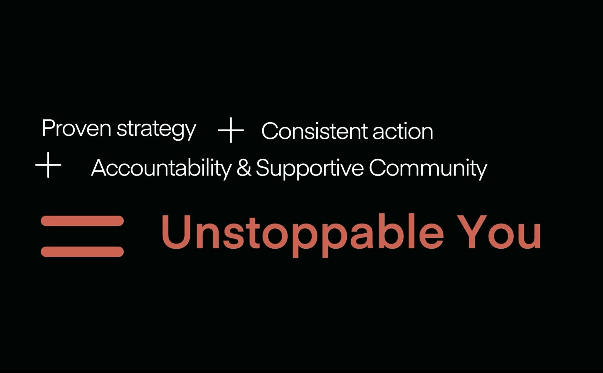
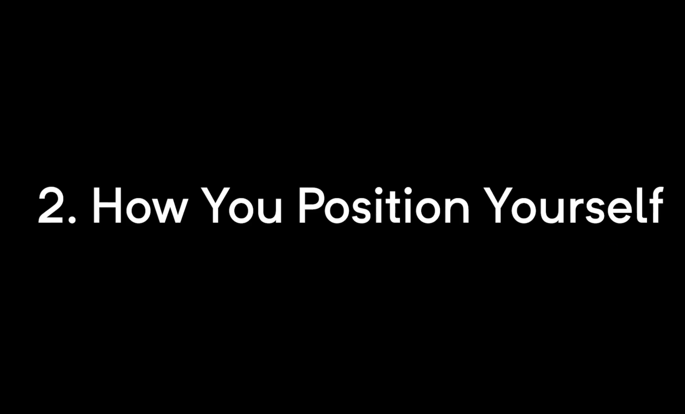
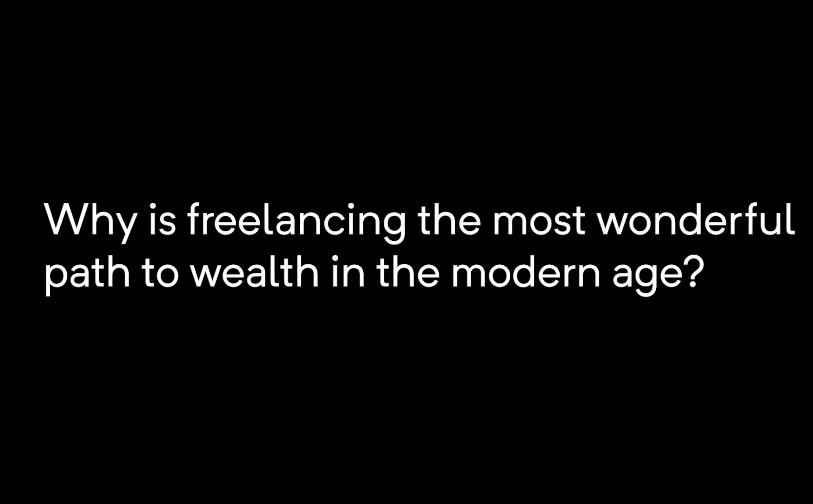
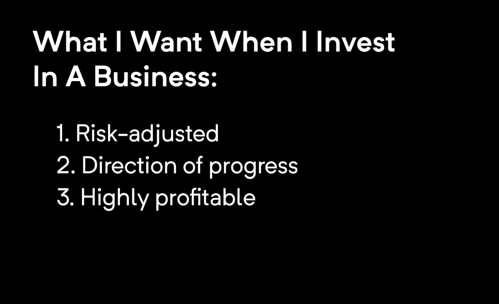
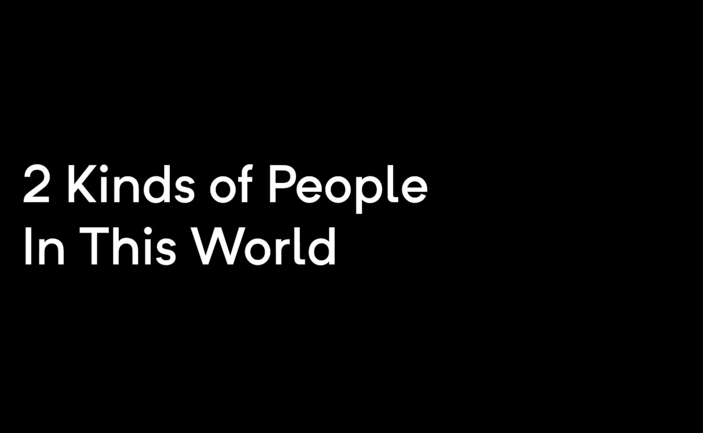
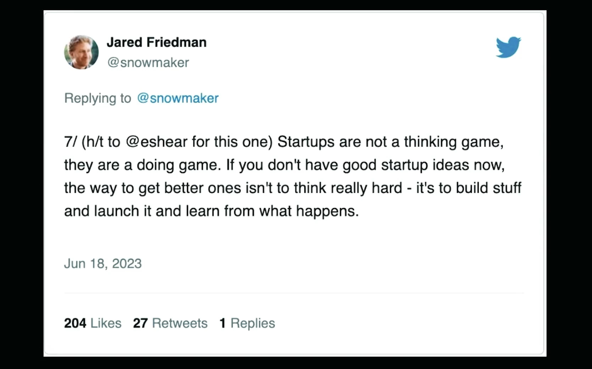

# The Freelance Formula

## Module 1 : Introduction - Preparing to be a 7 Figure Freelancer

### **=>** 1 Welcome to The Freelance Formula

### **=>** 2 Key Action: Join the FREE Community

### **=>** 3 Core Concepts for 7 Figure Freelancing

### **=>** 4 Deconstructing the Market of One Model

### **=>** 5 How to brainwash yourself to be successful

### **=>** 6 BONUS MODULE: New Science Revealing What Drives B2B Buying Decisions

### **=>** 7 BONUS MODULE: Why Story is Such a Critical Differentiator

### **=>** 8 Course Checklist

### **=>** 9 Creating Your Freelance Formula

### **=>** 10 Creating Your 15, 30, 60, 90 Day Plan

### **=>** 11 Business & Legal Basics
